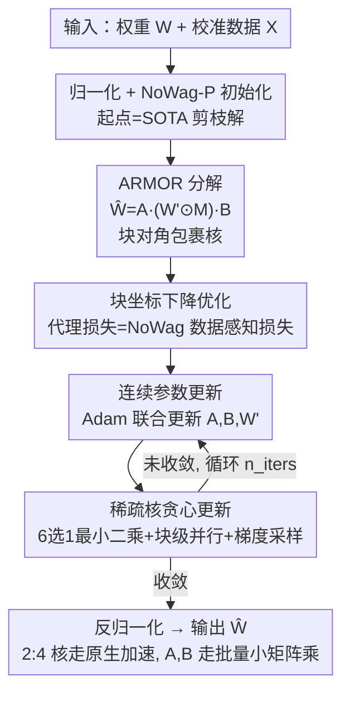

# ARMOR: High-Performance Semi-Structured Pruning via Adaptive Matrix Factorization

**会议**: ICLR2026  
**OpenReview**: [https://openreview.net/forum?id=8NE554wv0m](https://openreview.net/forum?id=8NE554wv0m)  
**代码**: https://github.com/LawrenceRLiu/ARMOR  
**领域**: 模型压缩  
**关键词**: 半结构化剪枝, 2:4 稀疏, 矩阵分解, 块坐标下降, 一次性后训练压缩

## 一句话总结
ARMOR 把 2:4 半结构化剪枝重新表述成「分解」问题——不直接删权重，而是把每个权重矩阵分解成一个 2:4 稀疏核外加两个轻量级块对角「包裹矩阵」当误差校正器，用块坐标下降联合优化，理论上保证代理损失不差于 SOTA，实验里在 Llama / Qwen 上把 2:4 剪枝与稠密模型的困惑度差距缩小近 50%，同时几乎保住了 2:4 的加速和省显存收益。

## 研究背景与动机
**领域现状**：大模型部署受算力和显存制约，剪枝是直接路线。剪枝分三类——结构化（删整行/整列/整头/整层，硬件友好但精度掉得狠）、非结构化（删任意单个权重，50% 稀疏下几乎不掉点，但稀疏模式不规则，现代 GPU 跑不出真实加速）、半结构化（折中）。其中 2:4 半结构化稀疏（每连续 4 个权重里恰好保留 2 个）被 NVIDIA Ampere 及之后的架构原生支持，理论上能把矩阵乘吞吐翻倍，是少数「理论加速能落地」的模式。

**现有痛点**：2:4 这个「每 4 个里固定留 2 个」的硬约束太死，强迫算法在每个小分组内做局部取舍，没法保住全局最重要的权重。后果是精度断崖式下跌——比如把 SOTA 的 2:4 剪枝用到 Llama-7B 上，Wikitext2 困惑度比同样 50% 的非结构化剪枝高出近 59%。于是用户被迫在「理论效率」和「实际精度」之间二选一。

**核心矛盾**：现有方法几乎都把压缩后的权重写成「稠密矩阵 ⊙ 二值掩码」$\hat W = W' \odot M$，研究焦点是找好掩码（Wanda 那类）或更新留下的权重补偿（SparseGPT 那类）。但只要落在「逐元素掩码」这个框架里，2:4 的死约束就无法绕开。已有跳出该框架的尝试也各有硬伤：DSF、OWL 这类与 2:4 加速核不兼容；WRP 依赖一个高度非结构化的稀疏分量、根本没有高效乘法核；LoSparse / MaskLLM 要昂贵的迭代重训（MaskLLM 用的数据是 ARMOR 的约 4000 倍、算力约 80 倍）；RotPruner / DenoiseRotator 这类旋转方法引入的是**固定**开销，没法调，留不出精度-延迟的可调空间。

**本文目标**：在保留 2:4 硬件加速的前提下，把剪枝带来的精度损失尽量补回来，且要一次性（one-shot，不重训）、开销可调。

**切入角度**：作者的关键观察是——与其纠结「该删哪些权重」，不如先把权重矩阵换到一个「2:4 约束损失更小的基」上再剪。给稀疏核前后各乘一个轻量线性变换，就能把激活空间和权重空间旋转到一个让 2:4 模式更无害的坐标系。

**核心 idea**：把半结构化剪枝重写成矩阵分解——$\hat W = A \cdot (W' \odot M) \cdot B$，中间是遵守 2:4 的稀疏核，两侧 $A, B$ 是块对角的「前/后变换误差校正器」，参数量只有 $O(N)$（相对稠密矩阵的 $O(N^2)$），用块坐标下降把这四个量一起优化出来。

## 方法详解

### 整体框架
ARMOR 是逐层（layer-by-layer）的一次性后训练剪枝：对每一层的权重 $W \in \mathbb{R}^{d_{out}\times d_{in}}$ 单独处理，目标是找到一个压缩表示 $\hat W$ 让数据感知的逐层代理损失 $L_{W,X}(\hat W)$ 最小，约束是稀疏核必须满足 2:4 模式（掩码 $M$ 在每行、每连续 4 列里恰好两个非零）。

整条流水线是这样转的：先把 $W$ 做行列归一化；再用一个等价于 SOTA 剪枝算法 NoWag-P 的解来**初始化**分解（$A=B=I$、$W'=\bar W$、$M$ 取每组里得分最高的两个元素）——这一步保证 ARMOR 的起点就已经是 SOTA 水准；然后进入块坐标下降主循环，交替做两件事——更新连续参数 $A, B, W'$、更新稀疏核 $W'\odot M$；循环 $n_{iters}$ 轮后，把归一化缩放还原（denormalize，预先把缩放折进 $A, B$），输出分解后的 $\hat W$。推理时 $A, B$ 因为是块对角的，能以批量小矩阵乘高效执行，稀疏核走原生 2:4 加速核。

### 关键设计

**1. ARMOR 分解：用块对角包裹矩阵当「误差校正器」给稀疏核补偿**

针对的痛点是「逐元素掩码 + 2:4 死约束」根本没有回旋余地。ARMOR 不再直接剪，而是把每层权重分解为
$$\hat W(A, B, W', M) := A \cdot (W' \odot M) \cdot B,$$
其中 $W'\in\mathbb{R}^{d_{out}\times d_{in}}$ 是变换后的稠密权重，$M\in\{0,1\}^{d_{out}\times d_{in}}$ 是施加 2:4 稀疏的二值掩码，$A\in\mathbb{R}^{d_{out}\times d_{out}}$、$B\in\mathbb{R}^{d_{in}\times d_{in}}$ 都是**块对角**矩阵（块大小 $d_{block}$ 是超参，需整除 $d_{out}, d_{in}$）。$A, B$ 不是简单删权重，而是学出来的低开销线性变换，把激活和权重空间旋转到一个「2:4 约束损失更小」的基里，从而比朴素 2:4 更能保住模型质量。关键是它**便宜**：$A$ 存成 $(d_{out}/d_{block})\times d_{block}\times d_{block}$ 的张量，推理时做批量矩阵乘，存储和计算开销随 $O((d_{out}+d_{in})\,d_{block})$ 增长，相对原始参数量 $d_{out}d_{in}$ 是亚线性的。而且 $d_{block}$ 给了一个旋钮——块越大，精度越好但开销越高，这正是 RotPruner / DenoiseRotator 那种固定旋转给不了的「精度-延迟可调」。

**2. NoWag 数据感知代理损失：可逐块分解，让贪心优化成为可能**

逐层剪枝得有个衡量「压坏没坏」的代理损失。ARMOR 采用 NoWag 的逐层损失
$$L_{W,X}(\theta) = \lVert \bar W - \hat W \rVert^2_{F,\,\mathrm{diag}(XX^T)} = \sum_i \sum_j (\bar W_{ij} - \hat W_{ij})^2 \lVert X_j \rVert_2^2,$$
其中 $\bar W$ 是 $W$ 的行列归一化版本。$\mathrm{diag}(XX^T)$ 这一项用输入激活的幅度给平方误差加权，把优化重心压在「对校准数据最有影响」的权重上；相比 SparseGPT 那种基于 Hessian sketch 的损失，它要的校准数据更少，也省掉了昂贵的 Hessian sketch 求逆。选它最关键的理由是**可分解性**——损失能拆成独立的逐块子问题
$$L_{W,X}(\theta) = \sum_i \sum_j \lVert \bar W^{(i,j)} - A^{(i)}(W'^{(i,j)}\odot M^{(i,j)})B^{(j)} \rVert^2_{F,\,\mathrm{diag}(XX^T)^{(j)}},$$
每个 $d_{block}\times d_{block}$ 的块可以独立优化。这个性质是后面稀疏核贪心更新能并行、能 least-squares 求解的基石。

**3. 块坐标下降优化：连续参数与稀疏核交替更新，且理论保证不差于 SOTA**

$\theta=(A,B,W',M)$ 里既有连续量也有离散掩码，没法一把求解。ARMOR 用块坐标下降（block coordinate descent），每一轮交替两步：先更新连续参数 $A, B, W'$，再更新稀疏核 $W'\odot M$（即设计 4）。连续参数那一步，理论版用顺序梯度下降、靠局部 $\beta$-smoothness 定步长以拿到严格收敛保证；实践里换成 Adam 对 $A, B, W'$ **联合**更新，每轮只需一次前/反向传播、省掉反复算 $\beta$-smoothness，作者称两者效果无显著差异。整套优化最漂亮的地方是有个收敛定理（Theorem 3.1）：序列 $\{L_{W,X}((\theta)_t)\}$ 收敛，且对任意 $t>0$ 都有 $L_{W,X}((\theta)_t)\le L_{W,X}((\theta)_0)$。因为初始化 $(\theta)_0$ 的代理损失恰好等于 NoWag-P 的损失，这条定理直接给出——ARMOR 在代理损失意义上**保证不差于 SOTA 的 NoWag-P**，等于把「至少不亏」写进了算法。

**4. 稀疏核贪心更新：6 选 1 最小二乘 + 块级并行 + 梯度加权采样**

固定 $A, B$ 后更新 $W'\odot M$ 面临组合爆炸的掩码搜索空间，ARMOR 用贪心绕开。三个技巧叠起来：① **利用 2:4 模式**——冻结其余部分、只看一个连续的 4 元素稀疏组，由于每组只有 $\binom{4}{2}=6$ 种掩码选法，逐一枚举，对每种选法求 2 个非零元的最优值是个最小二乘问题，解 6 个最小二乘取损失最小的那个即可。② **利用损失逐块可分解**——单个 4 元素组只占一层参数的不到 $0.2\times10^{-6}$，一次只更一组太慢；借助前面的块级分解，可以把 $(d_{in}d_{out})/d_{block}^2$ 个块的稀疏组**并行**更新，对标准 LLM 一次能更新约 $10^3$ 倍数量的元素。③ **梯度加权采样选组**——在每个块里按代理损失对该组的梯度幅度作为概率
$$p^{(i,j)}_{(i',k)} \propto \big\lVert \nabla_{(W'\odot M)^{(i,j)}}\,\ell^{(i,j)}_X \big\rVert_{i',[k]} \big\rVert_1,$$
随机地、但偏向「梯度大 = 重要」的稀疏组去更新。引入随机性还能避免反复挑同一组，作者实测这让代理损失收敛更快更好。

## 实验关键数据

### 主实验
模型：Qwen 2.5（7B/14B/32B/72B）、Qwen 3（8B/14B）做下游任务评测；Llama-2（7B/13B/70B）、Llama-3（8B/70B）做困惑度评测。统一 $d_{block}=128$、优化 20,000 轮。对手是 SparseGPT、Wanda、NoWag-P 三个 2:4 剪枝 SOTA（其中 NoWag-P 因为同损失同初始化，等价于「去掉 ARMOR 分解」的消融）。

下游任务（7 个 benchmark，节选 Qwen 2.5）：

| 模型 | 方法 | GSM8K | BBH | GPQA | MMLU |
|------|------|-------|-----|------|------|
| Qwen2.5-7B | Dense | 82.33 | 69.16 | 33.03 | 74.19 |
| Qwen2.5-7B | SparseGPT (2:4) | 36.69 | 46.31 | 29.69 | 56.91 |
| Qwen2.5-7B | NoWag-P (2:4) | 28.28 | 39.98 | 27.23 | 53.51 |
| Qwen2.5-7B | **ARMOR (2:4+4.95%)** | **53.28** | **55.11** | **31.47** | **65.56** |
| Qwen2.5-32B | Dense | 88.78 | 81.72 | 38.84 | 83.24 |
| Qwen2.5-32B | SparseGPT (2:4) | 66.03 | 71.31 | 30.36 | 75.26 |
| Qwen2.5-32B | **ARMOR (2:4+3.44%)** | **78.77** | **76.56** | **39.51** | **78.18** |

ARMOR 在全部 7 任务、全部模型上一致显著领先；尤其在 GPQA-Qwen2.5-32B 上拿到 39.51，**超过了稠密模型的 38.84**，远甩次优的 SparseGPT（30.36）。在推理/领域知识重的任务（GSM8K/BBH/GPQA）上优势最明显，说明「分解」比「直接删权重」更能保住复杂能力。

困惑度（Wikitext2 ↓，节选）：

| 数据集 | 模型 | Dense | SparseGPT | Wanda | NoWag-P | ARMOR |
|--------|------|-------|-----------|-------|---------|-------|
| Wikitext2 | Llama-2-13B | 4.57 | 8.39 | 8.36 | 8.28 | **6.37** |
| Wikitext2 | Llama-2-7B | 5.12 | 10.16 | 11.35 | 11.14 | **7.21** |
| Wikitext2 | Llama-3-8B | 5.54 | 14.18 | 22.42 | 24.0 | **10.10** |

在 Llama-2-13B / Wikitext2 上 ARMOR 拿到 6.37，相对次优的 NoWag-P（8.28）是巨大改进，把「2:4 剪枝 vs 稠密」的困惑度差距缩小了近 50%。

### 消融实验
NoWag-P 在表中既是基线也是消融——它就是 ARMOR 去掉分解 + 优化、只剩初始化的版本。从主表看，ARMOR 相对 NoWag-P 的全面领先，直接证明了「ARMOR 分解 + 块坐标下降」本身的价值。

| 配置 / 分析 | 关键指标 | 说明 |
|------|---------|------|
| ARMOR vs NoWag-P (= w/o 分解) | Llama-2-13B PPL 6.37 vs 8.28 | 分解+优化带来的纯增益 |
| 推理效率（Qwen2.5-14B gate_proj 层） | 批量 MatVec 1.57× 加速 | 朴素 2:4 是 1.86×，ARMOR 用 ~3.4% flop 开销换质量 |
| 块大小 $d_{block}$（1→128） | 困惑度指数衰减下降 | 块越大越准，$d_{block}=1$ 退化为 NoWag-P |
| 代理损失 vs C4 困惑度（20k 轮） | 强相关 | 验证代理损失是模型性能的好替身 |

### 关键发现
- **「分解」比「删权重」管用**：去掉分解（即 NoWag-P）后掉点最多，且在 reasoning 任务上落差最大，证明误差校正包裹矩阵是性能保住的主因。
- **块大小是精度-效率旋钮**：$d_{block}$ 从 1（=NoWag-P）增到 128，困惑度按指数衰减下降，这是 RotPruner / DenoiseRotator 固定开销给不了的可调性。
- **代理损失是靠谱替身**：代理损失下降与 C4 困惑度下降强相关，且大部分性能恢复在前 2,500 轮就完成，说明优化高效。
- **效率几乎无损**：ARMOR 仅引入约 2.4%–5% 的块对角开销，把朴素 2:4 的 2.0× 理论加速降到 ~1.87×，未优化的 PyTorch 概念验证就实现了其中 ~84%，仍保住 2:4 的大部分加速与省显存收益。

## 亮点与洞察
- **范式重述很巧**：把「剪枝 = 删权重」重写成「剪枝 = 分解（稀疏核 + 误差校正器）」。这一步看似简单，却直接绕开了逐元素掩码框架里 2:4 死约束的天花板——值得迁移到量化、低秩等其他压缩场景。
- **「至少不亏」写进算法**：通过把初始化设成等价于 NoWag-P 的解，再配收敛定理 $L_t \le L_0$，ARMOR 拿到了「代理损失保证不差于 SOTA」的理论底，这在偏经验的剪枝领域是难得的稳。
- **块对角是甜点结构**：既比对角包裹更有表达力，又比稠密矩阵便宜（$O(N)$ vs $O(N^2)$），还恰好能映射成批量小矩阵乘上硬件——表达力、开销、硬件友好三者兼顾。
- **6 选 1 枚举 + 块级并行**：2:4 每组只有 6 种掩码这一组合性质被吃干抹净，配合损失可分解直接把贪心搜索并行化到 $10^3$ 量级，是把「理论可分解」变「工程能跑」的关键。

## 局限与展望
- **概念验证而非生产核**：推理只实现了 PyTorch 的 proof-of-concept，达到理论加速的 ~84%，落后于高度优化的原生 2:4 核（~93%）；要真正落地还需要写专门的融合核。
- **额外开销不可忽略**：块对角包裹引入 2.4%–5% 的存储/计算开销，虽亚线性但非零，在显存/吞吐极端敏感的部署下要权衡。
- **N:M / 非结构化是下界**：对一般 N:M 和非结构化稀疏的扩展实验跑的迭代数远少于 2:4 主结果（非结构化仅 5000、半结构化 2000 vs 20000），作者明确说这些只是性能下界，未充分调优。
- **只测 base 稠密模型**：实验刻意排除了 instruction-tuned 模型和 MoE 架构，对指令模型和 MoE 的剪枝效果尚未验证。
- **改进方向**：把可调旋钮 $d_{block}$ 与硬件核协同设计、或把分解思路与量化复合，可能进一步压缩精度-效率的帕累托前沿。

## 相关工作与启发
- **vs Wanda / NoWag-P（免权重更新）**：它们固定未剪权重、只在逐元素掩码框架里找好掩码，受困于 2:4 死约束；ARMOR 跳出该框架，用包裹矩阵补偿，且初始化就等于 NoWag-P 再往上爬。
- **vs SparseGPT（权重更新）**：SparseGPT 靠 Hessian sketch 迭代调权重，精度尚可但有昂贵的 Hessian 求逆；ARMOR 用 NoWag 数据感知损失，要的校准数据更少、且代理损失可分解能并行。
- **vs LoSparse / MaskLLM（可学习）**：它们靠昂贵迭代重训（MaskLLM 用约 4000× 数据、80× 算力），ARMOR 是一次性后训练、不重训。
- **vs RotPruner / DenoiseRotator（旋转）**：旋转方法引入**固定**开销、不可调；ARMOR 的块对角包裹通过 $d_{block}$ 提供精度-延迟可调旋钮，在 Llama-2 7B/13B 上甚至超过 SparseGPT+DenoiseRotator。
- **vs DSF / WRP（分解/分解类）**：DSF 与 2:4 加速核不兼容，WRP 依赖无高效核的非结构化稀疏分量；ARMOR 的稀疏核严格遵守 2:4、可走原生加速核。

## 评分
- 新颖性: ⭐⭐⭐⭐⭐ 把半结构化剪枝重写成「稀疏核 + 块对角误差校正器」的分解问题，范式层面的创新且带收敛理论
- 实验充分度: ⭐⭐⭐⭐ Llama+Qwen 两大家族、下游任务+困惑度双线评测，但 N:M/非结构化欠调优、未测指令模型与 MoE
- 写作质量: ⭐⭐⭐⭐⭐ 动机、分解、优化、理论一气呵成，图表清晰
- 价值: ⭐⭐⭐⭐⭐ 把 2:4 与稠密的差距缩小近 50% 还几乎保住加速，直击「理论效率 vs 实际精度」的核心痛点

<!-- RELATED:START -->

## 相关论文

- [\[ICLR 2026\] Learning Semi-Structured Sparsity for LLMs via Shared and Context-Aware Hypernetwork](learning_semi-structured_sparsity_for_llms_via_shared_and_context-aware_hypernet.md)
- [\[ICLR 2026\] MoNE: Replacing Redundant Experts with Lightweight Novices for Structured Pruning of MoE](mone_replacing_redundant_experts_with_lightweight_novices_for_structured_pruning.md)
- [\[CVPR 2025\] MambaIC: State Space Models for High-Performance Learned Image Compression](../../CVPR2025/model_compression/mambaic_state_space_models_for_high-performance_learned_image_compression.md)
- [\[ACL 2026\] Two-Stage Regularization-Based Structured Pruning for LLMs](../../ACL2026/model_compression/two-stage_regularization-based_structured_pruning_for_llms.md)
- [\[ICLR 2026\] RCPU: Rotation-Constrained Error Compensation for Structured Pruning of Large Language Models](rcpu_rotation-constrained_error_compensation_for_structured_pruning_of_large_lan.md)

<!-- RELATED:END -->
