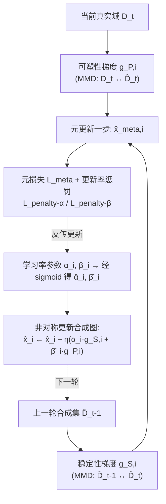

# Asymmetric Synthetic Data Update for Domain Incremental Dataset Distillation

**会议**: ICLR 2026  
**OpenReview**: [https://openreview.net/forum?id=XcsaCHaoJh](https://openreview.net/forum?id=XcsaCHaoJh)  
**代码**: 待确认  
**领域**: 数据集蒸馏 / 持续学习 / 模型压缩  
**关键词**: Dataset Distillation, Domain Incremental Learning, Catastrophic Forgetting, Bi-level Optimization, Stability-Plasticity  

## 一句话总结
本文提出"域增量数据集蒸馏（DIDD）"新问题——把陆续到来的不同域数据持续蒸馏进**同一个固定大小**的合成集，并用基于元学习双层优化的**非对称合成数据更新**策略为每张合成图分别学习稳定性梯度与可塑性梯度的更新率，从而在固定存储预算下缓解灾难性遗忘。

## 研究背景与动机
- **领域现状**：数据集蒸馏（DD）把大真实数据集压成一小撮合成样本，使在合成集上训练的模型逼近在全量数据上训练的效果，常用三类匹配（梯度匹配 GM、轨迹匹配 TM、分布匹配 DM）来对齐训练动态，可大幅省存储和训练成本。
- **现有痛点**：所有 DD 方法都默认"全量数据一次性给齐"。但现实里数据是**随时间分域陆续采集**的；若对每个新到的域单独蒸馏再堆起来（Distill-Gather），存储和训练成本会随域数线性膨胀，违背了 DD 省存储的初衷。
- **核心矛盾**：若改成在单个固定大小合成集上顺序蒸馏（Finetune），新域知识会**覆盖**旧域知识，发生灾难性遗忘——这本质是**稳定性（保留旧域）与可塑性（适应新域）的冲突**。作者实测发现，稳定性梯度 $g_{S,i}$ 与可塑性梯度 $g_{P,i}$ 的余弦相似度长期为负（图 3），二者方向直接打架，对它们用同一个更新率显然次优。
- **本文目标**：在 $|\hat{\mathcal{D}}_t| = \text{IPC} \times C$ 的固定预算下，让单个合成集既装下当前域 $\mathcal{D}_t$ 又保住历史域 $\mathcal{D}_{1:t-1}$ 的知识。
- **核心 idea**：**【按样本非对称】** 不再对全图统一更新，而是为**每个合成样本**分别学习稳定性与可塑性两个更新率，让一部分样本专注"记住旧域"、一部分专注"适应新域"，再用**【元学习双层优化】**自动估计这些更新率，从机制上拆解稳定-可塑冲突。

## 方法详解

### 整体框架
方法以分布匹配 DD（最小化合成集与真实集特征的最大均值差异 MMD）为基座。当第 $t$ 个域数据 $\mathcal{D}_t$ 到来时，对每张合成图同时计算两个梯度：**可塑性梯度** $g_{P,i}$（把 $\hat{\mathcal{D}}_t$ 拉向当前真实域 $\mathcal{D}_t$）与**稳定性梯度** $g_{S,i}$（把 $\hat{\mathcal{D}}_t$ 的特征约束到上一轮合成集 $\hat{\mathcal{D}}_{t-1}$）。关键在于：不是简单相加，而是给每张图各自学一对缩放系数 $(\bar\alpha_i,\bar\beta_i)$ 来加权这两个梯度；这对系数由内层"试更新一步、算元损失"、外层"反传更新系数"的双层优化求得（图 2）。

### 关键设计

**1. 稳定性损失：把"记住旧域"显式写进目标。** DD 原本只优化可塑性损失 $L_{\text{plastic}}(\hat{x}^t) = d(F(x^t), F(\hat{x}^t))$（$d$ 为高斯核 MMD，$F$ 为 ConvNet 特征），它只让合成集贴近当前真实域，是遗忘的根源。作者补一项稳定性损失 $L_{\text{stable}}(\hat{x}^t) = d(F(\hat{x}^{t-1}), F(\hat{x}^t))$，要求新合成集的特征与上一轮合成集保持一致，从而把历史知识"锚"住。二者联合后每张图按 $\hat{x}^t_i \leftarrow \hat{x}^t_i - \eta_x(g_{S,i} + g_{P,i})$ 更新——但这暴露了前述梯度冲突问题，引出下一步。

**2. 非对称更新：按样本拆解稳定-可塑冲突。** 既然 $g_{S,i}$ 和 $g_{P,i}$ 方向相左，对所有样本一刀切地等权相加就会互相抵消。作者给每张图引入一对缩放系数，把更新改写为 $\hat{x}^t_i \leftarrow \hat{x}^t_i - \eta_x(\bar\alpha_i \cdot g_{S,i} + \bar\beta_i \cdot g_{P,i})$，其中 $\bar\alpha_i,\bar\beta_i$ 由可学习参数 $\alpha_i,\beta_i$ 经 sigmoid 压到 $(\alpha_{\min},\alpha_{\max})$、$(\beta_{\min},\beta_{\max})$ 区间。这样当 $\bar\alpha_i > \bar\beta_i$ 时该样本偏重稳定性、反之偏重可塑性——冲突不再要求每张图同时兼顾两端，而是让不同样本各管一摊，整体上达到平衡。

**3. 双层优化求最优更新率（元学习）。** 难点是 $\alpha_i,\beta_i$ 没有现成监督。作者借 MAML 思路做双层优化：内层先用当前系数试走一步得到元样本 $\hat{x}^t_{\text{meta},i} = \hat{x}^t_i - \eta_x(\bar\alpha_i g_{S,i} + \bar\beta_i g_{P,i})$，算元损失 $L_{\text{meta}}(\hat{x}^t_{\text{meta}}) = L_{\text{stable}}(\hat{x}^t_{\text{meta}}) + L_{\text{plastic}}(\hat{x}^t_{\text{meta}})$；外层据此对 $\alpha_i,\beta_i$ 反传更新 $\alpha_i \leftarrow \alpha_i - \eta_\alpha \frac{\partial}{\partial \alpha_i} L^{\text{penalty}}_{\text{meta}}$（$\beta$ 同理）。直觉上：哪个方向能让"试更新后"的稳定+可塑损失下降更多，就给那个方向更大的更新率。

**4. 选择性惩罚：防止系数无脑全开。** 对元损失做一阶 Taylor 展开可知，只要内积 $\langle \frac{\partial}{\partial \hat{x}^t}L_{\text{meta}}, g_{S,i}\rangle$、$\langle \cdots, g_{P,i}\rangle$ 为正，把所有 $\bar\alpha_i,\bar\beta_i$ 一律调大就能降元损失——这会退化成"全部最大化"的平凡解，丧失非对称性。为此加上对更新率均值的惩罚 $L_{\text{penalty-}\alpha} = \frac{1}{N}\sum_i \bar\alpha_i$、$L_{\text{penalty-}\beta} = \frac{1}{N}\sum_i \bar\beta_i$，得总元目标 $L^{\text{penalty}}_{\text{meta}} = L_{\text{meta}} + \lambda_\alpha L_{\text{penalty-}\alpha} + \lambda_\beta L_{\text{penalty-}\beta}$。这逼着模型把"预算"花在真正需要的样本上，从而产生非对称（而非全开）的更新模式。作者进一步用 KKT 条件给出解读：$\bar\alpha_i,\bar\beta_i$ 类似样本级拉格朗日乘子，互补松弛 $\bar\alpha_i(L_{\text{stable}} - \epsilon_{\text{stable},i}) = 0$ 意味着只有当某样本"快要违反"稳定/可塑约束时才获得较大更新率——这恰好解释了元学习为什么会自动把资源分配给临界样本。

## 实验关键数据

数据集：Rotated-MNIST（20 个域，最长序列）、Seq-CORe50（11 个域）、PACS（4 个域）；3 层 ConvNet，IPC ∈ {1,10,20}；指标为平均精度 $A_T(\uparrow)$ 与平均遗忘 $F_T(\downarrow)$，三次运行均值。

### 主实验表格（节选 $A_T$ / $F_T$）

| 方法 | R-MNIST IPC=1 | R-MNIST IPC=20 | Seq-CORe50 IPC=20 | PACS IPC=20 |
|---|---|---|---|---|
| Finetune（下界） | 38.9 / 59.2 | 41.9 / 56.7 | 26.4 / 79.2 | 27.4 / 44.4 |
| EWC | 38.8 / 59.2 | 41.6 / 56.7 | 26.4 / 79.1 | 28.6 / 43.5 |
| MAS | 43.2 / 50.2 | 45.0 / 51.8 | 27.0 / 66.1 | 35.6 / 12.9 |
| LwF | 32.9 / 48.5 | 36.2 / 38.7 | 17.6 / 24.7 | 34.5 / 14.5 |
| Joint (M3D)（上界参考） | 80.2 / – | 91.5 / – | 84.7 / – | 54.5 / – |
| **Proposed** | **58.6 / 21.0** | **59.0 / 39.3** | **60.6 / 38.7** | **52.1 / 10.0** |

- 较 Finetune 与各持续学习基线（EWC/MAS/LwF/LF）全设定显著领先：R-MNIST IPC=1 上 $A_T$ 从 38.9 提到 58.6。
- 在 Seq-CORe50 与 PACS（IPC=10/20）上甚至**超过 DSA/DC 的 Joint 上界**；PACS 上恢复了 Joint 性能的 91%（IPC=10）与 95%（IPC=20），数据效率很高。

### 消融实验表格（R-MNIST，按 5 域分段看 $A_T$）

| 方法 | IPC=10 $A^T_{1:5}$ | $A^T_{6:10}$ | $A^T_{11:15}$ | $A^T_{16:20}$ |
|---|---|---|---|---|
| Finetune | 33.4 | 19.4 | 23.7 | 80.9 |
| + $L_{\text{stable}}$ | 26.9 | 27.5 | 59.3 | 87.1 |
| + Asym.（线性指派） | 31.0 | 33.4 | 56.6 | 82.7 |
| + Asym.（双层优化） | **36.3** | **43.8** | **76.3** | **94.5** |

- 只加 $L_{\text{stable}}$ 能救近期段，但最早段 $A^T_{1:5}$ 反而退化（26.9 < 33.4），说明长序列下稳定损失只保得住近期、且会拖累可塑性。
- 简单把 $\bar\alpha_i,\bar\beta_i$ 按样本索引线性指派也不能各段稳定提升；唯有双层优化在**所有段**同时改善，证明学习更新率优于手工规则。

### 关键发现
- **冲突可视化**（图 3）：$g_{S,i}$ 与 $g_{P,i}$ 余弦相似度长期为负，是非对称更新的直接动机。
- **样本分工**（图 6）：$\bar\alpha_i - \bar\beta_i$ 最小的样本捕捉最新域的旋转角（偏可塑），最大的样本跨域一致（偏稳定），可视化证实了"按样本各管一摊"。
- **成本**（表 2）：双层优化使蒸馏成本约为基线的 2.7 倍（PACS IPC=10：1123s vs 411s），但 DD 是一次性离线过程；降到 1000 迭代后成本 344s 仍显著优于各基线精度。

## 亮点与洞察
- **问题定义有价值**：DIDD 把"持续学习"与"数据集蒸馏"嫁接，戳中了 DD 假设全量数据可得这一不现实前提，且固定预算这一约束让它和"堆叠蒸馏"明显区分开。
- **把稳定-可塑冲突下沉到样本粒度**：以往持续学习多在参数/模型层面权衡，本文创新地在**合成像素**层面、且**按单样本**分配更新率，配合可视化让"分工"很直观。
- **理论自洽**：从 Taylor 展开识别平凡解 → 加惩罚 → KKT 解读为样本级拉格朗日乘子，形成"为什么必须惩罚 + 元学习在近似什么约束优化"的闭环论证。
- **超 Joint 上界**很亮眼：稳定损失带来的跨域正则反而比一次性联合蒸馏更利于泛化。

## 局限与展望
- **蒸馏成本偏高**：双层优化（含对元样本二阶反传）使开销翻倍，IPC 或域数继续增大时可扩展性存疑；作者仅以"DD 是离线一次性"作辩护。
- **仅验证小数据/小网络**：实验停留在 32×32 图与 3 层 ConvNet，未涉及 ImageNet 级或更深骨干，方法在大规模下的稳定性未知。
- **基座绑定 DM**：方法构建在分布匹配（MMD）之上，对梯度匹配/轨迹匹配类 DD 是否同样有效未做实验。
- **共享标签空间假设**：DIDD 设定要求各域类别一致（域增量），若叠加类增量（新类不断出现）则当前框架不直接适用。
- **超参数较多**：$\alpha/\beta$ 上下界、$\eta_\alpha,\eta_\beta,\lambda_\alpha,\lambda_\beta$ 等需调，缺乏敏感性分析。

## 相关工作与启发
- **数据集蒸馏**：从 Wang et al. (2018) 起，分梯度匹配（DC/DSA）、轨迹匹配（MTT、difficulty-aligned）、分布匹配（DM、M3D）三派；本文取 DM 为基座并补上"时序到达"维度。
- **域增量学习（DIL）**：正则类（EWC/MAS）、回放类（GEM/ER）、动态结构类（PNN）。本文把正则类的"保护重要参数"思路**迁移到合成数据**（正则目标从模型参数换成合成像素），并刻意排除需额外存储的回放/扩容法以契合 DD 省存储目标。
- **元学习**：借 MAML 的双层优化求超参（这里是逐样本更新率），是"用元学习自动化权衡"的一个具体落地，对其他需要逐样本/逐任务权衡的场景（如样本重加权、课程学习）有借鉴意义。

## 评分
- **新颖性**: ⭐⭐⭐⭐ 首次提出 DIDD 问题，并把稳定-可塑权衡下沉到逐样本合成像素 + 元学习自动求更新率，组合新颖。
- **实验充分度**: ⭐⭐⭐ 三数据集多 IPC、含分段消融与可视化较扎实，但规模偏小、未覆盖 GM/TM 基座与大骨干。
- **写作质量**: ⭐⭐⭐⭐ 动机—冲突可视化—方法—Taylor/KKT 解读逻辑连贯，图表清晰。
- **价值**: ⭐⭐⭐⭐ 给"数据持续到来下的蒸馏"开了一个有现实意义的新方向，且在固定预算下超过部分 Joint 上界，具启发性。

<!-- RELATED:START -->

## 相关论文

- [\[ICLR 2026\] Understanding Dataset Distillation via Spectral Filtering](understanding_dataset_distillation_via_spectral_filtering.md)
- [\[ICLR 2026\] Grounding and Enhancing Informativeness and Utility in Dataset Distillation](grounding_and_enhancing_informativeness_and_utility_in_dataset_distillation.md)
- [\[AAAI 2026\] DP-GenG: Differentially Private Dataset Distillation Guided by DP-Generated Data](../../AAAI2026/model_compression/dp-geng_differentially_private_dataset_distillation_guided_by_dp-generated_data.md)
- [\[ICLR 2026\] Beyond Student: An Asymmetric Network for Neural Network Inheritance](beyond_student_an_asymmetric_network_for_neural_network_inheritance.md)
- [\[ICLR 2026\] Pedagogically-Inspired Data Synthesis for Language Model Knowledge Distillation](pedagogically-inspired_data_synthesis_for_language_model_knowledge_distillation.md)

<!-- RELATED:END -->
