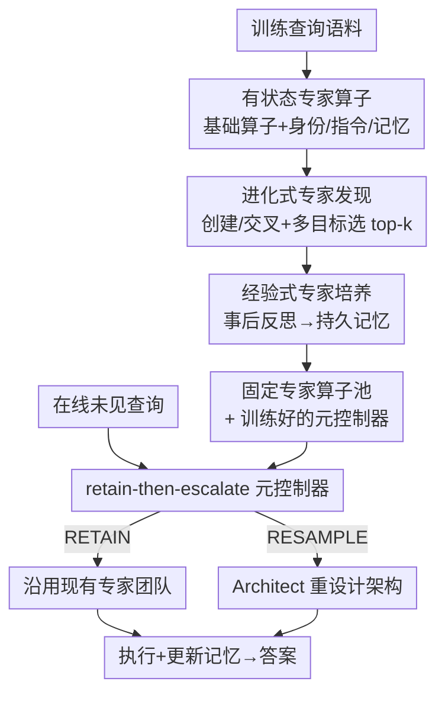

# Automated Stateful Specialization for Adaptive Agent Systems

**会议**: ICLR 2026  
**OpenReview**: [https://openreview.net/forum?id=UESTP6dR1K](https://openreview.net/forum?id=UESTP6dR1K)  
**代码**: https://github.com/myanvoos/ASpec  
**领域**: 多智能体系统 / 自动智能体设计 / 自进化智能体  
**关键词**: 多智能体、自动设计、专家智能体、进化搜索、元控制器

## 一句话总结
ASPEC 提出一套全自动的"有状态专家智能体团队"生命周期框架：先用进化搜索离线发现一批领域专家算子、再让它们在经验中反思培养出持久记忆，最后在线用一个轻量的 "retain-then-escalate"（先保留、再升级）元控制器决定每个查询是沿用现有团队还是重新搜索架构，从而在专家级科学基准 GPQA 上把 Gemini 2.0 Flash 从 56.3% 拉到 62.8%，同时训练+推理成本远低于同类自动框架。

## 研究背景与动机
**领域现状**：自动化多智能体系统设计（automated agent design）目前分成两条互斥的路线。一条是**任务级架构搜索**（ADAS、AFlow、AgentSquare），为某个任务领域搜出一个**静态最优工作流**，思路类似 AutoML / NAS；另一条是**查询级架构自适应**（MaAS、FlowReasoner、MAS-Zero），为**每条进来的查询**现场生成或采样一个定制化的智能体架构。

**现有痛点**：任务级方法是"一刀切"——一个静态工作流要应付整个领域的所有查询，无法按单条查询动态分配推理资源；查询级方法虽然适应性强，但每条查询都把架构推倒重来，付出巨大的"重新发现"（rediscovery）成本，更要命的是**单个智能体根本没机会沉淀长期专长**——架构每次都被重采样，组件像用过即弃的临时工。

**核心矛盾**：静态的任务级稳健性 与 动态的查询级适应性 之间存在鸿沟，二者各占一端却都丢了**"持久的智能体级专长"**这条中间地带。单纯给某个智能体挂一块记忆模块（agent-level memory）解决不了这个系统级问题——因为架构本身一直在变，记忆挂不到一个稳定的载体上。

**本文目标**：造出一支**有状态（stateful）的专家智能体团队**：它们会随时间积累知识、能在无人干预下被重新配置去应对新任务，把"专家级深度专长"和"按需自适应"统一进一个生命周期。

**切入角度**：作者类比人类专家的成长——先广泛学习概念、再通过**实践与反思**深化专长。于是把智能体的"诞生"拆成两阶段：先**发现**（探索性地造出多样的专家原型），再**培养**（在训练语料上反思、把经验沉淀成记忆）；运行时再用一个高层策略管"什么时候该沿用、什么时候该重建"。

**核心 idea**：用"发现—培养"的两阶段离线生命周期造出**持久的专家算子**，再用 "retain-then-escalate" 元控制器在线**默认沿用、只在必要时才升级到架构重搜**，从而同时拿到专家性、适应性和成本效率。

## 方法详解

### 整体框架
ASPEC 把整个系统建模成一套**分层强化学习（HRL）**：底层是一个负责架构重设计与算子池进化的生成过程（Architect），高层是一个学习"何时调用底层"的轻量策略（元控制器）。整条管线分**离线 + 在线**两段。

离线段（图 3）做两件事：**专家发现**——Architect 用进化算子（创建 / 交叉）在基础算子（CoT、Debate、ReAct 等无状态算子）之上派生出一批带"身份 + 方法论指令"的专家算子候选，经多目标选择留下 top-$k$；**专家培养**——选中的专家在训练语料上执行任务、事后反思，把经验写进各自的持久记忆，同时这一过程顺带训练出元控制器。离线产物是一个**固定的专家算子池**和一个**训练好的元控制器**。

在线段（图 2）算子池冻结，面对未见查询循环执行：元控制器读当前查询和当前架构的嵌入，做一个二元决策——**RETAIN**（沿用现有专家团队架构）还是 **RESAMPLE**（让 Architect 重新设计架构）；执行后更新各专家记忆，进入下一条查询。一条多步科学编码任务里，沿用的专家能跨步累积上下文与已学知识，这正是 SciCode 这类多子问题任务的胜负手。

### 关键设计

**1. 有状态专家算子：给"用过即弃"的智能体一个可被沉淀专长的稳定载体**

要让专长能积累，首先得有一个**稳定不被重建**的承载单元。沿用 MaAS，一个智能体算子定义为三元组 $O=(M,P,\{T_i\})$——LLM 骨干 $M$、提示 $P$、可用工具集 $\{T_i\}$；多智能体系统则是有向无环图 $G=\{V,E\}$，每个顶点是一个算子实例。ASPEC 把算子池切成两类：**基础算子** $O_{\text{base}}$ 是静态、无状态的通用结构（CoT、LLM-Debate 等），**专家算子** $O_{\text{spec}}$ 是从基础算子派生出的动态集合。一个专家算子 $O^S_i=(O_i, P_s, M)$ 在继承基础算子推理骨架（如"think step-by-step"）的同时，挂上一个**专门化提示** $P_s$ 和一块**持久的经验记忆** $M$。其中 $P_s$ 又拆成**身份**（identity，"我是谁"——例如"一位精通理论物理的专家物理学家"）和**指令**（directives，一组方法论原则——例如"先算洛伦兹因子、再算时间膨胀"）。这种"身份 + 指令"的分解让专家有一个丰富的"基因空间"，也正是它区别于无状态角色扮演的关键：身份和指令是会被**保留和培养**的，而不是为单次协作临时生成、用完即弃。

**2. 进化式专家发现：用创建 + 交叉的进化搜索自动造出多样且高水平的专家原型**

专家不靠人手写，而由 Architect（一个多轮迭代推理的 in-context LLM）通过进化搜索发现。Architect 的形式化映射是 $f_A(q_t, H_{t-m:t-1}, O_{t-1}, G_{t-1}) \to (G_t, O_t)$，输入当前查询、近 $m$ 条历史经验的滑动窗口、上一轮算子池与架构，输出新架构和新算子池；其目标是最大化"成本感知效用" $U_t - \lambda C_t(G_t)$ 再加上未来价值项。发现阶段用两个动作：**创建**——针对查询从某个基础算子派生专家，采用"多变体合成 + LLM 评审"，一次过量生成 $S=3$ 个身份-指令变体，再由一个 Judge 从推理方法论和领域覆盖度上择优；**交叉**——给定两个父代专家 $O^S_1, O^S_2$，合成一个继承双方身份与指令的子代专家（图 4 的物理专家就能顺着交叉回溯出"血缘"）。为防止过早碎片化，池子大小被动态卡在 $2k$ 以内，超限时 Architect 不许再创建、只能合并或剪枝，逼迫把零散能力整合。发现阶段结束做**选择**：解一个兼顾性能与多样性的多目标问题，$O^{(2)}_{\text{spec}}=\arg\max_{|O_{\text{spec}}|\le k}\big[\sum p(O^S_i) + \text{Diversity}(O_{\text{spec}})\big]$，其中多样性项基于对专家嵌入做 K-means 聚类、每个簇取性能最高者，从而选出 top-$k$ 既强又互补的专家。

**3. 经验式专家培养：让选中的专家在反思中把经验沉淀成可检索的领域记忆**

发现只保证"广而多样"，深度专长要靠培养。被选中的 top-$k$ 专家各自在训练语料上**独立**执行任务，并在执行后对结果做反思，把"问题模式 / 解法概要 / 失败模式 / 通用规则"这类结构化经验写进各自的记忆 $M_i$（图 4 的例子：'计算期望值前永远先归一化波函数'）。这一步刻意把培养**显式绑定到发现的输出**上——经验只会累积进那些被指定的、持久的专家原型里，而不是散落到一堆临时智能体，从而催生出角色专属的专长。运行时用语义检索（RAG 式）注入经验：把记忆切成结构化 chunk，给定查询 $q_t$ 取最相关的 chunk 作为上下文喂给专家执行。

**4. retain-then-escalate 元控制器：用一个轻量神经策略默认沿用、仅在必要时才升级到昂贵的架构重搜**

Architect 每次重建架构都很贵、且不停重建会让专家失去在新任务上深化专长的机会。元控制器是一个轻量神经策略 $\pi_\theta(a_t|s_t)$，动作空间只有二元 $\mathcal{A}=\{a_{\text{RETAIN}}, a_{\text{RESAMPLE}}\}$，把训练建模成 MDP，目标是最大化折扣累积回报 $\arg\max_{\pi_\theta}\mathbb{E}[\sum_t \gamma^t R_t]$。状态 $s_t=(e_q(q_t), e_g(G_{t-1}))$ 由固定长度的查询嵌入和架构文本嵌入（均用 MiniLM）拼成。这里有个巧设计：架构表示不走 GNN，而用 **"bag-of-operators"**——把架构表示成其构成算子嵌入的**注意力加权平均**，权重按各算子与查询嵌入的相似度算，得到一个"这个架构对这条查询能干什么"的查询感知表示，省掉了训练 GNN 的开销。"retain-then-escalate" 的精髓在于**默认 RETAIN**：靠专家的持久知识高效执行，只有当查询确实不匹配时才 ESCALATE 到 Architect 重采样，既省钱又给了专家在相关查询上持续深化的机会。

### 损失函数 / 训练策略
元控制器按 MDP 最大化期望折扣回报 $\pi^*_\theta=\arg\max_{\pi_\theta}\mathbb{E}[\sum_{t=0}^{T}\gamma^t R_t(s_t,a_t)]$，$\gamma\in[0,1)$；奖励综合了效用 $U_t$ 与 API 调用总成本 $C_t$（成本系数 $\lambda$）。实现上执行模型统一用 Gemini 2.0 Flash（$T=0.3$），滑动窗口 $m=10$，专家池上限 $k=5$。

## 实验关键数据

### 主实验
五个公开基准、三个领域：数学（MATH）、问答（MMLU、GPQA）、代码（HumanEval、SciCode），其中 GPQA、SciCode 是专家级。对比 13 个代表性 baseline（手工单/多智能体、自动专家化方法、自动架构框架）。

| 基准 | Vanilla | LLM-Debate | EvoAgent | AFlow | MaAS | ASPEC |
|------|---------|-----------|----------|-------|------|-------|
| MATH | 73.2 | 74.4 | 75.9 | 76.5 | 74.4 | **77.3** |
| HumanEval | 87.8 | 85.5 | 90.2 | 89.3 | 91.6 | 91.4 |
| MMLU | 86.0 | 87.1 | 88.3 | 90.5 | 87.3 | 90.0 |
| GPQA | 56.3 | 59.7 | 61.5 | 61.3 | 57.8 | **62.8** |
| SciCode | 24.0 | 24.0 | 24.8 | 24.3 | 25.6 | **26.6** |
| 平均 | 65.3 | 66.1 | 68.1 | 68.4 | 67.4 | **69.6** |

ASPEC 在专家级 GPQA 上最突出：62.8%，比 vanilla Gemini 2.0 Flash 高 6.5%，比最强手工多智能体 LLM-Debate 高 3.1%、最强自动框架 AFlow 高 1.5%、最强自动专家化方法 EvoAgent 高 1.3%；SciCode 也领先，得益于沿用专家跨子问题累积上下文。跨模型/跨基准迁移（图 5）显示增益稳健：GPT-4o-mini 上 GPQA 38.2→43.8、Llama 3.3 70B 上 45.6→53.5；甚至只用"在别的领域训练的专家"（ONLYSPEC）也能匹配或略超完整系统，作者归因于专家学到了"T 型"推理策略、且限制算子池逼迫系统真正用专家而非退回"安全但平庸"的通用算子。

效率方面（GPQA，Table 2）ASPEC 训练 + 推理都最省：

| 方法 | 训练成本(USD) | 推理成本(USD) | 准确率(%) |
|------|--------------|--------------|----------|
| EvoAgent | – | 1.45 | 61.8 |
| AFlow | 20.14 | 1.58 | 61.3 |
| MaAS | 3.43 | 2.07 | 57.8 |
| ASPEC | **1.38** | **0.88** | **62.8** |

一旦找到强专家池，Architect 往往偏好精简架构，成本随之大降。

### 消融实验
GPQA 上对五个组件 + 控制策略做消融（Table 6）：

| 配置 | 准确率(%) | 总成本(USD) | 说明 |
|------|----------|------------|------|
| ASPEC（完整） | 62.8 | 0.88 | 基准 |
| w/o 专家算子 | 57.4 | 2.26 | 掉 5.4%、成本近 3 倍——专家是性能与效率主驱动 |
| w/o 基础算子 | 61.3 | 0.48 | 只掉 1.5%，进一步印证专家更关键 |
| w/o 元控制器 | 62.7 | 2.0 | 性能持平但成本 ~2.3 倍（等于一直重采样） |
| w/o Architect | 61.0 | 1.28 | 静态拼全部专家 |
| w/o 专家记忆 | 61.4 | 0.94 | 去掉培养出的记忆 |
| w/ 随机策略 | 58.3 | 1.05 | 替代控制策略明显更差 |
| w/ LLM-as-gate | 62.5 | 3.74 | 准确率接近但成本 ~4.25 倍 |

### 关键发现
- **专家算子是性能与效率的双重主驱动**：去掉专家不仅掉 5.4%，成本还几乎翻三倍——因为 Architect 对通用算子池"不自信"，会采样高度复杂却冗余的多智能体架构来补偿。
- **元控制器的价值在省钱而非提分**：去掉它准确率几乎不变（62.7 vs 62.8），但成本翻 2.3 倍；LLM-as-gate 虽准但贵 4 倍多，说明轻量学得到的策略才是性价比之选。
- **专家池大小 $k$ 有 "Goldilocks" 效应**：$k=1$ 时 58.8%（单专家领域覆盖不足）、$k=10$ 时 60.9%（经验碎片化，稀疏专家攒不到够密的历史），$k=5$ 最佳。
- **发现过程会按领域宽窄自适应收敛/发散**：窄域 GPQA 上 5 次独立试验强收敛到相同角色（化学/生物/物理），宽域 MMLU 上则发散探索不同可行团队组合。

## 亮点与洞察
- **"发现—培养"两阶段把自动设计和自进化记忆缝合成一条生命周期**：以往要么搜架构、要么挂记忆，ASPEC 让记忆显式绑定到被发现的持久专家上，专长有了稳定载体——这是它区别于"无状态角色扮演"的根本。
- **"retain-then-escalate" 是个非常实用的成本观**：默认沿用、只在不匹配时才升级到昂贵的架构重搜，把"何时该重新思考"显式交给一个轻量门控，可直接迁移到任何"调用昂贵模块要不要触发"的系统设计（如 RAG 何时重检索、agent 何时重规划）。
- **bag-of-operators 状态表示**：用算子嵌入的查询感知注意力加权平均代替 GNN 编码架构拓扑，省训练开销又抓住了"这架构对这条查询能干什么"，是个轻巧可复用的 trick。
- **ONLYSPEC 现象很反直觉**：限制算子池只留"别的领域训练的专家"反而能匹配甚至略超完整系统，揭示了"逼迫系统用专家、别退回安全通用算子"本身就是一种正则。

## 局限与展望
- **元控制器与 "oracle proxy" 的决策分歧**：轻量状态表示会导致"不必要重采样 / 过度保守沿用"，作者坦言 GPQA 上的好成绩可能掩盖了这种与 LLM-as-gate 理想策略的偏离；如何在保持低开销的同时达到 oracle 级决策保真度是核心挑战。
- **缺收敛性的理论刻画**：专家发现过程相对领域宽度的收敛性质还没有理论框架，作者列为关键未来方向。
- **场景仍偏 QA/代码基准**：尚未在 SWE-bench 这类真实软件工程任务上验证；作者设想专家可自动内化某仓库的约定与 API，但这只是展望。
- **记忆可能放大偏见**：培养阶段让专家从经验学习，也可能把训练数据的偏见沉淀进记忆，需要缓解策略。
- （自己观察）执行模型主要是 Gemini 2.0 Flash 这类较小模型，强模型上专家化的边际收益是否还这么大、HumanEval/MMLU 上 ASPEC 并未拿到最优（分别被 MaAS/AFlow 超过），说明增益高度集中在"专家级窄域"。

## 相关工作与启发
- **vs 任务级架构搜索（ADAS / AFlow / AgentSquare）**：它们为整个领域搜一个静态工作流，推理时不变、缺按查询自适应；ASPEC 保留了可被沿用的稳定团队，但通过元控制器按查询决定是否重建，兼顾稳健与适应。
- **vs 查询级架构自适应（MaAS / FlowReasoner / MAS-Zero）**：它们每条查询重生成架构、付重新发现成本且组件攒不到长期专长；ASPEC 的专家是持久的、记忆有稳定载体，默认沿用大幅省钱（GPQA 推理成本 0.88 vs MaAS 2.07）。
- **vs 自进化/记忆类（Reflexion / ExpeL / AutoGuide / Agent Workflow Memory）**：这些方法单独探索过"反思—记忆"，但多为无状态、聚焦单任务最优团队；ASPEC 把培养阶段显式接到发现阶段的输出上，确保经验累积进指定的持久专家，形成角色专属专长。
- **vs 专家化提示（ExpertPrompting / EvoAgent / MASS / AutoAgents）**：它们也造专家角色，但专长往往无状态、为单任务生成；ASPEC 的专家结构被刻意设计成"可保留、可随时间培养"。

## 评分
- 新颖性: ⭐⭐⭐⭐⭐ 把自动智能体设计的两条对立路线统一进"发现—培养—retain-then-escalate"生命周期，视角清晰且填补了"持久智能体级专长"的空白
- 实验充分度: ⭐⭐⭐⭐ 五基准三领域 + 13 baseline + 跨模型/跨基准迁移 + 细致消融与敏感性，较扎实；但强模型与真实软件任务上的验证仍缺
- 写作质量: ⭐⭐⭐⭐⭐ 动机推导（两条路线的鸿沟）讲得透，HRL 形式化与图示配合清楚
- 价值: ⭐⭐⭐⭐ 在专家级 GPQA 上低成本拿到显著增益，"retain-then-escalate" 的成本观对实际 agent 系统很有借鉴价值

<!-- RELATED:START -->

## 相关论文

- [\[ICLR 2026\] Textual Equilibrium Propagation for Deep Compound AI Systems](textual_equilibrium_propagation_for_deep_compound_ai_systems.md)
- [\[ICLR 2026\] Rejuvenating Cross-Entropy Loss in Knowledge Distillation for Recommender Systems](rejuvenating_cross-entropy_loss_in_knowledge_distillation_for_recommender_system.md)
- [\[CVPR 2026\] Enhancing Mixture-of-Experts Specialization via Cluster-Aware Upcycling](../../CVPR2026/model_compression/enhancing_mixture_of_experts_specialization_via_cluster_aware_upcycling.md)
- [\[ICLR 2026\] Adaptive Width Neural Networks](adaptive_width_neural_networks.md)
- [\[ICML 2026\] PRISM: Synergizing Vision Foundation Models via Self-Organized Expert Specialization](../../ICML2026/model_compression/prism_synergizing_vision_foundation_models_via_self-organized_expert_specializat.md)

<!-- RELATED:END -->
