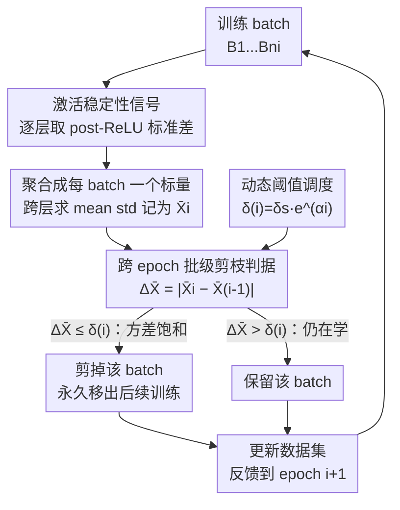

# Batch Pruning by Activation Stability

**会议**: ICLR2026  
**OpenReview**: [https://openreview.net/forum?id=TUADW7db5n](https://openreview.net/forum?id=TUADW7db5n)  
**代码**: https://github.com/mustakinalam/Batch-Pruning-by-Activation-Stability  
**领域**: 模型压缩 / 高效训练  
**关键词**: 数据剪枝, 激活稳定性, 动态批剪枝, 训练加速, 神经坍缩

## 一句话总结
提出 B-PAS——在训练过程中监控每个 batch 跨 epoch 的 ReLU 激活方差变化，把"激活已经稳定下来、不再贡献有效学习"的整批数据动态丢掉，在 ResNet/CvT/GPT-2 上最多省掉 57% 的训练数据和 61% 的 GPU 节点小时，且精度不降反略升。

## 研究背景与动机
**领域现状**：深度网络训练越来越贵——数据、时间、能耗都是瓶颈。一条主流的省钱路线是"少喂点数据"：数据集蒸馏（dataset distillation）和核心集选择（coreset selection）试图合成或挑出一个紧凑且信息量大的子集；加权采样则提高有用样本被抽到的频率。另一条路线是数据剪枝（data pruning），分静态和动态两类：静态方法在训练前就用某种"样本效用分"剔掉低价值样本，动态方法（如 InfoBatch）则在训练途中边训边剪。

**现有痛点**：这些方法各有各的累赘。蒸馏/核心集往往引入不小的预处理开销，还可能掉精度；加权采样对模型和数据集很敏感。静态剪枝要先把整套数据跑一遍算分，预处理成本高且训练中无法自适应。动态剪枝里最强的 InfoBatch 虽然效果好，但它依赖**逐样本的 loss 统计**、需要梯度重缩放（rescaling）来保持梯度无偏，而且被剪掉的样本在后续 epoch 还要被重新访问——这些都要额外记账和计算。简言之，现有信号要么是外部启发式（难度分、不确定性），要么是 loss/梯度统计，都不"便宜"。

**核心矛盾**：判断"一个 batch 还值不值得继续训"这件事，到底需不需要这么重的外部信号？loss 统计、辅助模型、人工规则都是在网络**外面**找证据，而真正反映"这批数据还有没有东西可学"的信息，其实就藏在前向传播已经算出来的**内部激活**里。

**切入角度**：作者把视角转向网络内部动态。神经坍缩（Neural Collapse）现象指出，随着训练收敛，同类样本的表示会越来越对齐、激活模式趋于稳定；Ahmad et al. (2024) 进一步把卷积激活的稳定性和"接近最优学习容量"联系起来，用它做早停。本文把这个原本用于整体早停的观察**下放到 batch 粒度**：既然某些 batch 的激活方差跨 epoch 几乎不再变化，那它对权重更新的贡献也就基本饱和了，可以直接丢掉。

**核心 idea**：用"激活稳定性"代替"loss/梯度统计"来判断 batch 的学习效用——监控每个 batch 后续 ReLU 激活标准差跨 epoch 的变化量，变化小于阈值就把整批永久剪掉，全程零额外前向、不碰标签、不需重缩放。

## 方法详解

### 整体框架
B-PAS 是一个**即插即用（plug-in）**的训练加速模块：原本的 CNN 训练流程不变，只是在每个 epoch 结束时，根据各 batch 激活方差的稳定程度，决定下一个 epoch 还要不要喂这批数据。输入是按 batch 组织的训练集，输出是一条"保留 batch 数逐 epoch 单调递减"的训练轨迹，最终在更少的数据上训出同等（甚至更好）的精度。

整个机制可以分成"取信号 → 聚合 → 比较 → 剪枝 → 反馈"五步。关键是：取信号这一步**复用前向传播里已经算好的激活值**，所以几乎零额外开销。下面这张图给出数据如何在一个 epoch 内被打分、并把决策反馈到下一个 epoch：

### 关键设计

**1. 激活稳定性信号：用 post-ReLU 标准差度量一个 batch 还有没有可学的东西**

痛点是：怎么不靠 loss/标签、只靠网络内部就判断一个 batch 的学习效用？作者的答案是看激活的方差有没有"动"。具体地，对每个卷积层、每个 batch，把 ReLU 激活后的输出张量拉平，算其标准差 $\sigma=\sqrt{\frac{1}{N}\sum_{k=1}^{N}(t_k-\mu)^2}$，其中 $t_k$ 是拉平张量里的每个值，$\mu$ 是均值，$N$ 是元素总数。之所以**在 ReLU 之后**算方差而不是之前，是因为 ReLU 不仅引入非线性，还会把不激活的神经元压成 0，使得方差反映的是稀疏、有意义的特征，而不是带噪的预激活值。当这个方差跨 epoch 几乎不变时，说明这批数据对应的特征已经"定型"，它对权重更新的贡献也就饱和了。这一步的妙处在于：$\sigma$ 用的全是前向传播里**已经存在**的激活，不需要额外跑网络、不需要辅助模型，开销可忽略。

**2. 跨 epoch 批级剪枝判据：方差不再变就把整批丢掉**

单层标准差还不够，作者把一个 batch 在所有 $l$ 个卷积层上的标准差 $\sigma_{1,ni},\dots,\sigma_{l,ni}$ 聚合成**每 batch 一个标量**——均值标准差 $\bar{X}_i(\sigma_{1,ni},\dots,\sigma_{l,ni})$。从第二个 epoch 起，把当前 epoch 的均值标准差和上一个 epoch 的相比，得到变化量

$$\Delta\bar{X} = \left|\bar{X}_i(\sigma_{1,ni},\dots,\sigma_{l,ni}) - \bar{X}_{i-1}(\sigma_{1,ni},\dots,\sigma_{l,ni})\right| \le \delta(i)$$

若 $\Delta\bar{X}$ 低于阈值 $\delta(i)$，就判定这个 batch 已收敛，把它从 epoch $i{+}1$ 起**永久**移出训练。这条判据在每个 epoch 末对所有 batch 执行一遍，于是保留的 batch 数 $n_i$ 单调不增（$n_i \le n_{i-1}$），训练逐步变轻。这里一个关键的工程取舍是**批级而非样本级**：batch 在初始化时固定下来（不每个 epoch 重新生成），但 batch 内部仍做 shuffle 保持随机性。之所以剪整批而不是剪单个样本，是因为样本级剪枝可能不成比例地剪掉某些类，造成类别失衡、精度崩塌（实验里样本级只有 70.87% vs 批级 78.43%）；批级剪枝则天然保留了类别多样性。

**3. 动态阈值调度：早期保守、后期激进，匹配学习的自然节奏**

固定阈值不好用：$\delta$ 太小会过度保守（方差几乎纹丝不动才肯剪，留下一堆冗余 batch），太大会过度激进（把还在学的 batch 提前剪掉，甚至 epoch 2 就把数据全删了导致训练崩溃）。作者用一条指数调度来平衡：

$$\delta(i) = \delta_s \cdot e^{\alpha i}, \quad \alpha = \frac{1}{I}\ln\!\left(\frac{\delta_e}{\delta_s}\right)$$

其中 $\delta_s$、$\delta_e$ 是初始/终止阈值，$i$ 是当前 epoch，$I$ 是总 epoch 数。这条曲线的逻辑很贴合训练动力学：训练早期特征还在大面积形成，阈值小、剪得保守，避免误杀；训练后期学习趋稳，阈值升高、剪得激进，把饱和的 batch 大胆丢掉。实验给出的经验默认值是：32×32 小图（CIFAR/SVHN）用 $\delta\in[10^{-6}, 5\times10^{-5}]$，ImageNet-1K 用 $\delta\in[5\times10^{-6}, 5\times10^{-5}]$。一个实用补充是：标定 $\delta$ 不需要跑完整训练，**只用 10% 的数据**就能选出可靠阈值。

**4. Data Savings Index（DSI）：一个不受硬件干扰的数据效率度量**

GPU 节点小时（node-hours $= g\times h$，GPU 数乘训练小时）受硬件和系统因素干扰，不同机器不可比。作者因此引入 DSI 直接量化"训练中省下的数据比例"：

$$\text{DSI} = 1 - \frac{\sum_{i=1}^{e_s} n_i}{e_0 \cdot n_0}$$

其中 $n_i$ 是第 $i$ 个 epoch 保留的 batch 数，$n_0$ 是训练前的总 batch 数，$e_s$ 是实际停止的 epoch，$e_0$ 是无剪枝时计划训练的 epoch 数（$e_s \le e_0$）。DSI 取值在 $[0,1]$，越大代表省得越多。举例：计划训 5 个 epoch、每 epoch 200 个 batch，但在第 3 个 epoch 停止、三个 epoch 分别处理了 200/190/180 个 batch，则 $\text{DSI} = 1 - \frac{200+190+180}{5\times200} = 0.43$，即省下 43% 的潜在训练数据。实验证实 DSI 与节点小时省幅走势一致，说明数据用量和训练成本紧耦合，但 DSI 更系统无关。

### 损失函数 / 训练策略
B-PAS **不改损失函数**——它是数据侧的即插件，训练目标仍是各任务原本的目标（分类交叉熵、GPT-2 微调的语言建模 loss 等）。一个对它影响很大的训练设置是 Batch Normalization：BN 按 batch 归一化特征统计量，恰好稳定了激活轨迹、放大了 B-PAS 所依赖的判别信号；没有 BN 时激活轨迹不稳，需要更激进的阈值才能剪出有意义的 DSI。

## 实验关键数据

### 主实验
覆盖 ResNet-18/50、CvT，数据集 CIFAR-10/100、SVHN、ImageNet-1K，并扩展到 GPT-2 large 在 Alpaca 上的微调。核心对比对象是当前 SOTA 的 InfoBatch。

| 数据集 / 模型 | 方法 | DSI(省数据%) | 省 GPU 时(%) | 精度 |
|--------------|------|------|------|------|
| ImageNet-1K / ResNet-50 | 全量基线 | 0 | 0 | 78.07 |
| ImageNet-1K / ResNet-50 | InfoBatch (40%) | 28 | 40 | 78.07 |
| ImageNet-1K / ResNet-50 | **B-PAS** ($\delta\in[10^{-5},10^{-4}]$) | **57** | **61** | 78.07 |
| ImageNet-1K / ResNet-50 | **B-PAS** ($\delta\in[5\times10^{-6},5\times10^{-5}]$) | 47 | 48 | **78.43** |
| CIFAR-100 / ResNet-50 | InfoBatch (30%) | 18 | — | 80.60 |
| CIFAR-100 / ResNet-50 | **B-PAS** | 30 | 29 | 80.60 |

在 ImageNet-1K 这种大规模场景上 B-PAS 优势最明显：同样维持 78.07% 精度，它比 InfoBatch 多省 29% 数据、多省 21% GPU 时；换更保守的阈值还能把精度推到 78.43%（略高于全量基线）同时省 47% 数据。在 CIFAR 这类小图上优势较温和但稳定。

### 消融实验

| 配置 | 关键指标 | 说明 |
|------|---------|------|
| 批级 vs 样本级剪枝 | 78.43% vs 70.87% | 样本级会剪偏某些类导致失衡，批级保类别多样性 |
| +BN vs -BN (CIFAR-10) | DSI 25%/Acc 95.60 vs DSI 19.72%/Acc 89.87 | BN 稳定激活、放大判别信号 |
| 90 vs 200 epoch (ImageNet) | DSI 12% vs 47% | 训得越久激活越稳，可剪空间越大 |
| 随机剪同样数量 batch | 精度持续下降 | 证明激活稳定性确实在识别"非信息" batch |
| 优化器 SGD/Adam/AdaGrad | 精度与基线一致，DSI 22–25% | 剪枝判据对优化动力学鲁棒 |

### 关键发现
- **批级粒度是精度关键**：样本级剪枝掉到 70.87%，批级 78.43%——把剪枝放到 batch 级别避免了类别失衡，是这套方法成立的前提。
- **随机剪枝对照证明信号有效**：剪同样数量但随机选的 batch 会持续掉精度，说明 B-PAS 剪的确实是"学不到东西"的批，而非单纯减数据。
- **训练越长越划算**：90 epoch 只能剪 12%，200 epoch 能剪 47%——激活稳定是训练后期才大量出现的现象，因此 B-PAS 在长训练、大规模场景收益最大。
- **跨架构/任务可迁移**：从 CNN 扩到 CvT（需更长训练或更激进 $\delta$，因 transformer 激活稳定得更晚更噪），再到 GPT-2 微调（剪 23% batch、loss/困惑度不变、2×A100 上省约 1 小时），说明激活稳定是一个通用信号。

## 亮点与洞察
- **把"早停信号"下放到 batch 粒度**：原本激活稳定性是用来判断"整个网络该不该停训"的全局信号，本文巧妙地把它细化到每个 batch，于是"早停"变成了"逐批渐进式瘦身"——这是核心的视角转换。
- **零额外开销的剪枝信号**：判据全用前向传播已算出的 post-ReLU 激活，不跑辅助模型、不存逐样本 loss、不做梯度重缩放，比 InfoBatch 这类要"记账"的方法在工程上轻得多，这正是它能在大规模上省更多的原因。
- **永久 vs 临时剪枝的取舍**：InfoBatch 的样本级剪枝是临时的、后续还要重访全部数据；B-PAS 是**永久批级剪枝**，被剪的批不再回来，因此真正减少了数据访问量——这个设计差异直接转化成了更高的节点小时节省。
- **DSI 这个度量可复用**：把"省了多少数据"定义成跨 epoch 的累计比例、与硬件解耦，比 GPU 时更适合横向比较不同剪枝方法，可以借鉴到其他高效训练工作里。

## 局限与展望
- **阈值调度仍靠经验**：作者承认 $\delta_s$、$\delta_e$ 的指数调度是经验选取的，虽然可以用 10% 数据快速标定，但缺乏自适应/理论化的阈值确定方法。
- **transformer 上收益打折**：CvT 和 GPT-2 上激活稳定来得更晚、更噪，温和阈值下只能剪 13–14%，要更激进的 $\delta$ 或更长训练才能逼近 CNN 的效率——说明该信号对 CNN 友好、对 transformer 需要再调。
- **依赖足够长的训练**：90 epoch 只能剪 12%，意味着短训练任务上收益有限；方法的甜区是长训练、大规模。
- **强依赖 BN**：没有 BN 时激活轨迹不稳、默认阈值几乎剪不动（DSI 仅 2%），对不用 BN 的架构适用性存疑。
- **改进方向**：把固定指数调度换成根据观测到的 $\Delta\bar{X}$ 分布自适应调节的阈值，或为 transformer 设计专门的激活稳定度量，可能进一步释放收益。

## 相关工作与启发
- **vs InfoBatch（动态样本剪枝 SOTA）**：InfoBatch 靠逐样本 loss + 软剪枝 + 梯度重缩放保证无偏，是临时、样本级剪枝；B-PAS 靠激活稳定做永久、批级剪枝，不碰 loss/标签、不重缩放、不重访被剪数据。结果是同精度下 B-PAS 在 ImageNet 多省 29% 数据、21% GPU 时。劣势是 B-PAS 在小图和 transformer 上收益相对温和。
- **vs 静态数据剪枝（GraNd / EL2N / DeepFool 等）**：静态方法训练前就用难度分/几何多样性/决策边界算样本重要性，要全量数据和重预处理、训练中不自适应；B-PAS 全程在线、按需剪枝，无预处理。
- **vs 数据集蒸馏 / 核心集**：蒸馏合成紧凑训练集，但难扩到高分辨率和大模型；B-PAS 不合成数据、直接在原数据上动态丢批，扩展性更好。
- **思想源头 Neural Collapse / Ahmad et al. (2024)**：前者揭示训练收敛时激活模式趋稳，后者用卷积激活稳定做早停；本文是把这条"内部动态指示学习进度"的线索从全局早停推进到 batch 级动态剪枝。

## 评分
- 新颖性: ⭐⭐⭐⭐ 把激活稳定性从全局早停下放到 batch 级动态剪枝，视角清晰且信号"免费"，但底层观察沿用已有工作。
- 实验充分度: ⭐⭐⭐⭐ 覆盖三种架构、四个数据集、45 组阈值扫描，还扩到 CvT 和 GPT-2，消融全面；缺一些更大 LLM 的验证。
- 写作质量: ⭐⭐⭐⭐ 动机递进清楚、判据和 DSI 定义明确，图示稍显拥挤但整体好读。
- 价值: ⭐⭐⭐⭐ 即插即用、零额外开销、ImageNet 上省 61% GPU 时不掉精度，对资源受限的训练很实用。

<!-- RELATED:START -->

## 相关论文

- [\[CVPR 2026\] Batch Loss Score for Dynamic Data Pruning](../../CVPR2026/model_compression/batch_loss_score_for_dynamic_data_pruning.md)
- [\[ICLR 2026\] SERE: Similarity-based Expert Re-routing for Efficient Batch Decoding in MoE Models](sere_similarity-based_expert_re-routing_for_efficient_batch_decoding_in_moe_mode.md)
- [\[ICLR 2026\] Steering MoE LLMs via Expert (De)Activation](steering_moe_llms_via_expert_deactivation.md)
- [\[ICLR 2026\] Null-Space Filtering for Data-Free Continual Model Merging: Preserving Stability, Promoting Plasticity](null-space_filtering_for_data-free_continual_model_merging_preserving_stability_.md)
- [\[ICLR 2026\] STaMP: Sequence Transformation and Mixed Precision for Low-Precision Activation Quantization](stamp_sequence_transformation_and_mixed_precision_for_low-precision_activation_q.md)

<!-- RELATED:END -->
