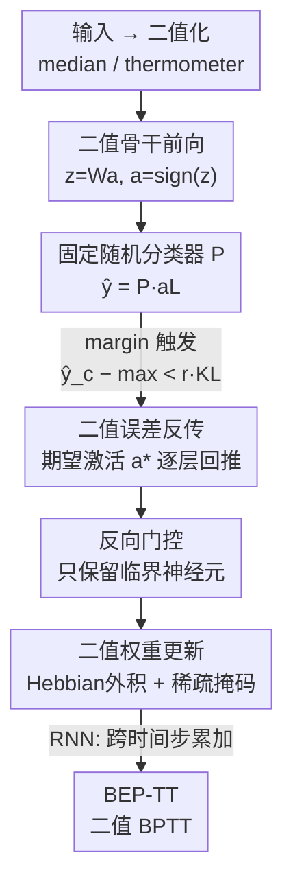

# BEP: A Binary Error Propagation Algorithm for Binary Neural Networks Training

**会议**: ICLR 2026  
**OpenReview**: [https://openreview.net/forum?id=jxtCMoZIu8](https://openreview.net/forum?id=jxtCMoZIu8)  
**代码**: https://github.com/AI-Tech-Research-Lab/BEP  
**领域**: 模型压缩 / 二值神经网络  
**关键词**: 二值神经网络, 反向传播, 无梯度学习, 位运算, 边缘设备

## 一句话总结
BEP 提出了反向传播链式法则的**纯二值离散版本**：让误差信号以 ±1 二值向量的形式逐层反向传播，整个前向和反向过程只用 XNOR、Popcount 和加减 1 这些位运算完成，从而首次实现了二值 MLP 和二值 RNN 的端到端全二值训练，相比之前的局部学习规则在 MLP 上提升最多 +6.89%、在 RNN 上平均提升 +10.57%。

## 研究背景与动机
**领域现状**：二值神经网络（BNN）把权重和激活都约束到 ±1，前向推理可以用 XNOR + Popcount 这类轻量位运算替代昂贵的浮点乘加，在算力、内存、功耗都吃紧的边缘设备上极具吸引力。但训练 BNN 是个难题——sign 激活函数不可导，标准基于梯度的优化没法直接用。

**现有痛点**：目前主流的训练方式是量化感知训练（QAT）。它绕开不可导问题的办法是：保留一份全精度的"隐变量权重"，前向时把它们二值化，反向时用直通估计器（STE）把 sign 的导数近似成恒等映射，再用浮点 Adam 去更新那份全精度权重。问题在于——反向传播全程是浮点运算，还要额外存一份 FP32 的隐权重和 Adam 的一二阶矩。也就是说，BNN 的位运算高效性**只在前向推理时兑现了，训练阶段完全没省下来**，而且训练和推理的动力学还存在偏差。

另一条路是纯二值、无梯度的局部学习规则（受统计物理启发）。最近的工作（Colombo et al., 2025）给二值 MLP 的每一层用一个**固定随机分类器**生成局部误差信号来更新。但它的致命缺陷是：信用分配（credit assignment）是**局部的**，最终输出层的误差**无法逐层传回**网络深处。

**核心矛盾**：QAT 全局但不二值（靠浮点梯度做全局信用分配），局部规则二值但不全局（没法把任务损失端到端传播）。两者无法兼得。这个矛盾直接导致：**凡是依赖端到端误差传播的架构（典型如 RNN，需要跨时间步的信用分配），现有的纯二值方法都束手无策。**

**本文目标**：能不能设计一个**多层、全局**的信用分配机制，让误差能逐层反传穿过整个网络，同时**全程只在二值域里操作**？

**切入角度**：作者注意到，标准反向传播的链式法则本质上是"误差信号 $\delta$ 经 $W^\top$ 投影回上一层、再乘激活导数 $\sigma'$、最后用学习率控制更新幅度"这三步。如果能给每一步都找到一个**二值对应物**，就能造出一个离散版的反传。

**核心 idea**：用二值"期望激活向量"$a^*$ 充当误差信号 $\delta$，用 $W^\top$ 的二值矩阵乘法做误差投影，用一个二值门控充当激活导数 $\sigma'$，用稀疏掩码充当学习率——拼出一条完全在 ±1 域里运行的"二值链式法则"。

## 方法详解

### 整体框架
BEP 训练的是一个"可训练二值骨干 + 固定随机分类器"的网络。前向时输入先被二值化成 ±1 向量喂进 $L$ 层全连接二值骨干，每层做 $z_l = W_l a_{l-1}$、$a_l = \text{sign}(z_l)$，骨干输出再经固定分类器 $P$ 得到 logits $\hat{y} = P a_L$。训练的关键在反向：当某个样本的正确类 logit 没有比其它类领先够多时，BEP 就从输出层开始，把"理想的二值激活模式"$a^*$ 一层层反推回去，再据此更新每层的整数隐权重。整条管线只动 ±1 二值量和整数权重，没有任何浮点梯度。

整个流程可以图文对照如下：

### 关键设计

**1. 二值期望激活反传：用 ±1 向量充当误差信号，造一条离散链式法则**

这是 BEP 的基石，针对的是"误差信号怎么在二值域里逐层传回"这个核心痛点。每层的状态由两个矩阵刻画：整数隐权重 $H_l \in \mathbb{Z}^{K_l \times K_{l-1}}$（编码"突触惯性"，提供学习稳定性、缓解灾难性遗忘，实际约束在 $B$ 位有符号整数范围，如 Int16），以及可见二值权重 $W_l = \text{sign}(H_l) \in \{\pm 1\}$（前向真正用的权重）。

反传从输出层开始。因为 logit 是激活与类原型的内积 $\hat{y} = P a_L$，要让正确类 $c^\mu$ 的 logit 最大，最理想的激活就是该类的原型向量本身，于是最后一层的期望激活解析可得：$a^{*\mu}_L = \rho_{c^\mu}$（$\rho_{c^\mu}$ 是固定分类器 $P$ 的第 $c^\mu$ 行）。对中间层 $l < L$，目标是找一组激活，让它经下一层后尽量对齐下一层的期望激活，即 $\arg\max_{a} \langle a^{*}_{l+1}, \text{sign}(W_{l+1} a)\rangle$。这是个 $2^{K_l}$ 的组合搜索，BEP 做了个松弛——去掉非线性 sign，改成最大化与**预激活**的对齐 $\arg\max_a \langle a^{*}_{l+1}, W_{l+1} a\rangle$。作者证明（Lemma 1）这个松弛问题有唯一解析解 $a^* = \text{sign}(W^\top(g \odot b))$。把基例和 Lemma 1 串起来，就得到逐层递归：

$$a^{*\mu}_l = \begin{cases} \rho_{c^\mu}, & l = L \\ \text{sign}\big(W^\top_{l+1}(g^\mu_{l+1} \odot a^{*\mu}_{l+1})\big), & l < L \end{cases}$$

注意这条递归里**只有二值矩阵乘法和 sign**——这正是"二值版链式法则"，误差信号以 ±1 向量形态端到端地穿过整个网络，而不像局部规则那样止步于本层。

反传的触发由一个 margin 准则控制：只有当正确类 logit 没领先够多时才更新，即 $\hat{y}^\mu_{c^\mu} - \max_{c \neq c^\mu} \hat{y}^\mu_c < r K_L$，其中 $r \in (0,1]$ 是用户设的鲁棒性间隔，$r$ 越大要求正确类领先得越多、分类越鲁棒。

**2. 反向门控：用二值门把误差只送给"临界"神经元，充当激活导数的角色**

这一步对应标准反传里的 $\sigma'(z)$。直觉是：对于那些预激活已经远离 0、近乎饱和的神经元，再怎么推它们也很难翻转激活符号，对它们做更新是浪费；真正"一推就动"的是预激活落在决策边界 0 附近的神经元。于是 BEP 在第 $l+1$ 层引入一个二值门控向量：

$$(g^\mu_{l+1})_i = \begin{cases} 1, & |z^\mu_{l+1,i}| \leq \nu K_l \\ 0, & \text{否则} \end{cases}$$

$\nu \in [0,1]$ 是可调阈值。门控把松弛优化目标改成带门的内积 $\langle a^*_{l+1}, W_{l+1} a\rangle_{g^\mu_{l+1}}$（定义 $\langle a, a'\rangle_g := \sum_i g_i a_i a'_i$）。它的作用和 $\sigma'$ 异曲同工：饱和神经元的 $\sigma'$ 趋近 0、会切断误差传播，这里的门也正是把饱和（大幅值预激活）的神经元从反传中剔除，让更新集中在最容易翻转的部分。后面实验会看到这个门控对深层（长序列）训练至关重要。

**3. 二值权重更新：Hebbian 外积 + 稀疏掩码，掩码充当"学习率"**

拿到期望激活 $a^*_l$ 后就更新整数隐权重 $H_l$。候选更新方向由经典感知机式的 Hebbian 外积给出：

$$\Delta H^\mu_l = \text{sign}\big(a^{*\mu}_l (a^\mu_{l-1})^\top\big) = a^{*\mu}_l (a^\mu_{l-1})^\top \in \{\pm 1\}^{K_l \times K_{l-1}}$$

这是 Clipped Perceptron（CP / CP+R）规则向多层的自然推广：当 $K_l = 1$ 时它退化成 CP——期望输出为 +1（或 −1）时就把输入向量加到（或减去）突触稳定度变量上。然后用一个二值掩码 $M^\mu_l \in \{0,1\}$ 筛选哪些权重真正改：把每层神经元分组，每组内只更新那个"最容易纠正的错误感知机"（即误分类里有符号稳定度 $a^*_l H_{l,j}$ 最小、最不稳定的那个）。聚合更新写成 $H_l \leftarrow H_l + 2\sum_{\mu \in M}(M^\mu_l \odot \Delta H^\mu_l)$。这个稀疏的"赢家通更新"机制限制了每个样本改的突触数，避免过度强化那些已经高置信分对的神经元，实质上是一种离散的、数据依赖的学习率控制。

此外还有一个来自 CP+R 的强化步骤：以概率 $p_r\sqrt{2/(\pi K_l)}$ 对每个整数权重做 $h \leftarrow h + 2\,\text{sign}(h)$，在模型不确定时更频繁地强化已有记忆轨迹，并按层尺寸归一化。分组尺寸 $\gamma$ 还采用调度策略——当泛化误差停滞时增大到 $K_l$ 的下一个约数，组越大、每步更新越稀疏，让训练后期更稳。

到这里可以看清 BEP 与标准反传的逐项对应：期望激活 $a^*$ ↔ 误差信号 $\delta$；$W^\top$ 投影 ↔ 误差反传；二值门控 ↔ 激活导数 $\sigma'$；稀疏掩码 ↔ 学习率（$\eta$ 管幅度，掩码管稀疏度）。

**4. BEP-TT：把全局误差传播扩展到时间维度，训练二值 RNN**

BEP 全局信用分配的最大红利是能直接搬到 RNN 上——这正是局部规则做不到的。把 RNN 沿时间展开，就得到二值版的 BPTT，称为 BEP-TT。前向递归 $s^\mu_t = \text{sign}(W_{xs} a^\mu_t + W_{ss} s^\mu_{t-1})$，末步状态经 $s^\mu_y = \text{sign}(W_{sy} s^\mu_T)$ 出结果。反向时把期望状态从 $t=T$ 一路推回 $t=1$：先令 $s^{*\mu}_y = \rho_{c^\mu}$，再 $s^{*\mu}_T = \text{sign}(W^\top_{sy}(g^\mu_y \odot s^{*\mu}_y))$，之后递归 $s^{*\mu}_t = \text{sign}(W^\top_{ss}(g^\mu_{t+1} \odot s^{*\mu}_{t+1}))$。由于 RNN 跨时间共享权重，$H_{xs}$ 和 $H_{ss}$ 要把所有时间步、所有触发样本的更新**累加**起来再施加，且二值掩码 $M_{xs}, M_{ss}$ 在各时间步**共享**——这样掩码才能和时间聚合交换次序，保证权重绑定不被破坏（若让掩码随时间变，等于在每个时间索引训练同一参数的不同副本）。这一设计让 BEP 成为首个能端到端二值训练 RNN 的方法。

### 损失函数 / 训练策略
BEP 没有传统意义上的可微损失，"损失"被 margin 触发准则替代：只对没把正确类分得够开的样本反传更新。关键超参包括鲁棒性 $r$、强化概率 $p_r$、初始分组尺寸 $\gamma_{0,l}$、门控阈值 $\nu$。RNN 实验用 $r=0.5,\ p_r=0.5,\ \gamma_{0,l}=15,\ \nu=0.05$，训练 50 个 epoch。输入二值化用中值阈值（图像）或温度计编码（表格/时序），固定分类器 $P$ 由二值等角框架方法生成。

## 实验关键数据

### 主实验
**二值 MLP（vs 局部规则 SotA + QAT）**：在 4 个数据集上对比 BEP、SotA 局部规则（Colombo et al., 2025）和 QAT（Larq 框架，不带 batchnorm 以保证推理时全二值），2/3 隐层、5 次平均。两种全二值方法都显著超过同等 QAT；BEP 在最小参数配置下相比局部 SotA 的提升如下表：

| 数据集 | BEP 相对局部 SotA 提升（最小参数配置） |
|--------|------|
| Random Prototypes | +6.89% |
| FashionMNIST | +1.22% |
| CIFAR-10 | +3.70% |
| Imagenette | +2.85% |

随模型变大差距收窄，BEP 与局部规则持平，仅在 CIFAR-10 / 3 层的高参数设置下略落后一点。

**二值 RNN（vs QAT）**：在 30 个 UCR 时序分类数据集上用 BEP-TT 对比 QAT（3 折交叉验证、3 次独立运行）。**每个数据集 BEP-TT 都超过同等 QAT 基线，平均提升 +10.57%。**

| 方法 | 内存（权重） | 内存（误差/梯度） | 反向 Boolean 门 | 更新 Boolean 门 |
|------|------|------|------|------|
| QAT (Adam) | 32 bit (FP32) | 32 + 64（一二阶矩） | ~$10^4$ | ~$10^4$ |
| BEP | 16 bit (Int16) | 1 bit | ~$10$ | ~$10$ |

即权重内存 2× 缩减、误差/梯度 32× 缩减，反向与更新的等效 Boolean 门成本约降 3 个数量级（BEP 全程只用 XNOR/Popcount/增减，QAT 的 FP32 加乘各需约 $10^4$ 门）。

### 消融实验

| 配置 | 现象 | 说明 |
|------|------|------|
| 门控阈值 $\nu$ 扫描 | $\nu \approx 10^{-2}$ 最优 | 过低或过高都掉点，中间值最稳 |
| 窗口长度增大 | 门控收益变大 | 反向步数越深（序列越长），聚焦临界神经元越关键 |
| 去掉全局反传（=局部规则） | MLP 掉点、RNN 不可训 | 全局信用分配是 RNN 能训的前提 |

### 关键发现
- **门控阈值 $\nu$ 存在明确最优值**（约 $10^{-2}$）：太小几乎不更新、太大把饱和神经元也卷进来，都会损害泛化；而且序列越长、网络反传越深，门控的作用越突出——说明"只更新决策边界附近的神经元"在深层尤其重要。
- **全局误差传播是 RNN 能被纯二值训练的根本原因**：局部规则因为误差传不到深处，在需要跨时间步信用分配的 RNN 上根本无从下手，BEP-TT 的成功正是对"二值全局信用分配可行"的关键验证。
- **QAT 带 batchnorm 在部分 UCR 数据集上反而更高**，但那样推理时就不是全二值模型了，与 BEP 的"全二值"目标不在同一约束下，不能直接比大小。

## 亮点与洞察
- **把反传的每一个部件都找到二值对应物**：$a^* \leftrightarrow \delta$、$W^\top$ 投影 $\leftrightarrow$ 误差反传、门控 $\leftrightarrow \sigma'$、稀疏掩码 $\leftrightarrow$ 学习率。这种"逐项对应"的视角既让算法有了清晰的理论解释，也是把连续算法离散化的一个可复用范式。
- **Lemma 1 的解析解是整个方法能"只用位运算"的关键**：原本是 $2^{K_l}$ 的组合搜索，松弛掉 sign 后变成 $\text{sign}(W^\top(g\odot b))$ 一步算出，没有这个解析解 BEP 就退化成不可行的暴力搜索。
- **整数隐权重 + sign 可见权重的双轨设计**很巧妙：整数权重提供"突触惯性/记忆"让训练稳定、抗遗忘，可见二值权重保证前向是纯位运算——把"需要连续量来稳定优化"和"推理要二值"这对矛盾分到了两套权重上。
- **稀疏"赢家通更新"掩码当作离散学习率**：在没有连续学习率的二值世界里，用"每组只更新最不稳定的一个神经元"来控制更新强度，是个很值得迁移到其它离散优化场景的 trick。

## 局限与展望
- **架构受限**：目前只覆盖二值 MLP 和 RNN。要扩展到卷积或 Transformer，需要完整的二值化设计——二值卷积、滤波器级掩码、以及支持权重共享/空间结构/多头机制的额外适配，作者承认这非平凡。
- **任务受限**：实验只做了分类。虽然 BEP 原则上支持任意二值输出向量（多标签、二值分割、二值向量回归），但这些任务需要额外设计输出编码方案。
- **规模受限**：只在中等规模数据集和中等深度网络上验证，扩到 ImageNet 级别的大模型还需大幅架构改造，可能还要引入二值兼容的归一化机制来保证稳定。
- （自己看）margin 触发 + 稀疏掩码引入了不少超参（$r, p_r, \gamma_0, \nu$），且缺乏正式的收敛性分析，作者也把"形式化收敛分析"列为 future work，目前更多是经验性有效。

## 相关工作与启发
- **vs QAT（BinaryConnect / XNOR-Net / Larq）**：QAT 维护全精度隐权重 + STE 做反传，本质是"用连续优化解离散问题"，训练全程靠浮点、训练-推理动力学有偏差；BEP 彻底抛弃任何实值参数和代理梯度，训练就是位运算，三个数量级的 Boolean 门成本优势就来自这里。
- **vs 局部学习规则（Colombo et al., 2025）**：他们给每层用固定随机分类器生成**局部**误差，能训多层 MLP 但任务损失传不到深处，因而无法处理 RNN；BEP 用 $W^\top$ 把二值误差**全局**反传，既在 MLP 上更强（最高 +6.89%），又解锁了 RNN。
- **vs CP / CP+R 等统计物理无梯度规则**：这些方法靠随机权重翻转、缺乏结构化的逐层信用分配，深层难扩展；BEP 把它们的整数稳定度变量和强化步骤继承下来，但补上了一条确定性的、可逐层反传的误差传播规则，把"纯二值优化"和"多层深度训练"接到了一起。

## 评分
- 新颖性: ⭐⭐⭐⭐⭐ 首个把反传链式法则完整离散化为纯二值算法，并据此实现 RNN 的全二值训练
- 实验充分度: ⭐⭐⭐⭐ MLP（4 数据集）+ RNN（30 UCR）+ 门控消融 + 复杂度分析较全面，但限于中等规模、未触及卷积/Transformer
- 写作质量: ⭐⭐⭐⭐⭐ 与标准 BP 的逐项类比讲得清晰，Lemma 把"为何可解析"交代得明白
- 价值: ⭐⭐⭐⭐ 对 TinyML / 神经形态 / 同态加密等约束场景的低成本训练有实在意义，是 BNN 训练范式上的一块重要拼图

<!-- RELATED:START -->

## 相关论文

- [\[ICML 2026\] SURGE: Surrogate Gradient Adaptation in Binary Neural Networks](../../ICML2026/model_compression/surge_surrogate_gradient_adaptation_in_binary_neural_networks.md)
- [\[ICML 2025\] An Efficient Matrix Multiplication Algorithm for Accelerating Inference in Binary and Ternary Neural Networks](../../ICML2025/model_compression/an_efficient_matrix_multiplication_algorithm_for_accelerating_inference_in_binar.md)
- [\[AAAI 2026\] BD-Net: Has Depth-Wise Convolution Ever Been Applied in Binary Neural Networks?](../../AAAI2026/model_compression/bd-net_has_depth-wise_convolution_ever_been_applied_in_binary_neural_networks.md)
- [\[ICLR 2026\] AnyBCQ: Hardware Efficient Flexible Binary-Coded Quantization for Multi-Precision LLMs](anybcq_hardware_efficient_flexible_binary-coded_quantization_for_multi-precision.md)
- [\[ICLR 2026\] Zeros Can Be Informative: Masked Binary U-Net for Image Segmentation on Tensor Cores](zeros_can_be_informative_masked_binary_u-net_for_image_segmentation_on_tensor_co.md)

<!-- RELATED:END -->
