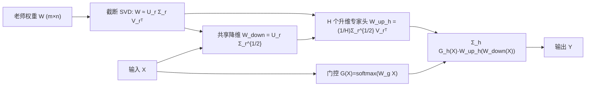

# Beyond Student: An Asymmetric Network for Neural Network Inheritance

**会议**: ICLR 2026  
**OpenReview**: [https://openreview.net/forum?id=mp67iSM7qn](https://openreview.net/forum?id=mp67iSM7qn)  
**代码**: [https://github.com/zyy-2001/InherNet-Demo](https://github.com/zyy-2001/InherNet-Demo)  
**领域**: 模型压缩 / 知识蒸馏 / 低秩分解  
**关键词**: Neural Network Inheritance, SVD 初始化, 低秩分解, Mixture-of-Experts, 知识蒸馏  

## 一句话总结
不再训练一个小容量学生网络去逼近老师，而是直接对老师权重做非对称低秩分解、用 SVD 初始化继承主成分知识，再以 MoE 风格的"一降维 + 多升维专家头"结构重建出一个又宽又深却轻量的"继承网络"，在同等参数下收敛更快、精度反超传统学生网络。

## 研究背景与动机

**领域现状**：知识蒸馏（KD）是模型压缩的主流范式，把大老师网络的知识迁移给轻量学生网络，已从单模态视觉/文本扩展到多模态跨模态迁移。

**现有痛点**：学生网络受限于容量与架构，性能普遍逊于老师，存在难以弥合的"能力鸿沟"。这与 PEFT 里的 LoRA 处境相似——LoRA 用低秩矩阵逼近权重增量 $\Delta W$，相比全量微调仍有差距。更关键的是，已有的低秩分解类压缩工作零散、多停留在早期 CNN 视觉任务，且常用 CP / MPO 等张量分解把一层拆成多个子层，让网络"越变越深越窄"，容易梯度消失/爆炸、训练不稳。

**核心矛盾**：KD 让学生"隐式模仿"老师，受限于异构知识迁移的难度与学生容量；而单纯低秩分解又破坏结构、牺牲稳定性。如何既显式继承老师的结构与知识、又不破坏架构稳定性？

**本文目标**：提出一种通用、架构无关的神经网络继承（NNI）方法，直接以低秩形式"继承"老师的容量，并系统比较"继承网络 vs 学生网络"在同等参数下的性能与效率。

**核心 idea**：**从"逼近增量"到"逼近权重本身"**——与 LoRA 逼近 $\Delta W$ 不同，InherNet 直接用 SVD 逼近老师的完整预训练权重 $W$，从而更直接地保留老师的表达力；再叠加 **非对称 MoE 继承结构** 在不显著加深网络的前提下同时实现"加宽 + 加深"。

## 方法详解

### 整体框架
InherNet 把每个待压缩层拆成两件事：**知识继承**（用什么数值初始化）与**结构继承**（搭成什么形状）。知识继承靠对老师权重做截断 SVD，把一层近似为"降维 + 升维"两层并用奇异值开方做初始化；结构继承则把升维侧扩成多个专家头，配一个门控做自适应融合，形成"一个共享降维分支 + H 个升维专家头"的非对称结构。两者结合后既保住老师的主成分知识，又通过多头专家化在同参数下扩大表达力。

### 关键设计

**1. SVD 驱动的知识继承：用主成分而非随机数起步**　InherNet 不像以往分解方法用随机初始化，而是对老师权重 $W \in \mathbb{R}^{m\times n}$ 做奇异值分解 $W = U\Sigma V^\top \approx U_r\Sigma_r V_r^\top$，截取前 $r$ 个最大奇异值对应的子空间。由 Eckart-Young-Mirsky 定理，这正是 Frobenius 范数意义下的最优 rank-$r$ 近似，误差等于被丢弃奇异值平方和的开方 $\|W-W_r\|_F=\sqrt{\sum_{i=r+1}^{\min(m,n)}\sigma_i^2}$。这样一层只需分解成两层（降维 + 升维），不会像 CP/MPO 那样把网络拆得又深又碎；对卷积层则先把核 $K\in\mathbb{R}^{N\times c\times k_w\times k_h}$ reshape 成 2D 矩阵再做同样的通道分解，得到 $W_{down}\in\mathbb{R}^{N\times r\times1\times1}$ 与 $W_{up}\in\mathbb{R}^{r\times c\times k_w\times k_h}$。由于 SVD 是离线一次性计算，训练时间几乎可忽略，却让网络"开局"就站在老师的主成分子空间里。

**2. 非对称专家头结构：一个降维分支配多个升维专家**　受 MoE 启发，InherNet 把升维侧扩成 $H$ 个专家头，但降维分支只保留一个，形成刻意的"非对称"。给定输入 $X$，输出为 $Y=\sum_{h=1}^{H}G_h(X)\cdot W_h^{up}\big(W^{down}(X)\big)$，其中 $W^{down}$ 与 $W_h^{up}$ 分别用 $U_{[:,:r]}\Sigma_{[:r,:r]}^{1/2}$ 和 $\frac{1}{H}\Sigma_{[:r,:r]}^{1/2}V_{[:,:r]}^\top$ 初始化（把奇异值开方均分到各头）。这一设计同时实现"加宽"（多头）与"加深"（两层），缓解纯低秩分解带来的梯度消失/爆炸风险；消融显示非对称优于对称（类 LoRA+MoE）结构，因为非对称引入了结构归纳偏置、增强了专家间的多样性。

**3. 自适应门控融合：让专家按输入分工**　各专家头由门控权重 $G(X)=\mathrm{softmax}(W_g(X))$ 加权聚合，$W_g\in\mathbb{R}^{m\times H}$ 为可学习参数。梯度可按 Lemma 2.2 自然分解为"各专家头贡献 + 门控网络贡献"两部分，使训练时梯度被路由到对当前输入最相关的专家，实现专家专精。消融表明门控对轻量级继承网络尤其关键——去掉门控（w.o. gate）后精度明显下降。

**4. 收敛与参数效率的理论支撑：把"更快收敛"讲清楚**　作者给出三组理论保证。一是收敛性：由于 $U_r,V_r$ 正交初始化，有效梯度 Lipschitz 常数从 $L$ 降到 $L'\approx L/\kappa$（$\kappa$ 为 $W$ 的条件数），在非凸 + 递减学习率 $\eta_t=\eta/\sqrt{t}$ 下达到 $\frac1T\sum_t\mathbb{E}\|\nabla L(\theta^{(t)})\|^2=O(1/\sqrt T)$，解释了实测的"收敛更快"。二是参数效率：rank-$r$、$H$ 头的压缩比约 $\rho=\frac{mn}{Hr(m+n)}$，且由 Proposition 2.7，功能相似度随 rank 单调上升但不随 $H$ 上升——**rank 才是继承知识多少的主导量**。三是 Proposition 2.10 给出多头的边际收益递减率 $O(1/H^2)$，即多头优于单头但越加越省，呼应了实验洞察。

## 实验关键数据

### 主实验：CIFAR-100 图像分类（top-1 Acc %，节选）

| 方法 | RN32×4 | VGG13 | WRN-40-2→40-1 | RN56 | RN110 |
|---|---|---|---|---|---|
| Teacher | 79.42 | 74.64 | 75.61 | 72.34 | 74.31 |
| Student | 72.50 | 70.36 | 71.98 | 69.06 | 71.14 |
| DKD | 76.32 | 74.68 | 74.81 | 71.97 | 74.11 |
| MLKD+Logit Std. | 78.28 | 75.22 | 75.56 | 72.33 | 74.32 |
| **InherNet-Small** | 77.57 | **75.68** | 76.04 | 72.67 | 74.13 |
| **InherNet-Large** | **78.53** | 75.16 | **76.39** | **73.67** | **75.88** |

InherNet-Large 普遍超过所有 KD baseline，且在 RN56/RN110 上**精度反超老师**；Small 在同参数下已可媲美最强的 Logit Std.。

### 跨模态检索（CC3M）+ ImageNet 零样本分类（%，节选）

| 方法 | I2T R@1 | T2I R@1 | top-1 | top-5 |
|---|---|---|---|---|
| ResNet-101 (Teacher) | 30.58 | 29.31 | 15.70 | 32.75 |
| EfficientNet-B0 (CLIP-KD) | **33.65** | 32.65 | 17.30 | 35.75 |
| **InherNet** | 32.17 | **33.01** | **17.39** | **36.65** |

多模态场景下 InherNet 普遍优于 CLIP-KD 蒸馏的学生，且性能持续显著高于老师网络。GLUE 上 InherNet 在 MNLI/QNLI/CoLA 等任务超过 T5-Small+KD；扩展到 LLaMA-2-7B 时，构造出的 4.2B 模型在 GSM8K 上略超 7B 老师。

### 消融实验（InherNet-Large，CIFAR-100 top-1 Acc %）

| 变体 | RN32×4 | WRN-40-2 | RN56 | RN110 |
|---|---|---|---|---|
| w.o. svd | 76.68 | 75.42 | 69.35 | 74.13 |
| w.o. gate | 78.17 | 76.08 | 73.22 | 75.64 |
| w. sym. | 77.92 | 75.98 | 73.28 | 75.45 |
| **InherNet** | **78.53** | **76.39** | **73.67** | **75.88** |

### 关键发现
- **SVD 初始化贡献最大**：去掉后（w.o. svd）RN56 上掉到 69.35，因为它既继承了老师的有益知识又稳定训练、加速收敛。
- **三大洞察**：① 蒸馏有利于小规模 InherNet，却**损害大规模 InherNet**（高 rank 下单凭任务损失就能略胜老师，KD 损失反而成了过强正则）；② rank 显著影响性能、多头优于单头；③ 相比传统蒸馏，InherNet 收敛显著更快。

## 亮点与洞察
- **范式转换很干净**：把"训练学生模仿老师"换成"直接继承老师权重"，用 SVD 把老师的主成分一次性注入新网络，绕开了异构知识迁移这个 KD 的老大难问题。
- **非对称 + MoE 的组合很巧**：单降维 + 多升维既加宽又加深，既避免传统张量分解"越拆越窄"的梯度风险，又用门控让专家分工，兼顾效率与表达力。
- **理论与实验闭环**："rank 决定继承多少知识、多头边际递减、SVD 初始化降低 Lipschitz 常数加速收敛"三条结论都既有定理又有消融佐证，少见地把"为什么收敛更快"讲透。
- **"反超老师"的反直觉结论**：高 rank InherNet 能略胜老师，并据此推出"对大模型反而别用 KD 损失"的实用建议。

## 局限与展望
- **依赖老师权重质量**：SVD 继承的前提是老师权重已训得足够好、主成分确实承载知识；对欠训练或谱分布平坦的老师，截断误差会侵蚀继承效果。
- **rank/H 需调**：rank 与专家头数是关键超参，论文虽给出"rank 主导、多头递减"的指导，但最优配置仍需针对任务搜索。
- **大模型 KD 对比缺位**：在 LLaMA-2-7B 上因词表 softmax、teacher-forcing、tokenizer 不匹配等原因未与标准 KD 正面比较，自蒸馏 baseline 说服力有限。
- **多数理论与扩展实验在附录**：ImageNet、收敛曲线、固定非对称设计的证明等都在 Appendix，正文主要落在 CIFAR-100 规模。

## 相关工作与启发
- **知识蒸馏**：logit 类（KD/DKD/MLKD/Logit Std.）与 feature 类（CRD/OFD/ReviewKD/SimKD/CAT-KD）都让学生隐式模仿老师；InherNet 改为显式继承，规避容量鸿沟。
- **低秩分解 / 张量分解**：Jaderberg、Zhang 等早期 CNN 分解与 CP/MPO 方法易把网络拆深拆窄；InherNet 只分两层并用 SVD 初始化保稳。
- **LoRA / PEFT**：InherNet 与 LoRA 形式相近但逼近对象相反（$W$ vs $\Delta W$），思路上把 PEFT 的低秩思想迁到"压缩 + 继承"。
- **MoE**：借鉴专家混合的"加宽"能力，用非对称专家头 + 门控提升表达多样性。对做模型压缩的人，启发是"压缩不必从零学，可直接从老师权重谱里继承"。

## 评分
- **新颖性**: ⭐⭐⭐⭐ 把"训练学生"重构为"继承老师权重"，逼近 $W$ 而非 $\Delta W$ + 非对称 MoE 继承结构，视角清新且自洽。
- **实验充分度**: ⭐⭐⭐⭐ 覆盖视觉/语言/多模态多任务、含消融与三大洞察；但大模型缺 KD 正面对比、不少结果在附录。
- **写作质量**: ⭐⭐⭐⭐ 理论与实验闭环清晰，图 1/图 2 把"逼近 W vs ΔW""知识继承 + 结构继承"讲得直观。
- **价值**: ⭐⭐⭐⭐ 为"超越学生"的模型压缩开了一条直接继承老师的新路，反超老师与"大模型别用 KD"的结论有实践指导意义。

<!-- RELATED:START -->

## 相关论文

- [\[AAAI 2026\] A Closer Look at Knowledge Distillation in Spiking Neural Network Training](../../AAAI2026/model_compression/a_closer_look_at_knowledge_distillation_in_spiking_neural_ne.md)
- [\[ICLR 2026\] The Lattice Geometry of Neural Network Quantization -- A Short Equivalence Proof of GPTQ and Babai's Algorithm](the_lattice_geometry_of_neural_network_quantization_--_a_short_equivalence_proof.md)
- [\[NeurIPS 2025\] On the Creation of Narrow AI: Hierarchy and Nonlocality of Neural Network Skills](../../NeurIPS2025/model_compression/on_the_creation_of_narrow_ai_hierarchy_and_nonlocality_of_neural_network_skills.md)
- [\[CVPR 2026\] Decompose, Mix, Adapt: A Unified Framework for Parameter-Efficient Neural Network Recombination and Compression](../../CVPR2026/model_compression/decompose_mix_adapt_a_unified_framework_for_parameter-efficient_neural_network_r.md)
- [\[AAAI 2026\] Renormalization Group Guided Tensor Network Structure Search](../../AAAI2026/model_compression/renormalization_group_guided_tensor_network_structure_search.md)

<!-- RELATED:END -->
