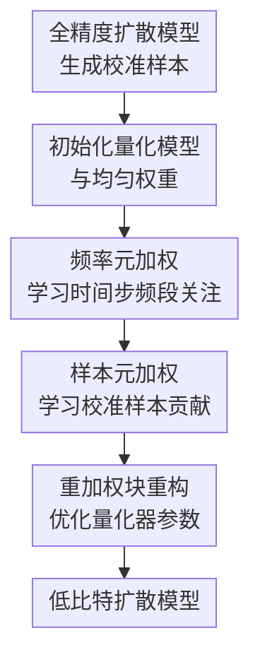

# Beyond Uniformity: Sample and Frequency Meta Weighting for Post-Training Quantization of Diffusion Models

**会议**: ICLR2026  
**OpenReview**: [https://openreview.net/forum?id=FDdOD3qwS7](https://openreview.net/forum?id=FDdOD3qwS7)  
**代码**: 未公开  
**领域**: 模型压缩 / 扩散模型量化  
**关键词**: 后训练量化、扩散模型、校准样本加权、频率域损失、元学习  

## 一句话总结
本文提出一种面向扩散模型后训练量化的样本与频率元加权方法，不再把所有校准样本和频率成分一视同仁，而是通过双层优化自动学习哪些样本、哪些时间步频率成分更该影响量化校准，从而在低比特扩散模型上稳定降低 FID。

## 研究背景与动机
**领域现状**：扩散模型能够生成高质量图像，但采样时需要反复调用噪声估计网络，模型参数量和多步去噪成本都很高。为了把扩散模型部署到资源受限设备上，后训练量化（post-training quantization, PTQ）是一条很有吸引力的路线：它不需要完整重新训练，只用少量校准数据调整量化器，就能降低权重和激活的存储、计算开销。

**现有痛点**：扩散模型的 PTQ 比普通分类网络更难，因为模型在不同去噪时间步看到的输入分布差异很大。PTQ4DM、Q-Diffusion、TFMQ-DM 等方法通常会从多个去噪时间步抽取生成样本作为校准集，但校准阶段往往默认每个样本贡献相同。这个假设看起来简单，却可能不适合扩散过程：早期时间步主要是高噪声输入，中后期才逐步形成结构和纹理，不同样本对量化误差的敏感性并不一致。

**核心矛盾**：扩散模型去噪过程本身具有明显的时间与频率演化规律。低频结构通常先被恢复，高频纹理和边缘细节在后期逐步补上；而传统 PTQ 校准损失却把不同时间步、不同频段的误差混在一起平均优化。这会导致量化模型把有限的校准能力浪费在不那么关键的样本或频率成分上，尤其在 W4A8、W4A32 这类低比特设置下更明显。

**本文目标**：作者想解决两个紧密相关的问题：第一，校准集中哪些样本应该对量化器更新更有话语权；第二，在每个去噪时间步，量化模型应该更关注低频结构误差，还是高频细节误差。两者都不是用手工规则固定下来，而是希望从验证损失中自动学出来。

**切入角度**：论文的切入点来自两个观察。一个经验观察是，在同一校准集上随机给样本分配不同权重时，有相当一部分随机权重组合的 FID 比均匀权重更好，说明“所有样本同等重要”不是最优。另一个领域观察是，扩散模型的频率恢复顺序随时间步变化，量化校准如果忽略这种频率动态，就很难让低比特模型精确模仿全精度模型。

**核心 idea**：用元学习把“样本权重”和“时间步频率权重”都变成可学习变量，通过验证集表现反向指导校准损失，让 PTQ 不再是均匀平均，而是按样本重要性和去噪阶段的频率需求来量化扩散模型。

## 方法详解

### 整体框架
这篇论文的方法可以理解为在现有扩散模型 PTQ 框架上加了一个“校准权重学习器”。输入是全精度扩散模型、按 Q-Diffusion 方式从多个去噪时间步采样得到的校准集，以及一个小验证集；输出是量化后的噪声估计网络。核心流程不是重新训练扩散模型，而是在逐层或逐块量化时交替学习两类权重：校准样本权重 $\omega$ 和频率权重矩阵 $\lambda$，再用它们重加权量化重构损失。

更具体地说，每个校准样本写作 $(x_i,t_i)$，其中 $x_i$ 是某个去噪时间步生成的中间样本，$t_i$ 是对应时间步。方法为每个样本分配一个可学习权重 $\omega_i$，并为每个时间步分配四个频率子带权重 $\lambda_{t,0},\lambda_{t,1},\lambda_{t,2},\lambda_{t,3}$。这四个频率子带来自 Haar 离散小波变换（DWT）：低频 $ll$ 表示整体结构，高频 $lh,hl,hh$ 表示横向、纵向和对角方向的细节变化。

整体优化是一个双层问题：内层用当前的 $\omega$ 和 $\lambda$ 更新量化模型，使量化块输出更接近全精度块输出；外层看这个“被当前权重训练出来的临时量化模型”在验证集上的重构误差，再反过来更新 $\omega$ 和 $\lambda$。因为精确求解双层优化代价太高，论文使用一步梯度近似来构造临时模型，并在每个待量化块内交替执行频率权重更新、样本权重更新、量化器参数更新。

### 关键设计
**1. 样本元加权：让验证集决定哪些校准样本更值得信任**

传统 PTQ 校准损失通常是对校准样本平均求和，这相当于默认所有 $(x_i,t_i)$ 对最终生成质量同等重要。本文把这个均匀平均改成带权重的重构损失：每个样本都有自己的 $\omega_i$，量化块训练时更重视权重大的样本。关键不在于“加一个权重”本身，而在于权重不是手工指定的时间步启发式，而是通过元学习从验证损失中学出来。

论文把量化模型的一步更新写成近似形式：当前量化参数 $\theta_Q$ 会沿着带权校准损失的梯度走一步，得到临时模型 $\hat{\theta}_Q$。随后用验证集 $S_v$ 上的输出重构误差评价 $\hat{\theta}_Q$，再对 $\omega_i$ 求梯度。如果某个校准样本参与内层更新后能让验证损失下降，它的权重就会被提高；反过来，如果它诱导的更新方向不利于验证表现，权重会被压低。这个机制等价于把校准样本从“被动平均材料”变成“按泛化贡献筛选的训练信号”。

这种设计尤其适合扩散模型 PTQ，因为不同时间步的样本形态差异很大：早期样本主要是噪声，中期样本形成布局，后期样本携带大量纹理。实验中的权重可视化也显示，越靠近后期去噪，样本权重的分布越分散、整体更容易变大，说明模型确实学到“不是每个时间步都该同等对待”。

**2. 频率元加权：按时间步学习低频与高频误差的校准重点**

扩散模型的一个重要性质是频率信息不是一次性恢复的。早期阶段更偏向粗结构和低频轮廓，后期阶段逐渐补充边缘、纹理等高频细节。本文因此不只比较全精度块输出和量化块输出的普通 $L_2$ 差异，还把二者经过 DWT 分解为四个子带，再用时间步相关的频率权重来计算频率损失。

对两个同形状张量 $a,b$，论文定义频率差异为 $L_f(a,b,\hat{\lambda})=\hat{\lambda}_0\|a_{ll}-b_{ll}\|^2+\hat{\lambda}_1\|a_{lh}-b_{lh}\|^2+\hat{\lambda}_2\|a_{hl}-b_{hl}\|^2+\hat{\lambda}_3\|a_{hh}-b_{hh}\|^2$。在第 $t_i$ 个时间步，校准样本使用对应的 $\lambda_{t_i}$，并约束四个子带权重和为 1。这样，模型可以在某些时间步更关注低频结构对齐，在另一些时间步更关注高频细节对齐，而不是用一个固定频率偏好覆盖整个去噪链。

频率权重同样通过验证损失学习。固定样本权重时，方法先用当前 $\lambda$ 构造一次内层量化更新，再看验证集上的重构损失对 $\lambda$ 的梯度。直观上，如果某个时间步的某个频段对最终验证重构更关键，它对应的频率权重就会被提高。相比手工规定“早期看低频、后期看高频”，这个做法更柔性：它利用了频率演化先验，但具体权重仍由模型、数据集和量化设置共同决定。

**3. 频率趋势正则：把扩散去噪的频率顺序写进权重形状里**

仅靠验证损失学习频率权重可能会受到小验证集和局部梯度噪声影响，因此论文加入了一个频率趋势正则 $L_{Reg}$。它关注的是低频权重与高频权重总和的比例 $r=\lambda_{:,0}\oslash(\lambda_{:,1}+\lambda_{:,2}+\lambda_{:,3})$，并用 $\sum_{t=0}^{T-2}\max(0,r_t-r_{t+1})$ 惩罚不符合预期的趋势。

这个正则的含义是：随着去噪时间步向后推进，也就是论文表述中的 $t$ 减小，低频相对权重应该下降，高频相对权重应该上升。它不是强制某个绝对权重值，而是约束频率关注随时间的相对变化方向。这样做能把已有扩散频率分析中的先验注入 PTQ，同时保留元学习权重的自适应空间。

消融实验说明这个正则不是装饰项。在 LSUN-Bedrooms 的 W4A8 设置下，只用样本和频率加权但去掉 $L_{Reg}$ 时，FID 为 3.41、sFID 为 7.18；加入正则后的完整方法达到 FID 3.28、sFID 7.05。也就是说，频率权重不仅需要“能学”，还需要被引导成符合扩散去噪阶段性的形状。

**4. 三步交替量化：把权重学习嵌入块重构 PTQ，而不是另起一套训练流程**

论文没有抛弃已有 PTQ 管线，而是把元加权嵌入到块级量化重构中。量化模型初始化沿用 LAPQ，权重量化使用 AdaRound 和 block-wise reconstruction，激活量化采用 TFMQ-DM 中较轻量的 EMA 范围估计。对于每个待量化块，方法先初始化均匀的样本权重和频率权重，然后循环执行三步：固定样本权重更新频率权重，固定频率权重更新样本权重，最后用二者共同定义的最终损失优化量化器参数。

最终量化损失可以概括为 $L_{FINAL}=\sum_i\omega_i[L_Q(\theta_Q,x_i,l)+\gamma L_F(\theta_Q,x_i,\lambda,l)]$，其中 $L_Q$ 是普通块输出重构损失，$L_F$ 是 DWT 子带上的频率重构损失，$\gamma$ 控制频率项强度。论文默认每个块的量化器优化 $N_Q=2\times10^4$ 次，频率权重更新 $N_f=100$ 次，样本权重更新 $N_s=200$ 次，使用 Adam，学习率为 $4\times10^{-5}$。

这个设计的优势是兼容性强：它可以站在 TFMQ-DM 这样的强基线之上，把“时间特征维护量化”继续保留下来，只替换校准损失如何被加权。代价是计算会比普通 PTQ 更重，因为双层近似和交替更新需要额外梯度；但相对于完整重训扩散模型，它仍然属于 PTQ 范畴。

### 损失函数 / 训练策略
方法中有三类核心损失。第一类是块重构损失 $L_Q(\theta_Q,x_i,l)=\|\epsilon^{(l)}_{FP}(x_i,t_i)-\epsilon^{(l)}_Q(x_i,t_i)\|^2$，用于让量化网络第 $l$ 个块的输出接近全精度网络。第二类是频率损失 $L_F$，它先对全精度和量化块输出做 Haar DWT，再按时间步频率权重 $\lambda_{t_i}$ 加权四个子带的平方误差。第三类是验证损失 $L_{val}=\|\epsilon_{FP}(x_j,t_j)-\epsilon_Q(x_j,t_j)\|^2+\beta L_{Reg}(\lambda)$，用于指导样本权重和频率权重更新。

训练策略是逐块进行的交替优化。对每个块，先用一步梯度近似构造临时量化模型 $\hat{\theta}_Q$，再分别对 $\lambda$ 和 $\omega$ 求外层梯度。样本权重更新时忽略 $L_{Reg}$，因为此时频率权重固定；频率权重更新时加入 $\beta L_{Reg}$。主实验中 $\gamma=0.1$、$\beta=0.05$，补充实验显示这两个超参数在一定范围内表现较稳定。验证集可以使用全精度模型生成样本的子集，也可以使用少量真实图像加噪得到的样本；论文在 LSUN-Bedrooms 上用 32 张真实图像构造验证集也能得到相近提升。

## 实验关键数据

### 主实验
论文在 DDPM 和 LDM-4 上评估，覆盖 CIFAR-10、LSUN-Bedrooms、FFHQ、ImageNet，指标主要是 FID 和 sFID，均为越低越好。最核心结论是：在强基线 TFMQ-DM 之上加入样本和频率元加权，低比特设置下的 FID 通常还能继续下降。

| 数据集 / 模型 | 量化设置 | 本文 FID / sFID | 强基线 TFMQ-DM FID / sFID | 主要提升 |
|---|---:|---:|---:|---|
| CIFAR-10 32×32 / DDPM | W4A32 | 4.21 / 4.47 | 4.73 / - | FID 降低 0.52 |
| CIFAR-10 32×32 / DDPM | W4A8 | 4.25 / 4.46 | 4.78 / - | FID 降低 0.53 |
| CIFAR-10 32×32 / DDPM | W8A8 | 4.15 / 4.36 | 4.24 / - | 高比特下仍略有收益 |
| LSUN-Bedrooms / LDM-4 | W4A32 | 3.16 / 6.92 | 3.60 / 7.61 | FID、sFID 均优于基线 |
| FFHQ / LDM-4 | W4A32 | 9.20 / 9.69 | 9.89 / 9.06 | FID 明显降低，sFID 略差 |
| ImageNet / LDM-4 | W4A32 | 10.10 / 7.32 | 10.50 / 7.98 | 类条件生成也有效 |

在 LSUN-Bedrooms 和 ImageNet 上，本文还与 Q-Diffusion、PTQD、PTQ4DM、TCAQ-DM 等方法比较。以 LSUN-Bedrooms W4A32 为例，本文 FID 3.16，明显优于 Q-Diffusion 的 4.20、PTQD 的 4.42 和 TFMQ-DM 的 3.60；W4A8 下本文 FID 3.28，也比 TFMQ-DM 的 3.68 更好。ImageNet W4A8 下本文 FID 10.01，略优于 TFMQ-DM 的 10.29 和 TCAQ-DM 的 9.97之间的对比则显示，FID 上本文接近最优，但不同指标并非全面碾压。

### 消融实验
| 配置 | LSUN-Bedrooms W4A8 FID↓ | LSUN-Bedrooms W4A8 sFID↓ | 说明 |
|---|---:|---:|---|
| TFMQ-DM baseline | 3.68 | 7.65 | 不使用本文加权机制 |
| + Sample weighting | 3.47 | 7.20 | 仅学习校准样本权重，已有明显收益 |
| + Frequency weighting | 3.38 | 7.39 | 仅学习频率权重，FID 收益更大 |
| Ours without $L_{Reg}$ | 3.41 | 7.18 | 同时加权但无频率趋势正则 |
| Ours full | 3.28 | 7.05 | 样本加权、频率加权、正则共同使用 |

补充实验还比较了不同频率变换。用 FFT 版本的频率损失，在 LSUN-Bedrooms W4A8 上得到 FID 3.45、sFID 7.20，优于 TFMQ-DM 的 3.68/7.65，但不如 DWT 版本的 3.28/7.05。另一个频率损失变体把中间样本近似还原到 $t=0$ 后再计算频率损失，在 CIFAR-10 上结果接近主方法，但计算成本最高可达三倍，因此主文选择在块输出上直接计算 DWT 频率损失。

### 关键发现
- 样本加权和频率加权都能单独提升量化扩散模型，说明“校准样本不等权”和“不同时间步频率不等权”是两个真实有效的信号，而不是同一个技巧的重复表述。
- 频率趋势正则对稳定学习很重要。没有 $L_{Reg}$ 时完整加权方法在 LSUN-Bedrooms W4A8 上 FID 为 3.41，加入后降到 3.28，说明单纯让验证损失自由学习频率权重还不够，需要扩散频率先验来约束方向。
- 低比特设置收益最明显。CIFAR-10 W4A32 和 W4A8 相对 TFMQ-DM 分别降低 0.52 和 0.53 FID，而 W8A8 的提升较小，这符合量化误差越强、重加权校准越有价值的直觉。
- 指标并非在所有表格项上全面最佳。比如 FFHQ 的 W4A32、W4A8 中本文 FID 很好，但 sFID 不如 TFMQ-DM；这提示方法更稳定地改善全局分布距离，空间中层特征相似性上仍有波动。

## 亮点与洞察
- 本文最核心的洞察是把扩散 PTQ 的校准集看成一个需要“再学习”的对象，而不是固定采样后直接平均。这个角度比单纯提出新的时间步采样启发式更通用，因为它可以和已有校准集构造方法叠加。
- 频率加权很贴合扩散模型的生成机制。很多压缩方法只在参数、通道或时间步上做选择，本文进一步问“量化误差在哪个频率上更要紧”，这让 PTQ 损失更接近生成质量退化的来源。
- 双层优化的使用比较自然：样本和频率权重不是为了降低校准集损失而学，而是为了让经过这些权重校准后的量化模型在验证集上更好。这个目标避免了“把校准集拟合得更好却生成质量更差”的风险。
- 方法保留了现有强 PTQ 框架的主体，只改校准损失的权重结构，因此有较强迁移潜力。类似思路可以迁移到视频扩散、DiT、甚至自回归视觉生成模型的 PTQ：只要模型不同阶段承担不同语义或频率角色，就可能需要非均匀校准。

## 局限与展望
- 额外计算成本不可忽视。方法需要对每个量化块进行频率权重、样本权重和量化器参数的交替优化，还需要 higher 这类库计算元梯度；相比普通 PTQ，它更像“重型 PTQ”。论文展示了性能收益，但没有充分展开端到端校准时间和显存开销的横向比较。
- 实验集中在图像扩散模型和 U-Net / LDM-4 架构上。对于更现代的 Diffusion Transformer、视频扩散或文本到图像大模型，频率规律是否仍然以同样形式存在，DWT 子带是否足够表达生成质量损失，还需要进一步验证。
- 频率正则依赖一个相对明确的先验：后期更重高频、早期更重低频。这个先验对自然图像生成比较合理，但在医学图像、遥感、多模态条件生成等领域，高频细节和语义结构的关系可能不同，直接套用可能不是最优。
- 方法默认验证集能够代表量化后生成质量。论文用生成样本子集和少量真实图像加噪都得到不错结果，但验证集大小、构造方式、是否会带来数据偏置，仍值得系统分析。

## 相关工作与启发
- **vs Q-Diffusion**: Q-Diffusion 重点在从固定时间间隔选取去噪样本作为校准数据，并配合 shortcut-splitting 等量化设计；本文沿用类似校准数据构造，但进一步学习样本权重和频率权重，解决的是“拿到校准集之后如何使用它”。
- **vs TFMQ-DM**: TFMQ-DM 强调维护扩散模型不同时间步的 temporal feature，是本文的重要强基线；本文在实现上还采用其激活量化和 temporal feature maintenance 思路，但把校准损失改成样本与频率的元加权版本，因此可以看成对 TFMQ-DM 的再校准增强。
- **vs APQ-DM**: APQ-DM 用结构风险最小化思想寻找更合适的校准时间步，更关注“选择哪些时间步生成校准数据”；本文不直接重选时间步，而是在已有校准样本内部学习连续权重，两者理论上可以结合。
- **vs 频率增强扩散方法**: Spectral Diffusion、Wavelet Diffusion 等工作利用频率域改善全精度扩散模型训练或采样；本文的差异是把频率域用于量化校准，目标不是提升全精度模型，而是让低比特模型更像全精度模型。
- **vs 元学习量化方法**: MetaQuant、MetaMix、MetaAug 等方法把元学习用于量化策略、混合精度或数据增强；本文的独特点是将元学习落在扩散 PTQ 的校准样本和时间步频率权重上，针对的是扩散模型独有的去噪动态。

## 评分
- 新颖性: ⭐⭐⭐⭐☆ 把样本重加权和频率重加权通过双层优化统一到扩散 PTQ 中，问题抓得准，组合也有针对性。
- 实验充分度: ⭐⭐⭐⭐☆ 覆盖多个数据集、模型和量化位宽，并有清晰消融；但校准成本和更大规模扩散模型实验还可以更充分。
- 写作质量: ⭐⭐⭐⭐☆ 方法公式和算法流程较完整，动机实验直观；部分时间步方向和频率趋势的表述需要读者结合扩散采样约定仔细理解。
- 价值: ⭐⭐⭐⭐☆ 对低比特扩散模型部署很实用，也给“非均匀校准”提供了可迁移范式，尤其适合继续扩展到 DiT 和视频生成压缩。

<!-- RELATED:START -->

## 相关论文

- [\[ICLR 2026\] Gradient-Aligned Calibration for Post-Training Quantization of Diffusion Models](gradient-aligned_calibration_for_post-training_quantization_of_diffusion_models.md)
- [\[ICLR 2026\] Quant-dLLM: Post-Training Extreme Low-Bit Quantization for Diffusion Large Language Models](quant-dllm_post-training_extreme_low-bit_quantization_for_diffusion_large_langua.md)
- [\[ICLR 2026\] PTQ4ARVG: Post-Training Quantization for AutoRegressive Visual Generation Models](ptq4arvg_post-training_quantization_for_autoregressive_visual_generation_models.md)
- [\[ECCV 2024\] MetaAug: Meta-Data Augmentation for Post-Training Quantization](../../ECCV2024/model_compression/metaaug_meta-data_augmentation_for_post-training_quantization.md)
- [\[ICLR 2026\] Post-Training Quantization for Video Matting](post-training_quantization_for_video_matting.md)

<!-- RELATED:END -->
