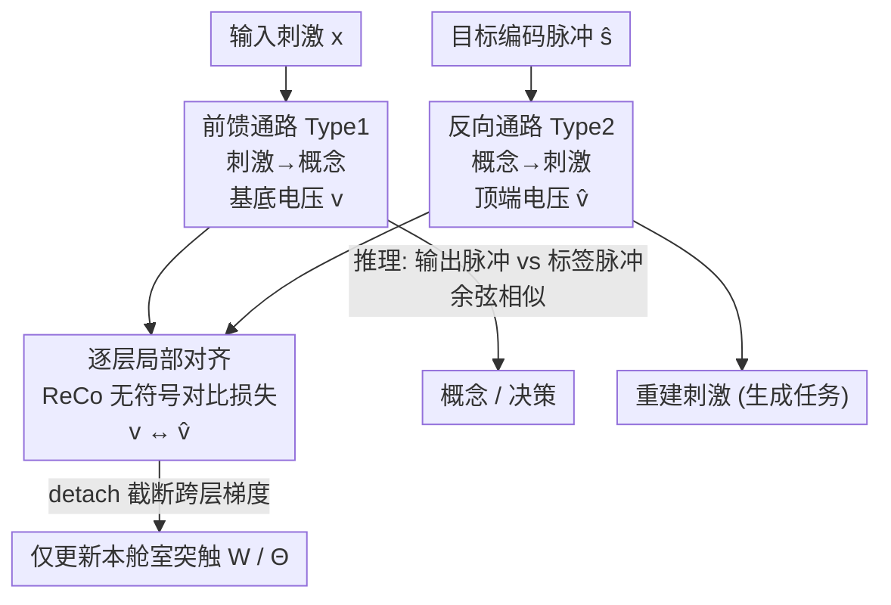

# Biologically Plausible Learning via Bidirectional Spike-Based Distillation

**会议**: ICLR 2026  
**OpenReview**: [https://openreview.net/forum?id=MmWZ2xVJ7z](https://openreview.net/forum?id=MmWZ2xVJ7z)  
**代码**: https://github.com/alden199/Bidirectional-Spike-Based-Distillation  
**领域**: 模型压缩 / 脉冲神经网络 / 类脑学习  
**关键词**: 脉冲神经网络, 生物可塑性学习, 双向蒸馏, 局部学习, 对比损失

## 一句话总结
本文提出 BSD（双向脉冲蒸馏），用一个前馈脉冲网络（刺激→概念，对应感知决策）和一个反向脉冲网络（概念→刺激，对应记忆回忆）互相蒸馏脉冲特征来训练，全程只用离散二值脉冲和无符号误差信号，在图像分类/生成、文本预测、时序回归上都做到了和反向传播相当的精度，同时满足五条生物可塑性准则。

## 研究背景与动机

**领域现状**：反向传播（BP）是深度学习的训练基石，但它和神经生物学原理处处冲突——要求前馈与反馈权重严格对称、依赖跨网络传播的全局误差信号、强制把前向和反向计算切成两个时间阶段、用连续激活值而非离散脉冲通信。为了找"生物上说得通"的替代方案，社区先后提出了反馈对齐、目标传播（TP/DTP）、预测编码、局部损失、STDP、能量模型等一大批算法。

**现有痛点**：这些方法几乎都在某条准则上妥协。Lv et al. (2025) 总结了三条准则——C1 前馈/反馈权重非对称、C2 仅用局部信息的突触可塑性、C3 非两阶段训练；但满足这三条的 CCL、DLL 仍然用**带符号的浮点数**在层间传信号，既不是脉冲也不符合"神经元发放无符号脉冲"的事实，而且在 CIFAR-100、时序回归这类任务上精度大幅落后于 BP。另一边，真正用脉冲的 R-STDP 满足全部准则却几乎学不会复杂任务（CIFAR-100 上只有 1% 左右）。

**核心矛盾**：生物保真度（用离散脉冲、无符号误差、局部更新）和计算有效性之间长期被认为存在 trade-off——越像大脑，性能越差。一个尚未解决的关键难题是：**脉冲是 0/1 二值的，怎么表示误差里必须有的负值（"该往哪个方向改"）？**

**本文目标**：设计一个同时满足五条准则（在 C1–C3 基础上补充 C4 神经元用离散脉冲、C5 误差信号无符号）、又能在多种任务多种架构上追平 BP 的学习算法。

**切入角度**：作者从认知神经科学的观察出发——人的学习不是单向"感知→决策"，而是自底向上的感知和自顶向下的记忆回忆双向交织。PET 实验显示，闭眼想象物体时被激活的早期视觉皮层（V1/V2）与真实感知时高度重叠；学会区分鸟类后，高层概念会反馈到低层视觉区，锐化对喙形、翅纹等细节的敏感度。

**核心 idea**：把学习重新表述为两种脉冲表示（刺激编码 ↔ 概念编码）之间的**双向变换**——前馈网络把刺激映射成概念，反向网络把概念重建回刺激，两者通过**互相蒸馏脉冲特征**联合训练，用脉冲串本身替代带符号的误差，从而绕过"脉冲无法表示负值"的难题。

## 方法详解

### 整体框架

BSD 训练的不是一个网络，而是**一对共享层结构、权重独立的脉冲网络**。每一层都包含两类锥体神经元：Type 1 接收下层输入、构成前馈通路（刺激→概念，做感知与决策）；Type 2 接收上层输入、构成反向通路（概念→刺激，做记忆重建以辅助前馈学习）。训练时，原始输入 $x$ 喂给最底层 Type 1 神经元，学习目标先被编码成脉冲串 $\hat{s}$ 喂给最顶层 Type 2 神经元，两条通路在每一层"相遇"并互相对齐特征。整个过程只用离散脉冲通信、误差只在单个神经元内部局部计算、前向反向同时进行——这样一次性满足全部五条生物准则。

关键的生物学载体是**三舱室锥体神经元**：胞体（soma）、基底树突（basal，收前馈输入产生电压 $v$）、顶端树突（apical，收反馈信号产生电压 $\hat{v}$）。基底电压 $v$ 驱动脉冲发放 $s=\mathrm{SN}(v)$，顶端电压 $\hat{v}$ 充当监督信号，指导基底树突上的突触可塑性。学习的本质就是**让同一个神经元的基底电压 $v$ 和顶端电压 $\hat{v}$ 对齐**——即让"自底向上看到的"和"自顶向下想到的"一致。

### 关键设计

**1. 双向脉冲蒸馏架构：用两条通路把"误差"换成"另一条通路的脉冲特征"**

这是全文的根基，直接针对"脉冲无法表示带符号误差"这个核心难题。传统方法要么放弃用脉冲传误差，要么需要正负两套学习信号。BSD 的做法是：不再让网络去传播一个抽象的误差，而是让前馈通路（Type 1）和反向通路（Type 2）成为彼此的"教师"。前馈路径为 $v_1=x;\ v_i=\hat{v}'_i=W_{i-1}s_{i-1},\ s_i=\mathrm{SN}(v_i)$，把刺激逐层变成概念脉冲；反向路径为 $v'_L=\hat{s};\ v'_i=\hat{v}_i=\Theta_i s'_{i+1},\ s'_i=\mathrm{SN}(v'_i)$，把概念脉冲逐层重建回刺激。两条通路用**独立**的权重矩阵 $W$（前馈）和 $\Theta$（反向），天然满足 C1 权重非对称。每一层，前馈算出的 $v_i$ 要去对齐反向送来的 $\hat{v}_i$，反向算出的 $v'_i$ 要去对齐前馈送来的 $\hat{v}'_i$——监督信号始终是"另一条通路当前发放的脉冲电压"，全是正向的脉冲表示，不需要任何带符号的误差，C5 由此达成。这等价于把"学习"建模成刺激编码与概念编码之间的双向变换，呼应大脑感知（分析模式）与回忆（想象模式）的协作。

**2. 锥体神经元三舱室与局部电压对齐：让误差只活在一个神经元内部**

针对 C2（仅用局部信息、不要全局误差）。BSD 借用 Sacramento et al. (2018) 的三舱室锥体神经元：基底树突负责前馈输入、顶端树突负责反馈信号、胞体负责整合发放。这样"前馈感知"和"反馈监督"在解剖结构上就被分到了同一个神经元的不同舱室里。学习目标退化为一个**纯局部**的目标：把本神经元的基底电压 $v$ 与顶端电压 $\hat{v}$ 拉近。由于分类任务里 Type 1 收到的是自底向上的感官输入、Type 2 收到的是自顶向下的目标信号，二者其实是两种模态，于是 $v$ 与 $\hat{v}$ 的对齐被作者解读为**跨模态嵌入对齐**。更妙的是，因为信息处理全在单个舱室内部完成、不存在跨层依赖，前馈蒸馏和反向蒸馏可以**同时**进行、不必像 BP 那样先前向再反向，C3（非两阶段）也顺势满足。神经元本身用 LIF 脉冲模型 $S[t]=\Theta(H[t]-U_{thr})$ 发放离散 0/1 脉冲，满足 C4。

**3. ReCo 无符号对比损失 + detach 局部化：既给出无符号误差，又把梯度锁在本层**

针对"如何在不传播全局梯度的前提下，给出一个无符号、又能稳定收敛的局部目标"。作者把每层基底/顶端电压按 batch 堆成矩阵 $V_i,\hat{V}_i\in\mathbb{R}^{B\times D_i}$，定义亲和矩阵 $[C_i]_{kj}=\frac{v_{i,k}\cdot\hat{v}_{i,j}}{\|v_{i,k}\|\|\hat{v}_{i,j}\|}$，然后采用 Relaxed Contrastive（ReCo）损失：

$$\mathcal{L}_i=\sum_{k=1}^{B}(1-[C_i]_{kk})^2+\lambda\sum_{k=1}^{B}\sum_{j\neq k}\big(\max(0,[C_i]_{kj})\big)^2$$

第一项拉高配对样本（对角）的相似度，第二项用 $\lambda$ 惩罚非配对样本里**正相关**的部分。整个损失是平方形式、恒非负，是个无符号目标（C5）。相比对比学习常用的 InfoNCE，ReCo 的关键差别在 $\max(0,\cdot)$：它**不惩罚已经正交或负相关的非配对样本**，给嵌入留出更灵活、更丰富的表达空间。为了真正做到"误差不跨层传播"，作者对层间用 `detach()` 截断计算图，使 $\mathcal{L}_i$ 的梯度只更新连到本神经元树突的突触权重 $W_{i-1}$（公式 8 给出了完整的解析梯度），随后做标准梯度上升 $W_{i-1}^{new}=W_{i-1}^{old}+\eta_W\frac{\partial\mathcal{L}_i}{\partial W_{i-1}}$，反向权重 $\Theta$ 用对称规则更新。顶层另加交叉熵 $\mathcal{L}_{top}$，总损失 $\mathcal{L}_{total}=\sum_{i=1}^{L-1}\mathcal{L}_i+\mathcal{L}_{top}$。推理时，分类标签由输出脉冲集合 $s_L$ 与各候选标签脉冲串的余弦相似度决定。

**4. 生成任务的 FFT 频域自适应正则：让重建既锐又不过噪**

针对图像生成时 autoencoder 既要保边缘细节、又要抑噪的需求。生成任务里上下两路输入都是图像 $x$，作者对输入图像及所有基底/顶端电压做快速傅里叶变换（FFT），把信号分到低频/高频两段，再让 ReCo 里的正则系数 $\lambda$ **随频率自适应**：高频分量给更大的 $\lambda$，强力抑制虚假相关、保住边缘保真度；低频分量给更小的 $\lambda$，避免放大噪声、维持结构连贯。顶层则改用 MSE 衡量基底与顶端电压的差异。这一设计让纯靠局部脉冲对齐训练出来的自编码器也能产出接近 BP 的重建质量。

### 损失函数 / 训练策略
逐层用 ReCo 局部损失对齐 Type 1/Type 2 神经元的基底/顶端电压，顶层补交叉熵（分类）或 MSE（生成）；前馈权重 $W$ 与反向权重 $\Theta$ 用各自的局部梯度对称更新；`detach()` 保证梯度不跨层传播；前馈蒸馏与反向蒸馏并行进行。结果在 4 个随机种子上平均。

## 实验关键数据

### 主实验

图像分类（5 数据集均值，CNN 配置）：BSD 满足全部 C1–C5，精度逼近 BP，远超同样满足前三条准则的 DLL/CCL，更碾压同样满足全五条的 R-STDP。

| 方法 | 满足准则 | CIFAR-10 (CNN) | CIFAR-100 (CNN) | 5 数据集均值 (CNN) |
|------|---------|----------------|-----------------|--------------------|
| BP on ANN | 0/5 | 87.12% | 57.75% | 86.29% |
| BP on SNN | C4 | 87.02% | 57.21% | 86.02% |
| Predictive Coding | C2 | 72.94% | 53.08% | 82.40% |
| DLL | C1–C3 | 70.89% | 38.60% | 77.01% |
| R-STDP | C1–C5 | 33.19% | 1.49% | 50.10% |
| **BSD (本文)** | **C1–C5** | **84.13%** | **53.48%** | **83.78%** |

序列回归 / 文本预测（RNN）：BSD 在 Harry Potter 字符预测上达 41.8%，明显高于 DLL(33.7%) 与 Predictive Coding(38.8%)；Metr-la 的 MSE 0.125 甚至低于 BP-ANN 的 0.131。

图像生成（FID↓）：

| 数据集 | ANN-BP | FSVAE | BSD (本文) |
|--------|--------|-------|------------|
| CIFAR-10 | 127.34 | 175.5 | 168.12 |
| MNIST | 49.56 | 97.06 | 72.39 |

BSD 全面优于专门的全脉冲变分自编码器 FSVAE，逼近 BP。

### 消融实验

层间损失函数选择（CNN 精度）：

| 配置 | MNIST | SVHN | CIFAR-10 | CIFAR-100 | 说明 |
|------|-------|------|----------|-----------|------|
| BSD-MSE | 21.10% | 19.46% | 16.93% | 1.58% | 改用 MSE，几乎不收敛 |
| BSD-InfoNCE | 98.77% | 83.27% | 72.38% | 38.06% | 改用 InfoNCE，能收敛但偏低 |
| **BSD (ReCo)** | **99.44%** | **90.81%** | **84.13%** | **53.48%** | 完整模型 |

### 关键发现
- **ReCo 是收敛的关键**：换成 MSE 直接不收敛（CIFAR-100 仅 1.58%），说明逐神经元电压对齐必须用对比式无符号损失；换成 InfoNCE 能收敛但 CIFAR-100 上比 ReCo 低 15+ 个点，原因是 InfoNCE 会惩罚那些本已正交/负相关的非配对样本，限制了表达灵活性。
- **生物保真不必牺牲性能**：BSD 是表中唯一既满足全五条准则、又把 CNN 均值做到 83.78% 的方法；同样满足五条的 R-STDP 只有 50.10%，对比鲜明地推翻了"越像大脑越弱"的成见。
- **脉冲本身确有代价但可被补偿**：BP 训练下 SNN 一律低于 ANN（二值脉冲不如连续激活），但 BSD 的双向蒸馏把这部分损失基本补了回来。
- **超参敏感性**：$\lambda$（ReCo 惩罚强度）和发放阈值是收敛的两个关键因子；Type 1 与 Type 2 同层脉冲的 Hamming 相似度随训练升到 0.9+，印证双向对齐确实在发生。

## 亮点与洞察
- **把"误差传播"重写成"互相蒸馏"**：最巧的一步是不再追问"脉冲怎么表示负误差"，而是让另一条通路的正向脉冲特征直接充当监督信号，从根上绕开了带符号误差的需求——这是把一个表示难题转化成架构设计的典范。
- **三舱室神经元 = 天然的局部学习容器**：把前馈输入和反馈监督分到基底/顶端两个树突舱室，使"局部、无全局误差、非两阶段"三条准则几乎是结构自带的副产品，而非额外约束。
- **ReCo 的 $\max(0,\cdot)$ 很可迁移**：在任何"对齐两组表示但不想强行推开本就无关的样本"的场景（跨模态对齐、表示蒸馏）里，这种放松版对比损失都值得一试。
- **跨模态对齐视角**：把基底电压 $v$ 与顶端电压 $\hat{v}$ 解读成两种模态的嵌入对齐，让 CLIP 式对比学习直接嫁接进类脑学习，思路衔接得很自然。

## 局限与展望
- **依赖较大 batch**：用对比式损失就继承了对比学习对 batch size 的敏感（作者在附录 J 单独分析），小 batch 下表现存疑。
- **绝对精度仍落后于 BP-ANN**：在 SVHN/CIFAR-100 等难任务上 BSD 与 BP-ANN 仍有差距（CIFAR-100 CNN 53.48% vs 57.75%），尚未真正追平最强基线。
- **额外开销**：要同时维护前馈+反向两套网络与权重，训练显存/计算成本翻倍（附录 N 给了分析），且需要把目标编码成脉冲串。
- **生成质量有限**：FID 虽优于 FSVAE 但离 BP 自编码器仍有明显差距（CIFAR-10 168 vs 127）。
- **改进方向**：把双向蒸馏扩展到更深/更大架构（已在 Tiny-ImageNet 初探）、降低反向通路的存储开销、探索不依赖大 batch 的局部对比目标。

## 相关工作与启发
- **vs DLL / CCL（满足 C1–C3 的局部学习）**：它们仍用带符号浮点数在层间通信，不满足 C4/C5，且在难任务上掉点严重；BSD 全程脉冲、无符号损失，CIFAR-100 上 CNN 反超 DLL 近 15 个点。
- **vs Target Propagation / DTP**：TP 用近似逆模型生成逐层目标、需要每层在不同时刻传两类信号，且常有收敛不稳；BSD 的双向通路同时训练、收敛稳定。
- **vs Predictive Coding / LRA-E**：预测编码靠自顶向下预测最小化感官误差，但只满足 C2；BSD 把"自顶向下预测"具象成一条独立的反向脉冲网络，并满足全部五条。
- **vs R-STDP**：同样满足全五条生物准则，但 STDP 类规则难以整合监督信号、需精确时间分辨率，复杂任务几乎学不会；BSD 用对比蒸馏注入监督，性能高出一个量级。
- **vs FSVAE（全脉冲生成）**：BSD 在 MNIST/CIFAR-10 的 FID 全面优于专门设计的全脉冲变分自编码器。

## 评分
- 新颖性: ⭐⭐⭐⭐⭐ 用双向脉冲蒸馏绕开"脉冲表示负误差"难题，首次让满足全五条生物准则的算法追平 BP。
- 实验充分度: ⭐⭐⭐⭐ 覆盖分类/生成/文本/时序四类任务与 MLP/CNN/RNN/AE 四种架构，但绝对精度与 BP-ANN 仍有差距。
- 写作质量: ⭐⭐⭐⭐⭐ 从神经科学动机到五准则再到方法推导，逻辑链条清晰自洽。
- 价值: ⭐⭐⭐⭐ 为类脑/神经形态硬件上的可塑性学习提供了可落地、可扩展的范式。

<!-- RELATED:START -->

## 相关论文

- [\[ICLR 2026\] Otters: An Energy-Efficient Spiking Transformer via Optical Time-to-First-Spike Encoding](otters_an_energy-efficient_spiking_transformer_via_optical_time-to-first-spike_e.md)
- [\[ICLR 2026\] Towards Lossless Memory-efficient Training of Spiking Neural Networks via Gradient Checkpointing and Spike Compression](towards_lossless_memory-efficient_training_of_spiking_neural_networks_via_gradie.md)
- [\[ICLR 2026\] Knowledge Distillation for Large Language Models through Residual Learning](knowledge_distillation_for_large_language_models_through_residual_learning.md)
- [\[CVPR 2026\] A Unified Framework for Knowledge Transfer in Bidirectional Model Scaling](../../CVPR2026/model_compression/a_unified_framework_for_knowledge_transfer_in_bidirectional_model_scaling.md)
- [\[NeurIPS 2025\] Linear Attention for Efficient Bidirectional Sequence Modeling](../../NeurIPS2025/model_compression/linear_attention_for_efficient_bidirectional_sequence_modeling.md)

<!-- RELATED:END -->
