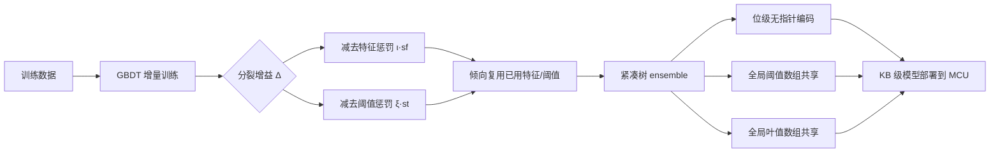

# Boosted Trees on a Diet: Compact Models for Resource-Constrained Devices

**会议**: ICLR 2026  
**OpenReview**: [https://openreview.net/forum?id=batDcksZsh](https://openreview.net/forum?id=batDcksZsh)  
**代码**: [https://github.com/TinyAIoT/LightGBM-ToaD](https://github.com/TinyAIoT/LightGBM-ToaD)  
**领域**: 模型压缩 / TinyML / 梯度提升树  
**关键词**: 梯度提升决策树, GBDT, 模型压缩, TinyML, IoT, LightGBM, 特征复用, 位级编码  

## 一句话总结
ToaD（Trees on a Diet）在 GBDT 训练时加入鼓励"复用特征和阈值"的正则项，并配合一套无指针、按位编码、全局共享阈值/叶值的内存布局，在保持精度不变的前提下把 LightGBM 模型压缩 4–16 倍，让提升树能塞进 KB 级微控制器。

## 研究背景与动机
**领域现状**：IoT 与 TinyML 的兴起让"把模型直接跑在微控制器上"成为刚需——典型的 Arduino Uno R4 只有 32 KB RAM、256 KB flash，还要和操作系统、传感、数据处理程序共享。梯度提升决策树（XGBoost/LightGBM）因为在结构化/表格数据上又准又快、可解释、计算量小，至今仍是这类设备上的首选模型。

**现有痛点**：现有的"瘦身"手段几乎都在训练前或训练后做文章——量化（把阈值/叶值降到 fp16 甚至 FPGA 定点）、剪枝（CCP、CEGB 等后训练裁剪）。这些方法的共同短板是**只能在模型定型后被动压缩，无法在训练阶段主动制造可压缩性**。

**核心矛盾**：决策树天然存在大量"可共享"的冗余——同一个特征、同一个阈值、同一个叶值常常在一棵树内乃至整个 ensemble 里反复出现。但标准训练的增益函数对"复用已有特征/阈值"和"引入全新特征/阈值"一视同仁，于是模型倾向于使用大量互不相同的取值，每个节点都得用满精度独立存储，内存被白白浪费。

**本文目标**：在训练过程中就把"内存占用"纳入优化目标，让 GBDT 在拟合质量和模型体积之间做出可控权衡，最终产出能在 KB 级设备上自主运行的紧凑提升树。

**核心 idea**：**训练侧软约束 + 部署侧硬编码**——一方面用正则项惩罚"新特征/新阈值"的引入，诱导模型自发复用已有取值；另一方面设计一套位级、无指针、全局共享的内存布局，把这些被复用的取值存得几乎"免费"。

## 方法详解

### 整体框架
ToaD 由两个相互咬合的部分组成：**训练侧**修改 GBDT 的分裂增益，对引入新特征或新阈值施加惩罚，使新生成的树倾向于重用已出现过的特征与阈值；**部署侧**用一套按位编码的内存布局，把树存成无指针的完全树数组，并把所有阈值、叶值抽到全局数组里共享引用。两者缺一不可——正则项制造"可复用性"，内存布局把"复用"真正兑现成省下来的比特。

### 关键设计

**1. 复用感知正则项：把"内存代价"写进分裂增益。** 提升树逐轮贪心地选增益最大的叶子和分裂点，但标准增益 $\Delta(I,i,\mu)$ 不区分这个分裂用的是"老特征老阈值"还是"全新取值"。ToaD 沿用 Peter et al. (2017) 的思路，维护一个已用特征集合 $F_U$ 和每个特征已用阈值集合 $T^f$，并在复杂度正则中追加一个线性惩罚 $\Omega_l(t_m)=\Omega(t_m)+\iota\cdot|F_U|+\xi\cdot\sum_{f\in F_U}|T^f|$——每引入一个新特征objective 涨 $\iota$，每引入一个新阈值涨 $\xi$。落到贪心分裂上就是把增益改写为 $\Delta_l(I,i,\mu)=\Delta(I,i,\mu)-s_f\iota-s_t\xi$，其中 $s_f,s_t\in\{0,1\}$ 标记这次分裂是否动用了"全新"的特征或阈值。直觉很朴素：已经在前面树里用过的特征/阈值在内存里近乎"免费"，所以增益不打折；只有真正新增取值才付出代价。两个超参 $\iota,\xi$ 由用户调，连续控制质量—体积的取舍。

**2. 无指针位级编码：让浅树用最少比特存下结构。** 提升树通常是深度很浅（≤5）、近乎平衡的树，于是 ToaD 干脆按完全二叉树的隐式索引存储：根节点放 index 0，节点 $i$ 的左右孩子分别在 $2i+1$ 和 $2i+2$——**彻底省掉左右孩子指针**。每个内部节点只存两样东西：一个特征引用和一个阈值索引；每个叶子只存一个叶值引用。一张 Feature & Threshold Map 记录解码所需的元信息：输入特征索引位宽 $\lceil\log_2|F_I|\rceil$、阈值位宽（用 2 的幂表示，1/2/4/8/16/32 位仅需 3 比特编码）、阈值数值类型（浮点或定点，1 比特）、以及每个特征的阈值个数 $\lceil\log_2\max_{f}|T^f|\rceil$。相比"每节点用 128 bit（特征+阈值+两个 32 位孩子指针）"的常规算法，这套编码把布尔判定都压到 2 比特，结构开销骤降。

**3. 全局共享阈值与叶值数组：复用真正变成省比特。** 正则项制造出来的"复用"必须靠存储侧兑现。ToaD 把所有阈值按特征聚到一个全局数组 Global Features & Thresholds，把所有叶值聚到 Global Leaf Values（固定 32 位浮点保证叶子精度），ensemble 里任意一棵树的任意节点都只存一个**索引引用**指向这些全局值。于是同一个阈值 $\mu^1_1$、同一个叶值 $v_4$ 哪怕被多棵树多个节点引用，也只在全局数组里存一份；通过 Feature & Threshold Map 按特征累加偏移就能定位并解码出原始取值，还允许不同特征用不同的位宽和精度。三者合起来——正则诱导复用、无指针压结构、全局数组消冗余——才凑出 4–16 倍的整体压缩。

## 实验关键数据

在 8 个公开数据集（mushroom、covtype、breastcancer、kr-vs-kp、kin8nm、california_housing、wine、covtype_multi，覆盖二分类/多分类/回归）上做网格搜索，每个数据集训练约 32,076 个模型（迭代数 $2^0$–$2^{10}$、树深 $2^0$–$2^3$、$\iota/\xi$ 从 $2^{-10}$ 到 $2^{15}$ 含 0），用 12 组 train-test split 取均值。分类用 Accuracy，回归用 $R^2$。

### 主实验表格（质量—内存权衡，对比各 baseline）

| 方法 | 类型 | 相对 ToaD 的内存需求 |
|------|------|----------------------|
| LightGBM (float32) | 标准 | 基线，最大 |
| LightGBM FP16 | 量化 | 次大 |
| LightGBM array-based | 无指针布局 | 中 |
| CCP | 后剪枝 | 中 |
| CEGB | 代价敏感提升 | 中 |
| **ToaD w/o Penalties** | 仅新内存布局 | 较小 |
| **ToaD w/ best Penalties** | 正则+布局 | **最小（省 4–16×）** |

在 ≤128 KB 的关键内存区间内，竞争方法要达到与 ToaD 相同精度需要 **4–16 倍**的内存。典型例子：Covertype 多分类上，ToaD 在 **2 KB** 就达到 **69% 准确率**，量化 LightGBM 要 **8 KB** 才追平，float32 LightGBM 更要 **16 KB**。多分类数据集上 ToaD 在所有内存档位全面领先；回归数据集在饱和前同样领先。

### 消融实验表格（单变量惩罚敏感性分析）

| 惩罚项 | 现象 | 解读 |
|--------|------|------|
| 特征惩罚 $\iota$ | $\iota<1$ 时特征数基本不变；超过阈值后特征数下降 | 生效点随数据集而异 |
| 特征惩罚 $\iota$（少特征数据集） | california/kin8nm 特征一减精度立刻掉 | 少量特征对预测至关重要 |
| 特征惩罚 $\iota$（多特征数据集） | Covertype 在 $\iota=2^{12}$ 时特征从 35 降到 5，精度仅掉约 2% | 先删冗余特征，下降更慢更晚 |
| 阈值惩罚 $\xi$ | 复用因子 ReF 随 $\xi$ 升高；ReF=1.5 表示复用 50%，ReF=2.0 表示平均每值用两次 | 阈值复用是压缩主力 |

### 关键发现
- ToaD 即便**不加惩罚**（仅靠新内存布局）也已经压过 array-based LightGBM，说明无指针位级编码本身就有效；加上惩罚后优势进一步放大。
- 复用因子 ReF 是衡量压缩效率的直观指标：把"节点+叶子总数 / 全局取值数"做比值，> 1 即发生了复用。
- `forestsize` 参数能直接指定内存上限（如 Arduino 的 32 KB），用户可用网格图为任意内存预算挑出最优惩罚配置，工程落地友好。

## 亮点与洞察
- **训练即压缩**：把内存占用从"事后处理"提前到训练目标里，是相对量化/剪枝的本质区别——后两者无法利用特征/阈值复用这一任务特定的压缩潜力。
- **两机制咬合**：正则项与内存布局是设计闭环——只加正则不改存储，复用省不下比特；只改存储不加正则，复用率上不去。这种"软约束制造可压缩性 + 硬编码兑现压缩"的范式值得迁移到其他模型。
- **工程务实**：直接在 LightGBM 上加三个超参（`toad_penalty_feature`、`toad_penalty_threshold`、`toad_forestsize`），开源可复现，对延迟/能耗几乎零额外开销（只多几次位运算）。
- **可控权衡**：$\iota,\xi$ 连续可调，用户能按设备内存预算精确换取精度，而非二选一的硬剪枝。

## 局限与展望
- **主攻内存而非延迟/能耗**：论文明确假设内存是 IoT 部署的主瓶颈，延迟与能耗只在附录给了原型实测，缺乏系统的端侧 benchmark。
- **依赖浅完全树假设**：无指针编码对完全/近完全浅树最划算，深的非完全树会浪费索引空间；对需要深树的任务收益会缩水。
- **超参搜索成本高**：每数据集训 3 万多个模型来找最优 $\iota,\xi$，虽然部署侧轻量，但训练侧网格搜索代价不小，缺少自动调参方案。
- **未覆盖更激进量化的组合**：阈值复用与定点/低位量化原则上正交，二者联合能否再叠加压缩、是否冲突，文中未充分探索。

## 相关工作与启发
- **代价敏感提升 CEGB**（Peter et al., 2017）：本文正则项的直接来源，原为特征获取代价设计，ToaD 把它重定义为"编码特征索引所需比特"，并扩展到阈值与叶值。
- **后训练量化/剪枝**（CCP、Buschjäger & Morik、FPGA 量化等）：作为对照基线，凸显"训练时压缩"相对"事后压缩"的优势。
- **无指针/数组化树推理**（QuickScorer、Lucchese et al.）：启发了完全树隐式索引的存储思路，但 ToaD 把它从"加速推理"重新用到"压缩存储"。
- **启发**：这种"在训练目标里编码部署约束"的思路可推广到神经网络的硬件感知 NAS、权重共享、码本量化等场景——与其训完再压，不如让模型从一开始就长成省资源的样子。

## 评分
- 新颖性: ⭐⭐⭐⭐ — "训练时鼓励特征/阈值复用 + 专用位级共享内存布局"的组合在 GBDT 压缩里是有辨识度的新视角，虽然正则项思想沿用 CEGB，但与内存布局的闭环设计是实打实的贡献。
- 实验充分度: ⭐⭐⭐⭐ — 8 数据集、12 split、3 万+模型网格、单/多变量敏感性分析齐全，baseline 覆盖量化/剪枝/无指针布局；扣分在缺真实端侧延迟/能耗系统评测。
- 写作质量: ⭐⭐⭐⭐ — 动机清晰、内存布局配图详尽、公式推导完整，TinyML 工程读者友好。
- 价值: ⭐⭐⭐⭐ — 直击 IoT/TinyML 真实痛点，4–16× 压缩且精度不降、开源可复现，对边缘部署有直接落地价值。

<!-- RELATED:START -->

## 相关论文

- [\[ICML 2026\] Memory-Efficient Partitioned DNN Inference on Resource-Constrained Android Crowds](../../ICML2026/model_compression/memory-efficient_partitioned_dnn_inference_on_resource-constrained_android_crowd.md)
- [\[ICLR 2026\] RCPU: Rotation-Constrained Error Compensation for Structured Pruning of Large Language Models](rcpu_rotation-constrained_error_compensation_for_structured_pruning_of_large_lan.md)
- [\[ICML 2026\] EpiCache: Episodic KV Cache Management for Long-Term Conversation on Resource-Constrained Environments](../../ICML2026/model_compression/epicache_episodic_kv_cache_management_for_long-term_conversation_on_resource-con.md)
- [\[ICLR 2026\] Study of Training Dynamics for Memory-Constrained Fine-Tuning (TraDy)](study_of_training_dynamics_for_memory-constrained_fine-tuning.md)
- [\[ICLR 2026\] INSTANT: Compressing Gradients and Activations for Resource-Efficient Training](instant_compressing_gradients_and_activations_for_resource-efficient_training.md)

<!-- RELATED:END -->
