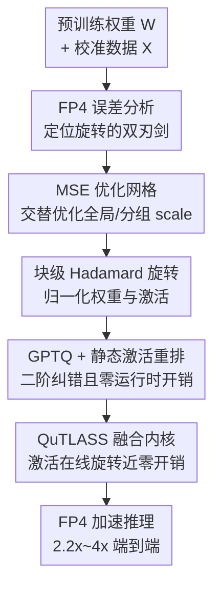

# Bridging the Gap Between Promise and Performance for Microscaling FP4 Quantization

**会议**: ICLR2026  
**OpenReview**: [https://openreview.net/forum?id=zCBGe9AqJZ](https://openreview.net/forum?id=zCBGe9AqJZ)  
**代码**: QuTLASS v1.0（论文随附开源库，基于 NVIDIA CUTLASS）  
**领域**: 模型压缩 / 后训练量化  
**关键词**: FP4 量化, MXFP4, NVFP4, GPTQ, Hadamard 旋转

## 一句话总结
这篇论文第一次系统地拆穿了硬件原生 4-bit 浮点格式 MXFP4/NVFP4 "免费提速又保精度" 的承诺，从量化误差理论证明了为什么现有量化技巧在这两种格式上失灵，并提出针对 FP4 特性定制的 MR-GPTQ 算法 + QuTLASS GPU 内核，在 B200/RTX5090 上拿到 2.2x~4x 端到端加速的同时把 MXFP4 精度从掉 10% 拉回到接近 NVFP4 的水平。

## 研究背景与动机

**领域现状**：后训练量化（PTQ）是把已训练好的大模型压小、压快、还尽量不掉精度的主流手段，GPTQ、AWQ、SmoothQuant、QuaRot/SpinQuant 这一系列方法已经把 INT4/INT8 做到近乎无损。最近 NVIDIA Blackwell 和 AMD 的新 GPU 直接在硬件里支持了两种 4-bit 微缩放浮点格式——MXFP4 和 NVFP4，它们把若干个元素分成一组共享一个缩放因子，宣称既比上一代 INT4 更准、又有硬件加速，被寄望"革命 LLM 推理"。

**现有痛点**：这两种格式的"承诺"几乎没人在真实模型上严格验证过。把现有 SOTA 量化方法直接套到 FP4 上，结果常常还不如最朴素的 RTN（round-to-nearest）——为旋转/异常值设计的技巧不仅不涨点，有时反而掉点。MXFP4 在 W4A4 设定下精度相对掉了约 10%，这显然不是"自动升级"。

**核心矛盾**：问题的根在于 FP4 格式的两个独有结构特征。其一，NVFP4 的组很小（每组 16 个元素），共享缩放因子已经天然在做异常值抑制，于是 QuaRot/SmoothQuant 这类专门搬运异常值的技巧失去了用武之地，甚至帮倒忙；其二，MXFP4 的组缩放因子被量化成 2 的幂（E8M0，纯指数无尾数），这个粗糙的舍入会注入很大的误差，严重拖累精度。一句话：现有方法假设的"大组 + 均匀网格"前提，被 FP4 的"小组 + 非均匀网格 + 幂次缩放"彻底打破了。

**本文目标**：(1) 用可证明的误差分析说清楚 NVFP4 和 MXFP4 到底差在哪、各自适合什么操作；(2) 据此造一个对两种格式都友好的量化算法；(3) 让这个算法的额外开销（在线旋转）在真实 GPU 上几乎为零。

**切入角度**：作者从量化误差的解析建模出发，把原生权重/激活建模成 Laplace 重尾分布，把 Hadamard 旋转后的张量建模成正态分布，再分别推导平均元素 MSE 和异常值 MSE 随组大小 $G$ 的变化规律。这个角度的价值在于：它能在动手做实验之前就预测"旋转对哪种格式有利、对哪种有害"。

**核心 idea**：与其发明全新格式，不如把经典 GPTQ 改造成"懂 FP4"的版本——用块级融合 Hadamard 旋转归一化分布、用 MSE 优化网格挑缩放因子、用静态激活重排省掉运行时开销，再配一套 QuTLASS 内核把在线旋转融进矩阵乘，做到"理论最优 + 硬件零开销"。

## 方法详解

### 整体框架

整篇工作分两块：前半是**诊断**（FP4 误差分析），后半是**药方**（MR-GPTQ 算法 + QuTLASS 内核）。诊断部分先证明一个反直觉结论——Hadamard 旋转会把"原本被 absmax 缩放完美保留的异常值"的误差摊到整组上，所以旋转是一把双刃剑：对组大的 MXFP4（$G=32$）有利，对组小的 NVFP4（$G=16$）有害。药方部分则把这个洞察灌进 GPTQ：先用交替优化挑一个 MSE 最优的初始网格，再对权重和激活做块级 Hadamard 旋转把分布"正态化"，然后跑带静态激活重排的 GPTQ 做二阶纠错，最后由 QuTLASS 内核在推理时把激活的在线旋转融合进量化，使整条链路相对普通 FP4 矩阵乘几乎不增加开销。

### 关键设计

**1. FP4 误差分析：证明旋转对 MXFP4 和 NVFP4 作用相反**

这是全文的理论基石，回答"为什么现有方法在 FP4 上失灵"。作者把量化误差拆成两个量：平均元素 MSE 与异常值（每组最大元素）MSE。一个关键引理（Lemma 1）指出，对正态分布向量做 Hadamard 旋转后再量化，旋转会把量化误差**均匀摊到每个坐标**，于是异常值 MSE 退化成普通的平均 MSE：$\mathrm{MSE}_{\mathrm{top}}(G)=\frac{1}{G}\mathbb{E}\|\varepsilon_y\|_2^2=\mathrm{MSE}(G)$。而在不旋转、直接用 absmax 缩放时，每组最大元素恰好被缩放到边界 $\pm 1$ 上、几乎无损，所以 $\mathrm{MSE}_{\mathrm{top}}(G)=0$——旋转反而毁掉了这种天然的异常值保护。

更细的速率分析给出一个"交叉现象"：定义逃出"死区"（dead-zone，第一个正量化级 $q_{\min}$ 的一半 $\delta=q_{\min}/2$ 以内的值会被舍成 0）的"保留质量" $R(G)=1-\mathrm{MSE}(G)$，对 Laplace 分布有 $R_L(G)=\Theta\big((\log G)^2 G^{-\delta}\big)$，对正态分布有 $R_N(G)=\Theta\big(\sqrt{\log G}\,G^{-\delta^2}\big)$。由于 $0<\delta^2<\delta<1$，小 $G$ 时原生 Laplace 误差更低，大 $G$ 时旋转后的正态分布反超。结论非常实用：**旋转在小组上帮倒忙、在大组上才划算**——这正好解释了为什么 Hadamard 对 $G=32$ 的 MXFP4 有效、对 $G=16$ 的 NVFP4 有害。再叠加一层缩放因子精度分析：MXFP4 的 E8M0 比元素格式 E2M1 还粗，异常值精度被基础格式卡死且与 $G$ 无关；NVFP4 的 E4M3 比 E2M1 细，所以共享缩放保留了更高精度。这套分析直接划出了后面三种策略（标准 NVFP4-GPTQ、MR-GPTQ-MXFP4、MR-GPTQ-NVFP4）的设计空间。

**2. MSE 优化网格：用交替优化挑缩放因子而非死守 absmax**

GPTQ 原版用 absmax 定缩放因子，但对 FP4 这不是最优的。作者把缩放因子的选取写成一个最小化重构误差的优化问题：NVFP 同时有全局（per-tensor）缩放 $s_T$ 和分组缩放 $s_G$，量化值为 $\hat{X}_i=s_T\cdot s_G\cdot Q\big(X_i/(s_T\cdot s_G)\big)$，目标是 $\min_{s_T,s_{G_1},\dots,s_{G_k}}\sum_i\|\hat{X}_i-X_i\|_2^2$。这个目标非凸且耦合，作者用**交替优化**——固定全局缩放优化各组缩放、再固定各组优化全局，来回迭代。对不旋转的 NVFP4，这个 MSE 网格能稳定涨点；对旋转后的 MXFP4，作者发现一个静态常数缩放就够稳，于是实现里直接用常数。这一步的意义在于：它给 GPTQ 一个比 absmax 更好的"起跑线"，让后续二阶纠错有更小的初始误差去修。

**3. 静态激活重排序：保住 act-order 的精度收益、砍掉运行时开销**

GPTQ 有个经典技巧叫"动态 act-order"——按 Hessian 对角线降序重排权重列，让重要的列先被量化、误差更早被补偿，能稳定涨点。但它要求**推理时动态重排列**，带来 10–20% 的端到端减速。作者的观察是：重排可以挪到"网格和缩放因子已经按原始列序算好之后"再做。具体流程是先按原始（任意）列序固定每组的网格和缩放，再 shuffle 列、跑 GPTQ、最后把列 shuffle 回去，从而保住原矩阵的微缩放分组结构。这样在量化过程内部享受到了 act-order 带来的更好行为，却不留任何运行时痕迹——既能配任意网格，又拿到与动态 act-order 相当的精度，运行时开销归零。

**4. 块级融合 Hadamard 旋转：把"正态化"做成能塞进矩阵乘的形式**

MR-GPTQ 用块对角的 Hadamard 变换 $H_k$（$k\times k$ 对角块，$k$ 为 2 的幂）来旋转权重和激活，归一化分布。对一个线性层，量化后的运算变成 $Q(WH_k)\,Q(XH_k)^\top$。关键在于这个旋转怎么"不花钱"：权重侧的 $WH_k$ 可以**离线预融合**进权重，推理时无需重算；激活侧的 $XH_k$ 必须在线算，但当块大小 $k<256$ 时这类稠密变换是访存受限（memory-bound）的，意味着任何旋转（不止 Hadamard）几乎同价，因为整块矩阵本就要被加载。作者还在附录里给 MXFP 加了一个缩放拟合修正，把过大的 E8M0 范围映射回数据实际范围，进一步提升 MXFP 量化模型表现。

**5. QuTLASS 内核：让在线旋转 + FP4 矩阵乘"近乎免费"**

光有算法不够，在线旋转若拖慢矩阵乘就白搭。作者基于 NVIDIA CUTLASS 造了 QuTLASS v1.0，把 $Q(WH_k)Q(XH_k)^\top$ 的计算拆成两类内核并适配 Blackwell 的 SM100/SM120。第一类是量化相关内核：为激活的在线旋转提供轻量融合实现，支持 $k\in\{16,32,64,128\}$ 的"单模态"块对角矩阵，并把量化和缩放因子计算作为 epilogue **融进同一个变换内核**，省掉额外读写。第二类是窄精度矩阵乘内核：处理 FP4 量化到矩阵乘之间硬件强制的缩放因子重排（用 Triton 实现），矩阵乘本身支持 CUTLASS/FlashInfer 等多后端即插即用。最惊人的结果是：他们的 MXFP4 内核吞吐甚至能超过"理想 NVFP4 矩阵乘"，层级加速逼近理想值（B200 上 3.6x、RTX5090 上 6x）。

### 损失函数 / 训练策略

MR-GPTQ 本质是 PTQ，主干无需训练，靠 GPTQ 的二阶 Hessian 信息（标准阻尼系数 $\lambda=10^{-2}$）逐列纠错，校准用 FineWeb 的 1024 条序列。论文额外报告了一组量化感知训练（QAT）作对照：用量化模型与冻结的全精度模型 token 分布之间的"平衡广义 Jensen-Shannon 散度"损失，在 Tülu 3 指令集 10%（92,995 条）子集上微调；结果是 QAT 对 NVFP4 收益很有限，但能持续缩小 MXFP4 到全精度的差距。

## 实验关键数据

### 主实验

在 Llama-3.1-8B-Instruct 上做 W4A4（权重+激活都量化到 4-bit）模拟量化，评测 MMLU-CoT / GSM8k / HellaSwag / WinoGrande，FP16 基线平均 78.93。

| 格式 | 方法 | 平均分 | 恢复率 % |
|------|------|--------|----------|
| FP16 | 基线 | 78.93 | 100 |
| NVFP4 | RTN | 74.73 | 94.67 |
| NVFP4 | QuaRot | 74.10 | 93.80 |
| NVFP4 | GPTQ | 75.72 | 95.92 |
| NVFP4 | **MR-GPTQ** | **75.84** | **96.08** |
| MXFP4 | RTN | 69.32 | 87.83 |
| MXFP4 | QuaRot | 62.90 | 79.70 |
| MXFP4 | GPTQ | 70.62 | 89.47 |
| MXFP4 | **MR-GPTQ** | **73.65** | **93.31** |

两个最扎心的对照：(1) QuaRot 这种为异常值设计的 SOTA 旋转方法，套到 MXFP4 上只剩 79.70% 恢复率，比朴素 RTN（87.83%）还差近 8 个点——印证了"旋转双刃剑"的分析；(2) MR-GPTQ 把 MXFP4 从 87.83%（RTN）拉到 93.31%，逼近 NVFP4 水平，相差仅 1–2%，等于用 4.25 bit/元素（vs NVFP4 的 4.5）拿到接近的精度。

### 消融实验

MR-GPTQ 的三个配料各自的作用（基于 Table 1 内的方法谱系对照）：

| 配置 | NVFP4 恢复率 | MXFP4 恢复率 | 说明 |
|------|--------------|--------------|------|
| RTN（基线） | 94.67 | 87.83 | absmax 朴素舍入 |
| RTN + HT（仅加旋转） | 93.82 | 89.26 | 旋转对 NVFP4 掉点、对 MXFP4 涨点 |
| GPTQ（仅二阶纠错） | 95.92 | 89.47 | 二阶纠错对两格式都稳涨 |
| MR-GPTQ（旋转+MSE网格+静态重排） | 96.08 | 93.31 | 三件套叠加，MXFP4 大涨 |

性能侧：QuTLASS 单层加速 B200 3.6x、RTX5090 6x；vLLM 端到端 B200 2.2x、RTX5090 4x。作者还顺手验证了整数微缩放变体 NVINT4/MXINT4：NVINT4 + MR-GPTQ 拿到全场最高 97.12% 恢复率，印证了"NVINT4 该从 HT 中获益"的预测。

### 关键发现

- **没有无损格式**：NVFP4、MXFP4、INT4 在 W4A4 下都明显掉点，误差大致均分给权重和激活两侧；微缩放不是精度恢复的"银弹"。
- **格式排序 NVFP4 > INT4 > MXFP4**：NVFP4 与 INT4 质量接近（INT4 方差更大），MXFP4 单独看是远远第三，但对 MR-GPTQ 的受益最大。
- **旋转的有效性强烈依赖组大小**：HT 对 $G=32$ 的 INT4/MXFP4 有效、对 $G=16$ 的 NVFP4 用 RTN 时反而掉点——与理论交叉现象完全吻合。
- **模型越大越好压**：大模型上 NVFP4/MXFP4 都能恢复到 FP16 的 98–99%；Qwen3 系列在 NVFP4 上可超 99% 平均恢复率，Llama 系列和 <8B 小模型恢复率偏低。

## 亮点与洞察

- **先证明再动手**：用 Laplace/正态分布建模 + MSE 速率分析，在跑实验前就预言"旋转对 NVFP4 有害、对 MXFP4 有利"，再被实验逐条验证——这种"理论指导格式特化"的范式，比盲试 trick 更有说服力，也最让人"啊哈"。
- **静态激活重排是可迁移的好 trick**：把动态 act-order 的精度收益与运行时开销解耦（量化时 shuffle、量化后 shuffle 回），适用于任意网格，可直接搬到其他 PTQ 方法里去掉 10–20% 的推理减速。
- **"访存受限 = 旋转免费"的洞察**：抓住 $k<256$ 时块对角变换是 memory-bound 这一硬件事实，论证任意旋转几乎同价，是把算法开销藏进硬件特性的漂亮一手。
- **MXFP4 内核吞吐超过理想 NVFP4 矩阵乘**：用更省 bit 的格式 + 定制内核反超更贵格式的理想性能，重新定义了 FP4 的"精度-性能"前沿。

## 局限与展望

- **结论高度绑定 Blackwell 架构**：QuTLASS 的"零开销旋转"依赖 SM100/SM120 的硬件特性和访存受限假设，换到其他架构或更大块 $k\geq256$ 时不一定成立。
- **W4A4 仍有 1–6% 的精度缺口**：即便是最好的 MR-GPTQ，MXFP4 也只恢复到约 93%，小模型和 Llama 系列缺口更大；对精度敏感的部署仍需谨慎。
- **QAT 收益有限且成本高**：对 NVFP4 几乎不涨点，仅对 MXFP4 有改善，却要在数万条样本上微调，性价比存疑。
- **分析基于分布建模假设**：Laplace/正态的建模虽有实测拟合支撑，但真实层间分布差异、激活异常值的极端情形可能偏离假设，理论速率只是渐近刻画。

## 相关工作与启发

- **vs GPTQ**：本文是 GPTQ 的 FP4 特化变体，保留二阶纠错主干，但额外加了 MSE 优化网格、静态激活重排、块级融合旋转三件套；原版 GPTQ 对 FP4（尤其 MXFP4）力不从心，MR-GPTQ 把 MXFP4 恢复率从 89.47% 提到 93.31%。
- **vs QuaRot / SpinQuant**：它们用全局/可训练 Hadamard 旋转搬运异常值，本是 INT4 的 SOTA；但本文证明并实测出旋转对小组 NVFP4 有害——QuaRot 在 MXFP4 上甚至跌到 79.70%，反衬出"格式无关地堆旋转"的危险。
- **vs SmoothQuant**：SmoothQuant 靠权重-激活间重缩放搬运异常值，在 FP4 上表现尚可（NVFP4 95.90%）但提升温和；MR-GPTQ 在 MXFP4 上优势明显。
- **vs QuIP/QuIP# 等旋转量化**：这类极限压缩用旋转矩阵归一化分布，本文指出该思路对 FP4 微缩放格式"不一定有帮助"，需按组大小区别对待。

## 评分
- 新颖性: ⭐⭐⭐⭐⭐ 首个对 MXFP4/NVFP4 的系统误差分析 + 格式特化算法 + 配套内核，理论与系统双落地。
- 实验充分度: ⭐⭐⭐⭐⭐ 跨 Llama-3/Qwen3 多尺寸、多格式（含 INT4/NVINT4/MXINT4）、模拟+真实内核+端到端速度全覆盖。
- 写作质量: ⭐⭐⭐⭐ 分析严谨、洞察清晰，但理论部分密度高、记号多，初读门槛较高。
- 价值: ⭐⭐⭐⭐⭐ 给"FP4 到底值不值得用"一个有理论有数据的答案，并提供可直接用的开源内核，对 LLM 推理落地影响直接。

<!-- RELATED:START -->

## 相关论文

- [\[ICLR 2026\] Alignment through Meta-Weighted Online Sampling: Bridging the Gap between Data Generation and Preference Optimization](alignment_through_meta-weighted_online_sampling_bridging_the_gap_between_data_ge.md)
- [\[ICLR 2026\] Metis: Training LLMs with FP4 Quantization](metis_training_llms_with_fp4_quantization.md)
- [\[ICLR 2026\] MicroMix: Efficient Mixed-Precision Quantization with Microscaling Formats for Large Language Models](micromix_efficient_mixed-precision_quantization_with_microscaling_formats_for_la.md)
- [\[ICLR 2026\] ARMOR: High-Performance Semi-Structured Pruning via Adaptive Matrix Factorization](armor_high-performance_semi-structured_pruning_via_adaptive_matrix_factorization.md)
- [\[ICLR 2026\] Is Finer Better? The Limits of Microscaling Formats in Large Language Models](is_finer_better_the_limits_of_microscaling_formats_in_large_language_models.md)

<!-- RELATED:END -->
