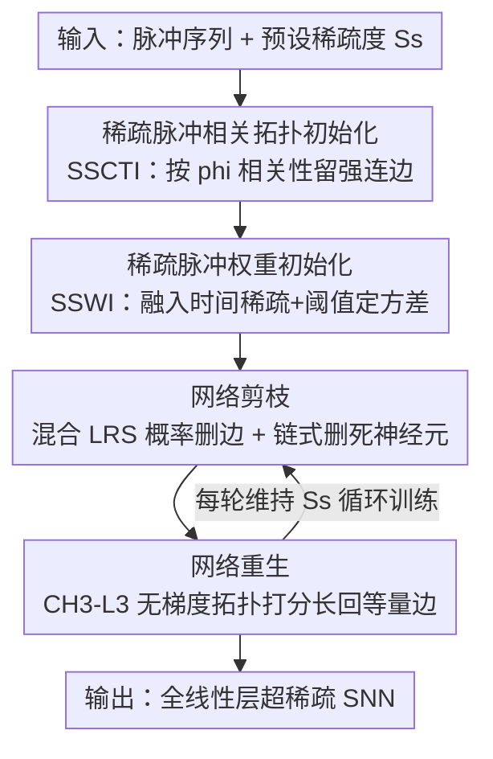

# Cannistraci-Hebb Training on Ultra-Sparse Spiking Neural Networks

**会议**: ICLR2026  
**OpenReview**: [https://openreview.net/forum?id=qDLVgr8ESB](https://openreview.net/forum?id=qDLVgr8ESB)  
**代码**: https://github.com/HuaGuaiGuai/CH-SNN  
**领域**: 模型压缩 / 稀疏训练 / 脉冲神经网络  
**关键词**: 动态稀疏训练、脉冲神经网络、Cannistraci-Hebb 理论、结构连接稀疏、神经形态计算

## 一句话总结
CH-SNN 把脑科学里的 Cannistraci-Hebb 链路预测理论搬进脉冲神经网络（SNN）的稀疏训练，用「相关性拓扑初始化 + 脉冲感知权重初始化 + 混合打分剪枝 + CH3-L3 拓扑重生」四阶段流程，在所有线性层做到 97.75% 的结构稀疏度还比全连接网络高 0.16% 精度，部署到边缘神经形态芯片上更是 98.84% 稀疏度、突触操作减少 97.5×、能耗平均降 55×。

## 研究背景与动机

**领域现状**：SNN 用稀疏的脉冲（spike）而非连续激活传递信息，天然带有「时间激活稀疏性」——神经元只在膜电位越过阈值时才放电，多数时刻处于静息态，因此能避开乘累加（MAC）运算、特别省电，是边缘端低功耗 AI 的热门方向。但 SNN 的「结构连接稀疏性」（即砍掉网络里的连边和神经元）一直没做好。

**现有痛点**：ANN 那套成熟的稀疏训练方法（Deep R、RigL、Grad R 等）大多依赖梯度信息来决定剪谁、长谁，可 SNN 的脉冲激活函数处处不可导、阈值点更是没定义，梯度信号本身就是用代理梯度硬凑出来的，直接照搬 ANN 的稀疏训练并不灵。结果就是：现有 SNN 稀疏方法要么稀疏度上不去（SD-SNN 在 DVS-Gesture 上精度 +1.45% 但稀疏度只有 61.10%，Shen 等人两阶段法平均也才 ~70%），要么稀疏度勉强冲到 90% 却掉点严重（Gradient Rewiring 90% 稀疏度但比全连接掉 3.55%）。

**核心矛盾**：高结构稀疏度与「保持接近全连接的精度」之间存在尖锐 trade-off，而矛盾根源在于——剪枝/重生的决策依赖梯度，可 SNN 的梯度本来就不可靠，越往超高稀疏度推、噪声越大，越容易把有用连接误删或长错。

**本文目标**：做一个能稀疏化 SNN 中**所有线性层**、把结构稀疏度推到 97%~99% 量级、却仍不掉点（甚至涨点）的通用动态稀疏训练框架。

**切入角度**：作者注意到 Cannistraci-Hebb（CH）理论——一套源自脑连接组/蛋白质互作网络科学的链路预测框架——只靠网络拓扑结构就能预测「该长哪条边」，**完全不需要梯度**。既然 SNN 的梯度不可靠，那就干脆把重生这一步从「靠梯度」换成「靠拓扑」。

**核心 idea**：用 CH 理论里最稳健的 CH3-L3 网络自动机做无梯度的链路重生，再配上专为脉冲信号设计的稀疏拓扑初始化与权重初始化，组成四阶段「初始化 → 剪枝 → 重生」循环，让 SNN 在超稀疏下还能稳稳训起来。

## 方法详解

### 整体框架

CH-SNN（Cannistraci-Hebb Spiking Neural Network）是一个四阶段的动态稀疏训练框架，目标是把一个 SNN 的每个线性层都训成超稀疏结构。整体流程是：**先用输入相关性把网络初始化成一张超稀疏拓扑图（而非全连接再剪），再用脉冲感知的方式初始化这些保留连边的权重，然后在训练过程中反复「按混合打分概率剪掉冗余连边 + 删掉变成孤立点的死神经元 → 用 CH3-L3 拓扑打分把同等数量的边长回来」，始终维持预设的稀疏度。** 关键在于剪枝和重生都不直接用梯度大小做硬判定，而是基于打分采样，既保留随机性又跟着拓扑走。

底层神经元用标准的 LIF（leaky integrate-and-fire）模型：膜电位 $v_j(t+1) = (1-z_j(t))\alpha v_j(t) + \sum_i W_{ij} x_i(t+1)$，放电 $z_j(t)=U(v_j(t)-\theta)$，越过阈值 $\theta$ 就发脉冲并复位。由于 $U$ 不可导，训练用代理梯度（surrogate gradient）。框架还可挂到硬件友好的 S-TP（Sparse Target Propagation）算法上跑到神经形态芯片。

### 关键设计

**1. SSCTI 稀疏脉冲相关拓扑初始化：不从全连接剪，而是一上来就按相关性搭超稀疏骨架**

传统剪枝得先建全连接网络再慢慢删，超稀疏目标下这既费内存又容易误删。CH-SNN 反过来——直接初始化一张超稀疏图。它的依据是「网络拓扑应当反映节点特征在潜在几何空间里的关系」，相关性高的节点就该连在一起。由于 SNN 的输入是离散二值脉冲序列，作者用衡量两个二值变量关联强度的 **Pearson phi 系数**来算输入节点间相关性：把输入每一维 $x_i$ 当一个变量、每个时间步 $t$ 当一个独立样本（总样本数 $N\times T$），得到 $\phi_{ij}=\sqrt{\chi^2_{ij}/(2NT)}$，进而拿到相关矩阵 $\Phi\in\mathbb{R}^{M\times M}$。只保留相关性最强的前 $(1-S_s)$ 比例连边（$S_s$ 是结构连接稀疏度），其余直接砍掉，超稀疏骨架就搭好了。隐藏层维度由扩张因子 $\beta\ge 1$ 灵活控制（=输入维 ×$\beta$）。一个实务坑：当 CH-SNN 用来稀疏化卷积层/注意力层之后的中间线性层时，输入分布已被前面的层搅乱、phi 相关性算不准，此时退化成「均匀随机初始化」保证每个节点连边数相等。

**2. SSWI 稀疏脉冲权重初始化：把时间稀疏性和脉冲阈值塞进权重方差，让超稀疏网络从一开始就训得动**

ANN 的 Kaiming/SWI 初始化假设权重零均值高斯、按「逐层方差一致」定方差，但它们既没考虑 SNN 的时间激活稀疏性，也没考虑 LIF 那套独特的阈值放电机制，直接用会让超稀疏 SNN 一开始就训练崩或收敛极慢。SSWI 把三样东西——时间激活稀疏度 $S_t$、结构连接稀疏度 $S_s$、神经元阈值 $\theta$——全融进初始化方差里：

$$\text{SSWI}(W^{(l)}_{ij})\sim\mathcal{N}(0,\sigma^2),\quad \sigma^2=\begin{cases}\dfrac{S_t}{n(1-S_s)}, & l=1\\[2mm]\dfrac{\theta^2\sqrt{\pi}}{\sqrt{2}e^{-1/2}\,n(1-S_s)}, & 1<l<L\\[2mm]\dfrac{\theta^2\sqrt{\pi}}{\sqrt{2}e^{-1/2}\,n}, & l=L\end{cases}$$

其中 $n$ 是该层输入维度、$L$ 是总层数。首层用输入的时间稀疏度 $S_t$ 定标，中间层加进阈值项 $\theta$ 并按 $(1-S_s)$ 放大补偿稀疏带来的方差缩水，末层不再乘稀疏因子（详细推导在附录 A.1）。这样初始化能显著加速早期收敛，也让后面的 CH3-L3 链路预测器更好使。

**3. 混合 LRS 剪枝 + 链式删点：剪边时既看权重大小也看相对重要性，并顺手清掉断线的死神经元**

只按权重绝对值剪边，容易把某些虽小但关键的连接砍掉、还会让很多神经元闲置。CH-SNN 提出**混合链路移除打分 LRS（link removal score）**，把「相对重要性 RI」和「权重幅值 WM」合起来：

$$\text{LRS}^{(l)}_{ij}=\frac{|W^{(l)}_{ij}|}{1+\sum_i|W^{(l)}_{ij}|}+\frac{|W^{(l)}_{ij}|}{1+\sum_j|W^{(l)}_{ij}|}$$

两项分别用流入神经元 $i$ 和流出神经元 $j$ 的权重总幅值做归一化，相当于既看这条边的绝对强度、也看它在所属神经元的「相对地位」。关键是不拿 LRS 大小做硬阈值，而是**按 LRS 值从多项分布里采样**决定删不删，避免一刀切。剪边按动态比例 $\zeta$ 进行。剪完之后做**链式删除（chain removal）**：那些单侧或双侧都断了连接（没有任何入边或出边）的神经元被判为「死神经元」，它们既传不了信息、又因 CH3-L3 机制在重生阶段也长不回新边，索性永久从网络里删掉——这正是 CH-SNN 能额外做到**节点稀疏**、改善信息流的原因。

**4. CH3-L3 无梯度拓扑重生：只靠局部社区结构预测该长哪条边，绕开 SNN 不可靠的梯度**

这是把脑科学搬进来的核心一步。剪掉的边要长回等量的新边以维持稀疏度，但 SNN 梯度不可靠，作者改用 Cannistraci-Hebb 理论里最稳健的 **CH3-L3 网络自动机**来给潜在连边打「重生分」。对一对可能成边的节点 $u,v$，它沿长度为 3 的路径（即 $u,v$ 的共同邻居 $z_1,z_2$）累加贡献：

$$\text{CH3-L3}(u,v)=\sum_{z_1,z_2\in l3(u,v)}\frac{1}{\sqrt{(1+d^e_{z_1})\times(1+d^e_{z_2})}}$$

其中 $d^e_{z_1},d^e_{z_2}$ 是中间节点的「外部局部社区连接度」——直觉是：两个节点如果有很多「对外连接少、抱团在同一局部社区」的共同邻居，它们之间就更该连边。打分完全只用拓扑、不碰梯度。同样地，重生不直接按分数硬选，而是**按分数从二项分布采样**随机决定是否长这条边（沿用 CHTs 的软规则），以躲开训练早期拓扑噪声大时容易陷入的「上位拓扑局部极小（epitopological local minima）」。CH3-L3 还会触发 CHT 式的节点渗滤（node percolation），把网络节点压到初始规模的约 30%。

## 实验关键数据

### 主实验

六个数据集（CIFAR-10/100、MNIST、N-MNIST、CIFAR10-DVS、DVS-Gesture）、三种网络结构（脉冲卷积网络、Spikformer 等），对比 Grad R、SD-SNN、DPAP 等。下表节选 6Conv2FC / 2FC 架构上的对比（精度提升相对全连接 FC 网络）：

| 数据集 | 方法 | 结构稀疏度 | 精度 | 相对FC提升 |
|--------|------|-----------|------|-----------|
| MNIST (2FC) | DPAP | 77.36% | 98.74% | −0.07% |
| MNIST (2FC) | SD-SNN | 45.86% | 98.90% | +0.09% |
| MNIST (2FC) | **CH-SNN** | **97.75%** | 98.97% | **+0.16%** |
| CIFAR-10 (6Conv2FC) | SD-SNN | 35.57% | 94.59% | −0.15% |
| CIFAR-10 (6Conv2FC) | **CH-SNN** | **74.62%** | 94.60% | −0.14% |
| CIFAR-100 (6Conv2FC) | SD-SNN | 36.94% | 75.33% | +3.27% |
| CIFAR-100 (6Conv2FC) | **CH-SNN** | **74.45%** | 75.22% | +3.16% |
| N-MNIST (2Conv2FC) | **CH-SNN** | **94.73%** | 99.15% | +0.08% |

亮点是 CH-SNN 几乎在每个数据集上都拿下**最高稀疏度**，且精度持平甚至反超 FC：MNIST 上 97.75% 稀疏度还 +0.16%；CIFAR-100 上稀疏度比 SD-SNN 高近 38 个百分点而精度只差 0.11%。挂到 Spikformer 上同样成立（如 CIFAR-100 82.11% 稀疏度 +0.75%）。

### 边缘芯片实验（S-TP on ANP-I）

将 CH-SNN 接到硬件友好算法 S-TP、部署在低功耗神经形态芯片 ANP-I（1.5 pJ/SOP）上，3FC 架构：

| 数据集 | 链路稀疏度 | 节点稀疏度 | 精度 | 能耗 |
|--------|-----------|-----------|------|------|
| MNIST (FC) | 0% | 0% | 97.29% | 948 mJ |
| MNIST (CH-SNN) | 94.59% | 23.47% | 97.56% | 48 mJ |
| DVS-Gesture (FC) | 0% | 0% | 89.02% | 78 mJ |
| DVS-Gesture (CH-SNN) | **98.84%** | 12.30% | 91.29% | **0.8 mJ** |
| N-MNIST (CH-SNN) | 98.46% | 41.90% | 96.20% | 4.4 mJ |

在 DVS-Gesture 上稀疏网络比 FC **精度 +2.27%、能耗只有 1/97.5**；四个数据集平均能耗降 55×、平均放电率降 10.77%。N-MNIST 上还顺手剪掉近一半节点（41.90% 节点稀疏度），精度只掉 0.18%。

### 关键发现
- **重生用拓扑而非梯度是涨点关键**：超稀疏下梯度不可靠，CH3-L3 只靠局部社区拓扑预测连边，反而能稳稳把网络训到 97%+ 稀疏度不掉点——这是 CH-SNN 区别于 Grad R/Deep R 等梯度类稀疏训练的根本。
- **链式删点带来额外节点稀疏**：删掉孤立死神经元让 CH-SNN 在边缘实验里额外获得 12%~42% 的节点稀疏，直接换来 SOP 数量级下降。
- **采样而非硬阈值更稳**：剪枝（多项分布）与重生（二项分布）都用打分采样，能避开训练早期拓扑噪声造成的局部极小。
- **并非全场最优**：在 DVS-Gesture 的精度提升上 CH-SNN（+0.38%）不如 SD-SNN（+1.14%）、Grad R（+7.83%），但稀疏度（94.73%）远高于二者，体现的是「稀疏度优先、精度持平」的定位而非单纯刷精度。

## 亮点与洞察
- **跨学科迁移得漂亮**：把网络科学/脑连接组里的链路预测理论（CH3-L3）原样搬到深度网络的稀疏重生，给「梯度不可靠时怎么决定长哪条边」提供了一条完全无梯度的拓扑路线，思路可迁移到任何梯度信号噪声大的稀疏训练场景。
- **「先稀疏初始化」而非「全连接再剪」**：SSCTI 用 Pearson phi 相关性直接搭超稀疏骨架，避开了建全连接的内存开销，对真正想在边缘端 from scratch 训稀疏网络的人很实用。
- **初始化里塞进领域先验**：SSWI 把时间稀疏度、结构稀疏度、脉冲阈值三个 SNN 专属量一起写进权重方差，是「让初始化适配稀疏 + 脉冲」的一个具体可复用范式，而不是空谈。
- **端到端打到芯片**：不止在数据集上刷稀疏度，而是真的跑到 ANP-I 神经形态芯片，给出 SOP、放电率、能耗（mJ）的硬指标，55×~97.5× 的能耗下降让「超稀疏 SNN 上边缘」这件事有了说服力。

## 局限与展望
- **SSCTI 对中间层失效**：卷积/注意力层后输入分布被打乱、phi 相关性算不准，只能退化成均匀随机初始化，意味着对深层非首层网络，作者最核心的「相关性拓扑初始化」优势用不上。
- **稀疏度高但精度增益不总占优**：在 DVS-Gesture 等数据集上精度提升明显低于 SD-SNN/Grad R，说明该方法换取超高稀疏度时在某些任务上会牺牲一部分精度上限。
- **依赖代理梯度训练主干**：重生虽无梯度，但权重本身仍靠代理梯度更新，SNN 训练固有的代理梯度近似误差并未被解决。
- **CH3-L3 计算开销未充分讨论**：沿长度-3 路径枚举共同邻居在大规模层上代价不小，论文主要给精度/能耗，重生本身的训练时间成本交代较少；可改进方向是给 CH3-L3 加近似或缓存以加速重生。

## 相关工作与启发
- **vs SD-SNN / DPAP（生物可塑性剪枝）**：它们靠突触消除、神经元剪枝、突触再生等脑发育机制做自适应剪枝，精度提升常更高，但稀疏度卡在 60%~70% 上不去；CH-SNN 用 CH3-L3 拓扑重生把稀疏度推到 94%~99%，定位是「极致稀疏 + 精度持平」。
- **vs Grad R / Deep R（梯度类稀疏训练）**：Deep R 按权重变号剪边再随机补回，Grad R 进一步改梯度让被剪边能再生——都依赖梯度信息，超稀疏下噪声大；CH-SNN 的重生完全无梯度，靠局部社区拓扑，因此能在更高稀疏度下不崩。
- **vs CHT / CHTs（ANN 上的 Cannistraci-Hebb 训练）**：CHT 把 CH3-L3 用到 ANN、1% 连接超越全连接，CHTs 加软规则避局部极小；本文是把这套理论**首次系统适配到 SNN**，新增了脉冲专属的 SSCTI（phi 相关性）、SSWI（阈值/时间稀疏感知）和混合 LRS 剪枝，解决 ANN 方法无法处理时间激活稀疏与 LIF 阈值的问题。

## 评分
- 新颖性: ⭐⭐⭐⭐⭐ 首次把 Cannistraci-Hebb 无梯度链路预测系统迁移到 SNN 稀疏训练，跨学科切入扎实
- 实验充分度: ⭐⭐⭐⭐ 六数据集三架构 + 真实神经形态芯片部署，硬件能耗指标硬核；但消融多放附录、正文略薄
- 写作质量: ⭐⭐⭐⭐ 四阶段框架与公式交代清楚，CH3-L3 等概念有定义；部分指标分散在附录
- 价值: ⭐⭐⭐⭐⭐ 97%+ 稀疏度不掉点 + 55× 能耗下降，对边缘端神经形态 AI 有直接落地价值

<!-- RELATED:START -->

## 相关论文

- [\[ICLR 2026\] A Recovery Guarantee for Sparse Neural Networks](a_recovery_guarantee_for_sparse_neural_networks.md)
- [\[ICLR 2026\] Towards Lossless Memory-efficient Training of Spiking Neural Networks via Gradient Checkpointing and Spike Compression](towards_lossless_memory-efficient_training_of_spiking_neural_networks_via_gradie.md)
- [\[NeurIPS 2025\] Spiking Brain Compression: Post-Training Second-Order Compression for Spiking Neural Networks](../../NeurIPS2025/model_compression/spiking_brain_compression_post-training_second-order_compression_for_spiking_neu.md)
- [\[AAAI 2026\] A Closer Look at Knowledge Distillation in Spiking Neural Network Training](../../AAAI2026/model_compression/a_closer_look_at_knowledge_distillation_in_spiking_neural_ne.md)
- [\[ICLR 2026\] Many Eyes, One Mind: Temporal Multi-Perspective and Progressive Distillation for Spiking Neural Networks](many_eyes_one_mind_temporal_multi-perspective_and_progressive_distillation_for_s.md)

<!-- RELATED:END -->
