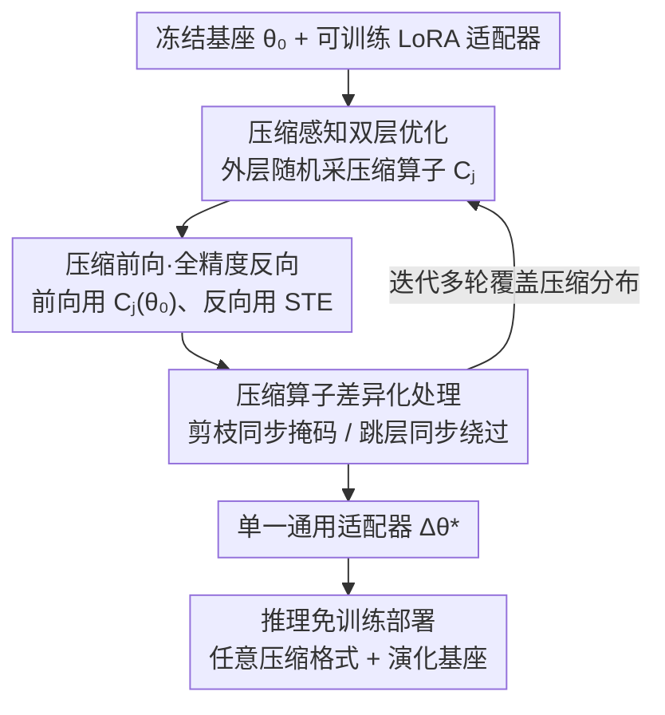

# CAR-LoRA: Training Compression-Aware and Robust LoRA Adapters for Evolving LLMs

**会议**: ICLR 2026  
**OpenReview**: [https://openreview.net/forum?id=5GimteSrgW](https://openreview.net/forum?id=5GimteSrgW)  
**代码**: 无  
**领域**: 模型压缩  
**关键词**: LoRA, 量化感知训练, 边缘部署, 模型演化, 通用适配器

## 一句话总结
CAR-LoRA 通过在训练时随机注入量化 / 剪枝 / 跳层等压缩扰动（前向用压缩权重、反向用全精度梯度），训练出一个「压缩感知 + 时间鲁棒」的通用 LoRA 适配器，让单个适配器无需重训就能直接部署到各种压缩格式的边缘设备以及未来演化的基座模型上，性能逼近为每种配置单独重训的 QLoRA。

## 研究背景与动机
**领域现状**：把大模型搬到手机、车机、IoT 传感器这类边缘设备上跑，需要两件事配合：一是用 LoRA 这类参数高效微调（PEFT）做个性化定制，只训练一小撮低秩参数；二是用量化 / 剪枝把基座模型压小，以塞进受限硬件。云端训 LoRA、设备端跑压缩模型，听起来天然解耦。

**现有痛点**：但 LoRA 适配器其实非常「脆」。一个在全精度（BF16）基座上训出来的 LoRA，直接套到 INT4 量化模型上会性能崩塌——论文实测 Llama-3.1-8B 上 GSM8K 从 38.9% 暴跌到 16.3%（Naive INT4）。原因是量化改变了权重分布，使得 $\theta_0 \notin C_\text{quant}(\theta_0)$，原本贴合 $\theta_0$ 精调出来的高精度修正量 $\Delta\theta^*$ 与压缩后的新权重空间错位。于是不得不为 INT8、FP4、NF4、剪枝每一种硬件格式各重训一个适配器。

**核心矛盾**：除了硬件异构，还有第二个轴——**模型演化**。基座模型会被开发者周期性地用新数据继续预训练，参数随时间漂移（temporal drift），早先 checkpoint 上训的适配器在新版本上也会退化。两个轴叠加，意味着「每出一种新硬件 × 每发一版新模型」都要重训一次，训练和维护成本随设备数和版本数线性爆炸，彻底抵消了 LoRA 本来的效率优势。

**本文目标**：训练一个**单一、通用、可移植**的适配器，同时满足 (i) 压缩感知（compression-aware）——能直接用于多种压缩格式，(ii) 时间鲁棒（temporally robust）——能用于未来演化的基座。

**切入角度**：作者观察到，时间鲁棒性其实是 LoRA 的**涌现属性**（PortLLM 已证明小幅漂移下适配器天然稳定），不需要专门处理；真正需要刻意诱导的只有**压缩鲁棒性**。既然 Naive 压缩崩塌的根源是「训练时只见过一种权重分布」，那就在训练时把适配器**暴露到一整个压缩扰动分布**里去。

**核心 idea**：把训练目标从「在固定基座上最小化任务损失」改成「在压缩算子分布上最小化期望任务损失」——一次训练里随机采样不同压缩方式做前向，强迫适配器学到对压缩 artifact 免疫的泛化特征。

## 方法详解

### 整体框架
CAR-LoRA 解决的是「一个 LoRA 适配器要同时扛住多种压缩格式 + 基座漂移」的问题。核心做法是把标准 LoRA 训练的「静态基座」换成「动态采样的压缩基座」：每个训练迭代先随机抽一种压缩算子作用到冻结的基座上，再在这个被压缩的基座上微调适配器；前向用压缩权重逼出鲁棒性，反向用直通估计器（STE）保证梯度稳定。训练完得到的单个适配器，推理时可免训练（training-free）地合并到任意压缩格式或任意演化版本的基座上。

整个流程可以拆成「外层采样压缩 → 内层微调适配器（含三类压缩的差异化处理）→ 推理免训练部署」：

### 关键设计

**1. 压缩感知双层优化：把单一基座换成压缩算子分布**

标准 LoRA 只在一个固定基座 $\theta_0$ 上训练，所以只学会贴合这一种权重分布，换个压缩格式就错位崩塌。CAR-LoRA 把训练目标改写为在一组压缩算子 $C=\{C_1,\dots,C_k\}$（不同量化位宽、剪枝掩码等）的分布 $p(C)$ 上最小化期望任务损失：

$$\Delta\theta^* = \arg\min_{\Delta\theta} \; \mathbb{E}_{C_j \sim p(C)}\big[\mathcal{L}_\text{task}(C_j(\theta_0) + \Delta\theta)\big]$$

实现成一个双层循环：**外层**每次迭代从可用压缩技术上（如均匀分布）随机采一个算子 $C_j$；**内层**先把基座压成 $\theta_0^c = C_j(\theta_0)$ 并冻结，再在这个压缩基座上对 LoRA 的 $A$、$B$ 做若干步标准微调，任务损失只回传给适配器。这样一次训练里适配器就被反复扔进不同的扰动权重空间，被迫学到「跨压缩格式都成立」的通用修正方向，而不是过拟合到某一种分布。这正是它能用一个适配器顶替多个重训 QLoRA 的根本原因。

**2. 压缩前向·全精度反向：用 STE 绕过压缩算子不可微**

双层优化有个硬骨头：量化这类压缩算子是不可微的（含 round / clip），直接反传梯度会消失或为零。CAR-LoRA 采用「compression-forward, full-precision-backward」：**前向**用压缩后的权重 $\theta_0^c$ 算损失，逼着适配器在真实的压缩 artifact 下学习；**反向**用直通估计器（straight-through estimator, STE）把压缩算子的雅可比近似成单位阵，即 $\frac{\partial C_j(\theta_0)}{\partial \theta_0}\approx I$，从而给 $A$、$B$ 一个稳定且有信息量的梯度。这一步是整个框架能稳定训练的关键——既保留了「见过压缩」的鲁棒性收益，又避免了不可微算子带来的梯度病态。

**3. 压缩算子差异化处理：剪枝同步掩码、跳层同步绕过**

不同压缩方式对 LoRA 的结构影响不同，不能一刀切。论文针对三类做了差异化处理。**量化**最简单，前向直接用量化权重即可。**结构化剪枝**会删掉整行 / 整列，必须让 LoRA 维度对齐：用对角掩码 $M_\text{row}$、$M_\text{col}$ 同时作用到基座和适配器上，前向变为

$$h = (M_\text{row} W_0 M_\text{col})x + (M_\text{row} B A M_\text{col})x$$

相当于把 $B$ 对应行、$A$ 对应列置零，让适配器在剪枝后的子空间里学习、保持结构对齐。**跳层（layer skipping）**则在前向时随机停用一部分带 LoRA 的层，被跳过的层其适配器一并绕过，逼着剩下的活跃适配器补偿被跳层的缺失。三种处理共同保证了无论采到哪种压缩，前向计算都维度兼容、语义合理。

### 损失函数 / 训练策略
训练目标就是上面期望任务损失（公式 3），通过双层循环近似。关键超参：下游任务 LoRA 用 rank $r=8$、$\alpha=16$；模拟时间漂移的继续预训练用 $r=64$、$\alpha=128$、学习率 0.0001、4 个 epoch。基线各训 5 epoch，CAR-LoRA 训 20 epoch（单次成本更高，但只训一次）。压缩算子集合含 5 种：INT8、FP4、NF4 三种量化 + 结构化剪枝 + 跳层。论文还给了可移植性的误差上界（Theorem 1，非正式）：通用适配器与「为每个配置重训的 oracle 适配器」的损失差被 $\epsilon_\text{drift}+\epsilon_\text{comp}+\epsilon_\text{gen}$ 界住，其中泛化项 $\epsilon_\text{gen}$ 正是压缩感知训练显式最小化的对象（⚠️ 推导细节以原文 Appendix D 为准）。

## 实验关键数据

### 主实验
在 Llama-3.1-8B 上跨 6 个推理基准对比，单个 CAR-LoRA 适配器逼近为每种量化格式单独重训的 QLoRA（QLoRA 是性能上界）：

| 方法 | SQA | MATH | GSM8K | ANLI | CSQA | ARC |
|------|-----|------|-------|------|------|-----|
| Zero-Shot | 57.6 | 9.3 | 19.6 | 33.8 | 43.1 | 48.5 |
| LoRA [BF16] | 68.7 | 16.5 | 38.9 | 39.9 | 65.4 | 60.4 |
| qLoRA [INT8] | 68.8 | 16.5 | 38.5 | 39.5 | 65.1 | 60.5 |
| qLoRA [FP4] | 68.7 | 16.1 | 38.5 | 39.9 | 65.1 | 60.4 |
| **CAR-LoRA [INT8]** | 68.4 | 16.1 | 38.4 | 39.7 | 65.4 | 60.5 |
| **CAR-LoRA [FP4]** | 68.4 | **16.7** | 38.5 | 39.8 | 65.1 | 60.4 |
| **CAR-LoRA [NF4]** | 68.5 | 16.4 | 38.1 | 39.4 | 65.1 | 60.3 |
| CAR-LoRA [LS] | 64.4 | 13.0 | 31.1 | 33.6 | 61.9 | 58.3 |
| CAR-LoRA [SP] | 67.6 | 16.0 | 37.5 | 39.5 | 65.1 | 60.5 |

量化格式下 CAR-LoRA 与专用 QLoRA 几乎打平（差距 < 0.5%），FP4 上 MATH 还略超（16.7% vs 16.1%）。明显短板在跳层（LS）：GSM8K 从 38.9% 掉到 31.1%，说明改变推理深度的架构扰动比改位宽更难扛。

### 跨架构 / 泛化 / 效率
| 实验 | 关键指标 | 说明 |
|------|---------|------|
| 跨架构 (Mistral-7B / Gemma-2-9B) | CAR-LoRA [BF16] SQA 72.1 / 74.5 | 普遍略超 LoRA 与所有 QLoRA 变体，证明不绑定单一基座 |
| 泛化到未见压缩 (训练不含 FP4) | Unseen FP4 GSM8K 37.42 vs QLoRA 38.49 | 仅落后 ~1%，说明学到跨量化族的「结构先验」 |
| 时间鲁棒性 (t=0→4) | SQA 在 68.8–68.2% 间几乎持平 | LoRA 随 checkpoint 演化逐渐退化，CAR-LoRA 曲线近乎水平 |
| 摊销效率 (5 设备) | 参数 20M vs 100M；170 vs 220 GPU 时 | 单适配器无需按设备复制，参数省 5×、训练时间也更低 |

### 关键发现
- **量化稳、跳层弱**：CAR-LoRA 对位宽量化（INT8/FP4/NF4）泛化极好、几乎无损，但对跳层这种改变网络深度的扰动退化最明显——架构级扰动是未来优化方向。
- **泛化来自「结构先验」**：即便训练时完全没见过 FP4，测试 FP4 也只落后专用 QLoRA ~1%，说明压缩感知训练赋予了适配器跨压缩族迁移的能力，而非死记某几种格式。
- **时间鲁棒是「免费」的**：作者没为时间漂移做任何专门设计，仅靠压缩采样诱导出的平滑解就同时扛住了参数漂移，印证了 PortLLM 关于「时间鲁棒是 LoRA 涌现属性」的观察。
- **TCO 视角才划算**：单次训练 20 epoch 比基线 5 epoch 贵，但传统方案成本是 $O(N\times T\times 5)$（N 个设备档 × T 次模型更新），CAR-LoRA 是 $O(1\times 1\times 20)$，设备越多 / 更新越频繁越省。

## 亮点与洞察
- **「压缩当数据增强」的视角很巧**：把量化 / 剪枝 / 跳层当成训练期的随机扰动而非部署期的破坏，等于给适配器做了一轮针对压缩 artifact 的对抗 / 增强训练——这个思路可迁移到任何「训练域≠部署域」的场景。
- **STE 用在「基座压缩」而非「激活 / 权重量化训练」上**：传统量化感知训练（QAT）量化的是被训练的权重，这里量化的是冻结基座、训练的是外挂适配器，STE 只为穿过冻结基座传梯度——一个老技巧用在新位置。
- **一图说清省钱逻辑**：把「一设备一适配器」的传统范式和「一适配器走天下」的通用范式并排画出来，直观点出维护成本从乘法变常数，论文的卖点一眼可见。

## 局限与展望
- **跳层是明显软肋**：作者承认 LS 下 MATH/GSM8K 掉点显著（38.9%→31.1%），改变推理深度的架构扰动尚未被很好覆盖。
- **理论是非正式的**：Theorem 1 只给了三项误差上界的存在性，$\epsilon$ 各项没有可计算的紧界，实践指导意义有限。
- **训练成本前置**：20 epoch 的单次训练成本高，只有在设备档位多、模型更新频繁的「摊销」场景才划算；小规模单设备部署反而不如直接 QLoRA。
- **压缩集合固定**：训练时的压缩算子集合需预先设定，虽展示了对未见量化族的泛化，但对完全异质的新压缩范式（如混合精度、激活量化）的覆盖未验证。
- **改进思路**：可对跳层引入专门的深度自适应正则、或把压缩采样分布做成可学习的（难例加权），进一步收紧架构扰动下的退化。

## 相关工作与启发
- **vs QLoRA**：QLoRA 是「train-for-the-target」——为某个特定低位宽量化基座专门训一个适配器，是本文的性能上界但需逐格式重训；CAR-LoRA 把压缩感知嵌进训练循环，用一个适配器覆盖所有格式，牺牲极小性能换巨大可移植性。
- **vs PortLLM**：PortLLM 处理的是时间漂移（模型演化下适配器退化），但不管硬件异构；CAR-LoRA 把「时间鲁棒（借用 PortLLM 的涌现性观察）+ 压缩鲁棒（本文新增）」统一进同一训练框架。
- **vs Naive 压缩**：直接把 BF16 LoRA 套到量化基座上会崩（INT4 GSM8K 38.9→16.3），本文正是从这个「脆性 toy problem」出发，证明压缩感知训练是必需而非可选。

## 评分
- 新颖性: ⭐⭐⭐⭐ 把压缩当训练期扰动、用一个适配器统一硬件异构与模型演化，视角清晰且实用
- 实验充分度: ⭐⭐⭐⭐ 覆盖 4 个基座 × 6 个基准 + 未见压缩泛化 + 时间漂移 + 效率，但跳层退化和理论紧界未充分挖
- 写作质量: ⭐⭐⭐⭐ 动机—toy problem—方法—实验链条顺畅，框架图直观
- 价值: ⭐⭐⭐⭐ 边缘 AI 大规模部署的实际痛点，摊销成本视角对工业落地有说服力

<!-- RELATED:START -->

## 相关论文

- [\[ICLR 2026\] IGU-LoRA: Adaptive Rank Allocation via Integrated Gradients and Uncertainty-Aware Scoring](igu-lora_adaptive_rank_allocation_via_integrated_gradients_and_uncertainty-aware.md)
- [\[ICLR 2026\] Towards Quantization-Aware Training for Ultra-Low-Bit Reasoning LLMs](towards_quantization-aware_training_for_ultra-low-bit_reasoning_llms.md)
- [\[ICLR 2026\] LoRA-Mixer: Coordinate Modular LoRA Experts Through Serial Attention Routing](lora-mixer_coordinate_modular_lora_experts_through_serial_attention_routing.md)
- [\[ICLR 2026\] Gradient Intrinsic Dimensionality Alignment: 弥合 LoRA 与全量微调之间的鸿沟](gradient_intrinsic_dimensionalityalignmentnarrowing_the_gap_between_low-rank_ad.md)
- [\[NeurIPS 2025\] Robust Federated Finetuning of LLMs via Alternating Optimization of LoRA](../../NeurIPS2025/model_compression/robust_federated_finetuning_of_llms_via_alternating_optimization_of_lora.md)

<!-- RELATED:END -->
