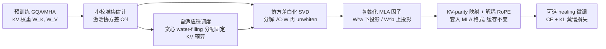

# CARE: Covariance-Aware and Rank-Enhanced Decomposition for Enabling Multi-Head Latent Attention

**会议**: ICLR 2026  
**arXiv**: [2603.17946](https://arxiv.org/abs/2603.17946)  
**代码**: [FutureMLS-Lab/CARE](https://github.com/FutureMLS-Lab/CARE)  
**领域**: model_compression  
**关键词**: KV-cache 压缩, Multi-Head Latent Attention, 低秩分解, 激活感知 SVD, 注意力转换  

## 一句话总结
CARE 用"激活协方差加权 SVD + 逐层自适应秩分配"把预训练的 GQA/MHA 一次性转换成同等 KV 预算的 MLA，把误差最小化目标从"权重空间"换到"激活空间"，one-shot 困惑度最多降低 215×，平均准确率最高提升 1.70×。

## 研究背景与动机
- **领域现状**：KV-cache 已成为 LLM 推理的内存与带宽瓶颈。MQA/GQA 通过共享 K/V 缩小缓存但牺牲表达力；Multi-Head Latent Attention (MLA) 把 K/V 压成低维 latent 缓存、推理时再用轻量上下投影还原，能在压缩缓存的同时保住甚至提升精度。生态里却是 MHA/GQA 预训练 checkpoint 占主导，从头按 MLA 训练代价过高。
- **现有痛点**：主流转换方案（TransMLA、MHA2MLA、X-EcoMLA 等）依赖**纯权重的低秩近似**（SVD 风格初始化）和**逐层统一秩**。它们最小化 $\|W-\hat{W}\|_F$，只关心权重矩阵差异，忽略权重如何作用在真实输入激活上，也忽略激活的协方差结构。
- **核心矛盾**：权重近似准 ≠ 激活近似准。论文用两个观察戳破假设——(1) 在 DeepSeek-V2-Lite 上逐层减半秩，各层敏感度差异巨大，统一秩要么过压脆弱层、要么浪费预算给鲁棒层；(2) 直接把奇异值当重要性分数（删小奇异值）做暴力消融，发现奇异值大小与下游准确率**非单调**，因为 vanilla SVD 优化的是权重误差而非各向异性输入分布下的激活误差 $\|XW-X\hat{W}\|$。
- **本文目标**：在**固定 KV 宽度（KV-parity）**下，把预训练 MHA/GQA 后验转换成 MLA，且尽量小的性能损失、尽量少的修复微调。
- **核心 idea**：**激活感知 + 秩自适应** —— 用激活协方差 $C$ 白化后再做 SVD（对齐真实激活而非权重），并按各层各矩阵的奇异谱难度把固定 KV 预算非均匀地分配下去。

## 方法详解

### 整体框架
CARE 是一条后验转换流水线：先在小校准集上估计每层输入激活协方差 $C^{(l)}$，用其奇异谱做全局**自适应秩调度**确定每层 K/V 保留多少秩；再对每个权重做**协方差白化 SVD**（factorize $\sqrt{C}W$、再 unwhiten）得到 MLA 的下投影 $W^a$ 与上投影 $W^b$；最后用 **KV-parity 映射**和解耦 RoPE 把转换后的 K/V 套进 MLA 格式并保持缓存大小不变，可选一段简短的蒸馏式 healing 微调把残差补满。

### 关键设计

**1. 激活感知白化分解：把误差目标从权重空间搬到激活空间。** CARE 不再最小化 $\|W-\hat{W}\|_F$，而是在真实输入分布下最小化激活误差 $\frac{1}{N}\sum_b \|X_b W - X_b \hat{W}\|_F^2$。论文证明该目标恰好等于 $\|\sqrt{C}(W-\hat{W})\|_F^2$，其中 $C^{(l)}=\frac{1}{N}\sum_b (X_b^{(l)})^\top X_b^{(l)}$ 是未中心化的激活协方差。于是把对 $W$ 做 SVD 换成对**白化算子** $\sqrt{C}W = U\Sigma V^\top$ 做 SVD，截断后再 unwhiten 得 $\hat{W}=\sqrt{C}^{-1}U_r\Sigma_r V_r^\top$。这样保留的是**主导激活方向**而非主导权重方向，在任何微调之前就大幅压低了注意力 logit 漂移。为保证 $C$ 可逆，实践用 shrinkage $\sqrt{C}_\lambda=(1-\alpha)\sqrt{C}+\alpha\lambda I$。

**2. 自适应秩调度：按奇异谱难度切分固定 KV 预算。** 既然各层敏感度异质，统一秩必然次优。CARE 对每层每个 K/V 矩阵，用白化后奇异值 $\sigma^{(l)}_{K,m}$（来自 $\sqrt{C^{(l)}}\tilde{W}^{(l)}_K$）定义"再加一秩"的边际收益优先级 $s^{(l)}_K(r)=\frac{(\sigma^{(l)}_{K,r+1})^2}{\sum_{m>r}(\sigma^{(l)}_{K,m})^2}$，即归一化的尾部能量残差缩减。论文证明 rank-$r$ 截断后的 Frobenius 残差等于平方尾部能量，用残差归一让不同谱尺度的层可比。给定总预算 $R^{(K)}_{tot}$，从一个常数起点用**贪心 water-filling**：每次把一秩分给当前 $\arg\max_l s^{(l)}_K(r^{(l)}_K)$ 的层，直到预算耗尽；V 用独立预算同理处理。谱衰减快的层少给、谱复杂的层多给，从而在 KV 约束下保真度最大化。

**3. KV-parity 映射与解耦 RoPE：套进 MLA 格式且缓存零增长。** 把 SVD 因子映射成 MLA 可训练参数 $W^a\leftarrow \sqrt{C}^{-1}U_r\Sigma_r$、$W^b\leftarrow V_r^\top$，使 $W^aW^b=\hat{W}$，缓存的 latent $XW^a\in\mathbb{R}^{T\times r}$ 张成主激活子空间。位置信息按 DeepSeek 解耦 RoPE 设计，额外引入小宽度 $d_r$ 的 RoPE 通道 $W^R_Q, W^R_K$，只缓存 KV latent 与共享 RoPE key，Query 实时算。K/V 可写成紧凑 join 形式 $\text{Concat}(K_C,V_C)=\text{Concat}(XW^a_K, XW^a_V)W_{join}$，$W_{join}=\text{blkdiag}(W^b_K,W^b_V)$。

**4. Healing 微调：少量数据补满 100% MLA 还原。** 转换后若要完全恢复原模型精度，用一段简短微调，损失为交叉熵 $L_{CE}$ 加温度 $\tau$ 下的 KL 蒸馏 $L_{KD}$：$L=L_{CE}+\beta\tau^2 L_{KD}$，以原模型为 teacher 引导转换后的 student。由于 CARE 的初始化已很接近，所需数据远少于 naive SVD baseline。

## 实验关键数据

### 主实验表格（One-shot, Llama-3.1-8B-Instruct, Rank=64, KV Save 93.75%, Alpaca 校准）

| 方法 | PPL (↓) | AVG ACC (↑) |
|------|---------|-------------|
| GQA (Original) | 7.21 | 58.24 |
| Palu (SVD) | 2260.60 | 31.87 |
| MHA2MLA | 284863.91 | 31.64 |
| ASVD | 2525.33 | 31.50 |
| SVD-LLM V2 | 967.04 | — |
| CARE-U (Ours) | 983.55 | 31.89 |
| **CARE-E (Ours)** | **983.03** | **32.37** |

> 在匹配 KV 预算下，CARE-E 取得最低 PPL 与最高平均准确率；相对最弱 baseline（MHA2MLA 的 28 万级 PPL），one-shot 困惑度最多降低约 215×、平均准确率最高提升 1.70×。

### 消融实验
- **CARE-U vs CARE-E**：在同样的协方差白化分解下，自适应秩（E）相比统一秩（U）进一步提升 AVG ACC（如 31.89 → 32.37），验证逐层秩分配的增量贡献。
- **协方差白化 vs 纯权重 SVD**：去掉激活协方差退化为 ASVD/SVD-LLM 风格，PPL 与准确率明显变差，说明激活空间目标是主要增益来源。

### 关键发现
- 评测覆盖 Qwen3-4B / 30B-A3B-Instruct-2507 与 Llama-3.1-8B / 70B-Instruct，多模型一致受益。
- one-shot（无微调）即可大幅领先 uniform-rank SVD baseline；加一段简短 post-SVD healing 微调可**完全恢复**原模型精度。
- 还报告了长上下文检索（NiH）与系统效率结果，转换后保持 MLA 的缓存效率优势。

## 亮点与洞察
- **目标函数的"一字之差"带来量级差距**：把 $\|W-\hat{W}\|$ 换成 $\|XW-X\hat{W}\|$，并证明它等价于 $\|\sqrt{C}(W-\hat{W})\|$，让经典 SVD 工具直接复用却对齐了推理时真正发生的事。
- **两个反直觉观察驱动设计**：逐层敏感度异质 + 奇异值非单调对应准确率，直接动机化了"自适应秩"与"激活感知"两支。
- **KV-parity 是硬约束而非松弛**：所有增益都在缓存零增长前提下取得，工程上即插即用、不破坏 MLA 推理收益。

## 局限与展望
- 协方差 $C$ 依赖校准集（论文用 256 样本 / 2048 长度 / Alpaca），校准数据的领域偏移可能影响白化方向的代表性。
- shrinkage 系数 $\alpha,\lambda$ 与秩预算起点常数 $C$ 等超参需调，跨模型迁移稳健性有待更系统验证。
- "完全恢复精度"仍需 healing 微调，纯 one-shot 与原模型仍有差距（PPL 983 vs 7.21），真正零成本部署场景下差距明显。
- 贪心 water-filling 是启发式分配，未必全局最优；与端到端可学习秩分配的对比可进一步探索。

## 相关工作与启发
- **MLA 转换线**：TransMLA（GQA↔MLA 等价参数化 + 轻微调）、MHA2MLA（处理 partial RoPE 失配 + 联合 SVD 初始化）、X-EcoMLA（结构化 SVD + 跨层蒸馏回收参数）。CARE 的差异在于把初始化从权重空间升级到激活空间并加自适应秩。
- **激活感知压缩**：ASVD、SVD-LLM V2 已尝试用激活信息改进截断方向，CARE 进一步给出"白化—unwhiten"的闭式映射并接到 MLA 因子上。
- **预算化重要性分配**：与 AdaLoRA、DyLoRA 等"按重要性分配 adapter 秩"精神一致，迁移到 KV 预算约束下的注意力转换。
- **启发**：低秩压缩的"正确目标"应是下游算子在真实分布上的行为而非参数本身；当资源是硬预算时，非均匀分配几乎总优于均匀分配。

## 评分
- **新颖性**: ⭐⭐⭐⭐ 把激活协方差白化 SVD 与自适应秩调度系统整合进 MLA 转换，理论（激活误差=白化 Frobenius 残差）与实践闭环清晰，虽各组件思想有前作渊源但组合与定位新颖。
- **实验充分度**: ⭐⭐⭐⭐ 覆盖 4 个规模 / 2 个模型族、多任务 LM Harness、消融拆出 U/E 与协方差贡献、含长上下文与系统效率，one-shot 与 healing 两种设置齐全。
- **写作质量**: ⭐⭐⭐⭐ 两个观察先证伪 naive SVD 再引出方法，逻辑顺畅；公式与图示（Fig.1/Fig.2）配合到位。
- **价值**: ⭐⭐⭐⭐ 直击"把海量预训练 GQA/MHA checkpoint 低成本迁到 MLA"的现实需求，固定 KV 预算下即插即用，工程落地价值高。

<!-- RELATED:START -->

## 相关论文

- [\[ICLR 2026\] TurboBoA: Faster and Exact Attention-aware Quantization without Backpropagation](turboboa_faster_and_exact_attention-aware_quantization_without_backpropagation.md)
- [\[ICLR 2026\] AdaRank: Adaptive Rank Pruning for Enhanced Model Merging](adarank_adaptive_rank_pruning_for_enhanced_model_merging.md)
- [\[ACL 2026\] Enabling Agents to Communicate Entirely in Latent Space](../../ACL2026/model_compression/enabling_agents_to_communicate_entirely_in_latent_space.md)
- [\[ICLR 2026\] FASA: Frequency-Aware Sparse Attention](fasa_frequency-aware_sparse_attention.md)
- [\[ICLR 2026\] Token Distillation: Attention-Aware Input Embeddings for New Tokens](token_distillation_attention-aware_input_embeddings_for_new_tokens.md)

<!-- RELATED:END -->
