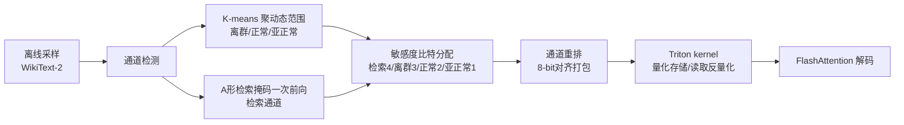

# Channel-Aware Mixed-Precision Quantization for Efficient Long-Context Inference

**会议**: ICLR 2026  
**OpenReview**: [https://openreview.net/forum?id=yjr2jX41qO](https://openreview.net/forum?id=yjr2jX41qO)  
**代码**: [https://github.com/cxiliao/ChanMix](https://github.com/cxiliao/ChanMix)  
**领域**: 模型压缩 / KV Cache 量化 / 长上下文推理  
**关键词**: KV Cache 压缩, 混合精度量化, 通道敏感度, 检索通道, 长上下文, Triton Kernel  

## 一句话总结
ChanMix 发现 KV cache 不同**通道**的量化敏感度差异巨大——检索通道和离群通道脆弱、亚正常通道鲁棒，据此把比特按通道敏感度非均匀分配（检索 4 bit / 离群 3 bit / 正常 2 bit / 亚正常 1 bit），用自定义 Triton kernel 实现 8-bit 对齐打包，在 2-bit 平均预算下显著缓解长上下文检索的精度崩塌。

## 研究背景与动机
**领域现状**：KV cache 随序列长度线性增长，长上下文场景下成为推理的内存瓶颈（Llama-3.1 每百万 token 需 125GB）。量化是主流压缩路线之一，业界惯例是对 key cache 做 channel-wise 量化、对 value cache 做 token-wise 量化（如 KIVI、KVQuant）。

**现有痛点**：现有量化方法对所有通道**一视同仁地分配相同比特宽度**（uniform bit allocation）。在一般任务上低比特量化损失尚可接受，但在低比特（2-bit）设置下，长上下文检索（如 RULER、NIAH）会出现严重精度崩塌，原因始终没有被讲清楚。

**核心矛盾**：均匀比特分配假设所有通道同等重要，但这与 KV cache 通道的真实统计性质矛盾——有的通道是离群值（动态范围大、量化误差大），有的通道幅值很小很鲁棒，还有一类专门承担长上下文检索的"检索通道"对量化极度敏感。把比特平均撒下去，既浪费在鲁棒通道、又饿死了敏感通道。

**本文目标**：在维持约 20% KV 预算（等效 2-bit 平均）的前提下，把长上下文检索精度拉回接近全精度水平，同时真正落地内存收益（更大 batch、更长 context）。

**核心 idea**：**[通道级敏感度非均匀比特分配]** 论文揭示了一个三向不对称——检索通道与离群通道需要高精度，亚正常（小幅值）通道可以激进压缩；据此对每个通道按敏感度分配 1/2/3/4 bit，并通过通道重排让混合比特仍能 8-bit 对齐高效存储。

## 方法详解

### 整体框架
ChanMix 是一个针对 KV cache 的通道级混合精度量化框架。离线阶段先用少量样本（WikiText-2）做两类通道检测：用 key cache 的动态范围 K-means 聚出离群/正常/亚正常三类通道，再用一个"A 形检索掩码"一次前向识别出检索通道。在线阶段沿用 KIVI 的 key channel-wise / value token-wise 量化，但对不同通道分配不同比特（1/2/3/4 bit），并把同一组通道重排成 8-bit 对齐块后用自定义 Triton kernel 量化存储；解码时再读出、反量化回全精度参与注意力计算。

### 关键设计

**1. 离群/亚正常通道检测：用动态范围三分通道** 量化误差的根源是组内的尺度因子 $S=(C_{\max}-C_{\min})/(2^b-1)$，最大误差 $E_{\max}=S/2$，所以通道的**动态范围**直接决定它对低比特有多敏感。论文对每个 key 通道 $c$ 计算其范围 $R_c=\max_i K_{i,c}-\min_i K_{i,c}$，再用 $k{=}3$ 的 K-means（初始质心取 $R_{\min},R_{\text{medium}},R_{\max}$）把所有通道聚成离群（$C_{\text{high}}$）、正常、亚正常（$C_{\text{low}}$）三类。统计上离群通道远少于亚正常通道，且 PPL 实验证实离群通道在比特下降时急剧恶化、亚正常通道几乎不变——这就给"离群多给比特、亚正常少给比特"提供了直接依据。

**2. 检索通道检测：A 形掩码一次前向定位检索头** 长上下文检索能力由特定的"检索头"承担，而这些头里的通道对量化最脆弱。论文不走以往昂贵的检索头识别路线，而是基于"检索靠捕捉输入中相同 token 之间的 copy-paste 关系"这一假设，构造一个语义无关的句子（约 $n{=}100$ token）重复 $t{\approx}30$ 次得到句子级依赖的探针 prompt，再用一个 A 形检索掩码 $M\in\{0,1\}^{l\times l}$ 抹掉注意力 sink 与局部 token 的噪声分数，只保留跨句检索依赖，按 $S=\sum_i\sum_j A_{ij}\circ M_{ij}$ 给每个头算检索分。分数高的头即检索头，其通道即检索通道。关键是整个过程**只需一次前向**，离线 10 分钟内可完成，开销极低。

**3. 敏感度感知比特分配 + 通道重排对齐** 综合两类敏感度分析，ChanMix 给检索通道分配 4 bit、离群通道 3 bit、正常通道 2 bit、亚正常通道 1 bit。由于亚正常通道数量总是多于离群通道，为保持 **8-bit 对齐存储**，只把与离群通道**等数量**的亚正常通道降到 1 bit，使每个对齐块内的比特总和恰好凑成 8。量化参数以 float8 e4m3fnuz 格式存储；一个 Triton kernel 负责算 scale/zero-point 并转整型，另一个 kernel 融合"重排+写入 8-bit 对齐内存"，读取端再融合"读取+反量化"，最大限度减少 memory copy 开销。该实现与 FlashAttention 完全兼容，是即插即用的通用方案。

**4. 与现有方法正交兼容** ChanMix 只动 KV cache 的比特分配，因此与权重压缩（GPTQ/AWQ/SVD 系）、token 剪枝（DuoAttention 等）以及量化误差补偿方法（如 Kang et al.）都正交可叠加，定位为长上下文 KV 压缩的通用底座而非替代品。

## 实验关键数据

### 主实验表格（RULER，KV≈20%）

| 模型 | 方法 | KV Size | 4K | 16K | 32K | 64K | 128K | 平均 |
|------|------|---------|----|-----|-----|-----|------|------|
| Llama-2 (32K) | Vanilla | 100% | 80.36 | 61.42 | 53.82 | - | - | 67.87 |
| Llama-2 | KIVI | 19.1% | 68.34 | 53.31 | 41.31 | - | - | 57.00 |
| Llama-2 | KVQuant | 19.8% | 70.84 | 59.43 | 49.60 | - | - | 61.54 |
| Llama-2 | **ChanMix** | 18.3% | 80.35 | 63.82 | 53.20 | - | - | **67.85** |
| Llama-3.1 (128K) | Vanilla | 100% | 93.90 | 86.21 | 84.66 | 82.26 | 74.59 | 84.47 |
| Llama-3.1 | KIVI | 18.9% | 85.42 | 76.07 | 72.58 | 68.36 | OOM | 76.51 |
| Llama-3.1 | OTT | 19.0% | 90.77 | 52.44 | 2.73 | 0.00 | OOM | 46.03 |
| Llama-3.1 | **ChanMix** | 19.5% | 90.64 | 83.66 | 82.68 | 80.55 | 69.41 | **82.16** |

ChanMix 在 RULER 上比所有基线至少高 **5 个绝对百分点**，Llama-2 上几乎零损失（67.85 vs 67.87），且 OTT 这类 token 重要度方法在 32K+ 长上下文直接崩到个位数。InfiniteBench 八任务上 ChanMix 同样与各基线持平或更优。

### 消融实验表格（RULER，两类敏感通道组件）

| 方法 | KV Size (Mistral) | Mistral | KV Size (Llama-3.1) | Llama-3.1 |
|------|------|---------|------|-----------|
| Vanilla | 100% | 86.99 | 100% | 84.47 |
| ChanMix2（纯 2-bit） | 16.1% | 72.13 | 15.8% | 75.40 |
| ChanMix2 + R（检索通道） | 19.6% | 86.12 | 19.5% | 81.50 |
| ChanMix2 + O（离群通道） | 16.1% | 84.17 | 15.8% | 81.13 |
| ChanMix2 + R + O（完整） | 19.6% | **86.35** | 19.5% | **82.16** |

纯 2-bit 量化在 Llama-3.1 上只有 75.40，单独加检索通道（+R）或离群通道（+O）都能大幅回血，两者叠加最优——验证了"三向不对称敏感度"假设的两条腿各自有效且可叠加。

### 关键发现
- **效率收益落地**：融合 Triton kernel 让 ChanMix 在同等内存下支持 **2.3× batch size**、**1.5× 更长 context**，吞吐与显存均优于 KIVI。
- **短上下文不退化**：MMLU/MBPP/GSM8K 上 ChanMix 普遍优于 KIVI、接近全精度（如 Llama-3.1 MBPP 47.2 vs vanilla 47.4，KIVI 仅 44.2）。
- **长生成仍是难题**：AIME24/25 上所有量化方法（含 ChanMix）都明显掉点（ChanMix 26.67/20 vs vanilla 43.33/23.33），低比特 KV 对持续推理仍是公开挑战。

## 亮点与洞察
- **把"通道敏感度"讲透**：第一次系统刻画了 KV cache 的三向不对称——离群通道（量化误差大）、检索通道（长上下文关键且脆弱）、亚正常通道（鲁棒可压），并用 PPL 与检索精度两组曲线分别佐证，解释了为什么以往均匀量化在长上下文会崩。
- **检索通道检测又简又快**：A 形掩码 + 重复句探针，一次前向、10 分钟离线搞定，比以往检索头识别便宜得多。
- **工程闭环完整**：通道重排凑 8-bit 对齐 + 融合 Triton kernel + FlashAttention 兼容，把混合精度这种容易"只在理论上省内存"的方案做成了真实可跑的端到端收益。

## 局限与展望
- **长生成/推理任务掉点**：AIME 上低比特量化整体退化明显，说明针对"短输入长输出"的持续推理，KV 量化还需要专门处理。
- **依赖离线 profiling**：通道分类与检索通道都来自固定样本（WikiText-2 / 探针 prompt），对分布迁移或新模型族的鲁棒性、是否需要重标定尚未充分讨论。
- **固定比特方案**：1/2/3/4 bit 的分档和"等数量降亚正常以凑齐 8-bit"是手工设计的对齐约束，是否在不同 head/layer 上自适应更优、能否与层级敏感度（如 KVTuner）联合优化，值得进一步探索。

## 相关工作与启发
- **KV 量化基线**：KIVI、KVQuant、ZeroQuant 走 key channel-wise / value token-wise 的均匀量化，ChanMix 在其框架上引入通道级非均匀比特。
- **混合精度量化**：权重侧有 LLM-MQ、SliM-LLM、CMPQ；KV 侧有 MiKV、ZipCache、OTT（按 token 显著性分比特）、KVTuner（层级敏感度）、QAQ（按离群与注意力敏感度）。ChanMix 的差异点在于**首次专门针对通道敏感度**做 KV 混合精度。
- **检索头研究**：建立在 copy-paste 检索头观察（Wu et al. 2025）及 DuoAttention 等之上，把"哪些头重要"进一步落到"哪些通道在量化下脆弱"。对做 KV 压缩的工作而言，"按结构维度（通道/头/层）差异化分配预算"是一条比"对 token 重要度打分"更稳的路线。

## 评分
- **新颖性**: ⭐⭐⭐⭐ 通道级三向敏感度刻画 + 检索通道一次前向检测是清晰且此前未被专门处理的切入点，但混合精度+敏感度分配的大框架在权重/KV 量化里已有不少先例。
- **实验充分度**: ⭐⭐⭐⭐ 覆盖 MHA/GQA/推理模型多家族，NIAH/RULER/InfiniteBench/短任务/效率/消融都齐，且消融把两类通道拆开验证；AIME 长生成的负面结果也如实报告。
- **写作质量**: ⭐⭐⭐⭐ 动机—分析—方法—实验逻辑顺畅，敏感度分析图与比特分配示意清楚，工程细节（8-bit 对齐、Triton kernel）交代到位。
- **价值**: ⭐⭐⭐⭐ 长上下文 KV 压缩是实打实的部署痛点，方法正交可叠加、带真实显存/吞吐收益且开源，落地价值高。

<!-- RELATED:START -->

## 相关论文

- [\[ICLR 2026\] MicroMix: Efficient Mixed-Precision Quantization with Microscaling Formats for Large Language Models](micromix_efficient_mixed-precision_quantization_with_microscaling_formats_for_la.md)
- [\[ICLR 2026\] PM-KVQ: Progressive Mixed-Precision KV Cache Quantization for Long-CoT LLMs](pm-kvq_progressive_mixed-precision_kv_cache_quantization_for_long-cot_llms.md)
- [\[ICLR 2026\] STaMP: Sequence Transformation and Mixed Precision for Low-Precision Activation Quantization](stamp_sequence_transformation_and_mixed_precision_for_low-precision_activation_q.md)
- [\[ACL 2025\] MoQAE: Mixed-Precision Quantization for Long-Context LLM Inference via Mixture of Quantization-Aware Experts](../../ACL2025/model_compression/moqae_mixed_precision_kv_cache.md)
- [\[ICLR 2026\] AnyBCQ: Hardware Efficient Flexible Binary-Coded Quantization for Multi-Precision LLMs](anybcq_hardware_efficient_flexible_binary-coded_quantization_for_multi-precision.md)

<!-- RELATED:END -->
