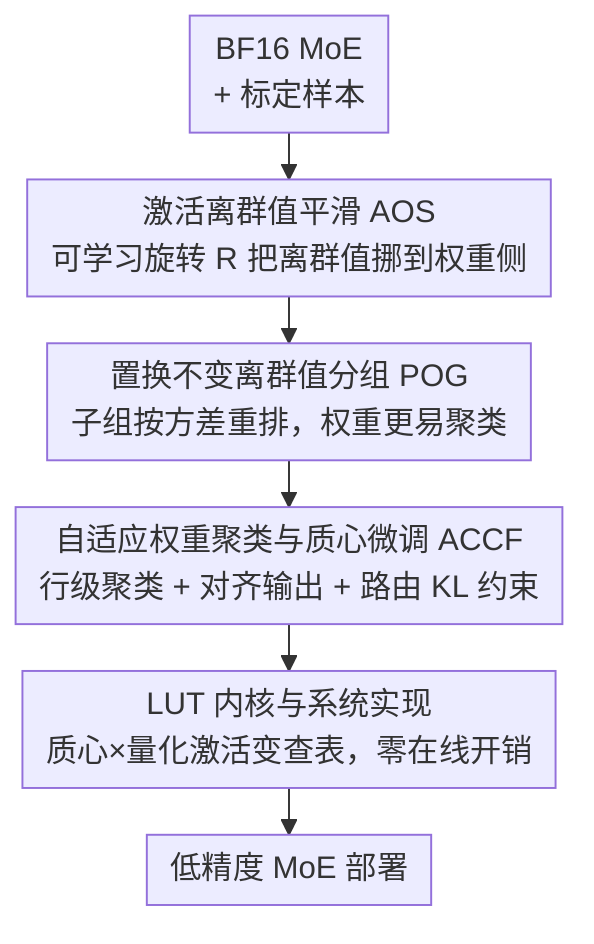

# CodeQuant: Unified Clustering and Quantization for Enhanced Outlier Smoothing in Low-Precision Mixture-of-Experts

**会议**: ICLR2026  
**OpenReview**: [https://openreview.net/forum?id=ATpchFiBQi](https://openreview.net/forum?id=ATpchFiBQi)  
**代码**: https://github.com/SAI-Lab-NYU/CodeQuant  
**领域**: 模型压缩 / 量化  
**关键词**: MoE 量化、离群值平滑、权重聚类、可学习旋转、LUT 内核

## 一句话总结
CodeQuant 把"可学习旋转把激活离群值挪到权重侧"和"用聚类质心吸收权重离群值"统一进一个针对 MoE 的后训练量化框架，再配一个 LUT 内核落地，在 A4W4 下把 Qwen3-30B-A3B 的平均精度比 QuaRot 提升 11.3%，并取得最高 4.15× 的推理加速。

## 研究背景与动机

**领域现状**：MoE（Mixture-of-Experts）已经成为扩展大模型的主流范式——每个 token 只激活一小部分专家，用条件计算换取容量。但 MoE 的总参数量极大，显存和通信开销都很重，所以低比特后训练量化（PTQ，尤其是 4-bit）成了部署的刚需，新一代硬件（Hopper/Ada 支持 FP8，Blackwell 支持 FP4）也在往这个方向推。

**现有痛点**：量化 MoE 的最大障碍是**离群值**（outlier）。大幅值激活会撑大动态范围，在低比特下造成灾难性的量化误差——表 1 里 RTN、SmoothQuant 这类基线在 A4W4 下 perplexity 直接爆到几千上万。近期基于旋转的平滑方法（QuaRot、SpinQuant）通过正交变换重新分配离群值幅度，能把误差压下来一截，但**残余误差依旧存在**，继续拖累低精度部署的可靠性。

**核心矛盾**：旋转方法解决的是激活侧离群值，可它把权重侧留给了**均匀量化**（GPTQ/AWQ 那一套）。问题是真实权重分布远非均匀，均匀量化网格对权重侧的离群值无能为力——这就是残余误差的根。另一条线（聚类/码本量化，如 SqueezeLLM）能把极端权重"吸收"进质心、天然抗离群值，且 LUT（查找表）实现对硬件友好，但它没有和激活侧的旋转平滑统一起来，也没专门处理 MoE 的路由结构。

**本文目标**：把"激活侧旋转平滑"和"权重侧聚类吸收"在 MoE 上统一起来，让两侧离群值都有去处，同时保证可硬件落地（LUT 内核、零在线开销）。

**切入角度**：作者的关键观察是——一旦把权重量化换成聚类，**激活量化反而变成主导瓶颈**（因为聚类已经把权重侧误差压得很低）。所以应该让旋转矩阵专心去最小化"旋转后激活"的量化误差，把剩下的变化都甩给权重，再让聚类去吸收这些权重离群值。

**核心 idea**：用**可学习旋转**把离群值从激活侧搬到权重侧（AOS），再用**带质心微调的自适应聚类**把权重离群值塞进码本质心（ACCF），辅以**置换让权重更易聚类**（POG），最后用 **LUT 内核**把聚类乘法变成查表（Stage 4）——一套统一的"旋转 + 聚类 + 查表"流水线。

## 方法详解

### 整体框架
CodeQuant 是一条**离线标定 + 部署**的四阶段流水线，作用在 MoE 的自注意力（SA）块和 FFN（含 router 与多专家）上。输入是预训练好的 BF16 MoE 模型与一小撮 WikiText2 标定样本，输出是一个权重已聚类、激活按 4-bit 量化、用 LUT 内核推理的低精度 MoE。四个阶段的分工是：Stage 1（AOS）训一个正交旋转矩阵 $R$ 把激活离群值平滑掉、顺势挪进权重空间；Stage 2（POG，可选）对权重列做子组置换，让权重分布更"易聚类"；Stage 3（ACCF）对旋转后的权重做行级聚类并微调质心，目标是最小化层输出的变化、且对 FFN 专门加路由保持项；Stage 4 用一个基于 LUT 的 GEMM 内核把"聚类质心 × 量化激活"的乘法变成查表，落地加速。

关键是 $R$ 和置换矩阵 $P$ 都是**正交**的，可以被"折叠"进 MoE 的线性层里（旋转/置换不变性，见下），所以推理时没有任何额外的在线计算——所有重活都在离线标定阶段做完。

### 关键设计

**1. AOS：用可学习旋转把激活离群值搬进权重空间**

激活离群值会撑大动态范围，是低比特量化误差的首要来源。CodeQuant 在 SA 和 FFN 的激活 $X$ 上插一个旋转矩阵 $R \in \mathbb{R}^{d_{in}\times d_{in}}$。由于 router 是线性层、每个专家结构上等同标准 FFN，整个 MoE 模块对旋转变换是**不变**的——让 router 和所有专家共享同一个 $R$，就能保证输出不变、且不引入在线计算。以单个专家为例，这种旋转不变性写作：

$$(\phi(X_t R R^\top W_{gate}) \odot X_t R R^\top W_{up})W_{down} = (\phi(X W_{gate}) \odot X W_{up})W_{down}$$

其中 $\phi(\cdot)$ 是 SiLU 之类的非线性，$X_t$ 是分配给该专家的 token 子集。光有随机旋转还不够——一旦权重侧换成聚类，激活量化就成了主瓶颈，所以 $R$ 不是随便取一个正交阵，而是要**学**出来。为了在保证正交的同时可微，作者用 Cayley 变换从一个可学习参数矩阵 $M$ 构造 $R$：先取反对称分量 $S=\tfrac{1}{2}(M-M^\top)$，再令 $R=(I-S)(I+S)^{-1}$。优化目标就是最小化旋转后激活的量化误差 $\arg\min_R \|XR - Q(XR)\|^2$（$Q(\cdot)$ 是整数量化）。这样旋转显式地把离群值对激活侧的影响压低，把"变化"留给权重侧——为后面聚类吸收离群值铺路。消融（表 4）显示学到的旋转比随机旋转在 DeepSeek-V2-Lite 上精度高 1.4%。

**2. ACCF：自适应权重聚类 + 质心微调，并为 MoE 路由专门设计目标**

AOS 把离群值赶到权重侧之后，权重侧不能再用均匀量化硬扛，得用聚类把极端值"吸收"进质心。ACCF 对旋转后权重 $W_R = R^\top W$ 做**行级**聚类：质心矩阵 $C \in \mathbb{R}^{d_{out}\times K}$ 的第 $i$ 行是第 $i$ 行权重的码本，二值分配张量 $A\in\{0,1\}^{d_{out}\times d_{in}\times K}$ 满足每个权重恰好选一个质心，重建权重 $W_{c;ij}=\sum_{k} C_{i,k}A_{i,j,k}$。优化目标不是去拟合权重本身，而是**对齐层输出**：$\arg\min_{C,A}\|X_R W_R - \tilde X_R W_c\|^2$。

但 MoE 的 FFN 不能照搬这个目标——直接聚类会改变 router 的 token-专家分配，造成路由错配、掉点。ACCF 因此设计了 **MoE 专属目标**：SA 层的 Q/K/V 用上面的输出对齐损失，而 FFN 的 gate/up 权重则改成"用加权和对齐 + 路由 KL 约束"：

$$L = \|Y - \sum_{i=1}^{E}\tilde\Pi_i \tilde X_R W_c\|^2 + \lambda D_{KL}(\tilde\Pi, \Pi)$$

其中 $Y$ 是非聚类权重产生的 MoE 加权和，$\tilde\Pi$、$\Pi$ 分别是聚类后/前的 router 输出，KL 项把路由分布拉回原样（$\lambda=1.0$）。求解用**交替迭代**：固定分配 $A$、对质心 $C$ 做梯度下降微调；再固定 $C$ 更新 $A$。这里有个细节——标准 K-means 的最近邻取整并不对齐上面的输出目标，所以作者推导了一个**解析的、基于梯度的分配准则**。先写出聚类权重的梯度 $\nabla W_c = 2\tilde X_R^\top \tilde X_R W_c - 2\tilde X_R^\top X_R W_R$，再为了效率只保留对角项 $D_1=\mathrm{Diag}(\tilde X_R^\top \tilde X_R)$、$D_2=\mathrm{Diag}(\tilde X_R^\top X_R)$，于是把 $W_{R,ij}$ 分到第 $k$ 个质心的误差为 $\psi(W_{R,ij},C_{i,k})=\|D_{1,jj}C_{i,k}-D_{2,jj}W_{R,ij}\|^2$，最优分配 $k^*=\arg\min_k \psi(\cdot)$。这个准则把"输入二阶统计量"加权进了分配，比纯 K-means 更贴输出目标。消融（表 5）显示加 KL 项能稳定 router 行为、并提精度。

**3. POG：子组置换让旋转后权重变得"易聚类"**

ACCF 的效果强依赖于 $W_R$ 的初始化是否"易聚类"——AOS 只最小化激活量化误差，把剩余变化全甩给权重，于是权重侧有时会出现某些组方差极大、聚类怎么也压不下去的情况。论文给的例子里，一个分成大小 $g=4$ 聚类组、每组 $k=2$ 个质心预算的权重向量，因为组 1 内部方差太高，最优聚类误差仍高达 17。POG 的做法是：先把权重向量切成更小的**子组**（例子里大小为 2），算每个子组的方差，再把子组当作**不可分割的单元**按方差重排，让高方差和低方差子组在大组之间分布得更均匀——这样每个聚类组内方差下降，整体聚类误差从 17 降到 7.5。

直觉是：原始 $W_R$ 里组 1 需要超过 2 个质心才能压住误差，而组 2 很好聚；通过子组级置换把"难聚"的元素摊匀，得到更易聚类的 $W_R^p$ 当 ACCF 的初始化。注意这和为量化做的置换（如 DuQuant）不同——重排后的 $W_R^p$ 不一定利于量化、只利于聚类。落地上，置换被写成一个**置换矩阵** $P$（正交），像旋转 $R$ 一样折进 SA 和 FFN：在 SA 块 $W_v P$ 与 $P^\top W_{out}$ 处、在 FFN $W_{up}P$ 与 $P^\top W_{down}$ 处插入 $P/P^\top$，保证输出不变。POG 只在分块（Block-wise）设置下有用；Embedding-wise 设置下它对最终性能无影响，故不启用。

**4. LUT 内核：把"质心 × 量化激活"的乘法变成查表**

聚类带来的代价是：如果质心以浮点存储、推理时再加载相乘，会有显著开销，聚类的硬件优势就没了。CodeQuant 设计了一个 LUT-based GEMM 内核来兑现聚类的效率潜力。核心是：把输入和权重按权重组大小分块，每组权重共享同一组质心、与多个激活通道相乘；对每个权重组，**预计算**一张由 16 个质心值 × 16 个可能的 4-bit 整数激活值构成的查找表（16 个子表，每个子表是一个质心在 16 个激活值上的乘积）。推理时用**两级 MUX** 根据权重索引和激活索引直接选出结果，省掉了反量化和实际乘法。LUT 常驻 SM 共享内存，只占现代 GPU 共享内存的一小部分；通过把激活和权重配对访问，还能减少共享内存 bank 冲突。论文用经过验证的 Accel-Sim 框架模拟了 A100 上的内核性能（针对 tensor core 固定 tile 尺寸与 bank 冲突做了 sub-tile 形状和多 bank 优化），并在真实 CPU 上用 T-MAC 内核验证趋势。

### 损失函数 / 训练策略
两阶段离线标定：AOS 用 1024 个 WikiText2 样本、128 次迭代，用 Cayley 变换优化旋转 $R$；ACCF 用 512 个 WikiText2 样本、64 次迭代优化质心，KL 系数 $\lambda=1.0$。预处理耗时（H100）：AOS 约 15/20/30/50 分钟、ACCF 约 30/40/110/240 分钟（Phi-mini-MoE / DeepSeek-V2-Lite / Qwen3-30B-A3B / Mixtral 8×7B）。整个流程**完全离线**，推理时权重固定、与标准 MoE 一致，无在线开销。

## 实验关键数据

模型覆盖 Phi-mini-MoE-Instruct、Qwen3-30B-A3B、DeepSeek-V2-Lite、Mixtral 8×7B，评测含语言建模（WikiText2/C4 perplexity）、零样本 QA（ARC/HellaSwag/MMLU/PIQA/WinoGrande）和数学推理（GSM8K 8-shot、MATH500 4-shot）。两种配置：Embedding-wise（整个 embedding 维度内量化）与 Block-wise（$g=1024$ 分块）。"A4W4" 在 CodeQuant 中指激活 4-bit 线性量化、权重聚成 $2^4=16$ 个质心。

### 主实验（A4W4，Embedding-wise）

| 模型 | 方法 | Wiki2 ↓ | C4 ↓ | 平均精度 ↑ |
|------|------|---------|------|-----------|
| Qwen3-30B-A3B | BF16 | 9.04 | 14.05 | 0.735 |
| Qwen3-30B-A3B | QuaRot | 16.04 | 24.27 | 0.581 |
| Qwen3-30B-A3B | **CodeQuant** | **10.31** | **15.75** | **0.694** |
| DeepSeek-V2-Lite | QuaRot | 7.75 | 10.75 | 0.640 |
| DeepSeek-V2-Lite | **CodeQuant** | **7.08** | **9.85** | **0.664** |
| Mixtral-8×7B | QuaRot | 16.79 | 24.29 | 0.497 |
| Mixtral-8×7B | **CodeQuant** | **4.65** | **8.06** | **0.725** |

CodeQuant 在 Qwen3-30B-A3B 上比 QuaRot 平均精度高 11.3%、Wiki2 降 5.73；Mixtral 上更夸张，平均精度高 22.8%、Wiki2 从 16.79 降到 4.65（几乎贴近 BF16 的 4.01）。RTN/SmoothQuant/SqueezeLLM 这些基线在 A4W4 下普遍崩盘（perplexity 上千）。数学推理（表 3）上 Qwen3-30B-A3B 的 GSM8K 比 QuaRot 高 35.9%、MATH500 高 11.3%。与旋转类强基线对比（表 2，启用在线 Hadamard 的 CodeQuant$_{had}$），Qwen3 上平均精度 0.653 > DuQuant 0.637 > SpinQuant 0.590。

### 消融实验

| 配置 | 关键指标（DeepSeek-V2-Lite, A4W4） | 说明 |
|------|-----------------------------------|------|
| AOS：随机旋转 → 学习旋转 | Acc 0.652 → 0.667；Wiki2 7.29 → 7.06 | 旋转微调提精度 1.4%（表 4） |
| ACCF：w/o KL → w/ KL | Acc 0.658 → 0.667（DeepSeek）；0.694 → 0.700（Phi） | KL 项稳路由、提精度（表 5） |
| 比特预算 A4W2 vs A4W4（CodeQuant） | Acc 0.568 vs 0.667 | 极端压缩下只掉 9.9%（表 6） |
| 比特预算 A4W2 vs A4W4（SqueezeLLM） | Acc 0.496 vs 0.652 | 同条件掉 15.6%，差距更大 |

### 关键发现
- **聚类换均匀量化后，激活成了主瓶颈**——这是 AOS 要"学"旋转而非随机旋转的根本动机，消融证实学习旋转确有增益。
- **KL 路由保持项对 MoE 是必要的**：直接聚类会破坏 token-专家分配，加 KL 既提精度又稳定 router 行为。
- **越压越能体现优势**：随比特预算从 A4W4 收紧到 A4W2，CodeQuant 对 SqueezeLLM 的领先从 1.5% 扩大到 7.2%，说明聚类吸收离群值在极端压缩下更值钱。
- **POG 只在 Block-wise 下有用**：Embedding-wise 设置下置换对最终性能无影响（故不启用）；A8W4 下 DeepSeek 因本身已接近 BF16，POG 甚至微降 0.3%，说明置换主要在"极端压缩"时见效。
- 加速方面：CodeQuant 相对 BF16 平均 2.63× 加速（GPU 模拟），CPU 真实硬件（T-MAC 内核）最高 4.15×，来源是 LUT 查表替代了重复的乘加。

## 亮点与洞察
- **"分工"的思路很干净**：旋转专管激活离群值、聚类专管权重离群值、置换负责让聚类更好做、LUT 负责落地——四件事各司其职又彼此衔接，比单纯堆一个更强的旋转或更细的量化网格更有结构感。
- **把"激活变成主瓶颈"当成设计起点**很有洞察力：很多旋转方法把激活和权重一起平滑，而 CodeQuant 看清楚一旦权重换聚类、矛盾就转移到激活侧，于是让旋转专注激活、可学习且可微（Cayley 变换），这是一个值得迁移的"先定位真瓶颈再下手"的范式。
- **基于梯度/输出对齐的分配准则**（用输入二阶统计量的对角近似加权）比朴素 K-means 最近邻更贴量化的真实目标，这个 trick 可迁移到其他"聚类即量化"的场景。
- **MoE 专属的路由 KL 约束**点出了一个容易被忽略的坑：量化 MoE 不只是量化权重，还会扰动 router 的离散决策——把"保持原路由"显式写进损失，是 MoE 量化区别于稠密模型量化的关键。

## 局限与展望
- **预处理成本不低**：Mixtral 8×7B 的 ACCF 需 240 分钟（H100），大模型上离线标定开销随规模快速增长，虽是一次性但限制了快速迭代。
- **硬件结论靠模拟**：GPU 侧的加速主要来自 Accel-Sim 模拟（且需要 tensor core sub-tile 形状、多 bank 共享内存等架构改动），并非现成 A100 上跑出来的真实数字；真正的硬件红利依赖 LUT 友好的加速器（论文也引用了 Apple Neural Engine、Cerebras 等已采用 LUT 设计的商用芯片）。CPU 侧的 4.15× 是真实硬件（T-MAC），相对更可信。
- **POG 适用面窄**：仅在 Block-wise + 极端压缩下有效，Embedding-wise 无效、甚至在已接近 BF16 的模型上微降，说明它不是普适增益。
- **改进方向**：把质心搜索/质心微调与 router 联合优化得更紧、或把 AOS 的"学习旋转"与 ACCF 的"质心微调"端到端联合训练，可能进一步压低残余误差；以及在真实 LUT 硬件上验证模拟的加速结论。

## 相关工作与启发
- **vs QuaRot/SpinQuant（旋转平滑）**：它们用正交旋转把离群值重分配后仍对权重做均匀量化，残余误差主要卡在权重侧；CodeQuant 保留旋转平滑激活，但权重换成聚类吸收离群值，并把旋转从"随机/固定"升级成"可学习且专注激活误差"，因此在 A4W4 下大幅领先（Qwen3 上 +11.3%）。
- **vs SqueezeLLM（K-means 聚类量化）**：SqueezeLLM 证明了非均匀聚类比均匀量化更贴权重分布，但它没做激活侧旋转平滑、也没针对 MoE 路由；CodeQuant 在它之上加了 AOS 平滑、输出对齐的解析分配准则、POG 置换和路由 KL，在所有比特预算下都更强，且越压差距越大。
- **vs DuQuant（置换 + 旋转双处理离群值）**：DuQuant 的置换是为了利于**量化**，CodeQuant 的 POG 是为了利于**聚类**（重排后矩阵不一定利于量化），目标函数不同；CodeQuant$_{had}$ 在公平对比下精度更高。
- **vs MoEQuant（MoE 专属量化）**：两者都强调 token-专家亲和度的重要性，CodeQuant 用 router logits 上的 KL 散度把这一点显式落进 ACCF 损失，并配套 LUT 内核做端到端的精度-效率权衡。

## 评分
- 新颖性: ⭐⭐⭐⭐ 把旋转平滑、聚类吸收、置换、LUT 四件事针对 MoE 统一起来，且"激活成主瓶颈"的洞察和路由 KL 约束都有新意。
- 实验充分度: ⭐⭐⭐⭐ 四个真实 MoE、多任务、多比特预算、完整消融（AOS/KL/POG/比特预算），但 GPU 加速依赖模拟。
- 写作质量: ⭐⭐⭐⭐ 框架图清晰、公式完整；正文一处说"三阶段"与图中四阶段略有出入，需对照图理解。
- 价值: ⭐⭐⭐⭐ 直击低精度 MoE 部署的离群值痛点，A4W4 下逼近 BF16，且代码开源，落地价值高。

<!-- RELATED:START -->

## 相关论文

- [\[ICLR 2026\] Efficient Quantization of Mixture-of-Experts with Theoretical Generalization Guarantees](efficient_quantization_of_mixture-of-experts_with_theoretical_generalization_gua.md)
- [\[ICLR 2026\] STaMP: Sequence Transformation and Mixed Precision for Low-Precision Activation Quantization](stamp_sequence_transformation_and_mixed_precision_for_low-precision_activation_q.md)
- [\[ICLR 2026\] Coupling Experts and Routers in Mixture-of-Experts via an Auxiliary Loss](coupling_experts_and_routers_in_mixture-of-experts_via_an_auxiliary_loss.md)
- [\[ICLR 2026\] UniQL: Unified Quantization and Low-Rank Compression for Adaptive Edge LLMs](uniql_unified_quantization_and_low-rank_compression_for_adaptive_edge_llms.md)
- [\[ACL 2025\] MoQAE: Mixed-Precision Quantization for Long-Context LLM Inference via Mixture of Quantization-Aware Experts](../../ACL2025/model_compression/moqae_mixed_precision_kv_cache.md)

<!-- RELATED:END -->
