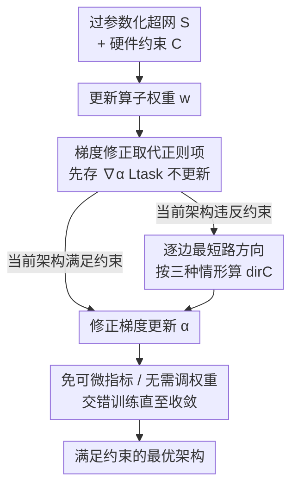

# Constraint-guided Hardware-aware NAS through Gradient Modification

**会议**: ICLR 2026  
**OpenReview**: [https://openreview.net/forum?id=fcKMFIiNFQ](https://openreview.net/forum?id=fcKMFIiNFQ)  
**代码**: https://gitlab.kuleuven.be/m-group-campus-brugge/distrinet_public/connas  
**领域**: 模型压缩 / 神经架构搜索 / 硬件感知 / 边缘部署  
**关键词**: 硬件感知 NAS、梯度修正、约束优化、可行域、边缘 ML

## 一句话总结
CONNAS 把硬件约束从"加在 loss 里的正则项"换成"直接改架构权重的梯度方向"，让梯度搜索过程自动绕开不可行架构，从而省掉可微硬件指标与正则权重调参，在 NATS-Bench 上找到的架构与最优可行解的差距最小仅 0.14%。

## 研究背景与动机
**领域现状**：在边缘机器学习（EdgeML）里，模型要部署到手机、嵌入式板、单片机这类算力/内存/能耗都很紧的设备上，所以架构既要准又要省资源。神经架构搜索（NAS）里基于梯度的方法（以 DARTS 为代表）因为能高效搜索大空间而成为主流：把所有候选架构塞进一张过参数化的超网，每条候选边配一个连续的架构权重 $\alpha$，用梯度下降同时优化算子权重 $w$ 和架构权重 $\alpha$。

**现有痛点**：要把硬件指标塞进梯度搜索，主流做法是把延迟、参数量、FLOPs 等硬件指标作为正则项加进损失函数，再配一个权重 $\lambda_{\text{hardware}}$ 去平衡它和任务损失。这条路有两个老毛病：其一，硬件指标本身对架构是离散、不可微的，为了能求导得想办法把它"因子化"成各候选算子贡献的加权和，大搜索空间里这种分解会算到不可行，只能上蒙特卡洛近似，采样分布没标定好估计就不准；其二，$\lambda$ 这个权重极难调——调小了不足以约束、搜出的架构超预算没法部署，调大了又会过度惩罚、把搜索逼到表达能力很弱的简单模型上。

**核心矛盾**：正则项这套机制本质上"只引导、不强制"——它把搜索往硬件指标更友好的方向推，但**不保证**最终架构真的满足约束。结果就是为了找到一个既满足约束又够准的架构，往往要带着不同的 $\lambda$ 反复跑很多遍搜索，既繁琐又费时。

**本文目标**：(1) 在搜索过程中**直接强制**硬件约束 $c_k(A)\le b_k$ 被满足，而不是软引导；(2) 摆脱对可微硬件指标的依赖；(3) 去掉需要反复调的正则权重。

**切入角度**：作者借鉴了"约束引导梯度下降"（CGGD，Van Baelen & Karsmakers 2023）的思路——CGGD 原本是在训练普通网络权重时、用修改梯度的方式（而非惩罚项）强制满足不等式约束，并证明只要修正方向选对、修正强度够大，优化就能收敛进可行域。作者的观察是：既然能对模型权重这么干，为什么不能对**架构权重 $\alpha$** 这么干？

**核心 idea**：不再把硬件约束写进 loss，而是在更新架构权重 $\alpha$ 时，往它的梯度上叠加一个"指向可行域的修正项"，把搜索方向从不可行架构那边掰回来——用梯度修正取代正则项。

## 方法详解

### 整体框架
CONNAS 沿用 DARTS 式的过参数化超网：超网是一张有向无环图，每条边 $e_l$ 上挂一组候选算子 $O_l=\{o_{l,1},\dots,o_{l,N}\}$，各配一个架构权重 $\alpha_{l,j}$；最终架构 $A$ 由每条边取 $\arg\max_k \alpha_{l,k}$ 选出。给定一组硬件约束 $C=\{(c_1,b_1),\dots,(c_M,b_M)\}$（每个约束形如"指标 $c_k$ 不超过上界 $b_k$"），目标是找出在满足所有约束的可行域 $\mathrm{FR}$ 内、任务损失最小的架构。

它和普通梯度 NAS 的唯一区别落在"怎么更新 $\alpha$"这一步：每个 batch 里先正常更新算子权重 $w$，再算出 $\alpha$ 的任务梯度但先**存着不更新**；然后检查当前架构 $A$ 是否违反约束，若违反就逐边算出一个指向可行域的单位方向 $\mathrm{dir}_C(\alpha)$，把它按一定强度叠加到存着的梯度上，再用修正后的梯度更新 $\alpha$。整条 pipeline 如下：

### 关键设计

**1. 梯度修正取代正则项：把"约束"做进 $\alpha$ 的更新方向**

针对正则项"只引导不强制、还得调权重"的痛点，CONNAS 不动 loss，而是在更新每个架构权重 $\alpha_{l,j}$ 时往梯度里塞一个修正项：

$$\alpha_{l,j} \leftarrow \alpha_{l,j} - \eta_\alpha\cdot\Big(\nabla_{\alpha_{l,j}}\mathcal{L}_{\text{task}}(w,\alpha) + R\cdot \mathrm{dir}_C(\alpha_{l,j})\cdot \max\big(\lVert\nabla_{\alpha_{l,j}}\mathcal{L}_{\text{task}}(w,\alpha)\rVert,\ \epsilon\big)\Big)$$

这里 $\nabla_{\alpha}\mathcal{L}_{\text{task}}$ 是原本的任务梯度，第二项才是新东西：$\mathrm{dir}_C$ 是指向可行域的单位方向，$R>1$ 是控制约束强制强度的"重缩放因子"，$\max(\lVert\cdot\rVert,\epsilon)$ 让修正项的量级跟着任务梯度走、并用一个极小常数 $\epsilon$ 保证即便任务梯度为零时也还能推一把。这样设计的妙处在于：约束不再是和任务损失抢权重的"竞争项"，而是直接作用在搜索的行进方向上——CGGD 已经证明，只要 $R>1$ 且方向选对，迭代就能收敛进可行域。换句话说，约束满足从"软优化目标"变成了"近乎硬性的方向保证"。

**2. 逐边最短路方向启发式：用三种情形把 $\mathrm{dir}_C$ 算出来**

设计 1 的方向 $\mathrm{dir}_C$ 怎么选是命门——CGGD 的收敛保证要求它取"到可行域欧氏距离最短的路径"，但精确算全局最短路要枚举搜索空间里所有架构的硬件指标，大空间里根本算不动。CONNAS 的做法是**退一步求其次**：把全局最短路近似成"逐边独立算最短路"——固定其余边、只在边 $e_l$ 上把当前算子换成各候选 $o_{l,j}$ 得到一批候选架构 $A_{l,j}$，逐个评估它们的硬件指标后，按三种情形决定这条边该往哪推：

- **全部候选都满足约束**：这条边无需修正，方向置 0；
- **部分候选违反**：先挑出满足约束的候选集合 $F$，对每一对"满足的 $j$ 、违反的 $m$"构造一个从 $m$ 指向 $j$ 的单位向量 $u_{j,m}$（在第 $j$ 维 $+1$、第 $m$ 维 $-1$，再除以 $\sqrt 2$），把所有这种向量加起来再归一化，得到这条边的方向——直觉就是"抬高满足约束的候选、压低违反的候选"；
- **全部候选都违反**：此时没有"满足"的候选可指向，改成按硬件指标值排序，从指标最高的候选依次构造指向更低候选的单位向量并聚合——即"哪个更费资源就更狠地压哪个"，把整条边整体往省资源方向拽。

最后把所有违反约束的指标各自算出的方向再聚合归一化成单条单位向量 $\mathrm{dir}_C(\alpha)$。作者坦言逐边近似让 CGGD 的严格收敛保证不再成立，但实验显示这个启发式在实践中有效。

**3. 免可微硬件指标 + 显式约束、无需调权重**

这是前两个设计带来的直接红利，也是 CONNAS 区别于一众基线的关键。因为方向计算只需要**评估** $c_k(A_{l,j})$ 的数值、再比较候选间的大小关系，硬件指标 $c_k$ 完全可以是查表（look-up table）或回归器给出的离散值，**根本不需要它对 $\alpha$ 可微**——这就绕开了"把硬件指标因子化/蒙特卡洛近似"那一整套麻烦。同时，约束以 $c_k(A)\le b_k$ 的形式被**显式写明**，用户直接指定上界即可，不再需要去调 $\lambda_{\text{hardware}}$ 这种和约束没有直接物理对应的权重。更省心的是，CGGD 已证明性能对 $R$ 的具体取值不敏感（只要 $R>1$ 即可，论文取 $R=1.2$），所以连这唯一的超参也几乎不用费心调——而正则类基线则对权重高度敏感、每换一组约束就得重新调。

**4. 交错式训练流程（Algorithm 1）**

把上面三件事串成可执行的训练循环：在每个 batch 内，$w$ 和 $\alpha$ 交错更新（沿用 DARTS 系做法）。具体是先用任务梯度更新算子权重 $w$；再算出 $\nabla_\alpha\mathcal{L}_{\text{task}}$ 但**先存起来**；接着遍历每个硬件约束 $(c_k,b_k)$，只有当前架构 $A$ 违反该约束（$c_k(A)>b_k$）时才为它算一个方向 $\mathrm{dir}_c^k$，把所有违反约束的方向求和归一化得到 $\mathrm{dir}_C(\alpha)$；最后按设计 1 的公式把存着的梯度修正掉，再更新 $\alpha$。注意"只为被违反的约束算方向"这一点很关键——已经满足的约束不再施加任何力，搜索就能在可行域边界附近探索更复杂、也仍合规的架构，而不是被一路压成最简单的模型。

### 损失函数 / 训练策略
任务侧仍是普通分类的交叉熵 $\mathcal{L}_{\text{task}}$，没有任何硬件正则项。候选算子的离散分布用 Gumbel-Softmax 松弛（CONNAS 对具体松弛方式无关，DARTS / ProxylessNAS 的松弛也能用）：温度 $\tau$ 在前 100 个 epoch 从 10 线性退火到 0.1（先高温鼓励探索、后低温趋近 argmax 做利用），共训 150 epoch；重缩放因子 $R=1.2$；最后 50 个 epoch 里挑出满足约束且验证损失最低的架构作为搜索结果。

## 实验关键数据

### 主实验
在 NATS-Bench 上评测（topology 空间 15,625 个架构、size 空间 32,768 个架构），约束设置成约 50% 架构满足。topology 空间用 Jetson TX2 上实测的延迟/能耗，size 空间用参数量/FLOPs/峰值内存等代理指标。每组重复 5 次，括号内为相对最优可行架构的相对误差。

| 搜索空间 / 约束 | 数据集 | CONNAS Top-1 (%) | 满足约束次数 | 备注 |
|--------|------|------|----------|------|
| topology · 延迟≤5.31ms | CIFAR-10 | 93.18 ± 0.09 (-1.08) | 5/5 | 与最优可行解差 1.08% |
| topology · 能耗≤23.95mJ | CIFAR-100 | 69.51 ± 1.48 (-2.43) | 5/5 | — |
| topology · 延迟∧能耗 | ImageNet16-120 | 41.45 ± 1.01 (-5.08) | 5/5 | — |
| size · 峰值内存≤655kB | CIFAR-10 | 93.28 ± 0.15 (**-0.14**) | 5/5 | 全文最小差距 0.14% |
| size · 参数量≤261650 | CIFAR-100 | 66.22 ± 0.47 (-2.70) | 5/5 | — |

CONNAS 在所有约束配置下都 **5/5 满足约束**，相对最优可行解的误差在 CIFAR-10/100/ImageNet16-120 上最大分别为 −1.18% / −4.10% / −6.45%。对比基线：ProxylessNAS、HDX 明显更差（HDX 在 topology·延迟下方差巨大，如 75.83 ± 36.80）；TAS、FBNet 在多组约束下根本**不能稳定产出合规架构**（TAS 在 topology 三组约束均 0/5 满足，灰字标注的高精度其实超预算无效）；CONNAS 与 TF-NAS 大致相当，但无需逐约束调权重。

### 实际部署用例
在感应电机偏心故障的边缘状态监测任务上（基于 1D 卷积、8 层、约 19.4 亿种架构的搜索空间），以 6 个手工架构的资源需求为约束，CONNAS 在严格预算（模型 ≤64kB、内存 ≤18kB）下搜出的架构最多比最好的手工架构**高 1.55% 准确率**。

### 消融实验

| 配置 | 现象 | 说明 |
|------|---------|------|
| 重缩放因子 $R$ 扫描（Appendix B） | 性能对 $R$ 不敏感 | 只要 $R>1$ 即可，无需精调 |
| 基线换不同 $\lambda_{\text{hardware}}$（Appendix D） | 基线对权重高度敏感 | 每组约束都得重调，凸显 CONNAS 免调权重优势 |
| 更严约束（Appendix C） | CONNAS 仍能找到合规架构 | 多数情况下优于所有基线 |

### 关键发现
- **"能否满足约束"比"精度高一点"更重要**：基线里有的精度看着高，但根本不满足约束（灰字/0-5 满足），实际不可部署；CONNAS 的核心价值是**稳定产出合规架构**。
- **免调权重是真实省力**：正则类方法对 $\lambda$ 敏感、每换约束要重跑多遍；CONNAS 唯一超参 $R$ 不敏感，一次就行。
- **逐边近似够用**：虽然牺牲了 CGGD 的严格收敛保证，但实践中始终收敛进可行域。

## 亮点与洞察
- **把约束从"目标项"挪到"梯度方向"**：这是最"啊哈"的一点——同样是用硬件信息，正则项让它和任务损失抢权重、还得调平衡，而 CONNAS 让它只管"往哪推"、不管"推多少由任务梯度量级定"，于是约束满足近乎被强制，调参负担几乎归零。
- **可借鉴的迁移思路**："用梯度修正强制不等式约束"本质和任务无关，凡是带可行/不可行判定的离散选择搜索（如带预算的特征选择、带时延上界的算子调度）都可能套用——只要能**评估**约束值、能定义一个指向可行集的方向即可，完全不要求约束可微。
- **查表即可的工程友好性**：硬件指标允许是查表/回归器的离散输出，意味着可以直接接入真机实测的延迟/能耗，而不必为了可微去做近似建模，更贴近真实边缘部署。

## 局限与展望
- **作者承认**：逐边独立算最短路只是全局最短路的启发式近似，CGGD 的严格收敛保证在此不再成立，只能靠实验证明实践有效。
- **方向计算的开销**：每条边、每个约束都要枚举候选算子并评估硬件指标来构造方向，边数/候选数/约束数大时这部分评估成本会上升（虽不需训练，但需多次查表/回归）。
- **自己发现的局限**：实验主要在 NATS-Bench（CNN 分类）和一个边缘信号用例上验证，对 Transformer/检测/分割等更大更异构的搜索空间，逐边近似是否仍稳健尚未充分检验；"全部候选都违反"那种情形下纯按指标排序施力，可能与任务精度方向冲突，论文未深入分析其影响。
- **改进思路**：可探索带置信度的方向聚合（对评估噪声更鲁棒）、或把逐边近似升级为分组/全局的近似最短路以找回部分收敛保证。

## 相关工作与启发
- **vs 正则项类硬件 NAS（ProxylessNAS / FBNet / TF-NAS）**：它们把硬件指标做成 loss 里的（可微）正则项、靠权重平衡，本文改成直接修架构权重的梯度方向。区别在于前者"软引导、需可微、要调权重、不保证满足约束"，CONNAS"近乎强制、免可微、免调权重、稳定满足约束"。
- **vs HDX（Hong et al. 2022）**：HDX 也改梯度，但它仍**保留正则项**且依赖**对硬件指标求导**；CONNAS 既不要正则项也不要可微指标，方向只由候选间指标值的比较决定。
- **vs CGGD（Van Baelen & Karsmakers 2023）**：CGGD 是在训练里对**模型权重**强制不等式约束、不是 NAS；本文把同一套梯度修正机制迁移到**架构权重 $\alpha$** 上，并为大搜索空间提出逐边最短路启发式。
- **vs 选择式/Frank-Wolfe 类（HardCoreNAS 等）**：它们多在预训练 one-shot 模型里筛子网或用硬约束优化器；CONNAS 是端到端的梯度搜索，在搜索过程中就把约束做进方向，无需预训练超网再筛。

## 评分
- 新颖性: ⭐⭐⭐⭐ 把 CGGD 的"梯度修正强制约束"迁到架构权重上，并提出逐边最短路启发式，角度新颖、动机清晰
- 实验充分度: ⭐⭐⭐⭐ NATS-Bench 两空间 × 三数据集 × 多约束 + 真实边缘用例，且对比 5 个基线，较扎实；但搜索空间偏 CNN 分类
- 写作质量: ⭐⭐⭐⭐ 问题动机和方法推导讲得很清楚，三种方向情形与算法流程完整
- 价值: ⭐⭐⭐⭐ 免可微指标 + 免调权重 + 稳定满足约束，对边缘部署的实用价值高

<!-- RELATED:START -->

## 相关论文

- [\[ICLR 2026\] GAPrune: Gradient-Alignment Pruning for Domain-Aware Embeddings](gaprune_gradient-alignment_pruning_for_domain-aware_embeddings.md)
- [\[ICLR 2026\] GradPruner: Gradient-guided Layer Pruning Enabling Efficient Fine-Tuning and Inference for LLMs](gradpruner_gradient-guided_layer_pruning_enabling_efficient_fine-tuning_and_infe.md)
- [\[CVPR 2026\] Gradient Knows Best: Mixed-Precision Quantization via Gradient-Guided Bit Allocation for Super-Resolution](../../CVPR2026/model_compression/gradient_knows_best_mixed-precision_quantization_via_gradient-guided_bit_allocat.md)
- [\[ICLR 2026\] Towards Efficient Constraint Handling in Neural Solvers for Routing Problems](towards_efficient_constraint_handling_in_neural_solvers_for_routing_problems.md)
- [\[ICLR 2026\] AnyBCQ: Hardware Efficient Flexible Binary-Coded Quantization for Multi-Precision LLMs](anybcq_hardware_efficient_flexible_binary-coded_quantization_for_multi-precision.md)

<!-- RELATED:END -->
