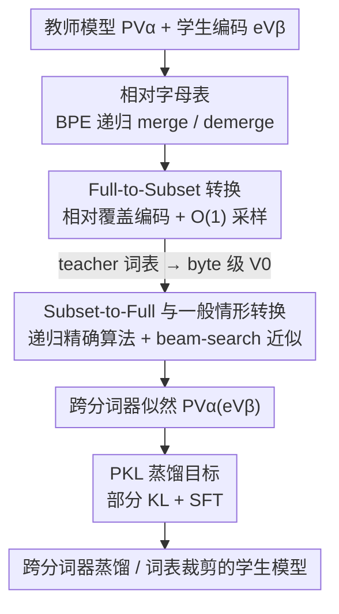

# Cross-Tokenizer Likelihood Scoring Algorithms for Language Model Distillation

**会议**: ICLR2026  
**OpenReview**: [https://openreview.net/forum?id=hD69qj15Os](https://openreview.net/forum?id=hD69qj15Os)  
**代码**: https://github.com/truongbuu/cross-tokenizer-scoring  
**领域**: 模型压缩 / 知识蒸馏  
**关键词**: 跨分词器蒸馏, BPE, 似然评分, 词表裁剪, 相对字母表

## 一句话总结
本文挖掘 BPE 分词的递归 merge 结构，提出"相对字母表"框架，让教师模型能在与自己分词器不同的学生词表上算出精确的序列似然，从而把经典 KL 蒸馏直接搬到跨分词器场景，在 GSM8K 蒸馏上比 SOTA 高 2%+、在词表裁剪上省 12% 显存的同时还涨点。

## 研究背景与动机
**领域现状**：蒸馏、RLHF、偏好优化等先进训练范式都依赖"算两个模型之间的 next-token 似然比"。经典做法（Hinton 蒸馏）让学生去对齐教师的 next-token 分布，比用人工标签做 SFT 能拿到更丰富、更样本高效的训练信号。

**现有痛点**：算似然比要求两个模型共享同一个概率空间，也就是同一套词表。可现实里教师和学生常常用不同的分词器——典型场景是边缘部署要把词表缩小以降内存，于是学生用了更小甚至 byte 级的词表。词表一旦不对齐，"该用什么目标替代 next-token 分布间的散度最小化"就变得不清楚了。

**核心矛盾**：不对齐不仅出现在输出空间，还藏在输入空间里——这就是 **tokenization bias**。举个例子：用 Llama3 当教师，输入 `111+11=12` 被切成 `[111,+,11,=,12]`，由于 `122` 在 Llama3 里是单个 token，序列 `[12,2]` 在合法编码下永远不可能出现，教师因此绝不会把 `2` 当下一个 token。可如果学生用 byte 级分词器，它会以为 `2` 是合法续接，于是收到的训练信号是错的、性能被拉低。换句话说，朴素地把教师 token 概率连乘到学生编码上会算出非零概率，但这个编码其实是非法（non-canonical）的，真实概率应当是 0。

**现有方案的缺陷**：当前跨分词器蒸馏要么往 logit 空间塞 Wasserstein / 最优传输这类辅助损失（ULD、DSKD），要么靠序列对齐去近似边缘概率（ALM）。这些组件都引入额外超参、偏离了 KL 最小化的简洁性，且要么对 logit 表示下强假设，要么是启发式近似。

**本文目标**：不加辅助组件、不改 KL 框架，直接把教师评分模型"重新对齐"到学生词表上，恢复经典的 next-token 散度最小化 / 似然比问题。作者把这个过程叫 **cross-tokenizer scoring（转换 / conversion）**。

**切入角度**：从随机分析的视角重新审视 BPE。作者发现广泛部署的 BPE 算法里藏着一个隐式递归结构——任何"子集词表"都可以被当成完整词表的一个中间字母表（relative alphabet）。顺着这个结构，merge/demerge 操作让"在不同词表间换算似然"变成可计算的。

**核心 idea**：用 BPE 的 merge/demerge 递归结构，把"在词表 $V_\beta$ 上给教师 $P_{V_\alpha}$ 评分"分解成两步——先把教师转成 byte 级模型（Full-to-Subset），再从 byte 级递归构造到目标词表（Subset-to-Full），从而对任意一对共享 UTF-8 字母表的 BPE 词表算出精确（lossless）似然。

## 方法详解

### 整体框架
方法要解决的核心问题是：给定一个在固定词表 $V_\alpha$ 上训练的语言模型 $P_{V_\alpha}$，以及一段用另一套词表 $V_\beta$ 编码的序列 $\vec{e}_{V_\beta}$，如何算出 $P_{V_\alpha}(\vec{e}_{V_\beta})$，即"该模型给这段异构编码前缀分配多少概率"。形式化定义为：从 $P_{V_\alpha}$ 自回归采样到 EOS 得到 token 序列，解码成底层字节串 $\vec{x}$，再用 $V_\beta$ 重新编码，问其以 $\vec{e}_{V_\beta}$ 为前缀的概率。

整体转换被拆成两个方向、再拼成一般情形：① **Full-to-Subset**——把训练于完整词表 $V_M$ 的模型转成在子集词表 $V_{M'}$（特别是 byte 级 $V_0$）上的等价模型；② **Subset-to-Full**——把 byte 级模型再递归构造到目标词表 $V_\beta$。两者复合（$V_\alpha \to V_0 \to V_\beta$）就能在任意两个共享基础字母表的 BPE 词表间转换。算出似然后，再套一个部分 KL（PKL）蒸馏目标，把这个跨分词器分数用于训练学生。

### 关键设计

**1. 相对字母表：把"子集词表"看成完整词表的中间字母表**

要在不同词表间换算似然，第一步得有一套能"在词表之间来回走"的语言。BPE 词表 $V_M = \{a_0,\dots,a_{|A|}, t_1,\dots,t_M\}$ 是从基础字母表 $A$ 出发、按 merge 顺序逐步加入合并 token 构造的，每个 $t_i = t_i^{\text{left}} \cdot t_i^{\text{right}}$ 都由更早的两个 token 拼成。作者观察到：取前 $M'$ 个合并 token 得到的截断词表 $V_{M'} \preceq V_M$，可以被当作 $V_M$ 的一个"相对字母表"。

在这个视角下，编码 $\text{encode}(\cdot)$ 就是一串 merge 操作、解码 $\text{decode}(\cdot)$ 就是一串 demerge 操作。于是从 $V_{M'}$ 的编码换到 $V_M$ 的编码，不必绕回字符串 $s$ 再重编码，而是直接续做 merge：$\text{encode}_{M'\to M}(\vec{e}_{V_{M'}}) = \text{merge}_M \circ \cdots \circ \text{merge}_{M'+1}(\vec{e}_{V_{M'}})$；反向则续做 demerge。这一抽象是整套算法的地基——它把"跨词表似然换算"统一成"在 merge 链上前进 / 后退几步"。相比之下，先前工作（Phan et al., 2025）只能从完整词表转到 byte 级字母表 $A$，本文把它推广到任意一对子集词表。

**2. Full-to-Subset 转换：用相对覆盖编码做精确边缘化，O(1) 采样**

有了相对字母表，第一类转换是把完整词表上的模型 $P_{V_M}$ 降到子集 $V_{M'}$（极端情形 $V_0$ 即 byte 级）。难点是：$V_{M'}$ 上一个合法编码 $\vec{e}_{V_{M'}}$ 在 $V_M$ 下可能对应多种"覆盖"它的更粗编码。作者把先前工作的 cover encoding 推广为**相对覆盖编码** $\text{cover}_{M'\to M}(\vec{e}_{V_{M'}})$，即所有 $V_M$ 上、其末 token 恰好"盖住" $\vec{e}_{V_{M'}}$ 某处之后的合法编码集合。于是 Lemma 1 给出精确边缘化：

$$P(\vec{e}_{V_{M'}}) = \sum_{\vec{e}_{V_M} \in \mathcal{C}} P(\vec{e}_{V_M}), \quad \mathcal{C} = \text{cover}_{M'\to M}(\vec{e}_{V_{M'}}).$$

这个集合可以靠合法编码条件 $\vec{e}=\text{encode}(\text{decode}(\vec{e}))$ 在 $O(|\vec{e}_{V_{M'}}|)$ 线性时间内枚举出来。更关键的是，因为它和 byte 级转换共享同样的边缘化结构，next-token 采样可以做到 **$O(1)$ 次模型前向**（而非随候选数线性增长）。这正好直接服务于"词表裁剪"——把大词表 LM 的语言建模头缩小、降显存，同时还能算出裁剪后词表上的精确分布。

**3. Subset-to-Full 与一般情形转换：递归精确算法 + beam-search 近似**

反方向（子集 → 完整，如 byte 级 $V_0$ → 目标 $V_\beta$）更棘手：朴素做法要对"所有以目标前缀编码开头的任意长字符串"求和，没有先验停止界。作者再次利用顺序解码结构，给出一个**有限时间的精确递归**。核心是逐个 merge 步骤地换算：设在 $V_{M'+1}$ 上的编码 $\vec{e}_{V_{M'+1}}$，看它的末 token 是否等于新合并 token 的左半 $t_{M'+1}^{\text{left}}$——

- 若 $\vec{e}_{V_{M'+1}}[-1] \neq t_{M'+1}^{\text{left}}$，覆盖集大小为 1，直接 $P_{M'}(\vec{e}_{V_{M'+1}}) = P_{M'}(\vec{e}_{V_{M'}})$；
- 若相等，则除了它自己还有 $t_{M'+1}$ 也能盖住它，需做差分：$P_{M'}(\vec{e}_{V_{M'+1}}) = P_{M'}(\vec{e}_{V_{M'}}) - P_{M'}(\vec{e}_{V_{M'}} \cdot t_{M'+1}^{\text{right}})$。

按此递归（Algorithm 1）保证有限步终止，但最坏开销是 $O(\exp(M-M'))$ 次 $P_{M'}$ 评估，词表一大就不可行。作者的解法是：因为训练好的 LM 把概率质量集中在少数候选上、且绝大多数叶子编码语义/句法上不合理、概率趋零，于是用 **beam search 剪枝**只保留高概率续接、再结合 pre-tokenization 模式过滤。实测一次 next-token 评估约展开 6 条 beam、平均长 10、耗时约 0.5 秒，近似与真值的 RMSE 仅 0.015。一般情形就把"教师 $V_\alpha \to$ byte 级 $V_0$"（设计 2，精确 $O(1)$）和"$V_0 \to$ 目标 $V_\beta$"（本设计，递归 + 近似）复合起来。

**4. PKL 蒸馏目标：用部分 KL 把跨分词器分数喂给学生**

算出跨分词器似然后，怎么用于蒸馏？由于 beam search 实际只能拿到少数（1~5 个）token 的概率（ground-truth、学生 top-1，外加几个 beam 候选），不可能算完整的 forward KL。作者因此用**部分 KL（PKL）**：只在这 1~5 个可用 token 的概率上做 KL 对齐，再以权重 $\omega$ 和 SFT 项 $(1-\omega)$ 混合，总损失 $\omega \cdot \text{PKL} + (1-\omega)\cdot \text{SFT}$。为省训练算力，教师推理离线完成、把软标签存下来（蒸馏实验存 7,500 例；词表裁剪存 top-$K$、$K=20$）。这个目标的妙处在于它**严格泛化了 ALM**：当 ALM chunk size 取 1 且做到（近）完美去偏时本方法退化为 ALM，但本方法额外利用了非 ground-truth token 的概率信息，因此更强。

### 损失函数 / 训练策略
蒸馏损失为 $\mathcal{L} = \omega \cdot \text{PKL} + (1-\omega)\cdot \text{SFT}$。GSM8K 跨分词器蒸馏取 $\omega \in \{0.0, 0.8, 1.0\}$（纯 SFT / 验证选出的混合 / 纯 PKL），端到端训练（不用 LoRA），batch size 64、学习率 $5\times 10^{-6}$。词表裁剪实验先在 Alpaca（约 5 万条指令）上用 Qwen2.5-7B 当教师 warm-up 一个 epoch，再在 GSM8K 训练集上用 Qwen2.5-Math-7B 蒸馏两个 epoch（编码任务则用 OPC 数据 + Qwen2.5-Coder-7B），$\omega=0.8$。

## 实验关键数据

### 主实验
GSM8K 跨分词器蒸馏：教师 Qwen2.5-Math-7B-Instruct、学生 Gemma-2-2B-Instruct（特意选词表几乎不重叠的一对）。

| 方法 | GSM8K 5-shot Acc |
|------|------|
| Gemma2-2B-Instruct（学生起点） | 52.3 |
| Qwen2.5-Math-7B-Instruct（教师） | 88.4 |
| SFT | 47.9 |
| ULD | 47.1 |
| DSKD | 51.5 |
| ALM（前 SOTA） | 53.2 |
| ALM + SFT | 53.5 |
| **PKL（本文）** | **54.6** |
| **SFT + PKL（本文）** | **55.6** |

本文 SFT+PKL 比前 SOTA ALM+SFT 高 2.1 个点，比纯 SFT 高近 8 个点。

### 消融 / 分析实验
词表裁剪（Qwen2.5-1.5B-Instruct，原词表 151,643，截断到前 16k/32k/64k 合并）。下表为各任务最佳列（本文 FKL，w/ SFT）：

| Vocab | GSM8K 4-shot | HumanEval | MBPP | 省显存 |
|-------|------|------|------|------|
| 16k | 60.4 | 46.4 | 41.4 | 13.5% |
| 32k | 63.0 | 47.6 | 41.4 | 12.0% |
| 64k | 62.8 | 51.2 | 46.4 | 9% |
| Full Vocab | 63.2 | 52.4 | 43.4 | 0% |

| 配置 | 关键现象 | 说明 |
|------|---------|------|
| 32k FKL+SFT | GSM8K 比原模型涨近 5%、比 SFT 高约 9% | 裁剪一半词表反而涨点 |
| beam-search 近似 | RMSE = 0.015 | ~6 beam、均长 10、约 0.5s/token |
| 纯 SFT (ω=0) | 普遍弱于 FKL | 缺少教师软标签的对齐信号 |

### 关键发现
- **裁剪词表还能涨点**：32k 变体在省 ~12% 显存的同时，GSM8K 比满词表原模型还高——因为蒸馏让学生在缩小的词表上重新分配概率质量，对齐目标本身带来增益。
- **本方法严格泛化 ALM**：在 ALM chunk size=1、近完美去偏时退化为 ALM，但额外用上非 ground-truth token 的概率，所以一致更强。
- **近似几乎无损**：beam-search 近似与精确 byte 级真值 RMSE 仅 0.015，验证了"高概率续接主导、低概率叶子可剪"的假设。

## 亮点与洞察
- **把分词器不对齐转化为纯结构问题**：作者不靠 logit 对齐或序列对齐这类启发式，而是直接从 BPE 的 merge/demerge 递归结构推出精确似然，回到了干净的 KL 框架——这是"第一性原理"式的解法，少了一堆超参。
- **相对字母表是可复用的抽象**：把"子集词表 = 完整词表的中间字母表"这一观察形式化后，编码/解码统一成 merge 链上的前进/后退，任何跨 BPE 词表的换算都能套这套语言，迁移到 cross-tokenizer 偏好优化、tokenization adaptation 等问题都顺理成章。
- **精确 + 近似两手都有**：subset 情形给精确 $O(1)$ 采样（适合词表裁剪），一般情形给"理论无损递归 + 工程可用 beam-search 近似"，把"严谨"和"能跑"分层解决，是很实用的工程哲学。

## 局限与展望
- **一般情形开销大**：Subset-to-Full 精确递归最坏 $O(\exp(M-M'))$，必须靠 beam-search 剪枝才实用；一次 next-token 评估约 0.5 秒，且只能拿到查询 token 的概率而非整个子词表分布，作者也把"优化时间/显存、增强剪枝"列为未来工作。
- **依赖合法编码假设**：全文假设 LM 总输出 canonical 编码、且两套词表共享同一 UTF-8 基础字母表——对非 BPE 分词器或基础字母表不同的情形不直接适用。
- **蒸馏只用了少数 token 概率**：受 beam-search 限制，PKL 只对 1~5 个 token 做对齐，理论上比完整 forward KL 信息更少；若能高效拿到更多候选概率，蒸馏信号还有提升空间。

## 相关工作与启发
- **vs Phan et al. (2025)**：他们只能把完整词表 LM 转成 byte 级模型（$V \to A$）；本文把覆盖编码推广为相对覆盖编码，支持任意子集词表 $V_i \preceq V_M$ 之间的转换，并进一步拼出任意 BPE 词表对的转换。
- **vs ULD / DSKD（最优传输派）**：他们在 logit 空间用 Wasserstein / 最优传输对齐教师学生分布，对 logit 表示下强假设；本文不碰 logit，直接算精确序列似然。
- **vs ALM / 序列对齐派（Minixhofer et al.）**：他们靠序列对齐近似边缘概率、是启发式；本文从第一性原理推精确似然，并在极限情形严格泛化 ALM，GSM8K 上高 2%+。

## 评分
- 新颖性: ⭐⭐⭐⭐⭐ 从 BPE 递归结构推出"相对字母表"，把跨分词器似然换算化为结构问题，角度新且自洽
- 实验充分度: ⭐⭐⭐⭐ 覆盖蒸馏 + 词表裁剪、多任务多词表规模，但缺更大模型/更多教师学生组合的规模化验证
- 写作质量: ⭐⭐⭐⭐ 形式化严谨、例子层层递进，但数学密度高、对不熟 tokenization bias 的读者门槛较陡
- 价值: ⭐⭐⭐⭐⭐ 边缘部署裁词表 + 跨分词器蒸馏都是刚需，方法即插、无额外超参，落地价值高

<!-- RELATED:START -->

## 相关论文

- [\[NeurIPS 2025\] Universal Cross-Tokenizer Distillation via Approximate Likelihood Matching](../../NeurIPS2025/model_compression/universal_cross-tokenizer_distillation_via_approximate_likelihood_matching.md)
- [\[AAAI 2026\] CTPD: Cross Tokenizer Preference Distillation](../../AAAI2026/model_compression/ctpd_cross_tokenizer_preference_distillation.md)
- [\[ICLR 2026\] Boomerang Distillation Enables Zero-Shot Model Size Interpolation](boomerang_distillation_enables_zero-shot_model_size_interpolation.md)
- [\[ICLR 2026\] UniFlow: A Unified Pixel Flow Tokenizer for Visual Understanding and Generation](uniflow_a_unified_pixel_flow_tokenizer_for_visual_understanding_and_generation.md)
- [\[ICLR 2026\] Pedagogically-Inspired Data Synthesis for Language Model Knowledge Distillation](pedagogically-inspired_data_synthesis_for_language_model_knowledge_distillation.md)

<!-- RELATED:END -->
