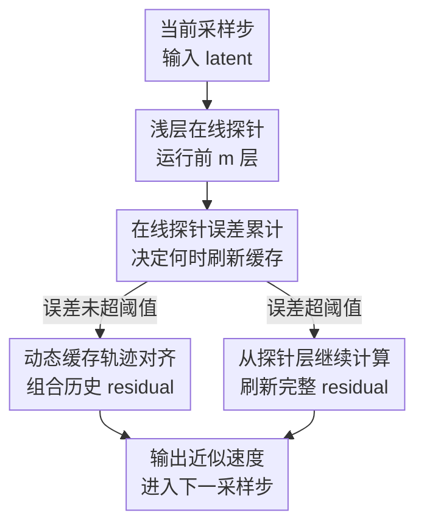

# DiCache: Let Diffusion Model Determine Its Own Cache

**会议**: ICLR 2026  
**OpenReview**: [https://openreview.net/forum?id=kflYZjGumW](https://openreview.net/forum?id=kflYZjGumW)  
**论文**: [项目页](https://bujiazi.github.io/dicache.github.io/)  
**代码**: https://github.com/Bujiazi/DiCache  
**领域**: 模型压缩 / 扩散模型加速  
**关键词**: 扩散模型缓存, DiT推理加速, 训练无关加速, 在线探针, 特征复用  

## 一句话总结
DiCache 提出一种训练无关的扩散模型自适应缓存策略，让 DiT 在推理时用浅层在线探针自己判断何时复用缓存、如何组合历史缓存，在 WAN 2.1、HunyuanVideo 和 Flux 上同时提升速度与生成结果相对原始模型的保真度。

## 研究背景与动机
**领域现状**：扩散模型，尤其是以 Diffusion Transformer (DiT) 为骨干的图像和视频生成模型，已经成为高质量视觉生成的主流路线。问题也随之变得很直接：模型层数更深、参数更多、视频帧数更长以后，每个采样步都完整跑一遍 DiT 的代价非常高。训练式加速需要额外数据和训练成本，求解器、蒸馏、稀疏注意力、量化等路线各有适用范围；缓存式加速则因为不改权重、部署轻量，成为近年很活跃的一类方法。

**现有痛点**：缓存方法本质上是在相邻采样步之间复用中间特征或残差，但它有两个必须回答的问题：第一，什么时候可以放心跳过完整计算；第二，跳过时应该怎样使用缓存。已有方法往往用固定间隔、离线拟合的经验函数、数据集级先验，或者 Taylor 展开式的手工规则来做这些决策。这类规则在平均样本上可能有效，但扩散采样是高度动态的：不同 prompt、不同随机种子、不同模型和不同时间段的特征变化都不一样，统一的经验律很容易在个别样本上过度复用或复用不足。

**核心矛盾**：最理想的缓存决策应该看当前样本在当前采样步的模型输出变化，也就是知道完整模型输出 $y_t$ 和 $y_{t+1}$ 差了多少；但如果为了判断是否能跳过而先把完整模型跑完，缓存就失去意义。于是矛盾变成：能不能用极低成本获得足够可靠的动态信号，让模型在运行时自己感知“现在该不该复用”。

**本文目标**：作者把问题拆成两层。第一层是 “when to cache”：用一个便宜的在线指标估计缓存误差，从而给每个样本定制缓存调度。第二层是 “how to use cache”：当决定复用时，不只是机械地拿最近一次缓存，而是利用多步历史缓存更准确地逼近当前残差。

**切入角度**：论文的关键观察来自 DiT 内部特征轨迹。作者发现，对同一个采样过程，浅层特征差分的变化趋势与深层/最终输出差分高度相关；同时，不同层的残差轨迹也呈现相似形状。这意味着浅层前几层不只是“预处理”，还可以作为扩散动态的在线探针，用很小的额外计算成本给缓存策略提供实时反馈。

**核心 idea**：用浅层在线探针替代离线经验规则，让扩散模型在每个采样步先感知自身特征变化，再决定是否复用缓存，并用探针轨迹指导多步缓存的动态对齐。

## 方法详解

### 整体框架
DiCache 是一个 plug-and-play、训练无关的 DiT 缓存加速框架。它不改变模型权重，也不需要为特定数据集拟合额外预测器；在每个采样步，它先运行前 $m$ 个浅层 DiT block 得到 probe feature，再用这个 probe 同时服务两个决策：累计估计缓存误差来决定是否刷新缓存，用 probe residual 的轨迹来估计当前完整 residual 应该如何由历史缓存组合得到。

从输出形式看，DiCache 缓存的不是某个注意力矩阵，而是模型残差 $r_t = y_t - x_t$。如果当前步选择复用，就用 $y_t = x_t + r_t$ 近似完整模型输出；如果累计误差超过阈值，就从已经算过的浅层 probe 处继续跑剩余深层，刷新缓存，因此需要完整计算的采样步不会浪费 probe 成本。

### 关键设计
**1. 浅层在线探针：用便宜的浅层差分估计昂贵的输出变化**

缓存调度最想知道的是相邻采样步完整模型输出的相对变化。论文把理想缓存误差写成 $\epsilon_{t,t+1}=L1_{rel}(y_t,y_{t+1})=\frac{\lVert y_t-y_{t+1}\rVert_1}{\lVert y_{t+1}\rVert_1}$，其中 $y_t$ 是完整 DiT 输出。这个量越小，说明当前步和相邻步输出越接近，复用缓存越安全；越大，则说明扩散动态发生了明显变化，需要重新计算。

困难在于，完整 $y_t$ 本身很贵。DiCache 的观察是，浅层输出 $y_t^m$ 的相邻步差分 $L1_{rel}(y_t^m,y_{t+1}^m)$ 与完整输出差分在同一样本上具有很强相关性；论文的统计中，即使 probe depth 只有 $m\in[1,3]$，Spearman 相关系数也已经接近 $0.8$。因此 DiCache 在每个采样步只先跑前 $m$ 层，将 $\hat{\epsilon}_{t,t+1}=L1_{rel}(y_t^m,y_{t+1}^m)$ 作为实时缓存误差指标。它比输入 latent 的差分更有判别力，因为输入差分往往随时间单调变化，不能反映输出动态的局部起伏；它也比离线经验函数更稳，因为每一步都来自当前样本自己的内部特征。

**2. 累计误差调度：把“何时缓存”变成样本级运行时决策**

有了单步估计误差以后，DiCache 不直接用固定间隔跳步，而是维护一个累计误差 $\Sigma_{error}$。当某一步完整计算并缓存残差后，后续每个采样步都运行浅层 probe，并把 $\hat{\epsilon}_{t,t+1}$ 加到累计量里；只要 $\Sigma_{error}\le\delta$，就认为从上次刷新到当前步的累积偏差仍在可接受范围内，可以继续复用缓存；一旦超过用户设定阈值 $\delta$，就从第 $m$ 层以后继续完整计算，得到新的 $y_t$ 和 residual $R=y_t-x_t$，随后清零累计误差。

这个设计的好处是，缓存间隔不再是预先写死的。平稳片段中，模型会自动连续复用更久；动态变化剧烈的片段中，probe 误差会更快累积到阈值，触发刷新。阈值 $\delta$ 也有清晰语义：它控制质量和速度的 trade-off。更小的 $\delta$ 会更频繁重算、质量更接近 vanilla；更大的 $\delta$ 会带来更高加速但可能增加偏差。论文在主实验中对 WAN 2.1、HunyuanVideo、Flux 分别使用 $\delta=0.2,0.1,0.4$，probe depth 都设为 $m=1$，说明作者更强调用极浅探针换取部署效率。

**3. 动态缓存轨迹对齐：用 probe residual 指导多步历史缓存怎么组合**

只回答“何时复用”还不够，因为复用时如果总是直接拿最近一次缓存 residual，会把当前步的特征运动趋势压扁成零阶近似。DiCache 的第二个观察是，浅层 residual $r_t^m=y_t^m-x_t$ 与完整 residual $r_t=y_t-x_t$ 在特征轨迹上形状相似。换句话说，浅层 probe 不仅能告诉模型“现在变化大不大”，还能告诉它“当前 residual 大概沿着历史 residual 的哪条方向移动”。

论文选取最近两次完整重算的时间步 $t_\alpha$ 和 $t_\beta$，其中缓存了完整 residual $r_{t_\alpha}$ 与 $r_{t_\beta}$。当前 residual 被写成一阶轨迹近似 $r_t=r_{t_\beta}+\gamma_t(r_{t_\alpha}-r_{t_\beta})$。真正的 $\gamma_t$ 在不跑完整模型时未知，但 probe residual 在每个采样步都已经算出来，所以可以在浅层空间直接解一个对应的轨迹参数：$\hat{\gamma}_t=\frac{L1_{rel}(r_t^m,r_{t_\beta}^m)}{L1_{rel}(r_{t_\alpha}^m,r_{t_\beta}^m)}$。然后用 $\hat{\gamma}_t$ 替代完整空间里的 $\gamma_t$，得到 $r_t=r_{t_\beta}+\hat{\gamma}_t(r_{t_\alpha}-r_{t_\beta})$。

这个步骤就是 Dynamic Cache Trajectory Alignment (DCTA)。它和 TaylorSeer 这类手工 Taylor 预测的区别在于，DCTA 的系数不是固定规则给出的，而是由当前样本当前采样步的 probe residual 轨迹在线估出来。直观上，如果浅层 residual 显示当前点更靠近较新的缓存，就少借用旧缓存；如果显示轨迹已经向两次缓存之间的方向延伸，就按比例利用历史 residual。论文的可视化显示，DCTA 能更好保留人物身份、纹理和视频运动细节。

**4. 重算续接机制：让 probe 成本真正变成可复用计算**

一个容易被忽略但很关键的实现细节是：DiCache 每步都跑前 $m$ 层 probe，看起来会引入额外开销；但当某一步需要完整重算时，模型不是从第 1 层重新开始，而是直接从已经得到的 $y_t^m$ 继续跑第 $m+1$ 到第 $M$ 层。这意味着 probe 在刷新缓存的步上不是额外浪费，而是完整前向的一部分。

这一点决定了 DiCache 的实际效率。论文附录报告，Flux 上 probe cost 约为 $0.19$s，占 DiCache 总推理时间 $4\%$；WAN 2.1-1.3B 上为 $3.98$s，占 $5\%$；HunyuanVideo 上为 $11.47$s，占 $2\%$。由于 DiT 通常层数较深，而实验中 $m=1$，浅层探针带来的额外负担相对可控，换来的则是样本级缓存调度和更准确的缓存组合。

### 一个完整示例
以 HunyuanVideo 的一次 50 步视频生成为例，DiCache 第一步必须完整计算，得到完整输出 $y_T$，并缓存 residual $R=y_T-x_T$。从第二个采样步开始，它只先跑第 1 个 DiT block 得到 $y_t^1$，计算与前一步 probe feature 的相对差分，并把这个差分加入 $\Sigma_{error}$。

如果当前 prompt 对应的视频运动比较平稳，例如背景缓慢移动、主体姿态变化小，那么连续几步的 probe 差分都较低，$\Sigma_{error}$ 迟迟没有超过 $\delta=0.1$。这几步就不再跑完整 HunyuanVideo DiT，而是用历史 residual 近似当前输出，其中 DCTA 会根据 probe residual 的位置在两次历史 residual 之间动态调整组合系数。等到画面出现大动作、镜头切换或纹理细节明显变化时，probe 差分变大，累计误差越过阈值，DiCache 继续跑剩余层刷新 residual。这样，一个样本内部的缓存间隔会随扩散动态自动伸缩，而不是始终每隔两步或三步固定刷新。

### 损失函数 / 训练策略
DiCache 没有训练损失，也不需要微调扩散模型。它的全部超参数主要是 probe depth $m$ 和 reuse threshold $\delta$。$m$ 决定每步探针前向的层数，越大估计更准但越慢；$\delta$ 决定缓存误差容忍度，越大速度越快但质量风险越高。论文主实验统一采用 $m=1$，并为不同模型选取小范围阈值；附录建议新模型可以在 $\delta\in[0.1,0.5]$ 内做一维扫描，步长 $0.05$ 或 $0.1$，用少量样本校准质量和速度平衡。

## 实验关键数据

### 主实验
论文在三个代表性 DiT 生成模型上验证 DiCache：WAN 2.1-1.3B 和 HunyuanVideo 用于视频生成，Flux.1.0-dev 用于图像生成。评价集包括 300 个高质量视频 prompt 和 1000 个 LAION-5B 图像 caption。效率指标是 speedup 和 latency，保真度指标是相对原始 vanilla 输出的 LPIPS、SSIM、PSNR。

| 模型 | 方法 | LPIPS↓ | SSIM↑ | PSNR↑ | Speedup↑ | Latency↓ |
|------|------|--------|-------|-------|----------|----------|
| WAN 2.1 | TeaCache-fast | 0.2161 | 0.8226 | 20.97 | 2.20× | 87.58s |
| WAN 2.1 | EasyCache | 0.2013 | 0.8562 | 24.80 | 2.21× | 86.96s |
| WAN 2.1 | DiCache | 0.1734 | 0.8885 | 26.45 | 2.45× | 78.42s |
| HunyuanVideo | TeaCache-fast | 0.2898 | 0.8015 | 22.01 | 2.20× | 538.49s |
| HunyuanVideo | EasyCache | 0.1558 | 0.9270 | 30.71 | 2.12× | 558.71s |
| HunyuanVideo | DiCache | 0.1492 | 0.9396 | 32.79 | 2.34× | 507.24s |
| Flux | TaylorSeer | 0.4709 | 0.6721 | 16.63 | 3.13× | 4.83s |
| Flux | EasyCache | 0.3049 | 0.7527 | 19.75 | 2.49× | 6.06s |
| Flux | DiCache | 0.2704 | 0.8211 | 22.39 | 3.22× | 4.69s |

这组结果的重点不是单纯追求最高 speedup，而是速度和保真度一起看。WAN 2.1 上，DiCache 比 TeaCache-fast 和 EasyCache 都更快，同时 LPIPS 更低、SSIM/PSNR 更高。HunyuanVideo 上，TaylorSeer 在单张 A800 80GB 上 OOM，DiCache 则在 2.34× 加速下保持最好的 LPIPS、SSIM 和 PSNR。Flux 上，TaylorSeer 速度接近 DiCache，但相对原始输出偏差很大；DiCache 既达到 3.22× speedup，又保持更好的保真度。

### 消融实验
| 配置 | LPIPS↓ | SSIM↑ | PSNR↑ | Speedup↑ | 说明 |
|------|--------|-------|-------|----------|------|
| Probe depth $m=5$ | 0.1367 | 0.9495 | 33.47 | 2.10× | 更深探针质量最好，但速度较慢 |
| Probe depth $m=3$ | 0.1397 | 0.9472 | 33.30 | 2.20× | 质量略降，速度提升 |
| Probe depth $m=1$ | 0.1492 | 0.9396 | 32.79 | 2.34× | 主实验选择，效率最高且质量仍好 |
| Threshold $\delta=0.05$ | 0.1047 | 0.9584 | 35.45 | 1.76× | 最保守，接近原始输出但加速较低 |
| Threshold $\delta=0.10$ | 0.1492 | 0.9396 | 32.79 | 2.34× | HunyuanVideo 主设置 |
| Threshold $\delta=0.20$ | 0.1886 | 0.8980 | 29.81 | 2.90× | 更激进，速度更快但质量下降 |
| w/o DCTA | 0.1517 | 0.9314 | 31.98 | 2.34× | 只做缓存调度，不做轨迹对齐 |
| w/ DCTA | 0.1492 | 0.9396 | 32.79 | 2.34× | 保持同等速度，提升保真度 |

### 关键发现
- 浅层探针深度并不需要很大。$m=1$ 已经能支撑 2.34× speedup 和较高保真度，说明浅层动态信号足够强；更深探针主要是在质量上继续逼近 vanilla，但会牺牲速度。
- $\delta$ 是最直接的质量-效率旋钮。HunyuanVideo 上从 $\delta=0.05$ 到 $0.20$，speedup 从 1.76× 提到 2.90×，但 LPIPS 从 0.1047 变到 0.1886，说明复用更激进时偏差会明显增加。
- DCTA 的收益看似数值不大，但方向稳定：在同样 2.34× speedup 下，SSIM 从 0.9314 提到 0.9396，PSNR 从 31.98 提到 32.79。它解决的是“复用时怎么更像原始轨迹”，对纹理、身份和视频运动细节尤其重要。
- DiCache 可以叠加其他加速技术。与 Sparse VideoGen 结合时，HunyuanVideo 的 speedup 从 SVG 单独的 1.67× 提到 3.08×；与 AccVideo 蒸馏版 WAN 2.1-14B 结合时，也能在 10 步采样设置下进一步达到 1.56× speedup。

## 亮点与洞察
- 这篇论文最巧妙的地方是把缓存调度从“外部规则”改成“模型自感知”。浅层 probe 并不是额外训练出来的判别器，而是原模型前几层自然产生的特征，所以它对不同 prompt 和不同模型的迁移性更好。
- DiCache 对 “when” 和 “how” 的统一处理很干净。很多缓存方法只回答什么时候跳过，或者只改缓存组合方式；DiCache 用同一个在线 probe 既估计误差，又估计轨迹参数，减少了方法内部的规则拼接感。
- DCTA 的视角很有启发：缓存不一定只是“拿最近一次结果顶上”，也可以把历史缓存看成特征轨迹上的几个锚点，再用便宜信号估计当前位置。这种想法可以迁移到其他迭代式生成或推理过程，例如 autoregressive video generation 中的跨步状态复用。
- 论文的实验覆盖了图像和视频、不同规模模型、稀疏注意力和蒸馏组合，说明它不是只针对某个单一 backbone 调参出来的 trick。尤其 HunyuanVideo 上 TaylorSeer OOM 而 DiCache 正常运行，体现了 residual 级轻量缓存的实用性。
- 从系统角度看，DiCache 的“从 probe 层续接完整计算”是一个非常务实的实现点。否则每步 probe 会像额外税一样侵蚀加速收益；续接机制让 probe 在重算步上自然成为完整前向的一部分。

## 局限与展望
- DiCache 仍然需要每个采样步运行浅层 probe。虽然论文报告 probe cost 占总时间比例较低，但在极浅、极少步或已经高度优化的模型上，这个开销可能更明显。
- 阈值 $\delta$ 仍需要按模型校准。作者给出了推荐扫描范围，但新模型、新分辨率、新采样步数下，用户仍然要在质量和速度之间重新选点。
- 当前 DCTA 主体采用一阶历史缓存组合。附录中的高阶扩展在 Flux 上收益有限，还会增加显存占用；这说明更复杂的多历史缓存并不总是划算，未来可能需要自适应选择 cache order。
- 实验主要评估相对 vanilla 输出的相似度，而不是人类偏好或任务成功率。对创意生成来说，有时偏离 vanilla 不一定差；但作为“无损/近似无损加速”方法，本文选择 LPIPS/SSIM/PSNR 是合理的，只是不能完全代表用户主观质量。
- 方法假设浅层和深层特征轨迹在 DiT 中有稳定相关性。论文在 WAN、HunyuanVideo、Flux 上验证充分，但对非 DiT 架构、强条件控制模型或特殊注意力结构，仍需要更多验证。

## 相关工作与启发
- **vs TeaCache**: TeaCache 用离线数据校准的多项式估计器来预测输出变化，优点是简单，问题是依赖数据集级先验。DiCache 用当前样本的浅层 probe 在线估计变化，更能适应 prompt 和采样过程的局部动态。
- **vs EasyCache**: EasyCache 用经验 transformation rate law 替代 TeaCache 的多项式函数，减少了离线拟合依赖，但仍然偏规则化。DiCache 的调度信号直接来自模型内部浅层特征，因此在不同模型和样本上的泛化更自然。
- **vs TaylorSeer**: TaylorSeer 关注多步缓存的预测利用，用类似 Taylor 展开的手工方式增强细节，但可能带来显存压力和与原始结果的偏离。DiCache 的 DCTA 也利用多步缓存，但系数来自 probe residual 轨迹，在实验中更好地平衡了速度、显存和保真度。
- **vs Sparse VideoGen / AccVideo**: SVG 和 AccVideo 分别属于稀疏注意力和蒸馏/少步生成路线，改变的是注意力计算或采样模型本身；DiCache 是推理时 residual 缓存策略，可以叠加在这些技术之上，因此更像一层通用加速插件。

## 评分
- 新颖性: ⭐⭐⭐⭐⭐ 把浅层在线 probe 同时用于缓存时机和缓存轨迹对齐，问题定义清楚，区别于经验调度和手工预测规则。
- 实验充分度: ⭐⭐⭐⭐⭐ 覆盖三个主流 DiT 生成模型、图像与视频、主实验、消融、兼容性和 probe cost 分析，证据链比较完整。
- 写作质量: ⭐⭐⭐⭐☆ 论文主线清晰，图 2 的方法结构直观；但部分公式符号和采样时间方向对读者不够友好，需要结合算法细读。
- 价值: ⭐⭐⭐⭐⭐ 对扩散模型部署很实用，尤其适合希望在不重训模型的情况下给 DiT 图像/视频生成加速的场景。

<!-- RELATED:START -->

## 相关论文

- [\[NeurIPS 2025\] Graph Your Own Prompt](../../NeurIPS2025/model_compression/graph_your_own_prompt.md)
- [\[ICLR 2026\] Q&C: When Quantization Meets Cache in Efficient Generation](qc_when_quantization_meets_cache_in_efficient_generation.md)
- [\[ICLR 2026\] Diffusion Models as Dataset Distillation Priors](diffusion_models_as_dataset_distillation_priors.md)
- [\[ICLR 2026\] LookaheadKV: Fast and Accurate KV Cache Eviction by Glimpsing into the Future without Generation](lookaheadkv_fast_and_accurate_kv_cache_eviction_by_glimpsing_into_the_future_wit.md)
- [\[ICLR 2026\] ERTACache: Error Rectification and Timesteps Adjustment for Efficient Diffusion](ertacache_error_rectification_and_timesteps_adjustment_for_efficient_diffusion.md)

<!-- RELATED:END -->
