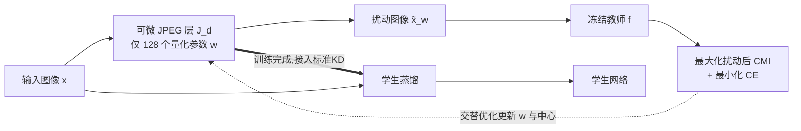

# Differentiable JPEG-based Input Perturbation for Knowledge Distillation Amplification via Conditional Mutual Information Maximization

**会议**: ICLR 2026  
**OpenReview**: [https://openreview.net/forum?id=ZKYPoPn0fP](https://openreview.net/forum?id=ZKYPoPn0fP)  
**代码**: 待确认  
**领域**: 模型压缩 / 知识蒸馏  
**关键词**: 知识蒸馏, 条件互信息(CMI), 可微 JPEG, 输入扰动, 冻结教师, 交替优化  

## 一句话总结
在冻结教师前面插一层**可微 JPEG 压缩层**，只训练 128 个量化参数来扰动教师输入、直接最大化教师的条件互信息(CMI)，从而让教师输出更"软"更有信息量的监督信号——一个即插即用、不改教师权重的蒸馏增益器，学生 Top-1 最高提升 4.11%。

## 研究背景与动机
- **领域现状**: 知识蒸馏(KD)是主流模型压缩手段，但传统教师只用交叉熵(CE)训练，没人关心它"会不会教"。近期 MCMI(Ye et al., 2024)证明：训练教师时**最大化条件互信息 $I(X;\hat{Y}\mid Y)$** 能让同类样本预测分布在概率单纯形上更分散、教师监督信号更软，从而提升蒸馏效果。
- **现有痛点**: ① MCMI 这类"面向学生的教师"必须**微调教师权重**，而现实里教师往往是固定/闭源/超大的，重训练不现实；② MCMI 用代理目标且**固定类中心 $S_y$**，微调时中心会漂移，代理本身不精确；③ 另一条路是输入扰动(对抗样本/CKD 自适应压缩)，但要额外生成样本或逐图选量化表，**计算开销大**。
- **核心矛盾**: 既想吃到"CMI 最大化让教师变好教"的红利，又不能动教师权重，还不能引入高昂的逐样本生成成本。
- **本文目标**: 在**完全冻结教师**的前提下，用极少参数把教师的 CMI 拉高，且即插即用、与任意 KD 流程正交。
- **核心 idea**: **把"改教师"换成"改教师看到的输入"**——在教师前插一个可微 JPEG 层 $J_d$，仅训练它的量化参数 $w$ 来扰动输入图像，使**扰动后 CMI** 最大化；并用**交替优化**动态更新类中心，绕开 MCMI 固定中心的缺陷。

## 方法详解

### 整体框架
DJIP 分两阶段：**(1) 可微 JPEG 层训练**——输入 $x$ 经 $\tilde{x}_w=J_d(x,w)$ 扰动后送入冻结教师，在 CE 与 DJIP 双目标下只优化 JPEG 编码参数 $w$ 以最大化扰动后 CMI；**(2) 学生蒸馏**——把训好的 JPEG 层接进标准 KD 流程，教师吃扰动后的图像、吐出更有信息量的软标签，照常蒸馏学生。JPEG 层是"一面透镜"：拿掉即恢复原模型，且不改任何 KD 超参。

### 关键设计

**1. 可微 JPEG 层作为输入扰动器：用压缩参数当"旋钮"调教师。** 标准 JPEG 把 RGB 转 YCbCr、分 8×8 块做 DCT、再用量化表 $Q$ 均匀量化，但其硬量化 $Q_u$ 不可导。DJIP 沿用 JPEG-DL 的可微软量化 $Q_d$（由量化步长 $q$ 和锐度 $\alpha$ 参数化，用 bin 上的平滑期望近似 $Q_u$），使整层 $J_d$ 端到端可微，重建图为 $\tilde{x}_w=J_d(x,w)$，$w=(Q,\alpha)$。与 JPEG-DL 把该层当 DNN 一部分联合训权重不同，DJIP 把它**从教师剥离**、教师彻底冻结，只用这 **128 个量化参数**当作扰动旋钮——这也是它"轻量"的根源：搜索空间极小却能撬动教师行为。

**2. CE–CMI 联合目标 + 扰动后 CMI。** 因为 $\tilde{X}_w$ 是 $X$ 的确定性函数，马尔可夫链 $Y\to X\to\tilde{X}_w\to\hat{Y}$ 成立，于是 $I(X;\hat{Y}\mid Y)=I(\tilde{X}_w;\hat{Y}\mid Y)$（即"扰动后 CMI"）。目标是在压低 CE 的同时把扰动后 CMI 拉高，优化变量从 MCMI 的教师参数 $\theta$ 换成 JPEG 参数 $w$：

$$\min_{w}\ \Big\{\,\mathbb{E}_X\big[H(P_{Y|X},f(\tilde{X}_w))\big]-\lambda\, I(\tilde{X}_w;\hat{Y}\mid Y)\,\Big\}$$

其中 $\lambda>0$ 权衡 CE 与 CMI。CMI 的表达式里 $I(X;\hat{Y}\mid Y=y)=\mathbb{E}_{X|Y}[D_{KL}(f(X)\|S_y)]$，$S_y$ 是 $y$-簇在单纯形上的中心，CMI 越大说明同类预测越分散、监督越软。

**3. 引入"反向通道"把问题改写成双重最小化。** 直接最大化 CMI 的麻烦在于中心 $S_y$ 依赖该类全部样本的 $f(x_j)$，难以数值求解、无法 GPU 并行；MCMI 干脆固定中心，但中心会漂移、理论不严。DJIP 引入一个虚拟"反向通道"分布 $Q(\cdot\mid i,y)$，由 Theorem 1 把原目标等价改写为对 $w$ 和 $\{Q\}$ 的**双重最小化**，且内层最小化在 $Q(x\mid i,y)=\dfrac{P_{X|Y}(x\mid y)\,f(\tilde{x}_w)[i]}{P_{\hat{Y}|Y}(i\mid y)}$ 时取得。经验目标在 mini-batch 上写成 $L_B=L_{CE}-\lambda L_{DJIP}$，其中 $L_{DJIP}=-\frac{1}{|B|}\sum_{(x,y)}\sum_i f(\tilde{x}_w)[i]\ln Q(x\mid i,y)$。

**4. 交替优化算法：让类中心动态更新。** 基于双重最小化，算法交替两步——**Step 1（固定 $w$）**按 $S_y[i]=\frac{1}{|D_y|}\sum_{x_j\in D_y}f(J_d(x_j,w))[i]$ 经验更新中心，再据此算出 $Q(x\mid i,y)$；**Step 2（固定 $\{Q\}$）**用标准 SGD 更新 $w$。如此每轮都重新估计中心，避免 MCMI 固定中心的近似误差，训练更稳更有效——这正是 DJIP 在自由度远小于 MCMI（128 参数 vs 整个教师）时仍能匹敌甚至超越它的原因。

## 实验关键数据
在 CIFAR-100 与 ImageNet 上覆盖同构/异构、CNN/ViT 多种师生对，每组 3 次取平均；CMI 在无数据增强的训练集上测量。

### 主实验（CIFAR-100 同构师生，节选 Top-1 %）

| Teacher→Student | 方法 | CE 教师 | DJIP 教师 | Δ |
|---|---|---|---|---|
| ResNet-32×4→ResNet-8×4 | KD | 73.33 | 74.38 | **+1.05** |
| VGG-13→VGG-8 | KD | 72.98 | 74.01 | +1.03 |
| ResNet-110→ResNet-32 | KD | 73.08 | 73.71 | +0.63 |
| ResNet-32×4→ResNet-8×4 | FT | 72.86 | 73.76 | +0.90 |
| WRN-40-2→WRN-40-1 | RKD | 72.22 | 72.36 | +0.14 |

CMI 普遍从 CE 教师的 ~0.006–0.16 抬升到 DJIP 教师的 ~0.25–0.72，证明扰动确实显著放大了教师 CMI。

### 关键发现 / ImageNet & 跨范式

| 设置 | 方法 | CE | DJIP | Δ |
|---|---|---|---|---|
| ResNet-34→ResNet-18 (ImageNet) | KD | 70.66 | 71.65 | **+0.99** |
| ResNet-50→MobileNetV1 (ImageNet) | AT | 69.56 | 70.57 | +1.01 |
| CIFAR-100 异构师生(节选) | SP | 73.48 | 75.92 | **+2.44** |
| CIFAR-100 异构(最大增益) | — | — | — | **+4.11** |

- **增益在异构师生(容量差大)时更显著**——CIFAR-100 同构最高 +2.44%，异构/跨范式最高 **+4.11%**。
- **正交性强**：在 KD/DKD/DIST/WTTM/CC/RKD/AT/FitNet/FT/SP/ITRD/CRD/LSKD 等 13 种 distiller 上几乎全员提升，且可叠加在 MCMI 之上。
- **以小博大**：仅调 128 个量化参数即可在多数场景匹敌或超越自由度大得多的 MCMI；相比逐图选量化表的 CKD/TALD，用一张全局共享量化表就取得相当或更好的结果，开销低得多。

## 亮点与洞察
- **范式转换**：把"让教师变好教"的优化对象从**教师权重**搬到**教师输入**，彻底回避重训练大教师/闭源教师的现实障碍。
- **极致轻量**：128 个量化参数是整个可训练面，即插即用、拔掉无残留、不动任何 KD 超参，工程友好度极高。
- **理论补强**：用"反向通道 + 双重最小化"给 CMI 最大化一个可并行、可动态更新中心的严格形式，修正了 MCMI 固定中心的近似缺陷。
- **CMI 视角的可解释性**：实验直接报告 CMI 数值随扰动上升，把"软标签更有信息量"量化成可观测指标。

## 局限与展望
- **依赖 CMI 假设**：方法建立在"更高 CMI ⇒ 更好蒸馏"的前提上，若教师本身分布异常或任务不满足该规律，增益可能受限。
- **JPEG 表达力上限**：128 个量化参数+单张全局量化表自由度有限，作者也承认这是相对 MCMI 的"先天劣势"，在某些场景增益较小(+0.04~+0.2)。
- **SGD 非全局最优**：交替算法收敛到局部解，是 SGD 类方法的通病而非本算法独有。
- **图像域绑定**：JPEG 压缩天然面向自然图像，迁移到非图像模态(文本/音频/点云)需另设可微扰动算子。

## 相关工作与启发
- **CMI 蒸馏**：MCMI(Ye et al., 2024)首倡训练教师最大化 CMI，DJIP 继承其 CMI 估计器但用交替算法修掉固定中心缺陷、并把优化对象换成冻结教师的输入。
- **可微 JPEG / JPEG-DL**(Salamah et al., 2025b)：提供可微软量化层，DJIP 将其从"DNN 一部分"重定位为"独立输入扰动器"。
- **输入扰动蒸馏**：对抗/分歧输入(Heo, Nguyen-Duc/TALD)、自适应压缩(CKD, Salamah et al., 2025a)证明扰动教师输入有益，DJIP 以"全局量化表 + 极少参数"取代逐样本生成/选表，大幅降本。
- **启发**：当"改模型"代价过高时，"改模型的输入分布"是一条被低估的、参数效率极高的增益路径；信息论指标(CMI)可作为蒸馏中可直接优化的监督质量代理。

## 评分
- **新颖性**: ⭐⭐⭐⭐ — "冻结教师 + 可微 JPEG 扰动输入最大化 CMI"是清晰且少见的视角转换，反向通道改写为方法提供了扎实理论支撑。
- **实验充分度**: ⭐⭐⭐⭐ — 两数据集、同构/异构、CNN/ViT、13 种 distiller、与 MCMI/CKD/TALD 全面对比，覆盖面足够；但增益部分场景偏小、缺更大规模教师与多模态验证。
- **写作质量**: ⭐⭐⭐⭐ — 动机—理论—算法—实验脉络清晰，CMI 与双重最小化推导交代到位，框架图与表格规整。
- **价值**: ⭐⭐⭐⭐ — 即插即用、不改教师、参数极少，对教师闭源/超大或部署受限的工业场景实用性高。

<!-- RELATED:START -->

## 相关论文

- [\[ICLR 2026\] Token Distillation: Attention-Aware Input Embeddings for New Tokens](token_distillation_attention-aware_input_embeddings_for_new_tokens.md)
- [\[ICLR 2026\] Light Differentiable Logic Gate Networks](light_differentiable_logic_gate_networks.md)
- [\[ICLR 2026\] In Good GRACES: Principled Teacher Selection for Knowledge Distillation](in_good_graces_principled_teacher_selection_for_knowledge_distillation.md)
- [\[ICLR 2026\] SGD-Based Knowledge Distillation with Bayesian Teachers: Theory and Guidelines](sgd-based_knowledge_distillation_with_bayesian_teachers_theory_and_guidelines.md)
- [\[ICLR 2026\] Generative Diffusion Prior Distillation for Long-Context Knowledge Transfer](generative_diffusion_prior_distillation_for_long-context_knowledge_transfer.md)

<!-- RELATED:END -->
