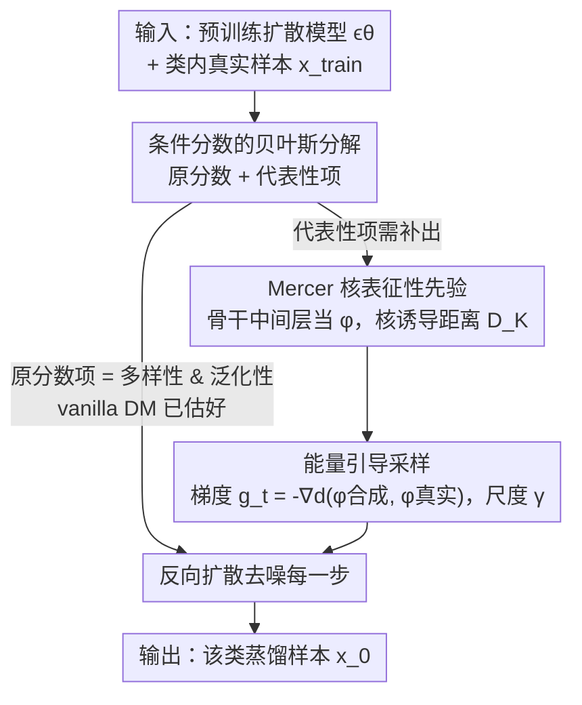

# Diffusion Models as Dataset Distillation Priors

**会议**: ICLR 2026  
**OpenReview**: [https://openreview.net/forum?id=Hvge3NzkJN](https://openreview.net/forum?id=Hvge3NzkJN)  
**论文**: [项目主页](https://suduo94.github.io/Diffusion-As-Priors)  
**代码**: https://suduo94.github.io/Diffusion-As-Priors （项目页）  
**领域**: 模型压缩 / 数据集蒸馏 / 扩散模型  
**关键词**: 数据集蒸馏, 扩散先验, Mercer 核, 代表性, 引导采样

## 一句话总结
本文把"代表性"形式化为合成样本与真实样本在扩散模型特征空间里的 Mercer 核距离，并以能量引导的形式注入反向扩散过程，从而**免训练**地让预训练扩散模型同时输出多样性、泛化性、代表性兼备的蒸馏数据集，在 ImageNet-1K 及子集上超过一众 SOTA 生成式蒸馏方法。

## 研究背景与动机

**领域现状**：数据集蒸馏（Dataset Distillation, DD）的目标是把大数据集压成一个极小但仍能训练出高性能模型的合成子集（论文中可达 $10\times\sim200\times$ 的训练规模压缩）。近年的主流路线是"生成式蒸馏"——直接拿训练好的扩散模型（Stable Diffusion 的 U-Net、DiT 的 Transformer）当基础模型来合成蒸馏样本，借扩散模型对整体分布的强建模能力获得高保真、多样的数据。

**现有痛点**：一个理想的蒸馏数据集需要同时满足三件事——**多样性（Diversity）**覆盖原数据的全部变化、**泛化性（Generalization）**不过拟合到某个特定下游网络结构、**代表性（Representativeness）**保留原数据最关键的信息。问题在于：vanilla 扩散模型采样出来的样本天然有前两者，却**没有显式编码代表性**。为了补上代表性，IGD、MGD3 这类方法往往要外挂额外约束（比如用某个代理网络做 influence-guided 采样），既增加复杂度，又容易把归纳偏置绑死在某个架构上（例如 IGD 显式用 ResNet-18 当代理，换架构就掉点）。

**核心矛盾**：作者追问两个问题——① vanilla 扩散模型的先验到底满不满足 DD 的需求？② 扩散模型里有没有**被忽略的、本来就能服务于代表性的先验**？他们的判断是：扩散模型通过估计分数函数 $\nabla_x \log p(x)$ 来建模整个流形，本身已经提供了多样性与泛化性；而代表性其实**不必外挂**——一个训练好的扩散模型骨干网络本身就是个优秀的特征提取器，它对视觉内容的理解（强图文对齐、可当判别式分类器）恰恰可以充当代表性先验。

**本文目标**：在不重新训练、不外挂代理网络的前提下，把"代表性"这一缺失的属性也从扩散模型自身的先验里挖出来，注入采样过程。

**核心 idea**：把条件分数函数按贝叶斯拆成"原分数（多样性+泛化性）+ 代表性项"，再用 **Mercer 核诱导距离**把代表性写成一个可微的能量项，以**分类器引导（classifier guidance）**的方式注入反向扩散每一步——即标题所说的 "Diffusion As Priors (DAP)"。

## 方法详解

### 整体框架

DAP 的输入是一个**预训练好的扩散模型** $\epsilon_\theta$ 和某个类别 $c$ 的真实训练样本；输出是该类别的蒸馏样本。整条流程不引入任何额外训练，全部发生在**采样阶段**：照常跑反向扩散去噪，但在每一步额外加一个把当前生成样本"拉向真实数据代表区"的引导梯度。

它的理论支点是对条件分数函数做贝叶斯分解（式 4）：

$$\nabla_x \log p(x|R) = \underbrace{\nabla_x \log p(x)}_{\text{多样性 \& 泛化性}} + \underbrace{\nabla_x \log p(R|x)}_{\text{代表性}}$$

第一项就是 vanilla 扩散模型已经估好的原分数（对应多样性、泛化性先验），**白拿**；本文只需补出第二项——代表性项。补法分两步：先用 Mercer 核把"合成样本对真实集的代表性"写成一个可微的核诱导距离 $D_K$，再把它当能量函数，求梯度作为引导项加进反向 SDE。

### 关键设计

**1. 条件分数的贝叶斯分解：把"唯一缺的能力"单独拎出来补**

作者没有从零设计一个全新的蒸馏目标，而是先论证 vanilla 扩散模型已经够用一半。多样性来自扩散轨迹的随机性——不同噪声初始化走出不同去噪路径，天然覆盖流形而非记忆个体样本，避免 mode collapse；泛化性来自扩散式蒸馏**不做像素级的、针对特定下游分类器的优化**（不像传统 DD 去匹配某个网络的梯度/参数/特征），因此蒸馏出的是"与数据相关"而非"与架构相关"的知识，天然跨架构泛化。既然前两者是 $\nabla_x \log p(x)$ 这一项白送的，那么把条件分数 $\nabla_x \log p(x|R)$ 按贝叶斯拆开后（式 4），唯一要动手补的就是代表性项 $\nabla_x \log p(R|x)$。这个"分而治之"的拆解是整篇方法的骨架——它把问题从"重设计一个蒸馏器"缩小为"只补一个引导项"，也解释了为什么 DAP 能免训练。

**2. Mercer 核表征性先验：把"代表性"写成扩散特征空间里的可微距离**

痛点是"代表性"本身很模糊，难以变成可优化的目标。作者用核函数把它形式化：合成样本 $x_{syn}$ 越能代表整个训练集，就要求它与真实样本在特征空间里的相似度 $\mathbb{E}_{x_{train}}[K(x_{syn}, x_{train})]$ 越大。为此定义核诱导距离

$$D_K(x, y) = \big(K(x,x) + K(y,y) - 2K(x,y)\big)^{1/2}$$

并证明（定理 3.1）只要核 $K$ 是半正定（PSD）的，$D_K$ 就是一个合法的距离度量（满足非负、对称、三角不等式）；进一步（定理 3.2）Mercer 核可被分解为 $D_K(x,y) = d \circ (\phi \times \phi)(x,y)$，即"一个复杂特征映射 $\phi$ + 一个简单的 Hilbert 范数 $d$"，并保证优化问题凸且可解。关键的一步是回答"$\phi$ 用什么"——作者直接把**扩散模型的骨干网络（U-Net / DiT）某一层输出**当作 $\phi: X \to \mathbb{R}^n$，理由是预训练阶段骨干已经习得了高层语义特征（强图文对齐 + 可当高精度判别分类器）。实践中核取最易处理的线性核 $K(x,y)=x^\top y$。这样代表性就从一个抽象概念变成了"合成特征与真实特征之间一个可求梯度的距离"，而且**完全复用扩散模型自带的特征，不需额外特征网络**。

**3. 能量引导采样：以分类器引导方式把代表性注入反向扩散**

有了可微距离 $D_K$，还要把它接回采样过程。作者把代表性条件概率写成关于 $D_K$ 的玻尔兹曼分布（式 6）

$$p(R|x_{syn}) \triangleq \frac{1}{Z}\Big\{\exp\big(-\tfrac{1}{N}\textstyle\sum_N D_K(x_{syn}, x_{train})\big)\Big\}^{\gamma}$$

其中 $\gamma>0$ 控制代表性先验的强度。对其取对数梯度得到代表性分数（式 7）

$$\nabla_{x_{syn}} \log p(R|x_{syn}) \propto -\gamma \frac{1}{N}\sum_N \nabla_{x_{syn}} d\big(\phi(x_{syn}), \phi(x_{train})\big)$$

这正是 energy-based guidance / 分类器引导的形式。把它叠加进反向扩散 SDE（式 8），并借鉴扩散分类器的做法——用预训练扩散模型自身充当**时间相关**的特征提取器 $\phi(x_t, t) \approx \phi(x_0)$，于是无需在带噪样本上额外训练特征网络。落到算法 1（VP-SDE）里就是：每一步先按常规去噪得到 $\tilde{x}_{t-1}$，再算引导梯度 $g_t = -\nabla_{x_t} d(z_t, z_{train}^{c})$，最后 $x_{t-1} = \tilde{x}_{t-1} + \gamma g_t$，让每条去噪轨迹偏向"被真实数据充分代表"的区域。值得注意的是 $\gamma$ **不能无限调大**：因为式 4 里多样性/泛化性的梯度场是预训练扩散模型固定给出的，$\gamma$ 太大就会扭曲整个梯度场、把生成轨迹带偏，反而削弱多样性与泛化性导致掉点——三类先验之间存在此消彼长。

### 损失函数 / 训练策略
DAP **无任何训练目标**：不微调扩散模型、不训练代理网络、不需要在采样前挑选特定的 $x_{train}$ 样本。唯一的超参是引导尺度 $\gamma$ 与"取骨干哪一层当 $\phi$"；采样用 VP-SDE，三次运行报告 mean±std。

## 实验关键数据

### 主实验

在 ImageNet-1K（soft-label 协议、ResNet-18）上，DAP 在两个 IPC 设置下都拿到最佳：

| 数据集 | IPC | 之前最强基线 | DAP | 提升 |
|--------|-----|--------------|-----|------|
| ImageNet-1K | 10 | 46.7 (VLCP) / 45.6 (MGD3) | **49.1** | +2.4 ~ +3.5 |
| ImageNet-1K | 50 | 60.5 (VLCP) / 60.2 (MGD3) | **62.7** | +2.2 |

在 ImageNette / ImageWoof（hard-label 协议）上，DAP 在 ConvNet-6 / ResNetAP-10 / ResNet-18 三种架构、IPC 10/50/100 上几乎全面领先：

| 数据集 | 模型 | IPC | IGD | MGD3 | DAP | Full（参考） |
|--------|------|-----|-----|------|-----|--------------|
| ImageNette | ConvNet-6 | 10 | 61.9 | 56.2 | **64.8** | 94.3 |
| ImageNette | ResNetAP-10 | 100 | 85.2 | 85.0 | **86.0** | 94.6 |
| ImageWoof | ResNet-18 | 100 | 70.6 | 68.8 | **71.6** | 89.0 |

唯一例外是 ImageWoof / ResNet-18 / IPC10，IGD 略高——作者归因于 IGD 显式把 ResNet-18 当代理网络引入了对该架构的归纳偏置（局部增益但有过拟合风险，见跨架构表）。在 Stable Diffusion 骨干上，DAP 同样全面超过 vanilla SD 与 MGD3，例如 ImageNette/IPC50 达 81.4%（soft-label），逼近全量训练精度。

### 消融实验

| 配置 / 因素 | 现象 | 说明 |
|------------|------|------|
| 去掉代表性引导（$\gamma=0$，即 vanilla DM） | DiT/ImageNette IPC10 62.8% | 仅有多样性+泛化性 |
| 加代表性引导（$\gamma=0.5$） | 66.4% | 注入代表性后 +3.6 |
| 加代表性引导（$\gamma=1$） | 67.8% | 继续 +1.4 |
| 取骨干特征层 $\phi$ | U-Net 取 "Mid" 层最好；DiT 取 4–12 层（早期块）最好 | 最终输出层反而次优——它偏向分布对齐而非代表性 |
| $\gamma$ 持续增大 | 先升后降 | 过大扭曲梯度场、偏置轨迹，削弱多样性/泛化性 |

跨架构泛化（表 5，ImageNet-1K，ResNet-18 软标签训练，迁移到 ResNet-101 / MobileNet-V2 / EfficientNet-B0 / Swin）：基线因架构归纳偏置掉点，DAP 在所有目标架构上都最高。规模缩减实验（表 4，从 IPC100 子采样得到 IPC50/10）：IGD、MGD3 出现 >5% 退化，DAP 几乎无损——说明它捕获的是可迁移知识而非"记住某个固定规模的样本"。

### 关键发现
- **代表性引导是涨点主力**：在 hard-label 这种更严苛的协议下，过去多数方法只有靠 soft-label 才有竞争力，而 DAP 在 hard-label 下就已追平甚至超过它们，直接说明代表性先验实打实提升了蒸馏数据质量。
- **特征层选择很关键**：骨干的中间层（语义层）比最终输出层更适合做代表性度量——输出层优先做分布对齐，损失了代表性信息。
- **三类先验此消彼长**：$\gamma$ 太大会牺牲多样性/泛化性，存在一个最优引导强度，这是论文反复强调的边界。
- **跨域鲁棒**：SD 在 LAION 上预训练、却用来蒸馏 ImageNet，DAP 仍稳健，体现用扩散先验弥合域差的能力。

## 亮点与洞察
- **"先验已够一半，只补缺口"的拆解很优雅**：贝叶斯分解把蒸馏需求拆成"白拿的多样性/泛化性 + 要补的代表性"，让方法天然免训练，这种"找出模型里被忽略的能力再激活"的思路可迁移到很多用预训练大模型当先验的任务。
- **用扩散骨干自身当特征提取器**：不引入外部特征网络，直接拿 U-Net/DiT 中间层做 $\phi$，并配上 Mercer 核的理论保证（合法距离 + 凸可解），把"代表性"这个模糊概念落成可求梯度的能量项，工程上极简。
- **分类器引导的新用法**：把"代表性 = 合成与真实在特征空间的接近度"包装成能量引导，复用成熟的 classifier guidance 机制注入采样，几乎零额外成本。
- **$\gamma$ 的存疑**：式 6 的玻尔兹曼分布与式 7、8 的梯度推导是核心，建议对照原文确认归一化项 $Z$ 与时间相关近似 $\phi(x_t,t)\approx\phi(x_0)$ 的细节，⚠️ 以原文为准。

## 局限与展望
- **依赖骨干特征质量**：代表性度量完全建立在扩散骨干提取的特征上，若骨干在某领域特征不佳（如与预训练域差异极大的数据），代表性引导可能失效；论文主要在自然图像（ImageNet 系）上验证。
- **$\gamma$ 与层选择需手调**：最优引导尺度和特征层在 U-Net 与 DiT 上不同（Mid vs. 早期块），换骨干/数据可能要重新搜参，缺少自动选择机制。
- **核函数简化**：实践只用线性核 $K(x,y)=x^\top y$ 图省事，更复杂的 Mercer 核是否带来额外收益未充分探索。
- **未触及的方向**：把代表性先验推广到视频、3D 等模态，或在采样中动态调度 $\gamma$ 以自适应平衡三类先验，都是自然延伸。

## 相关工作与启发
- **vs IGD**：IGD 显式引入代理网络（如 ResNet-18）做 influence-guided 采样来补代表性，带来对该架构的归纳偏置——局部涨点但跨架构/缩规模时退化；DAP 不依赖任何架构特定启发式，代表性来自扩散骨干自身特征，因此跨架构更稳。
- **vs MGD3**：同为扩散式生成蒸馏，但 MGD3 仍需外部约束增强数据质量；DAP 论证这些外挂约束"非必要"，直接从扩散先验里挖代表性，更简洁且在 hard-label 下就领先。
- **vs 传统 DD（匹配梯度/参数/特征）**：传统方法做像素级、针对特定分类器的优化，蒸馏的是"架构相关知识"，难跨架构；DAP 走架构无关的生成式范式，蒸馏"数据相关知识"。
- **vs 扩散分类器（Diffusion Classifier）**：本文正是受其启发——既然扩散模型能当高精度判别分类器，那它提取的特征就足以度量代表性，从而把扩散模型从"生成器"复用为"代表性先验"。

## 评分
- 新颖性: ⭐⭐⭐⭐⭐ 首次论证并激活扩散模型中被忽略的代表性先验，理论（贝叶斯分解 + Mercer 核）与实践（免训练引导）结合得很完整
- 实验充分度: ⭐⭐⭐⭐ 覆盖两种骨干、多数据集/架构/IPC，含跨架构与缩规模分析；线性核之外的核与更大规模域外验证略少
- 写作质量: ⭐⭐⭐⭐ 三类先验的拆解叙述清晰，定理与算法配套；部分公式（式 6–8）较密需对照原文
- 价值: ⭐⭐⭐⭐⭐ 免训练、即插即用、跨架构稳健，对生成式数据集蒸馏有直接实用价值

<!-- RELATED:START -->

## 相关论文

- [\[CVPR 2026\] Mitigating The Distribution Shift of Diffusion-based Dataset Distillation](../../CVPR2026/model_compression/mitigating_the_distribution_shift_of_diffusion-based_dataset_distillation.md)
- [\[ICLR 2026\] FutureMind: Equipping Small Language Models with Strategic Thinking-Pattern Priors via Adaptive Knowledge Distillation](futuremind_equipping_small_language_models_with_strategic_thinking-pattern_prior.md)
- [\[CVPR 2026\] DMGD: Train-Free Dataset Distillation with Semantic-Distribution Matching in Diffusion Models](../../CVPR2026/model_compression/dmgd_train-free_dataset_distillation_with_semantic-distribution_matching_in_diff.md)
- [\[CVPR 2026\] IMS3: Breaking Distributional Aggregation in Diffusion-Based Dataset Distillation](../../CVPR2026/model_compression/ims3_breaking_distributional_aggregation_in_diffusion-based_dataset_distillation.md)
- [\[ICLR 2026\] Generative Diffusion Prior Distillation for Long-Context Knowledge Transfer](generative_diffusion_prior_distillation_for_long-context_knowledge_transfer.md)

<!-- RELATED:END -->
