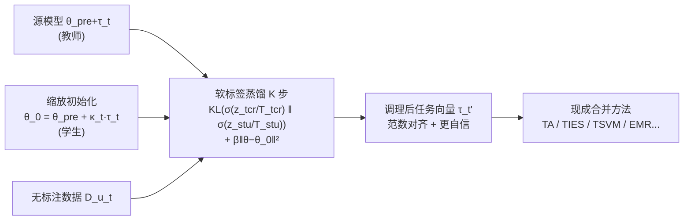

# DisTaC: Conditioning Task Vectors via Distillation for Robust Model Merging

**会议**: ICLR 2026  
**OpenReview**: [https://openreview.net/forum?id=W70w5JCzdq](https://openreview.net/forum?id=W70w5JCzdq)  
**代码**: [https://github.com/katoro8989/DisTaC](https://github.com/katoro8989/DisTaC)  
**领域**: 模型合并 / Model Merging  
**关键词**: task vector, model merging, knowledge distillation, robustness, task vector norm, model confidence  

## 一句话总结
本文揭示了模型合并的两个隐藏失效模式——任务向量范数差异和源模型低置信度，并提出 DisTaC：在合并前用知识蒸馏对任务向量做"预调理"（重缩放范数 + 提升置信度），让现有 SOTA 合并方法在原本会崩盘的现实场景下也能正常工作。

## 研究背景与动机
**领域现状**：模型合并（model merging）把多个独立微调好的模型直接在权重空间线性组合成一个多任务模型，无需重训、无需汇集所有任务数据，是近年很火的多任务学习范式。其核心操作对象是任务向量（task vector）$\tau_t := \theta_t - \theta_{pre}$，即微调权重相对预训练权重的偏移；TA、TIES、Consensus、TSVM 等方法各自设计变换矩阵 $P_t$ 来缓解任务间干扰。

**现有痛点**：这些 SOTA 方法几乎都在"对合并极度友好"的理想 benchmark 上评测——所有源模型用统一学习率、硬标签、同样的训练步数微调出来。但真实世界里，不同任务的微调超参往往五花八门，这种理想假设根本不成立，方法的鲁棒性几乎没人系统检验过。

**核心矛盾**：本文做了一项关键诊断实验，定位出两个对合并"特别有害"却被长期忽视的源模型特征——**(1) 任务向量范数差异**：不同学习率/步数/weight decay 会让范数差出 5–7 倍，而 Proposition 1 证明当两向量近似正交、范数比 $\delta \ll 1$ 时，合并结果 $\cos(\tau_{merge}, \tau_1) \le \delta$，几乎完全被大范数任务主导，小范数任务的知识被淹没；**(2) 源模型低置信度**：label smoothing/Mixup/focal loss 等常规训练技巧会让预测熵升高三个数量级，反直觉的是——校准良好的模型在合并视角下反而脆弱，置信度越低合并后掉点越狠（最高掉 24% normalized accuracy，比范数差异更致命）。

**本文目标**：与其改进合并算法本身，不如在合并前先"治好"源模型的这两个病灶。

**核心 idea**：**预调理（pre-conditioning）思路** —— 提出 DisTaC，用一次轻量知识蒸馏、仅靠无标注数据，同时把任务向量范数缩放到目标值并提升源模型置信度，且保留任务特定知识，让现有合并方法即插即用地获得鲁棒性。

## 方法详解

### 整体框架
DisTaC（Distillation for Task vector Conditioning）是一个加在合并流程**前**的预处理步骤：对每个有问题的源模型，以"调理后的权重"为学生初始化、以原微调模型为教师，做 $K$ 步纯软标签蒸馏，输出一个范数被矫正、置信度被提升、但任务能力不变的新任务向量，再交给任意现成合并方法。两类调理（范数 + 置信度）由同一个 Algorithm 1 统一完成，只需调节缩放系数 $\kappa_t$ 和温度对 $(T_{tcr}, T_{stu})$。

### 关键设计
**1. 任务向量范数调理：缩放后用蒸馏找回精度。** 朴素做法是把 $\tau_t$ 直接乘标量 $\kappa_t$ 把范数压到目标值，但这种硬缩放不保证性能、往往大幅掉点。DisTaC 的关键在于把缩放后的模型 $\theta_{pre} + \kappa_t \tau_t$ 当作学生的初始化（anchor point $\theta_0$），再以原微调模型 $\theta_{pre}+\tau_t$ 为教师，仅用同任务的无标注数据做蒸馏，把缩放丢掉的精度"蒸"回来。因为没有标签，损失里固定 $\zeta=1$，只用软目标 KL 项 $T_{tcr}T_{stu}\,\mathrm{KL}(\sigma(z_{tcr}/T_{tcr})\,\|\,\sigma(z_{stu}/T_{stu}))$，并加 $\ell_2$ 正则 $\beta\|\theta-\theta_0\|_2^2$ 防止范数在蒸馏中又漂回去。实验里目标范数取"其余七个任务向量范数的均值"，温度对用中性的 $(10,10)$。

**2. 源模型置信度调理：用更高的学生温度把熵压低。** 针对低置信度，学生与教师在初始化时完全相同（$\theta_0=\theta_{pre}+\tau_t$，$\kappa_t=1$），唯一的杠杆是温度——故意把学生温度设得比教师高（$T_{stu} > T_{tcr}$，如 $(1,10)$）。学生是在一个被"软化"过的高熵分布上训练的，当推理时温度复位为 1，学生输出会比教师更尖锐、更低熵，也就更自信。作者承认这会让模型过自信，但论点是：过自信可以事后用温度缩放等校准方法补救，而欠自信源模型造成的合并崩盘是不可逆的，两害相权取其轻。

**3. 统一为单趟蒸馏算法。** 当范数差异与低置信度同时存在时，二者并不冲突——只需选好缩放系数 $\kappa_t$ 和非对称温度对 $(T_{tcr},T_{stu})$，Algorithm 1 一次蒸馏即可同时矫正两个病灶。由于 DisTaC 用已训好的任务向量做初始化、只跑少量步数（$K=500$，实际约 100 步就收敛）、且只吃无标注数据，计算开销极小，对现有合并管线几乎零侵入。

## 实验关键数据
设置：CLIP 的 ViT-B-32 / ViT-L-14 骨干，8 个视觉任务（Cars/DTD/EuroSAT/GTSRB/MNIST/RESISC45/SUN397/SVHN），对比 7 种合并方法在 Original / Norm Mismatch / Low Confidence 三种配置下的表现。

### 主实验表格（部分，绝对准确率 / 括号内归一化准确率，ViT-B-32）

| 方法 | Original | Norm Mismatch | + DisTaC | Low Confidence | + DisTaC |
|------|---------|---------------|----------|----------------|----------|
| Task arithmetic | 70.4 (78.0) | 63.6 (71.8) | **70.0 (78.2)** | 51.0 (58.3) | **63.6 (72.2)** |
| TIES | 74.0 (82.0) | 59.1 (66.4) | **73.1 (81.0)** | 54.5 (62.0) | **68.7 (77.9)** |
| EMR-Merging | 88.5 (98.4) | 80.0 (88.7) | **88.1 (97.3)** | 39.2 (45.1) | **70.3 (79.2)** |
| TSVM | 83.3 (92.4) | 72.2 (80.2) | **82.9 (91.8)** | 60.7 (68.4) | **81.5 (91.8)** |
| WUDI-Merging | 85.5 (93.9) | 49.2 (52.6) | **84.4 (93.2)** | 38.0 (40.8) | **73.8 (83.3)** |

DisTaC 几乎把所有方法在两种恶劣配置下都拉回到接近 Original 的水平；ViT-B-32 最高绝对提升 35.8 个百分点，ViT-L-14 最高提升 63.6 个百分点。TSVM 在 Low Confidence 下从 68% normalized 恢复到 92%（正文摘要数据），EMR-Merging 在低置信度下从 45.1% 拉回 79.2%。

### 消融/分析实验

| 分析 | 关键现象 |
|------|---------|
| 收敛速度（Fig 2） | 约 100 步内精度即恢复到教师水平甚至超过；$\ell_2$ 正则让范数保持在初始化的 ~1.1× |
| 缩放方向（Fig 3） | 缩小任务向量（$\kappa_t<1$）在很宽范围内保持甚至提升精度；拉伸（$\kappa_t>1$）则迅速掉点，$\kappa_t=3$ 时所有任务跌破 zero-shot |
| 学生超过教师 | 减小 $\kappa_t$ 带来类 weight decay 的正则效应，学生偶尔反超教师（呼应 Born-Again Networks） |

### 关键发现
- **范数差异和低置信度是两个被 benchmark 掩盖的真实失效模式**，其中低置信度危害更大（最高 24% vs 14% 掉点）。
- **两条可落地的合并准则**：(i) 范数不齐时，缩短长向量优于拉长短向量；(ii) 源模型低置信时，先让它"过自信"再合并、最后对合并模型做校准，比保留欠自信模型更优。

## 亮点与洞察
- **诊断先于方案**：先用干净的对照实验把"合并为什么在现实中崩"归因到两个可量化的源模型特征，并配上 Proposition 1（范数主导）和 NTK 视角的理论解释，立论扎实。
- **正交于合并算法**：DisTaC 不改任何合并方法，作为前处理即插即用，对 7 种 SOTA 普遍有效，迁移性强。
- **极低成本**：仅 ~100–500 步、无标注数据、用已有任务向量初始化，几乎不增加合并门槛。
- **反直觉洞见**：校准良好≠合并友好，"过自信 + 事后校准"反而是更稳的工程路线。

## 局限与展望
- 实验集中在 CLIP + 8 视觉分类任务，未覆盖 NLP/生成/检测等更复杂任务与更多骨干，泛化性待验证。
- 需要"同任务分布的无标注数据"，在某些隐私或冷启动场景仍可能拿不到。
- 鼓励源模型过自信会牺牲校准，依赖事后温度缩放补救，在对可靠性敏感的应用中需谨慎。
- 缩放系数 $\kappa_t$ 与温度对目前靠规则/经验设定（如取其余范数均值），尚无自适应选择机制。

## 相关工作与启发
- **任务向量与模型合并**：Task Arithmetic、TIES、Consensus、EMR、TSVM、Iso-CTS、WUDI 等是本文的"被服务对象"，DisTaC 站在它们之上做鲁棒化。
- **知识蒸馏**：复用 Hinton 的软标签蒸馏，但创新地把它用作"任务向量调理器"而非压缩工具；学生反超教师呼应 Born-Again Networks。
- **NTK / 权重解耦**：用 Ortiz-Jimenez、Yoshida、Wei 等的理论解释"为何小范数更适合合并"，把经验准则与理论统一。
- **启发**：合并研究的下一步不只在"怎么合"，更在"合之前把源模型准备成什么样"——预调理可能是一个值得系统化的新维度。

## 评分
- 新颖性: ⭐⭐⭐⭐ 把"合并失效"重新框定为源模型预调理问题，视角新颖且有理论支撑
- 实验充分度: ⭐⭐⭐⭐ 7 方法 × 3 配置 × 2 骨干系统对比 + 收敛/缩放消融，但局限于 CLIP 视觉任务
- 写作质量: ⭐⭐⭐⭐ 诊断—理论—方法—准则逻辑清晰，图表支撑到位
- 价值: ⭐⭐⭐⭐ 即插即用、零侵入、低成本地提升所有合并方法的现实鲁棒性，落地价值高

<!-- RELATED:START -->

## 相关论文

- [\[ICLR 2026\] MergOPT: A Merge-Aware Optimizer for Robust Model Merging](mergopt_a_merge-aware_optimizer_for_robust_model_merging.md)
- [\[CVPR 2025\] Task Singular Vectors: Reducing Task Interference in Model Merging](../../CVPR2025/model_compression/task_singular_vectors_reducing_task_interference_in_model_merging.md)
- [\[ICLR 2026\] Expert Merging: Model Merging with Unsupervised Expert Alignment and Importance-Guided Layer Chunking](expert_merging_model_merging_with_unsupervised_expert_alignment_and_importance-g.md)
- [\[ICML 2026\] Saliency-Aware Model Merging](../../ICML2026/model_compression/saliency-aware_model_merging.md)
- [\[ICLR 2026\] Pedagogically-Inspired Data Synthesis for Language Model Knowledge Distillation](pedagogically-inspired_data_synthesis_for_language_model_knowledge_distillation.md)

<!-- RELATED:END -->
