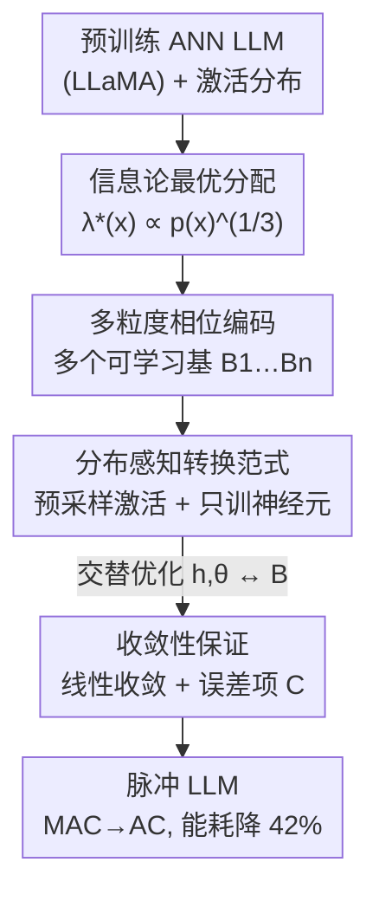

# Distribution-Aware Multi-Granularity Phase Coding: Towards Lower Conversion Error for Spike-Driven Large Language Models

**会议**: ICLR2026  
**OpenReview**: [https://openreview.net/forum?id=meDMftHUlX](https://openreview.net/forum?id=meDMftHUlX)  
**代码**: https://github.com/njzhenghy/SpikingLLM  
**领域**: 模型压缩 / 脉冲神经网络 / ANN-to-SNN 转换  
**关键词**: 脉冲大模型, ANN-to-SNN 转换, 相位编码, 激活分布对齐, 能效

## 一句话总结
针对脉冲大模型转换时"激活分布非均匀、却被均匀离散化"导致的潜在转换误差，本文提出**分布感知的多粒度相位编码**——用多个可学习的相位基把离散值密度对齐到激活分布，再配一套只训神经元、不动权重的交替优化转换范式，在 LLaMA-2-7B / LLaMA-3-8B 上以极短转换时间（约 2 分钟）拿到接近 ANN 的精度与最低困惑度，同时 MAC+AC 能耗降低 42%。

## 研究背景与动机
**领域现状**：脉冲神经网络（SNN）以二值脉冲 + 加法（AC）替代浮点乘加（MAC），在神经形态硬件上能效极高，因此"脉冲大模型"被寄予厚望。但从零直接训练一个 LLM 规模的 SNN（用代理梯度反传）代价高得离谱，于是更现实的路线是 **ANN-to-SNN 转换**：复用预训练好的 ANN 权重，只去最小化"转换误差"——即 SNN 神经元对原始 ANN 激活值的逼近误差。

**现有痛点**：现有脉冲大模型的编码方案（rate coding、temporal coding）几乎都把激活值**均匀地**切成等宽区间再离散化。可是真实 LLM 的激活分布是高度**非均匀**的（论文 Figure 1：单层内激活值集中在接近 0 的小区间、层间分布还各不相同）。把均匀的离散值硬塞给非均匀的激活，就会在激活密集区"精度不够、误差堆积"，这就是长期困扰转换的**分布失配（distribution misalignment）转换误差**。

**核心矛盾**：转换误差本质等价于信息论里的**量化失真**。量化理论告诉我们，要最小化失真就该"哪里概率密度高，就在哪里分配更多离散值"；而 rate/temporal coding 的均匀分配恰恰违背了这个最优原则——它们没有 distribution-aware 的能力。

**本文目标**：(1) 设计一种能把离散值密度**自适应对齐到激活分布**的编码方案；(2) 配套一个**低成本**的转换流程（最好别再做整网络的前向/反向传播）；(3) 给出理论收敛保证。

**切入角度**：作者注意到 **phase coding（相位编码）** 给每个时间步 $t$ 赋一个相位值 $B^{-t}$（$B$ 是相位基），通过调节基 $B$ 就能实现**非均匀**的离散值分配——这正是 rate/temporal coding 不具备的自由度。把单一基扩展成"多个不同粒度的可学习基"，就能逼近任意非均匀分布。

**核心 idea**：用**多粒度可学习相位基**让离散值分配 $\propto p(x)^{1/3}$ 对齐激活分布，并只训练神经元参数（不微调权重）来最小化转换误差。

## 方法详解

### 整体框架
方法要解决的是"把一个预训练 ANN LLM（LLaMA）转成脉冲 LLM，且转换误差尽量低、转换成本尽量小"。整条管线的逻辑链是：**先从信息论推出"最优离散值分配应正比于激活密度"这个目标 → 用多粒度相位编码提供能逼近该目标的可学习离散值分配 → 用一套只训神经元、不动权重的交替优化算法把神经元参数拟合到每层真实激活分布上 → 理论上保证这个交替优化收敛**。

具体地，转换时在每个线性层 / 矩阵运算之前插入"带多粒度相位编码的 SNN 神经元"，把浮点激活转成脉冲信号，从而把 ANN 的浮点矩阵乘法换成脉冲驱动的加法运算。每个神经元的训练数据**不是**整段文本前传得到的，而是从该层对应的**激活分布里预采样**出来的一批激活样本——这样训练时只在单个神经元内传播，彻底省掉了整网的前向/反向传播。

### 关键设计

**1. 信息论最优离散值分配：把"转换误差"翻译成"量化失真"，从而知道该往哪儿放离散值**

作者先把 ANN-to-SNN 转换误差写成对激活分布加权的均方误差 $E=\int p(x)\,(\hat{x}-x)^2\,dx$，其中 $\hat{x}$ 是 SNN 神经元对 ANN 激活值 $x$ 的逼近。这一步的关键洞察是：这个误差**等价于信息论里量化器的渐近失真**。引用 Bennett 积分（Gray & Neuhoff），用 $M$ 个分配区间、点密度函数 $\lambda(x)$ 表示的失真为

$$D(q)\simeq \frac{1}{12}\frac{1}{M^2}\int \frac{p(x)}{\lambda^2(x)}\,dx.$$

在归一化约束 $\int\lambda(x)\,dx=1$ 下最小化它，得到**最优点密度** $\lambda^*(x)\propto [p(x)]^{1/3}$。这句话给整篇文章定了调：既然 LLM 激活 $p(x)$ 非均匀，最优分配 $\lambda^*(x)$ 也必然非均匀——激活密集处要分配更多离散值、稀疏处少分。它直接戳破了 rate/temporal coding"均匀切区间"的错误，并给后面的编码设计提供了明确目标（去逼近这个非均匀的 $\lambda^*$），而不是一句空泛的"对齐分布"。

**2. 多粒度相位编码：用多个可学习基撑出足够灵活的非均匀离散值分配**

传统相位编码给时间步 $t$ 赋相位值 $B^{-t}$，神经元动力学是 $v(t{+}1)=v(t)-B^{-t}s(t),\ O(t)=B^{-t}s(t),\ s(t)=\Theta(v(t)-B^{-t})$（$\Theta$ 为阶跃函数，$s(t)\in\{0,1\}$ 为脉冲）。它靠调单一基 $B$ 已经能做一点非均匀分配，而且在总时间步 $T$ 内能把可编码离散值扩到 $2^T$ 量级（相对 temporal/rate 编码以指数方式压缩 $T$）。但单一基的表达力不够贴合复杂分布。

本文把单基扩成**一组不同粒度的可学习基** $\{B_1,B_2,\dots,B_n\}$，并把相位序列改写为分段形式

$$\{B^{-t}\}_{t=1}^{T}\ \to\ \{B_1^{-1},B_1^{-2},\dots,B_2^{-t},B_2^{-(t+1)},\dots,B_n^{-T}\},$$

即不同时间步段使用不同的基，输出权重 $d(t)$ 取自这组多粒度基。同时**解耦** $h(t),\theta(t),d(t)$（传统相位编码强制三者都等于 $B^{-t}$），把 $\{h,\theta\}$ 也当作可学习参数。这样多个粒度的表达能力叠加起来，离散值就能在激活密集的子区间里"加密"、稀疏区间里"放稀"，从而把映射后的离散值分布贴到真实激活分布上（论文 Figure 3：阴影面积 = 转换误差，多粒度分配的阴影明显小于均匀分配）。这是对设计 1 那个 $\lambda^*\propto p(x)^{1/3}$ 目标的可学习实现。

**3. 分布感知转换范式 + 交替优化神经元训练：只训神经元、不动权重，把转换成本压到几分钟**

有了可学习的多粒度神经元，目标就变成在每个神经元上最小化期望转换误差

$$\min_{\{h,\theta\},B}\int p(x)\,\big(\mathrm{SN}(x;\{h,\theta\},B)-x\big)^2\,dx,$$

其中 $\mathrm{SN}(\cdot)=\sum_{t=1}^{T}O(t)$ 是激活经神经元映射后的离散值。实际操作时，对每个神经元先从该层激活分布估计并**下采样**出一批激活样本 $X$，把问题落成经验误差最小化 $\min \lVert \mathrm{SN}(X)-X\rVert^2$。求解用 **Algorithm 1 的交替优化**：固定 $B$ 更新 $\{h,\theta\}$（因阶跃函数不可导，用 sigmoid 代理梯度），再固定 $\{h,\theta\}$ 更新 $B$，如此交替。粒度数固定时，时间步在各粒度间的分配由"自适应粒度分配"决定（附录 C）。这套设计的妙处在于：训练对象只是单个神经元的几个参数、训练数据是预采样的激活，**完全不需要整网络前向/反向传播、也不微调任何权重**，所以转换在 LLaMA-2-7B 上只要约 2 分钟，而需要解码层前后传的 SpikeLLM 要 5～6 小时。RMSNorm、激活-激活相乘、Softmax、SiLU 等其它非线性算子的处理放在附录 B。

**4. 收敛性保证：证明这套交替 + 代理梯度优化能稳定逼近全局最优**

代理梯度让阶跃目标变得可优化，但也带来"是否还收敛"的疑问。作者把原目标 $f(h,\theta,B)$ 与其平滑版 $g$ 对照，在 Lipschitz 梯度、Polyak–Łojasiewicz（PL）条件、以及"平滑前后偏差有界 $|f-g|\le\sigma$"三条假设下，证明（Theorem 2）

$$f(o_{k+1},B_{k+1})-f^*\le (1-\mu_3\eta_2)(1-\mu_1\eta_1)\,[f(o_k,B_k)-f^*]+C,$$

即一个**线性收敛项**加一个主要由平滑程度决定的**误差项 $C$**（这里 $o$ 统记 $h,\theta$）。结论是：只要平滑技术得当让 $C$ 足够小，迭代就能逼近全局最优——这给"用代理梯度训神经元"提供了理论背书，而不只是工程上 work。

### 损失函数 / 训练策略
核心训练目标就是上面的经验转换误差 $\min \lVert\mathrm{SN}(X;\{h,\theta\},B)-X\rVert^2$；优化用交替优化（Algorithm 1）：外层迭代 $N$ 次，内层先用代理梯度、学习率 $\eta_1$ 对 $\{h,\theta\}$ 走 $N_1$ 步，再用学习率 $\eta_2$ 对 $B$ 走 $N_2$ 步。全程不微调模型权重，训练数据来自各隐藏层激活分布的预采样，因此转换极其廉价。粒度数 $n$（Grain=2/3）与总时间步 $T\in\{6,8,10\}$ 为关键超参。

## 实验关键数据

### 主实验
在 LLaMA-2-7B / LLaMA-3-8B 上评估困惑度（Wikitext2 / C4 / RedPajama / Pile）与零样本精度（WinoGrande / ArcC / ArcE / PiQA）。Baseline 含 SpikeLLM、TTFSFormer、LAS（可视作本文去掉优化的特例 $\theta=h=d=\tau\cdot2^{-t}$）、SpikedAttention。

LLaMA-2-7B（$T=8$）平均困惑度对比（越低越好）：

| 方法 | $T$ | 转换耗时 | Avg. PPL ↓ | Avg. ACC ↑ |
|------|-----|----------|-----------|-----------|
| LLaMA-2-7B (ANN) | — | — | 5.67 | 67.25 |
| SpikeLLM | 8 | 5h 54m | 6.10 | 64.80 |
| TTFSFormer | 128 | — | 12.71 | 66.87 |
| SpikedAttention | — | 2m 02s | 19.91 | 63.89 |
| **本文 (Grain=2)** | 8 | **2m 01s** | **7.16** | **67.17** |
| **本文 (Grain=3)** | 8 | 2m 04s | 7.68 | **67.31** |

在更大时间步 $T=10$ 下，本文 (Grain=2) 困惑度降到 **5.73**、精度 **67.30**，几乎追平 ANN（5.67 / 67.25），且只花约 2.5 分钟，而 SpikeLLM 需近 6 小时。LLaMA-3-8B 上 $T=8$ 时本文 (Grain=2) 平均 PPL **7.22** / ACC **71.32**，对照 ANN 的 7.00 / 71.19——而 SpikeLLM 在该设置下困惑度直接 >100（崩溃）。

### 能耗分析（LLaMA-3-8B, $T=6$）
按 45nm CMOS 估计 $E_{\mathrm{MAC}}\approx4.6\,\text{pJ},\ E_{\mathrm{AC}}\approx0.9\,\text{pJ}$，单样本能耗：

| 模型 | 计算量 | 能耗 (J) |
|------|--------|---------|
| ANN | 3912.08G MACs + 0.17G ACs | 18.00 |
| 本文 (Grain=2) | 15.87G MACs + 11521.88G ACs | **10.44** |
| 本文 (Grain=3) | 15.87G MACs + 11539.14G ACs | 10.46 |

把绝大多数 MAC 换成 AC 后，能耗从 18.00 J 降到约 10.44 J，**降幅 42.0%**。

### 关键发现
- **多粒度可学习基是性能主力**：LAS 本质是本文"无优化"的特例，本文相对 LAS 困惑度大幅下降，直接验证神经元训练算法 + 多粒度基的有效性。
- **极短转换时间是范式优势**：本文约 2 分钟 vs SpikeLLM 近 6 小时，差距来自"只训神经元、不做整网前后传"。
- **小时间步下更稳**：在受限总时间步 $T\in\{6,8,10\}$ 设置下，SpikedAttention / SpikeLLM 容易崩（PPL >100），本文凭多粒度相位编码的表达力仍能维持接近 ANN 的表现。
- **粒度数权衡**：Grain=2 与 Grain=3 表现接近，多数设置下 Grain=2 困惑度略优，说明粒度并非越多越好。

## 亮点与洞察
- **把转换误差等价成量化失真**，于是 $\lambda^*(x)\propto p(x)^{1/3}$ 这条信息论结论成了"该往哪儿放离散值"的硬指引——这把一个工程问题升级成有最优解可逼近的优化问题，是全文最"啊哈"的地方。
- **多粒度相位基**是个可迁移的小技巧：凡是"需要把离散预算非均匀分配到非均匀分布上"的场景（如非均匀量化、码本设计）都可借鉴用多个可学习基 + 解耦 $h,\theta,d$ 的思路。
- **只训神经元、不动权重**把转换成本从小时级压到分钟级，思路上等于"冻结骨干、只校准激活映射"，对资源受限环境特别友好。
- **给代理梯度训练补了收敛证明**，让 SNN 这套"非可导但能 work"的训练多了一层理论安全感。

## 局限与展望
- **离散值过度集中近零区的风险**：$\lambda^*\propto p(x)^{1/3}$ 会把大量分配堆到激活密集（接近 0）的区间，对长尾大激活（outlier）是否够用、会不会牺牲极端值精度，论文未深入讨论。
- **粒度分配偏经验**：固定粒度数下的时间步自适应分配放在附录，主文缺少对"自动选粒度数 $n$"的系统研究，Grain 仍是手调超参。
- **能耗为理论估计**：42% 降幅基于 45nm CMOS 的 MAC/AC 单次能耗外推，是理论值而非真实神经形态硬件实测；AC 操作数其实暴涨（11521G vs ANN 的 0.17G），实际加速依赖硬件对脉冲加法的高效支持。
- **仅在 LLaMA 系验证**：未覆盖更大规模（70B）或不同架构（MoE / Qwen 等），泛化性待证。
- **展望**：作者计划进一步压低总时间步 $T$ 以追求更高能效。

## 相关工作与启发
- **vs LAS（Chen et al., 2025b）**：LAS 用 $\theta(t)=h(t)=d(t)=\tau\cdot2^{-t}$ 的固定单基神经元，正是本文去掉优化、退化成单粒度的特例；本文解耦三者并引入多可学习基 + 神经元训练，困惑度显著更低。
- **vs SpikeLLM（Xing et al., 2025）**：SpikeLLM 把 SNN 与量化 ANN 混合、训练需对解码层前后传（数小时），且在小时间步 / LLaMA-3 上易崩；本文只训神经元、分钟级转换且更稳。
- **vs SpikedAttention / One-Spike SNN（Hwang et al., 2024）**：用单脉冲相位编码做 training-free 转换；本文放宽其单脉冲限制、扩展到 LLaMA，并在受限时间步下表现更好。
- **vs TTFSFormer（Zhao et al., 2025）**：基于 time-to-first-spike 的时序编码需很大时间步（$T=128$）才行；本文用远更小的 $T$ 达到可比甚至更优结果。

## 评分
- 新颖性: ⭐⭐⭐⭐⭐ 把转换误差等价为量化失真、用多粒度可学习相位基对齐激活分布，是脉冲大模型编码方向少见的"有理论指引"的清晰创新。
- 实验充分度: ⭐⭐⭐⭐ 覆盖两个 LLaMA、4 困惑度 + 4 精度数据集、多 baseline 与能耗分析；但缺更大规模/异架构验证，能耗为理论估计。
- 写作质量: ⭐⭐⭐⭐ 从信息论动机到方法到收敛证明逻辑顺，公式与图配合清晰。
- 价值: ⭐⭐⭐⭐⭐ 以分钟级转换 + 接近 ANN 的精度 + 42% 能耗下降，给"低成本得到能用的脉冲大模型"提供了实用范式。

<!-- RELATED:START -->

## 相关论文

- [\[ICLR 2026\] RCPU: Rotation-Constrained Error Compensation for Structured Pruning of Large Language Models](rcpu_rotation-constrained_error_compensation_for_structured_pruning_of_large_lan.md)
- [\[AAAI 2026\] First-Order Error Matters: Accurate Compensation for Quantized Large Language Models](../../AAAI2026/model_compression/first-order_error_matters_accurate_compensation_for_quantized_large_language_mod.md)
- [\[ACL 2026\] TLoRA: Task-aware Low Rank Adaptation of Large Language Models](../../ACL2026/model_compression/tlora_task-aware_low_rank_adaptation_of_large_language_models.md)
- [\[ICLR 2026\] QWHA: Quantization-Aware Walsh-Hadamard Adaptation for Parameter-Efficient Fine-Tuning on Large Language Models](qwha_quantization-aware_walsh-hadamard_adaptation_for_parameter-efficient_fine-t.md)
- [\[ICLR 2026\] ES-dLLM: Efficient Inference for Diffusion Large Language Models by Early-Skipping](es-dllm_efficient_inference_for_diffusion_large_language_models_by_early-skippin.md)

<!-- RELATED:END -->
