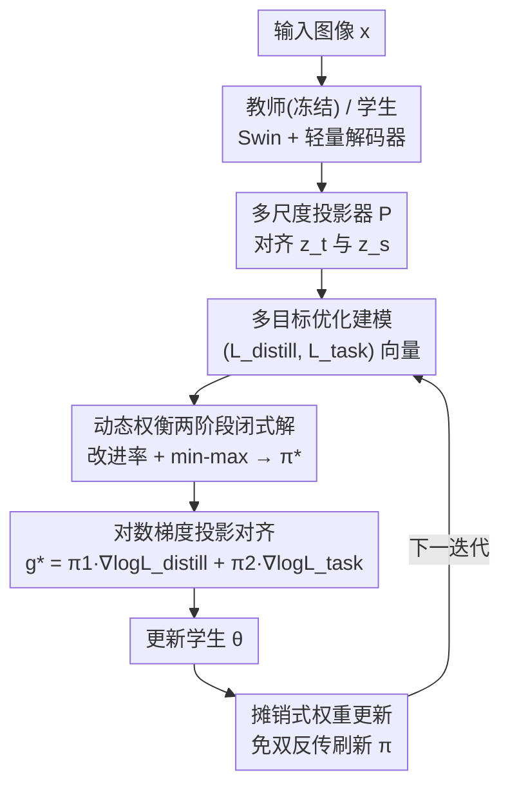

# DTO-KD: Dynamic Trade-off Optimization for Effective Knowledge Distillation

**会议**: ICLR2026  
**OpenReview**: [https://openreview.net/forum?id=QMItTyQW92](https://openreview.net/forum?id=QMItTyQW92)  
**代码**: 待确认  
**领域**: 模型压缩 / 知识蒸馏  
**关键词**: 知识蒸馏, 多目标优化, 梯度冲突, 帕累托最优, 动态权衡  

## 一句话总结
DTO-KD 把知识蒸馏里"任务损失 vs 模仿教师"的权衡当成一个多目标优化问题，在梯度层面用闭式解动态算出两个损失的权重，自动消解梯度冲突与梯度支配，免去手调 loss 权重，在 ImageNet-1K 分类和 COCO 检测上都刷到 SOTA，且收敛更快（240 epoch 即追平别人 300 epoch）。

## 研究背景与动机
**领域现状**：知识蒸馏（KD）是把大教师模型压进紧凑学生模型的主流手段。标准做法是把一个任务损失（分类/检测）和一个蒸馏损失（模仿教师 logits 或中间特征）加权求和，$L_{tot} = \alpha_1 L_{distill} + \alpha_2 L_{task}$，然后端到端训练学生。从早期的 logit 蒸馏（Hinton）到后来的特征蒸馏（FitNets、ReviewKD）、再到 Transformer 的 token 蒸馏（DeiT、VkD），花样越来越多。

**现有痛点**：不管蒸馏信号怎么设计，那个固定的加权和 $\alpha_1 L_{distill} + \alpha_2 L_{task}$ 始终是个隐患。$\alpha_1,\alpha_2$ 是要手调的超参，而且训练过程中两个损失的梯度尺度一直在变，固定权重根本跟不上这种动态。更糟的是教师和学生架构/表示不匹配（比如 CNN 教师蒸 Transformer 学生），会让两路梯度在方向和大小上打架。

**核心矛盾**：作者把这种"打架"精确地拆成两个可量化的病症。一是**梯度冲突（Gradient Conflict, GrC）**：当 $\langle g_{dist}, g_{task}\rangle < 0$，即蒸馏梯度和任务梯度方向相悖，合成梯度 $g_{tot}$ 会同时伤害两个目标里的至少一个。二是**梯度支配（Gradient Dominance, GrD）**：当两路梯度范数差距悬殊（用 $\frac{\lVert g_{dist}\rVert}{\lVert g_{task}\rVert}$ 衡量），更新方向几乎被大梯度那一边主导，另一个目标被晾在一边。现有方法（包括各种启发式 loss 平衡）都没系统解决这两件事，优化层面的不一致才是真正卡住蒸馏效率的瓶颈。

**本文目标**：要一个不用手调权重、又能在每一步都让两个损失"和气下降"的训练策略——既不让蒸馏吞掉任务，也不让任务压住蒸馏，并且保证收敛到帕累托最优。

**切入角度**：作者注意到这本质上是个多目标优化（MOO）问题——多任务学习里早就有用梯度操纵求帕累托解的成熟工具（PCGrad、Liu 2023 的 FAMO 等），但还没人把它干净地搬到 KD 上。把 KD 重写成两目标向量 $(L_{distill}, L_{task})$ 的优化，GrC 和 GrD 就能在同一个框架里被一起处理掉。

**核心 idea**：把蒸馏建成"任务损失 + 蒸馏损失"的多目标优化，在梯度层面用一个**闭式解**动态算出两者的权重 $\pi$，使更新方向同时与两个目标对齐、对两个损失等量贡献，从而自动消解冲突与支配，彻底甩掉手调 $\alpha$。

## 方法详解

### 整体框架
DTO-KD 的输入是同一张图像 $x$，同时喂给冻结的教师和可训练的学生（论文里两者都是 Swin Transformer + 轻量解码器）。教师特征 $z_t$ 和学生特征 $z_s$ 经过多尺度的轻量投影器 $P$ 对齐，分别送进 DistillHead 和 TaskHead 算出蒸馏损失 $L_{distill}$ 和任务损失 $L_{task}$。关键不在于这两个 head 怎么设计，而在于**怎么把这两个损失的梯度合成一个更新方向**——这正是 DTO 模块干的事：它把训练看成两目标向量 $L_{tot}(\theta) = (L_{distill}(\theta), L_{task}(\theta))^\top$ 的优化，每一步动态算出权重 $\pi=(\pi_{distill},\pi_{task})$，合成一个朝帕累托前沿走的梯度去更新学生，更新完再根据两个损失各自的"改进率"闭式刷新 $\pi$。整个过程端到端，没有任何需要手调的 loss 权重。

### 关键设计

**1. 多目标优化建模：把"加权求和"换成"求帕累托前沿"**

固定加权和 $L_{tot}=\alpha_1 L_{distill}+\alpha_2 L_{task}$ 的根本问题是：它假设两个目标可以用一组静态权重线性折中，但蒸馏里两个目标的梯度尺度一直在漂，静态权重要么手调到崩溃要么跟不上动态。DTO-KD 把训练目标改写成向量 $L_{tot}(\theta)=(L_{distill}(\theta), L_{task}(\theta))^\top$，要找的是帕累托最优解 $\theta^*$——即不存在另一组参数 $\tilde\theta$ 能让两个损失**同时**更低（$L(\tilde\theta)\preceq L(\theta^*)$ 不成立）。这个视角一换，两件事就顺了：超参 $\alpha_1,\alpha_2$ 不用再手定（由 MOO 自动决定每步贡献），而 GrC/GrD 也不再是"加权和的副作用"，而是可以在求帕累托解时被显式对齐掉的对象。这是后面所有闭式推导的出发点。

**2. 动态权衡两阶段闭式解：每一步求最优权重 π**

沿用 Liu et al. (2023) 的两阶段思路，但把它做成了 KD 专属的可解析版本。**阶段一**先定义两个损失的"改进率"：用候选更新 $\theta_{t+1}=\theta_t-\eta g_t$ 试走一步，看每个损失相对下降了多少，$r_{dist}(g_t)=\frac{L_{distill}(\theta_t)-L_{distill}(\theta_{t+1})}{L_{distill}(\theta_t)}$，$r_{task}$ 同理。改进率大说明那个目标这步赚得多。**阶段二**求一个 $g_t$ 去最大化"最差那个目标的改进率"，即 min-max：$\max_{g_t}\min_{i\in\{dist,task\}}\frac{1}{\gamma}r_i(g_t)-\frac{1}{2}\lVert g_t\rVert^2$。关键在于，论文证明这个问题的对偶——在单纯形 $\pi_1+\pi_2=1$ 上求 $\min_\pi \frac{1}{2}\lVert J_t\pi\rVert^2$（其中 $J_t=[\nabla\log L_{distill}(\theta_t)\,\vert\,\nabla\log L_{task}(\theta_t)]$）——**有闭式解**（Theorem 3.1）：

$$\pi_1^*=\frac{g_{22}-g_{12}}{g_{11}+g_{22}-2g_{12}},\qquad \pi_2^*=\frac{g_{11}-g_{12}}{g_{11}+g_{22}-2g_{12}}$$

其中 $g_{11},g_{12},g_{22}$ 是 Gram 矩阵 $G=J_t^\top J_t$ 的元素（即两个对数梯度的内积/范数）。和 Liu (2023) 只能数值迭代不同，这里两目标的特例直接写出了解析公式，每步 $O(1)$ 算完权重，因此能跟上 KD 里快速变化的损失动态，不像别的任务加权法会震荡或滞后。

**3. 对数梯度投影对齐：让更新同时利好两个损失**

有了 $\pi^*$，更新方向取 $g^*=\pi_1\nabla\log L_{distill}(\theta_t)+\pi_2\nabla\log L_{task}(\theta_t)$。注意这里梯度取在**对数损失**上而非原损失上，这等价于一种尺度归一化，天然缓解了量纲悬殊。论文给了三条性质来说明它确实治好了开头那两个病：**对齐性（Corollary 3.2）**——$g^*$ 与 $g_1,g_2$ 都同向，保证两个损失同时被降，直接消解 GrC；**等量贡献（Corollary 3.3）**——$\langle g^*,g_1\rangle=\langle g^*,g_2\rangle=\frac{g_{11}g_{22}-g_{12}^2}{\lVert g_1-g_2\rVert^2}$，即更新对两个目标的下降贡献严格相等，直接消解 GrD；外加上下界 $\frac{1}{\sqrt2}\min(\lVert g_1\rVert,\lVert g_2\rVert)\le\lVert g^*\rVert\le\frac{\lVert g_1\rVert\lVert g_2\rVert}{\lVert g_1\rVert-\lVert g_2\rVert}$（Corollary 3.4/3.5）保证更新幅度既不塌缩也不爆炸。换句话说，"对齐 + 等量 + 有界"三件事一次性由这个闭式投影方向给齐了。

**4. 摊销式权重更新：免去每步两次反传**

理论上每步都要拿到两路独立梯度 $J=[\nabla\log L_{distill},\nabla\log L_{task}]$，这意味着一次迭代要做两次反向传播，开销翻倍。DTO-KD 改成**摊销（amortized）**更新：不显式求两路梯度，而是把权重当参数直接对一个代理目标做梯度下降，$\pi(t+1)=\pi(t)-\eta_\pi\nabla_\pi\frac{1}{2}\lVert\pi_{distill}(t)\log L_{distill}(\theta_t)+\pi_{task}(t)\log L_{task}(\theta_t)\rVert^2$，更新后用 softmax 把 $\pi$ 重新归一化回单纯形。这样每步只需一次反传，却在实测中明显超过 SOTA——尤其是收敛速度：DTO-KD 用 240 epoch 就追平了 VkD（Roy Miles & Deng, 2024）跑 300 epoch 的最好成绩。

### 损失函数 / 训练策略
$\pi_{distill},\pi_{task}$ 初始化为 0.5；教师冻结，学生可训。优化器统一用 AdamW（分类 lr=0.001/wd=0.05，检测 lr=$10^{-4}$，整体权衡优化 lr=0.025/wd=0.01）。分类沿用 DeiT 训练配方与 VkD 的数据增强，检测沿用 ViDT 配置。全部实验在 4 张 NVIDIA H100 上用 PyTorch 跑。后处理还加了梯度裁剪进一步稳住更新。

## 实验关键数据

### 主实验
ImageNet-1K 分类（教师 RegNetY-160，学生 DeiT，除注明外均训 300 epoch）：

| 学生模型 | 方法 | Top-1 | 对比 |
|----------|------|-------|------|
| DeiT-Ti (6M) | VkD (CVPR24) | 78.3 | 前 SOTA |
| DeiT-Ti (6M) | **DTO-KD** | **79.7** | +1.4 pp |
| DeiT-S (22M) | VkD (CVPR24) | 82.3 | 前 SOTA |
| DeiT-S (22M) | **DTO-KD** | **83.1** | +0.8 pp |

DTO-KD-Ti 比 DeiT-Ti 基线（KD 版）涨 5.2 pp；DTO-KD-S（83.1）甚至超过教师 RegNetY-160（82.6）和原版 DeiT-S（79.8），印证"学生反超非蒸馏版"的论断。

COCO 检测（教师 ViDT-base，50 epoch，指标 AP）：

| 学生 | Token-Matching | VkD | **DTO-KD** | 提升 |
|------|----------------|-----|-----------|------|
| Swin-nano (16M) | 41.9 | 43.0 | **43.7** | +0.7 pp |
| Swin-tiny (38M) | 46.6 | 46.9 | **47.4** | +0.5 pp |
| Swin-small (61M) | 49.2 | 48.5 | **49.6** | +1.1 pp |

DTO-KD-small（61M, AP 49.6）超过从头训的 Swin-base（0.1B, 49.4）；DTO-KD-tiny（38M）逼近 Swin-small（61M）。CIFAR-100 上跨同构/异构 CNN 架构也全面刷新 SOTA（如 ResNet-32×4→ResNet-8×4 达 76.40，超 ReviewKD++ 的 76.07）。

### 消融实验
组件影响（学生 DTO-KD-nano / 教师 ViDT-base，COCO AP）：

| Proj | Optimization | Grad.Clip | AP | 说明 |
|------|------|------|------|------|
| | | | 41.0 | 裸基线 |
| ✓ | | | 41.8 | 仅加投影器 +0.8 |
| | ✓ | | 43.1 | 仅加动态权衡优化 +2.1（贡献最大） |
| ✓ | ✓ | | 43.6 | 投影+优化 |
| ✓ | ✓ | ✓ | **43.7** | 完整模型 |

不同教师蒸馏（检测 AP）：DTO-KD 即便用更小的 ViDT-small 当教师，蒸 ViDT-nano 也能到 43.2，蒸 ViDT-tiny 到 46.9，全面优于 Token-Matching 和 VkD，说明它对教师规模不挑剔。

### 关键发现
- **动态权衡优化模块是涨点主力**：单加它就把 AP 从 41.0 抬到 43.1（+2.1），远超单加投影器（+0.8），证明真正起作用的是梯度层面的权衡而非特征对齐本身。
- **权重 π 的演化有可解释规律**：检测任务里 DTO-KD 早期优先压蒸馏损失（学教师），后期逐渐把重心移向任务损失（学定位/分类），这种"先模仿后做题"的节奏是自动学出来的，不是人为设的课程。
- **收敛更快**：240 epoch 追平别人 300 epoch，且子任务误差分析显示它在分类和定位两类误差上同时下降——而 VkD、Token-Matching 在分类子任务上甚至不如不蒸馏的基线，反衬出梯度对齐避免了"顾此失彼"。

## 亮点与洞察
- **把蒸馏的老大难"loss 权重"问题升维成 MOO 再降维成闭式解**：别人靠启发式或网格搜索调 $\alpha$，本文证明两目标特例有解析 $\pi^*$，每步几乎零开销算出来——这是把多任务学习的理论红利干净地接到 KD 上的漂亮一手。
- **GrC 和 GrD 被同一个更新方向一次性治好**：对齐性管冲突、等量贡献管支配、上下界管稳定，三条推论环环相扣，不是堆 trick 而是一个解推出来的，理论自洽度高。
- **摊销技巧把"双反传"砍成单反传**：理论上要两次 backprop 才能拿到独立梯度，作者用代理目标 + softmax 归一摊销掉，实测还超 SOTA——这条"理论严谨但工程上偷工不减料"的折中很值得迁移到其他需要 per-task 梯度的 MOO 场景（多任务检测、多模态对齐）。
- **学生反超教师/非蒸馏版**：DeiT-S 蒸到 83.1 超过 82.6 的教师，说明好的优化动力学本身就是一种正则，蒸馏不只是"压缩"还能"提纯"。

## 局限与展望
- **作者承认**：和多数 KD 一样依赖训练数据，且因为用了 min-max 优化（需要数据反复试走更新），扩到 data-free（无数据、靠合成样本蒸大模型）会比普通 KD 更难。
- **只在视觉任务验证**：分类（ImageNet/CIFAR）和检测（COCO）都做了，但没碰 NLP/多模态/分割，两目标公式能否直接推广到三目标以上（论文图里分类其实出现 $\pi_{cls},\pi_{kl}$ 两个任务项 + 蒸馏项的三权重情形）虽有迹象但没系统给闭式解。
- **闭式解的边界情况存疑**：上界 $\frac{\lVert g_1\rVert\lVert g_2\rVert}{\lVert g_1\rVert-\lVert g_2\rVert}$ 在两梯度范数接近时会发散，实践里靠梯度裁剪兜底，但理论上的稳定区间没充分讨论（⚠️ 以原文为准）。
- **改进方向**：把两目标闭式解推广到 $K$ 目标的近似闭式（让多教师/多层级蒸馏也能享受），或结合无数据样本合成攻克 data-free 蒸馏。

## 相关工作与启发
- **vs VkD / Token-Matching（特征/token 蒸馏）**：它们死磕"蒸馏信号怎么设计得更丰富"，但仍用固定加权和把蒸馏损失塞进总损失；DTO-KD 不改蒸馏信号，专攻"两个损失怎么在梯度层面共处"，因此正交于这些方法、可叠加。
- **vs 启发式 loss 平衡（GradNorm、Kendall 不确定性加权）**：那些方法靠人设准则或可学习权重，忽略梯度间的动态交互、缺理论保证；DTO-KD 直接在帕累托框架下给出对齐+等量+有界的解析解。
- **vs MOO/梯度操纵（PCGrad、MGDA、Liu 2023 FAMO）**：这些都生在多任务学习语境；DTO-KD 把它们首次系统迁移到 KD，并针对"蒸馏 vs 任务"两目标推出了通用 MOO 拿不到的闭式 $\pi^*$，是"老方法 + 新场景 + 新解析结果"的组合创新。

## 评分
- 新颖性: ⭐⭐⭐⭐ 把 KD 重述为 MOO 不算首创，但两目标闭式解 + 一整套对齐/等量/有界推论的组合很扎实
- 实验充分度: ⭐⭐⭐⭐ ImageNet/CIFAR/COCO 三套基准 + 充分消融 + 不同教师鲁棒性，缺 NLP/多模态外推
- 写作质量: ⭐⭐⭐⭐ 病症（GrC/GrD）定义清晰、定理推论层层递进，可读性好
- 价值: ⭐⭐⭐⭐ 免调 loss 权重 + 几乎零额外开销 + 收敛更快，对实际蒸馏部署很实用

<!-- RELATED:START -->

## 相关论文

- [\[ICLR 2026\] Navigating the Accuracy-Size Trade-Off with Flexible Model Merging](navigating_the_accuracy-size_trade-off_with_flexible_model_merging.md)
- [\[ICCV 2025\] EA-KD: Entropy-based Adaptive Knowledge Distillation](../../ICCV2025/model_compression/ea-kd_entropy-based_adaptive_knowledge_distillation.md)
- [\[ICCV 2025\] ACAM-KD: Adaptive and Cooperative Attention Masking for Knowledge Distillation](../../ICCV2025/model_compression/acam-kd_adaptive_and_cooperative_attention_masking_for_knowledge_distillation.md)
- [\[ICML 2025\] Rethinking the Stability-Plasticity Trade-off in Continual Learning from an Architectural Perspective](../../ICML2025/model_compression/rethinking_the_stability-plasticity_trade-off_in_continual_learning_from_an_arch.md)
- [\[ACL 2025\] Beyond Logits: Aligning Feature Dynamics for Effective Knowledge Distillation](../../ACL2025/model_compression/beyond_logits_aligning_feature_dynamics_for_effective_knowledge_distillation.md)

<!-- RELATED:END -->
