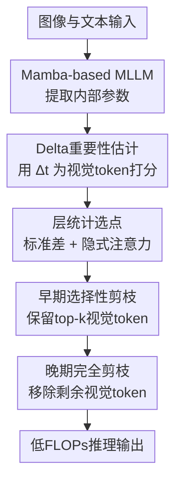

# DTP: Delta-Guided Two Stage Pruning for Mamba-based Multimodal Large Language Models

**会议**: ICLR2026  
**OpenReview**: [https://openreview.net/forum?id=uqT7TAhwrm](https://openreview.net/forum?id=uqT7TAhwrm)  
**代码**: 待确认  
**领域**: 模型压缩  
**关键词**: Mamba, 多模态大模型, 视觉Token剪枝, 推理加速, Delta重要性  

## 一句话总结
DTP 针对 Mamba-based 多模态大模型的视觉 token 冗余问题，用 Mamba 内部的输入相关参数 $\Delta_t$ 估计 token 重要性，并在早期层选择性剪枝、晚期层完全剪枝，在接近减半 FLOPs 的同时尽量保住多模态任务性能。

## 研究背景与动机
**领域现状**：多模态大模型通常把图像编码成大量视觉 token，再和文本 token 一起送入语言模型进行理解、问答或推理。Transformer-based MLLM 依赖自注意力，复杂度随序列长度平方增长；Mamba-based MLLM 则用状态空间模型的递推更新替代显式 attention，在解码阶段有线性复杂度和更低内存占用，因此被看作更高效的多模态骨干。

**现有痛点**：Mamba 缓解了解码阶段的重复计算，但并没有消除 prefill 阶段的负担。多模态输入里视觉 token 数量往往远多于文本 token，prefill 时这些 token 仍要一次性穿过所有层；如果图像 token 中存在大量背景、重复 patch 或对回答无关的信息，模型会把主要推理时间花在低价值 token 上。

**核心矛盾**：视觉 token 剪枝在 Transformer MLLM 中已经比较自然，因为 attention score 可以直接充当重要性信号；但 Mamba 没有显式注意力矩阵，直接搬用 FastV、DART 等 Transformer-oriented 方法会失去原本的依据。真正的难点不是“能不能剪 token”，而是如何在 Mamba 的内部机制里找到一个可信、无需训练、能区分视觉 token 贡献的信号。

**本文目标**：作者把问题拆成三个子问题：第一，找出 Mamba 内部哪个参数最适合作为视觉 token 重要性；第二，决定应该在哪些层剪枝，而不是手工指定固定层；第三，在减少 FLOPs 和 prefill latency 的同时，避免因为过早丢弃关键视觉信息而造成任务性能崩塌。

**切入角度**：论文从 Mamba 的选择性状态空间模型出发，关注输入相关的时间步参数 $\Delta_t$。这个参数会影响离散化后的状态转移和输入注入强度，因此比输出 $y_t$ 或系数 $B_t, C_t$ 更接近“当前 token 会对后续状态造成多大影响”。作者进一步观察不同层的 $\Delta_t$ 重要性分布和 Mamba 的 implicit attention pattern，用统计形态来选择早晚两个剪枝点。

**核心 idea**：用 $\Delta_t$ 作为 Mamba-native 的视觉 token 重要性信号，在早期层只保留 top-k 视觉 token，在晚期层直接移除剩余视觉 token，从而把 Mamba-based MLLM 的冗余视觉计算集中压掉。

## 方法详解
### 整体框架
DTP 是一个 training-free 的推理期视觉 token 剪枝框架，目标模型是 Cobra、RoboMamba 这类以 Mamba 为语言骨干的 MLLM。给定图像和文本输入后，模型先照常得到视觉 token 与文本 token；DTP 在每个 Mamba block 内读取 $\Delta_t$，把它平均成视觉 token 的重要性分数，再用层间统计决定两个剪枝层：早期层做选择性剪枝，晚期层做完全剪枝。

这里的“两阶段”并不是训练两次模型，而是在同一次前向推理中分两处减少视觉 token。早期剪枝负责去掉明显低价值的视觉 token，晚期剪枝利用论文观察到的深层视觉 token 贡献衰减现象，把已经不再提供稳定区分信息的视觉 token 全部移除。

### 关键设计
**1. Delta重要性估计：把 Mamba 的选择性参数变成视觉 token 分数**

DTP 的第一个关键判断是：不要为 Mamba 硬造一个 Transformer attention score，而要从 Mamba 自己的 selective SSM 里找重要性。Mamba 通过输入相关的 $\Delta_t$ 将连续 SSM 离散化，并调节离散状态转移 $\bar{A}_t$ 与输入映射 $\bar{B}_t$。直观地说，如果某个 token 的 $\Delta_t$ 更大，它会触发更强的状态更新；如果 $\Delta_t$ 很小，它对后续隐藏状态的扰动也更弱，更像一个低影响输入。

论文把第 $j$ 个 token 的重要性定义为 $s_j = \frac{1}{D}\sum_{d=1}^{D}\Delta_{j,d}$，即在通道维度上平均 $\Delta_t$。这个定义很克制：它不引入额外预测头，不需要微调，也不依赖下游标签，只使用前向过程中已经存在的内部量。后续消融也支持这个选择：用 $\Delta_t$ 做重要性在 Cobra 和 RoboMamba 上普遍优于 $y_t$、$B_t$、$C_t$，尤其在 TextVQA、POPE 等任务上更稳。

**2. 层统计选点：用标准差和隐式注意力决定在哪里剪**

视觉 token 剪枝最容易犯的错误是“层数拍脑袋”：剪得太早会丢掉还没被整合的信息，剪得太晚则省不了太多 prefill 计算。DTP 先在每层计算视觉 token 重要性分数的标准差，形式为 $Std_\ell = \sqrt{\frac{1}{N}\sum_{j=1}^{N}(s_{j,\ell}-\bar{s}_\ell)^2}$，再观察层间变化。标准差在这里不是单纯的统计装饰，而是用来判断 token 重要性是否已经出现可分离结构。

作者还借用 Mamba 的 implicit attention 解释：Selective SSM 展开后可以得到一个下三角 kernel 矩阵 $K$，它描述早期 token 如何影响后续输出。论文发现，在早期约前 $25\%$ 层中，标准差较低且隐式 token-token interaction 开始成形的位置更适合做选择性剪枝；在后 $30\%$ 层中，标准差出现 cliff-like 突变、隐式交互结构变弱的位置，则说明视觉 token 已经不再提供稳定的可区分贡献。于是早期剪枝层取 $k_{early}=\arg\min_\ell Std_\ell, 0\leq\ell\leq0.25L$，晚期剪枝层取 $k_{late}=\arg\max_\ell |Std_{\ell+1}-Std_\ell|+1, 0.7L\leq\ell<L-1$。

**3. 早期选择性剪枝：只剪视觉 token，保留高 Delta 的 top-k**

早期层仍然承担视觉语义聚合的任务，所以 DTP 不会粗暴移除所有视觉 token，而是按 $\Delta_t$ 分数排序，只保留 top-k 视觉 token。这里的“只剪视觉 token”非常重要：文本 token 是问题、指令和输出条件的载体，如果把 top-k 选择扩展到所有 token，文本 token 可能被误删，论文的消融显示这种策略会导致灾难性性能下降。

选择性剪枝的好处在于，它把冗余背景、重复 patch、低影响视觉区域尽早剔除，让后续层处理更短序列，从而直接降低 prefill FLOPs。与此同时，因为保留下来的视觉 token 是 $\Delta_t$ 认为更能改变状态更新的 token，模型仍有机会保住回答问题所需的核心视觉证据。相比随机剪枝，DTP 的 top-k visual-only 策略在 GQA、TextVQA、OKVQA 等任务上明显更稳。

**4. 晚期完全剪枝：在视觉贡献失稳后彻底移除剩余视觉 token**

DTP 的第二阶段更激进：到晚期层后，论文观察到视觉 token 重要性分布变得分散、标准差突变，implicit attention 的 token-token interaction 也开始弱化。作者的解释是，此时视觉信息已经被前面层注入到隐藏状态和文本条件中，继续保留视觉 token 不再带来稳定增益，反而消耗大量计算。

因此，DTP 在 $k_{late}$ 进行 complete pruning，直接去掉剩余视觉 token，让后续层主要围绕文本和已融合状态继续推理。这个设计看起来大胆，但消融表明它很划算：在早期剪枝比例固定时，加上晚期完全剪枝能让 Cobra FLOPs 从 1.26 降到 0.97，让 RoboMamba 从 0.44 降到 0.34，而 GQA、TextVQA、VizWiz、POPE、OKVQA 等指标几乎不变。也就是说，晚期完全剪枝贡献了额外计算节省，却没有明显牺牲任务表现。

### 一个完整示例
假设 Cobra 接收一张图像和一个视觉问答问题，视觉编码器产生 729 个视觉 token，文本侧包含用户问题和提示词。前几层中，DTP 不立即动手，因为此时视觉 token 之间的语义关系还在形成；模型前向到早期候选区间后，DTP 读取每个视觉 token 的 $\Delta_t$，在通道维度求平均得到 729 个分数。

如果当前 keep ratio 设为 $r=0.5$，DTP 会在 $k_{early}=15$ 附近保留分数最高的一半视觉 token，大约从 729 个降到 365 个。剩余 token 继续穿过中间层，与文本 token 一起完成视觉语义整合。到 $k_{late}=45$ 附近，DTP 根据层统计判断模型进入视觉 token 贡献不稳定的晚期阶段，于是把剩余视觉 token 全部移除，只让文本 token 和已经融合过视觉信息的隐藏状态继续走完后续层。

这个过程的关键不是“越早剪越好”，而是早期只剪低重要性视觉 token、晚期再彻底退出视觉 token 计算。前者负责控制信息损失，后者负责拿到更大的 FLOPs 与 latency 收益。

### 损失函数 / 训练策略
DTP 没有新增训练损失，也不需要重新训练 Cobra 或 RoboMamba。它是一个 plug-in 的推理期策略：先用少量样本统计各层 $\Delta_t$ 重要性分布，确定 $k_{early}$ 和 $k_{late}$，然后在正式推理时按这两个层执行剪枝。

论文实验中，早期选择性剪枝由 keep ratio $r$ 控制。较温和设置如 $r=0.9$ 主要追求几乎无损的 FLOPs 下降；较激进设置如 $r=0.5$ 则把 FLOPs 降到约一半。附录的 keep ratio 曲线显示，随着 $r$ 从 1.0 降到 0.3，Cobra 和 RoboMamba 的平均性能大致平滑下降，没有出现突然崩塌，这说明 $\Delta_t$ 排序至少在这些 Mamba-based MLLM 上具有一定稳定性。

## 实验关键数据

### 主实验
论文在两个代表性 Mamba-based MLLM 上验证 DTP：Cobra 和 RoboMamba。Cobra 覆盖 GQA、VQAv2、TextVQA、POPE、VSR、VizWiz 六个多模态理解基准；RoboMamba 覆盖 OKVQA、GQA、VQAv2、POPE、VizWiz 五个基准。对比方法包括改造后的 FastV、VTW 和 DART。

| 模型 | 方法 | FLOPs比例 | 平均分 | 相对原模型变化 |
|------|------|-----------|--------|----------------|
| Cobra | Baseline | 100% | 65.8 | 0.0 |
| Cobra | FastV, 约70% FLOPs | 72% | 65.3 | -0.5 |
| Cobra | VTW, 约70% FLOPs | 71% | 65.7 | -0.1 |
| Cobra | DART, 约70% FLOPs | 69% | 65.2 | -0.6 |
| Cobra | DTP, $r=0.9$ | 67% | 65.8 | 0.0 |
| Cobra | FastV, 约50% FLOPs | 53% | 64.7 | -1.1 |
| Cobra | VTW, 约50% FLOPs | 52% | 54.0 | -11.8 |
| Cobra | DART, 约50% FLOPs | 48% | 64.3 | -1.5 |
| Cobra | DTP, $r=0.5$ | 48% | 64.9 | -0.9 |

| 模型 | 方法 | FLOPs比例 | 平均分 | 相对原模型变化 |
|------|------|-----------|--------|----------------|
| RoboMamba | Baseline | 100% | 67.0 | 0.0 |
| RoboMamba | FastV, 约70% FLOPs | 71% | 66.6 | -0.4 |
| RoboMamba | VTW, 约70% FLOPs | 71% | 66.6 | -0.4 |
| RoboMamba | DART, 约70% FLOPs | 67% | 66.1 | -0.9 |
| RoboMamba | DTP, $r=0.9$ | 66% | 66.7 | -0.3 |
| RoboMamba | FastV, 约50% FLOPs | 53% | 65.6 | -1.4 |
| RoboMamba | VTW, 约50% FLOPs | 51% | 53.4 | -13.6 |
| RoboMamba | DART, 约50% FLOPs | 51% | 65.4 | -1.6 |
| RoboMamba | DTP, $r=0.5$ | 49% | 65.9 | -1.1 |

在 Cobra 上，DTP 的优势最清楚：$r=0.9$ 时 FLOPs 已降到 67%，平均分仍与 baseline 持平；$r=0.5$ 时 FLOPs 降到 48%，平均分只掉 0.9。RoboMamba 因为原始视觉 token 只有 256 个，比 Cobra 的 729 个更少，激进剪枝时更容易丢信息，但 DTP 仍比 FastV、DART 和 VTW 保持更小平均降幅。

### 消融实验
| 消融项 | 设置 | 代表结果 | 说明 |
|--------|------|----------|------|
| 重要性参数 | $y_t$ / $B_t$ / $C_t$ / $\Delta_t$ | Cobra TextVQA 上 $\Delta_t$ 为 56.1，$y_t$ 为 48.0，$B_t$ 为 47.4，$C_t$ 为 44.9 | $\Delta_t$ 更适合衡量 Mamba 中 token 对状态更新的贡献 |
| Token选择范围 | Random / Top-k all tokens / Top-k visual only | Cobra GQA 上 Top-k all tokens 只有 7.01，Top-k visual only 为 61.4 | 文本 token 不能被剪，剪枝目标应限制在视觉 token |
| 晚期完全剪枝 | 去掉 / 保留 complete pruning | Cobra FLOPs 从 1.26 降到 0.97，GQA 61.5 到 61.4，TextVQA 保持 56.1 | 晚期完全剪枝贡献约 23% 额外 FLOPs 节省，性能几乎不变 |
| RoboMamba晚期剪枝 | 去掉 / 保留 complete pruning | FLOPs 从 0.44 降到 0.34，POPE 保持 84.4，OKVQA 63.9 到 63.8 | 在较少视觉 token 的模型上也能稳定节省计算 |

### 关键发现
- DTP 的主要收益来自两个互补环节：早期 top-k visual-only 剪枝控制信息损失，晚期 complete pruning 负责进一步压缩计算。
- $\Delta_t$ 是本文最关键的信号源。它比 $B_t$、$C_t$ 或输出 $y_t$ 更贴近 Mamba 的选择性机制，因此作为剪枝依据更自然。
- 不能把视觉 token 剪枝策略简单扩展到所有 token。Top-k all tokens 会误删文本条件，在 Cobra 和 RoboMamba 上都导致性能崩溃。
- 实际速度收益和 FLOPs 下降能对上：在 Cobra + POPE 上，DTP 将 mean prefill latency 从 98.04 ms 降到 61.54 ms，总延迟从 16m05s 降到 10m35s，GPU memory 从 8.8 GB 降到 8.3 GB。
- RoboMamba 的降幅略不如 Cobra 从容，原因是视觉 token 起点更少，冗余空间更小；这提示 DTP 更适合视觉 token 数量较大的 Mamba-based MLLM。

## 亮点与洞察
- DTP 最好的地方是没有把 Transformer 的 attention 剪枝思路生搬硬套到 Mamba 上，而是回到 selective SSM 的内部变量，找到 $\Delta_t$ 这个更“原生”的重要性信号。
- 两阶段剪枝的逻辑很清楚：早期层还有视觉信息整合风险，所以只做选择性剪枝；晚期层视觉 token 贡献已经弱化，所以直接完全剪枝。这比单点剪枝更贴合深层 MLLM 的信息流。
- 论文把 layer-wise standard deviation 和 implicit attention pattern 放在一起分析，为 Mamba-based MLLM 的可解释压缩提供了一个有用视角。即使以后不用 DTP，这种“从内部状态分布找压缩时机”的方法也可以迁移到其他 Mamba/VSS 模型。
- 对工程部署来说，DTP 的吸引力在于 training-free。很多推理加速方法需要重新训练或校准复杂超参，而 DTP 主要依赖前向统计和固定剪枝策略，接入成本相对低。
- 这篇论文也提醒我们：Mamba-based MLLM 的效率瓶颈并不只在解码阶段。即使骨干架构已经线性复杂度，视觉 token 的 prefill 成本仍可能支配整体延迟。

## 局限与展望
- 实验模型主要是 Cobra 和 RoboMamba，两者能代表当前公开 Mamba-based MLLM，但覆盖面仍有限。更大规模、更强视觉编码器、更长上下文设置下，$\Delta_t$ 分布是否保持同样规律还需要验证。
- DTP 的剪枝点依赖少量样本上的层统计。论文显示跨数据集趋势一致，但如果部署任务和校准样本分布差别很大，早晚剪枝层可能需要重新估计。
- 完全剪枝的前提是晚期视觉 token 不再提供稳定贡献。对于需要细粒度定位、OCR 或长链视觉推理的样本，个别视觉 token 可能在晚期仍有价值；当前策略没有样本级动态恢复机制。
- 论文主要评估标准 VQA/POPE/VSR/VizWiz 等基准，对真实在线服务中的 batch size、显存碎片、不同硬件 kernel 优化讨论不多。FLOPs 与 wall-clock latency 虽然方向一致，但部署收益仍受实现细节影响。
- 后续可以考虑把 DTP 做成样本自适应策略：根据当前输入的 $\Delta_t$ 分布尖锐程度动态调 keep ratio，或者为 OCR/小目标/高分辨率图像设置更保守的剪枝门控。

## 相关工作与启发
- **vs FastV**: FastV 来自 Transformer-based MLLM，核心依据是 attention score，并在较早层剪掉视觉 token。DTP 的区别是用 Mamba 的 $\Delta_t$ 替代显式 attention，并通过统计自动选择早晚两个剪枝点，因此更适合 Mamba 架构。
- **vs VTW**: VTW 用 KL divergence 判断视觉 token 可以撤出的层，本身相对架构无关。DTP 不需要比较原输出和撤出后的 logits，而是直接从 Mamba 层内分布和 implicit attention 形态决定剪枝点；实验中 VTW 在约 50% FLOPs 设置下掉点很大。
- **vs DART**: DART 关注视觉 token duplication，通过 pivot token 和相似度移除重复 token。DTP 关注的是 Mamba 状态更新贡献，判断依据不是 token 间相似度，而是 $\Delta_t$ 对隐藏状态演化的影响。
- **vs Vision Mamba token pruning / Famba-V**: 这些工作主要处理单模态视觉 Mamba 或 token fusion。DTP 的任务场景是 Mamba-based MLLM，强调视觉 token 与文本 token 共存时只剪视觉侧，并验证多模态问答、幻觉检测和视觉空间推理等任务。
- **启发**: 对 Mamba 类模型做压缩时，可以少一点“找 attention 替代品”的惯性，多分析 selective SSM 内部参数本身。$\Delta_t$、隐式 kernel、层间分布突变都可能成为剪枝、早退、动态计算分配的依据。

## 评分
- 新颖性: ⭐⭐⭐⭐☆ 用 $\Delta_t$ 做 Mamba-native token importance 并配合早晚两阶段剪枝，问题切得比较准，但整体仍属于推理期 token pruning 范式。
- 实验充分度: ⭐⭐⭐⭐☆ 覆盖两个 Mamba-based MLLM、十余个任务指标、延迟和多项消融，证据较扎实；更大模型和真实部署场景还可补充。
- 写作质量: ⭐⭐⭐⭐☆ 动机、公式和实验表格清楚，层选择分析有图支撑；部分关于标准差“低峰/突变”的直觉解释还可以写得更严谨。
- 价值: ⭐⭐⭐⭐☆ 对 Mamba-based MLLM 推理加速很有参考价值，尤其适合视觉 token 较多、prefill 成本明显的部署场景。

<!-- RELATED:START -->

## 相关论文

- [\[ACL 2026\] Two-Stage Regularization-Based Structured Pruning for LLMs](../../ACL2026/model_compression/two-stage_regularization-based_structured_pruning_for_llms.md)
- [\[ICLR 2026\] Entropy-Based Block Pruning for Efficient Large Language Models](entropy-based_block_pruning_for_efficient_large_language_models.md)
- [\[ICLR 2026\] RCPU: Rotation-Constrained Error Compensation for Structured Pruning of Large Language Models](rcpu_rotation-constrained_error_compensation_for_structured_pruning_of_large_lan.md)
- [\[ICLR 2026\] ES-dLLM: Efficient Inference for Diffusion Large Language Models by Early-Skipping](es-dllm_efficient_inference_for_diffusion_large_language_models_by_early-skippin.md)
- [\[ICLR 2026\] KBVQ-MoE: KLT-guided SVD with Bias-Corrected Vector Quantization for MoE Large Language Models](kbvq-moe_klt-guided_svd_with_bias-corrected_vector_quantization_for_moe_large_la.md)

<!-- RELATED:END -->
