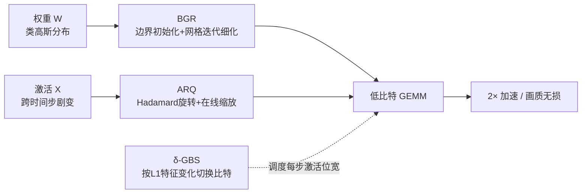

# DVD-Quant: Data-free Video Diffusion Transformers Quantization

**会议**: ICLR 2026  
**OpenReview**: [https://openreview.net/forum?id=3AnRMvlVDw](https://openreview.net/forum?id=3AnRMvlVDw)  
**代码**: 待开源（论文承诺 Code and models will be released）  
**领域**: 模型压缩 / 训练后量化 / 视频扩散模型  
**关键词**: Video DiT, 训练后量化(PTQ), 数据无关量化, W4A4, 混合精度, Hadamard 旋转  

## 一句话总结
DVD-Quant 提出一套**完全免标定（data-free）**的视频扩散 Transformer 训练后量化框架，用权重网格细化（BGR）、自动缩放旋转量化（ARQ）和 δ 引导比特切换（δ-GBS）三件套，首次让 Video DiT 在 W4A4 下不掉画质，并在 HunyuanVideo 上实现约 2× 加速。

## 研究背景与动机
**领域现状**：扩散 Transformer（DiT）已成为视频生成的 SOTA 架构（Sora、HunyuanVideo、Wan2.1 等），但 50 步迭代去噪 + 全注意力带来的算力和显存开销让部署极其昂贵。训练后量化（PTQ）是无需重训、即插即用的加速路线，ViDiT-Q 等已能做到 W8A8 近乎无损。

**现有痛点**：把激活精度压到 8 bit 以下时，已有 PTQ 方法集体失效——VBench 指标暴跌 27.5%~61.3%。原因有两条：(1) 主流方法依赖**离线标定（calibration）预缩放**，既费时又无法适配 DiT 中随去噪时间步剧烈变化的激活尺度；(2) 直接做 W4A4 激进量化会让生成质量崩塌。

**核心矛盾**：DiT 量化的难点本质是**时变性**——激活分布在 50 个时间步上漂移巨大，而标定集只是某些时间步的快照，注定无法覆盖全程；同时权重呈类高斯分布，MinMax 固定范围把大量码位浪费在仅占 0.3% 的离群值上。

**本文目标**：彻底甩掉标定数据，在 W4A6 甚至 W4A4 下保住视频保真度并拿到实打实的加速。

**核心 idea**：作者从三个观察出发——**(观察1) 权重类高斯分布**适合迭代细化量化网格；**(观察2) 激活尺度跨时间步剧变**必须在线动态缩放而非离线静态；**(观察3) 潜在特征在不同去噪步变化不均**，给了按步自适应分配比特宽度的空间。三个设计分别对症下药。

## 方法详解

### 整体框架
DVD-Quant 由三个互补模块串成一条数据无关的量化流水线：**BGR** 负责权重侧，把类高斯权重的量化误差压下去；**ARQ** 负责激活侧，用 Hadamard 旋转 + 在线缩放替代离线标定；**δ-GBS** 负责调度，按特征变化在时间步层面动态切换激活比特宽度。三者协同后才能在 W4A4/W4A6 下保住画质。

### 关键设计

**1. BGR（Bounded-init Grid Refinement）：用闭式坐标下降把权重量化误差打下 86%。** MinMax 量化直接拿权重极值算步长 $\Delta=(\max(W)-\min(W))/(2^b-1)$，对类高斯权重极不友好——离群区吃掉过多码位、零均值密集区间隔又太粗。BGR 把目标重写成最小化 $\|W-\Delta\odot(W_q-z)\|_F$，并指出 MinMax 解只是个初始化。由于 PTQ 要避免梯度下降，作者采用**固定两者优化第三者**的坐标下降：先固定 $z,W$，对步长求最小二乘闭式解 $\Delta'=\langle W_q-z,\,W\rangle_{\text{row}}\oslash\langle W_q-z,\,W_q-z\rangle_{\text{row}}$；再固定 $\Delta',W_q$ 把零点松弛到实数后取整 $z'=\text{clamp}(W_q-W\oslash\Delta',0,2^b-1)$；最后更新 $W_q$，循环到误差收敛。初始化不用裸 MinMax 而用**搜索边界**——逐步内缩裁剪上下界 $W_c=\text{clamp}(W,\min(W)+\delta_l,\max(W)-\delta_u)$ 来排除离群值，给迭代一个更好的起点。整套流程纯权重侧离线完成，推理期零额外开销，在 HunyuanVideo 各层把量化误差平均降低约 86%~91%。

**2. ARQ（Auto-scaling Rotated Quantization）：旋转压离群 + 在线缩放抗时变，干掉标定数据。** 激活量化有两大死穴：跨时间步动态变化让离线缩放因子失效；纯旋转法虽能压制大离群值，却可能在变换空间放大某些激活反而引入新误差。ARQ 把旋转和缩放的长处合一：先用 Hadamard 矩阵 $H$ 同时乘到激活和权重两侧保持计算不变性 $Y=(XH)(H^\top W)$（快速 Hadamard 变换，延迟开销极小），再**在线**逐通道算缩放因子并只作用到激活（不转移到权重）：

$$\widehat{X}=Q(XH\Lambda^{-1}),\quad \widehat{W}=\text{BGR}(WH),\quad Y=\widehat{X}\,\Lambda\,\widehat{W}^\top,$$

其中 $s_j=\|\widetilde{X}_j\|_\infty$、$\Lambda=\text{diag}(s_1,\dots,s_c)$。旋转负责把海量离群值打散到多个通道，旋转后的在线缩放再强化通道一致性、修掉旋转带来的副作用。关键是缩放因子**每个时间步实时算**，天然适配 DiT 激活的时变分布，无需任何标定集。实际部署时为对齐低比特 Tensor Core 的 GEMM 粒度，ARQ 采用与硬件对齐的 **block-wise 缩放**变体，论文所有延迟/精度数字都基于这一硬件友好配置。

**3. δ-GBS（δ-Guided Bit Switching）：按特征变化在时间步上动态切位宽。** DiT 去噪过程中特征演化高度不均——很多冗余步特征几乎不变，少数关键步发生剧烈变换。统一位宽要么浪费算力要么在关键步掉质。δ-GBS 实时监控相邻输出的归一化 L1 距离 $L_1(F,t)=\|F_t-F_{t-1}\|_1/\|F_{t-1}\|_1$，对自上次重置以来的累计变化做阈值判断：

$$B_{t_i}=\begin{cases}b_{\text{low}}, & \sum_{t=t_p}^{t_i-1}L_1(F,t)<\delta\\[4pt] b_{\text{high}}, & \sum_{t=t_p}^{t_i-1}L_1(F,t)\ge\delta\end{cases}$$

累计特征变化低于 $\delta$ 时说明该段冗余、用低位宽 $b_{\text{low}}$；一旦超过 $\delta$ 就切到高位宽 $b_{\text{high}}$ 保细节并把累计器清零。这种误差驱动的决策**随输入 prompt 自适应**，比静态时间步划分或固定模式更贴合实际内容。$\delta$ 是性能-效率旋钮：$\delta\to0$ 退化为全程 W4A8，$\delta\to\infty$ 退化为 W4A4，中间值则在激活层面平滑插值，避免离散位宽突变带来的质量抖动。实验取 $b_{\text{low}}=4,\,b_{\text{high}}=8$，50 步平均位宽约 6（即 W4A6）。

## 实验关键数据

### 主实验表格（HunyuanVideo，VBench）

| 方法 | W/A | Aesthetic | Imaging | Overall Consist. | Dynamic Degree |
|---|---|---|---|---|---|
| HunyuanVideo (FP) | 16/16 | 62.53 | 64.78 | 25.86 | 51.39 |
| MinMax | 4/8 | 59.44 | 60.62 | 25.78 | 52.78 |
| SmoothQuant | 4/8 | 60.50 | 64.47 | 25.56 | 51.39 |
| Quarot | 4/8 | 58.80 | 56.86 | 25.33 | 55.56 |
| ViDiT-Q | 4/8 | 57.01 | 59.74 | 24.77 | 48.61 |
| **DVD-Quant** | **4/6** | **62.27** | **64.22** | **25.83** | **58.33** |
| MinMax | 4/4 | 24.20 | 24.78 | 4.27 | 0.00 |
| SmoothQuant | 4/4 | 48.41 | 59.46 | 21.09 | 1.39 |
| Quarot | 4/4 | 44.85 | 54.30 | 17.33 | 87.5 |
| ViDiT-Q | 4/4 | 45.36 | 40.10 | 19.66 | 0.00 |
| **DVD-Quant** | **4/4** | **61.96** | **61.82** | **25.68** | **56.94** |

W4A6 几乎追平 FP16 并全面超越所有 W4A8 baseline；W4A4 下其他方法集体崩溃（动态度归零或画质腰斩），DVD-Quant 仍保持稳定，是**首个 W4A4 不掉画质**的 Video DiT PTQ。

### 消融实验表格（BGR / ARQ）

| BGR | ARQ | W/A | Aesthetic | Imaging | Subject Consist. |
|---|---|---|---|---|---|
| ✓ | | W4A6 | 58.15 | 58.68 | 98.04 |
| | ✓ | W4A6 | 57.85 | 57.72 | 98.23 |
| ✓ | ✓ | W4A6 | **60.46** | **61.93** | **98.91** |
| ✓ | | W4A4 | 53.95 | 52.67 | 97.92 |
| | ✓ | W4A4 | 43.26 | 58.31 | 95.36 |
| ✓ | ✓ | W4A4 | **59.57** | **58.93** | **98.67** |

BGR、ARQ 缺一不可，二者协同才达最优；尤其 W4A4 下去掉任一模块都明显掉分。δ-GBS 对比 STP/ITP/ABS/SBA 四种固定模式混合精度策略，Imaging Quality（61.93）均居首。

### 关键发现
- **加速与显存**：HunyuanVideo 上显存优化 3.68×；延迟 W4A8 加速 1.75×、W4A6 1.93×、W4A4 2.12×（约 2×）。
- **叠加 TeaCache** 缓存技术后端到端加速进一步到 W4A8 4.01×、W4A4 4.85×，画质几乎不降。
- **δ 是平滑旋钮**：$\delta$ 从 0.06→0.18，平均位宽随之下降、Imaging Quality 从 62.11 平滑滑到 61.00，连续可调而非突变。

## 亮点与洞察
- **彻底数据无关**是最大卖点：BGR 纯权重闭式细化、ARQ 在线算缩放、δ-GBS 实时监控特征，全程不碰任何标定集，直接破解了 DiT 激活时变 vs 标定快照的根本矛盾。
- **三模块各打一个观察**，逻辑闭环干净：高斯权重→网格细化、时变激活→在线旋转缩放、不均特征→自适应位宽，没有冗余设计。
- ARQ 把"旋转打散离群 + 在线缩放修旋转副作用"组合起来，且落到 Tensor Core 的 block-wise 粒度，是真能跑出加速的工程化方案而非纸面理论。
- δ-GBS 用累计 L1 误差做触发器，天然随 prompt 内容自适应，且在 W4A8↔W4A4 之间提供连续插值，避免离散切换抖动——这是相比静态划分的实质优势。

## 局限与展望
- **主表只在 HunyuanVideo 上做**，Wan2.1 结果挪到附录，跨更多视频 DiT（CogVideoX、Open-Sora 等）和文生图 DiT 的普适性还需更系统验证。
- **VBench 指标 vs 人眼**：动态度等指标偶有反常（如 Quarot W4A4 动态度 87.5 却整体崩坏），单看自动指标可能误导，缺少大规模人评。
- **δ 阈值需手调**，虽是单旋钮但不同模型/prompt 的最优 δ 仍要经验设定，离全自动还有距离。
- ARQ 的 Hadamard 旋转和在线缩放虽"开销极小"，但在线缩放因子每步重算对极长视频/极多步数场景的累积开销值得进一步量化。

## 相关工作与启发
- **DiT 量化谱系**：QAT 路线（Ter-DiT 三值训练）精度高但要重训；PTQ 路线 SVDQuant（低秩分支吸收离群值做 4-bit）、ViDiT-Q（W8A8 近无损）即插即用。DVD-Quant 站在 PTQ 一侧，把精度边界从 W8A8 推到 W4A4。
- **量化通用技术**：SmoothQuant 的通道缩放、Quarot 的正交旋转、Q-Diffusion/PTQ4DM 的时间步统计——ARQ 实质是"旋转(Quarot 系) + 在线缩放(SmoothQuant 系)"的融合升级，并去掉了它们共有的标定依赖。
- **启发**：对一切"分布随推理过程漂移"的模型（扩散、自回归长生成），**在线动态量化**可能比离线标定更本质；而把压缩模块和缓存（TeaCache）正交叠加能拿到乘性加速，是部署侧值得复用的组合拳。

## 评分
- **新颖性**: ⭐⭐⭐⭐ — 三模块组合新颖，首次实现 Video DiT 的 W4A4 无损 PTQ，"完全数据无关"是清晰的差异化卖点；单看每个技术（旋转、缩放、混合精度）有前作影子。
- **实验充分度**: ⭐⭐⭐⭐ — VBench 八维度对比 + 充分消融 + 延迟/显存/TeaCache 叠加 + δ 敏感性扫描；但主表集中在单一模型、缺人评略减分。
- **写作质量**: ⭐⭐⭐⭐ — 三观察→三设计的结构清晰，公式与算法完整，图表（误差对比、可视化）有力。
- **价值**: ⭐⭐⭐⭐⭐ — 视频生成部署成本是真痛点，2× 加速 + W4A4 不掉画质 + 免标定即插即用，工程落地价值高，承诺开源。

<!-- RELATED:START -->

## 相关论文

- [\[ICLR 2026\] Quant-dLLM: Post-Training Extreme Low-Bit Quantization for Diffusion Large Language Models](quant-dllm_post-training_extreme_low-bit_quantization_for_diffusion_large_langua.md)
- [\[ICML 2026\] Selective Coupling of Decoupled Informative Regions: Masked Attention Alignment for Data-Free Quantization of Vision Transformers](../../ICML2026/model_compression/selective_coupling_of_decoupled_informative_regions_masked_attention_alignment_f.md)
- [\[ICLR 2026\] DiffVax: Optimization-Free Image Immunization Against Diffusion-Based Editing](diffvax_optimization-free_image_immunization_against_diffusion-based_editing.md)
- [\[ICLR 2026\] Post-Training Quantization for Video Matting](post-training_quantization_for_video_matting.md)
- [\[CVPR 2025\] Q-DiT: Accurate Post-Training Quantization for Diffusion Transformers](../../CVPR2025/model_compression/q-dit_accurate_post-training_quantization_for_diffusion_transformers.md)

<!-- RELATED:END -->
