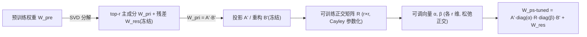

# Efficient Orthogonal Fine-Tuning with Principal Subspace Adaptation

**会议**: ICLR 2026  
**OpenReview**: [https://openreview.net/forum?id=FSHrinMArK](https://openreview.net/forum?id=FSHrinMArK)  
**代码**: [https://github.com/fei407/PSOFT](https://github.com/fei407/PSOFT)  
**领域**: 参数高效微调 / 模型压缩  
**关键词**: PEFT, 正交微调(OFT), 主子空间, 低秩, 语义保持, Cayley 参数化  

## 一句话总结
PSOFT 把正交微调从「全参数空间」搬到「预训练权重的低秩主子空间」里做，用 SVD 构造维度兼容的投影、给出一个严格保持子空间几何（角度+范数）的理论条件，再加两条可调向量松弛正交性，从而第一次让 OFT 在参数量、显存、算力三个维度上都追平甚至超过 LoRA。

## 研究背景与动机
**领域现状**：参数高效微调(PEFT)里有两条主线。LoRA 用加性低秩更新 $W=W_{pre}+AB$，便宜、无推理延迟，但会扭曲预训练权重列向量之间的角度/范数关系（即「语义表示」），在生成类任务上可能掉质量。正交微调(OFT)走乘法路线 $W=RW_{pre}$，用正交矩阵 $R$ 做等距变换，严格保住列向量的角度和范数（hyperspherical energy），语义保持好。

**现有痛点**：OFT 的正交矩阵 $R\in\mathbb{R}^{d\times d}$ 在全参数空间太贵。后续工作为了省参数引入稀疏结构——block-diagonal OFT 用块对角，但刚性块结构限制表达力；BOFT/qGOFT 把 $R$ 拆成多个稀疏矩阵连乘（butterfly / Givens 旋转）来恢复表达力，可是链式连乘产生大量中间激活，反而吃显存、拖训练。论文给的数字很扎心：qGOFT 训练比 LoRA 慢约 6×，BOFT/qGOFT 在大模型上经常超过 80GB 显存、频繁 OOM。

**核心矛盾**：稀疏化路线的 OFT 没法同时兼顾「表达力」和「多维效率（参数/显存/算力）」——省了参数却赔了显存和速度。

**本文目标**：设计一个同时做到**语义保持 + 表达力 + 多维效率**的 PEFT 方法。

**核心 idea**：**把正交变换约束到预训练权重的低秩主子空间**。既然大量证据表明预训练模型及其任务适配都处于低内在秩，那就没必要在全空间里做正交变换——只在 top-r 主成分张成的子空间里转，就能跳出全空间 OFT 的低效，同时保住语义、保住表达力。难点有三：①低维正交矩阵和高维权重维度不兼容；②朴素地在子空间做正交变换会破坏子空间几何；③严格正交会限制对任务漂移的适配。

## 方法详解

### 整体框架
PSOFT 冻结预训练权重，先对 $W_{pre}$ 做 SVD 拆成「主成分 $W_{pri}$ + 残差 $W_{res}$」，把 $W_{pri}$ 分解成投影矩阵 $A'$ 与重构矩阵 $B'$（二者都冻结），只在中间训练一个 $r\times r$ 的正交矩阵 $R$ 和两条 $r$ 维可调向量 $\alpha,\beta$。前向计算为 $h=(A'\,\mathrm{diag}(\alpha)\,R\,\mathrm{diag}(\beta)\,B'+W_{res})^\top x$。整条链路依次解决三个难点：SVD 投影解决维度兼容，理论条件 $R^\top A^\top A R=A^\top A$ 保证几何不变，可调向量负责松弛正交性。

### 关键设计

**1. 维度兼容的子空间正交变换：用 SVD 把高维权重投影进低秩主子空间。** 直接把 $R\in\mathbb{R}^{r\times r}$ 作用到 $W_{pre}\in\mathbb{R}^{d\times n}$ 维度对不上，所以先做 $W_{pre}=U\Sigma V^\top$，取前 $r$ 个奇异值/向量重构出主成分 $W_{pri}=U_{[:,:r]}\Sigma_{[:r,:r]}V_{[:,:r]}^\top$，剩下的是残差 $W_{res}=W_{pre}-W_{pri}$。把 $W_{pri}$ 写成 $A B$（$A$ 把权重投进 $r$ 维主子空间、$B$ 再重构回去），正交变换就在子空间里做：$W_{ps\text{-}tuned}=ARB$。这里有个很关键的参数效率账：LoRA 训两个矩阵，$M=(d+n)r_{LoRA}$，故 $r_{LoRA}=M/(d+n)$；PSOFT 只训一个正交矩阵，$M=r_{PSOFT}^2$，故 $r_{PSOFT}=\sqrt{M}$。因为 $\sqrt{M}\ll d+n$，所以**同样参数预算下 PSOFT 能用大得多的秩**，表达力更强——这正是它在大模型上把 $r$ 拉到几百仍便宜的原因。

**2. 几何保持的理论条件：不是随便一个正交 $R$ 都能保住子空间几何。** 仅维度兼容还不够，朴素地把低维正交矩阵套到对称分解的 $A,B$ 上仍会扭曲 $W_{pri}$ 列向量之间的角度和范数。论文给出 Theorem 4.1：要让 $W_{ps\text{-}tuned}=ARB$ 同时保住列间夹角和列范数，必须满足 $R^\top A^\top A R=A^\top A$。直觉是：子空间几何由 Gram 矩阵 $G=A^\top A$ 编码，任何满足 $R^\top G R=G$ 的 $R$ 都是这套几何的「对称」（类似旋转或反射），先对 $B$ 的列施加 $R$ 再用 $A$ 投影，高维空间里的角度和长度都不变。实践上把 $A$ 正交归一化使 $A^\top A=I_r$，条件就退化成「$R$ 是标准正交矩阵」。于是分解从对称形式改成**非对称形式** $A'=U_{[:,:r]}$、$B'=\Sigma_{[:r,:r]}V_{[:,:r]}^\top$，$R$ 初始化为单位阵（训练从 $W_{pre}$ 起步）。为低成本维持 $R$ 严格正交，采用 Cayley 参数化 $R=(I-Q)(I+Q)^{-1}$（$Q$ 反对称），并按 OFTv2 用 5 项截断 Neumann 级数近似 $(I+Q)^{-1}$，避免昂贵的 Gram-Schmidt。

**3. 低成本松弛正交性：两条可调向量换来对任务漂移的适配力。** 严格正交虽保语义，却限制了对任务特定漂移的适应，性能会次优。已有方法的松弛都很贵：qGOFT 松弛灵活但要 4 倍参数，BOFT 在输出维加缩放向量、尺寸随模型线性增长。PSOFT 的做法是在正交矩阵两侧各插一条 $r$ 维可调向量，前向变成 $h=(A'\,\mathrm{diag}(\alpha)\,R\,\mathrm{diag}(\beta)\,B'+W_{res})^\top x$，$\alpha,\beta$ 初始化为全 1（保证训练起点严格正交），训练中逐渐松弛、允许角度可调、范数可缩放。因为向量插在子空间内部，开销只有 $2r$ 个参数（$2r\ll n$），且可对 $C=\mathrm{diag}(\alpha)R\,\mathrm{diag}(\beta)$ 施加显式约束 $\|C^\top C-I\|_F\le\epsilon$ 防止偏离正交太多。合起来，PSOFT 总可训练参数仅 $r(r-1)/2+2r$，附加矩阵的数量和尺寸都从 $\min(d,n)$ 降到 $r$，激活显存因此远低于其他 OFT 变体。

## 实验关键数据
覆盖 35 个 NLP+CV 任务，4 个代表模型：DeBERTaV3-base、ViT-B/16（小模型），LLaMA-3.2-3B、LLaMA-3.1-8B（大模型）。

### 主实验表格

DeBERTaV3-base / GLUE（5 seed 平均，显存为序列长 64 的峰值）：

| 方法 | #Params | 显存(GB) | Avg. |
|------|---------|----------|------|
| FFT | 184M | 5.9 | 86.68 |
| GOFTv2 | 0.08M | 18.5 | OOM |
| qGOFTv2 | 0.33M | 18.5 | OOM |
| BOFT (b=8,m=2) | 1.41M | 6.3 | 86.83 |
| OFTv2 (b=32) | 1.29M | 4.5 | 86.34 |
| LoRA (r=8) | 1.33M | 4.5 | 87.30 |
| DoRA (r=8) | 1.41M | 5.8 | 87.61 |
| LoRA-XS (r=136) | 1.33M | 4.2 | 86.43 |
| **PSOFT (r=46)** | **0.08M** | **4.1** | **88.04** |

PSOFT 用最少参数（0.08M，约 18× 于 LoRA 类）、最低显存拿下最高平均分；和 GOFT 同参数量却省约 80% 显存且不 OOM。

ViT-B/16 / VTAB-1K：PSOFT 73.4 平均，参数比 LoRA 类少约 94%、显存最低；GOFTv2/qGOFTv2 直接 OOM。

大模型 LLaMA-3.2-3B / GSM-8K & MATH：

| 方法 | #Params | 显存(GB) | GSM-8K | MATH |
|------|---------|----------|--------|------|
| OFTv2 (b=32) | 11.6M | 35.2 | 61.03 | 15.70 |
| LoRA (r=8) | 12.2M | 32.2 | 60.80 | 15.76 |
| PiSSA (r=8) | 12.2M | 32.2 | 61.26 | 14.96 |
| DoRA (r=8) | 12.9M | 43.4 | 62.62 | 15.48 |
| **PSOFT (r=352)** | 12.2M | 36.2 | **63.08** | **15.98** |

BOFT/GOFTv2/qGOFTv2 在 3B 上全部 OOM；PSOFT 比 LoRA 高 +2.28%（GSM-8K）、比 PiSSA 高 +1.02%（MATH），显存与 LoRA 类相当。LLaMA-3.1-8B / 8 个常识推理基准上 PSOFT 平均 82.54，最高，比 OFTv2 高 1.77%、比 DoRA 省约 7GB 显存。

### 消融实验表格

| 消融项 | 设置 | 结论 |
|--------|------|------|
| 正交性来源 | PiSSA+LoRA-XS 加正交正则 $\gamma L_{orth}$ vs Cayley 严格正交 | Cayley 在一半参数下追平无约束变体，参数对齐后明显更优；正则法需精调 $\gamma$ |
| 可调向量 $\alpha,\beta$ | none / 仅 α / 仅 β / 两者 | 两者全开最好（GSM-8K 51.63），单侧增益小 |
| 初始化 | $A_{orth}R_{orth}B$ / $AR_{orth}B_{orth}$ / $AR_{orth}B$ | $A_{orth}R_{orth}B$ 最佳，对 $B$ 强加正交会降表达力 |

### 关键发现
- **参数量与显存不必然相关**：DoRA 参数和别的 LoRA 变体相近，但权重分解带来明显额外显存（ViT 上 17.8GB），说明 PEFT 设计要看「多维效率」而非只盯参数量。
- 训练速度上 PSOFT 比 GOFTv2/qGOFTv2 快约 3.5×（LLaMA-3.2-3B，Q/K/V），ViT 上即便 batch 32 峰值显存仍 <4GB，而 BOFT/GOFT 系列已 OOM。

## 亮点与洞察
- **把"低秩"和"正交"两条原本对立的 PEFT 路线统一起来**：LoRA 走低秩加性、OFT 走正交乘性，PSOFT 用「主子空间里的正交」桥接二者，既继承 OFT 的语义保持，又拿到低秩的效率。
- **理论条件 $R^\top A^\top A R=A^\top A$ 很漂亮**：把"子空间几何保持"还原成 Gram 矩阵的对称群，再用归一化把它简化成标准正交，工程上干净可落地。
- **参数效率账揭示了反直觉点**：同预算下正交矩阵能用 $\sqrt{M}$ 量级的秩远超 LoRA 的 $M/(d+n)$，所以 PSOFT 在大模型上敢用 r=352/424 这种大秩还保持便宜。

## 局限与展望
- 需要对每个权重矩阵做 SVD 来构造主子空间，预处理有一次性成本（论文未重点讨论其规模影响）。
- Cayley 参数化依赖 Neumann 级数近似（K=5），秩很大时近似精度与稳定性的权衡值得进一步分析。
- 残差 $W_{res}$ 全程冻结，主子空间维度 $r$ 的选取对不同任务/模型的敏感性、以及超出 top-r 之外信息被忽略的影响，仍有探索空间。
- 实验在 FP32、单卡设定下完成，混合精度/多卡分布式下的效率结论需验证。

## 相关工作与启发
- **LoRA 系**：LoRA、PiSSA（改初始化、微调主成分）、DoRA（方向+幅度分解）、LoRA-XS（在两固定矩阵间插一个方阵，表达力受初始化约束）。PSOFT 与 PiSSA 都用 SVD 主成分，但 PiSSA 训 A、B，PSOFT 冻结 A、B 只训正交 R。
- **OFT 系**：OFT/block-diagonal OFT、BOFT（butterfly）、qGOFT（Givens 旋转）、OFTv2（input-centric + Cayley-Neumann）。PSOFT 的最大区别是把正交变换从全空间挪进低秩主子空间，从根上解决稀疏化 OFT 的显存/速度顽疾。
- **启发**：对任何"想保结构又想省成本"的适配场景，"先投影到低秩子空间、再在子空间里加结构约束"是个通用范式；几何保持可以转化成 Gram 矩阵的代数条件来设计约束。

## 评分
- 新颖性: ⭐⭐⭐⭐ 把 OFT 限制到主子空间、并给出严格的几何保持理论条件，是对 OFT 路线的实质性推进，思路清晰且填补了 LoRA 与 OFT 之间的空白。
- 实验充分度: ⭐⭐⭐⭐ 35 任务 × 4 模型，覆盖编码器/解码器、NLP/CV，含参数/显存/速度多维度对比与三组消融，OOM 对照很有说服力。
- 写作质量: ⭐⭐⭐⭐ 动机—难点—设计三段对应清楚，参数效率账和理论条件解释到位，图表充分。
- 价值: ⭐⭐⭐⭐ 第一次让 OFT 在多维效率上追平 LoRA，对资源受限下的大模型微调有直接实用价值，且开源。

<!-- RELATED:START -->

## 相关论文

- [\[ICLR 2026\] SumRA: Parameter Efficient Fine-Tuning with Singular Value Decomposition and Summed Orthogonal Basis](sumra_parameter_efficient_fine-tuning_with_singular_value_decomposition_and_summ.md)
- [\[ICLR 2026\] Memba: Membrane-driven Parameter-Efficient Fine-Tuning for Mamba](memba_membrane-driven_parameter-efficient_fine-tuning_for_mamba.md)
- [\[ICLR 2026\] PiCa: Parameter-Efficient Fine-Tuning with Column Space Projection](pica_parameter-efficient_fine-tuning_with_column_space_projection.md)
- [\[ICLR 2026\] LoFT: Low-Rank Adaptation That Behaves Like Full Fine-Tuning](loft_low-rank_adaptation_that_behaves_like_full_fine-tuning.md)
- [\[ICLR 2026\] QWHA: Quantization-Aware Walsh-Hadamard Adaptation for Parameter-Efficient Fine-Tuning on Large Language Models](qwha_quantization-aware_walsh-hadamard_adaptation_for_parameter-efficient_fine-t.md)

<!-- RELATED:END -->
