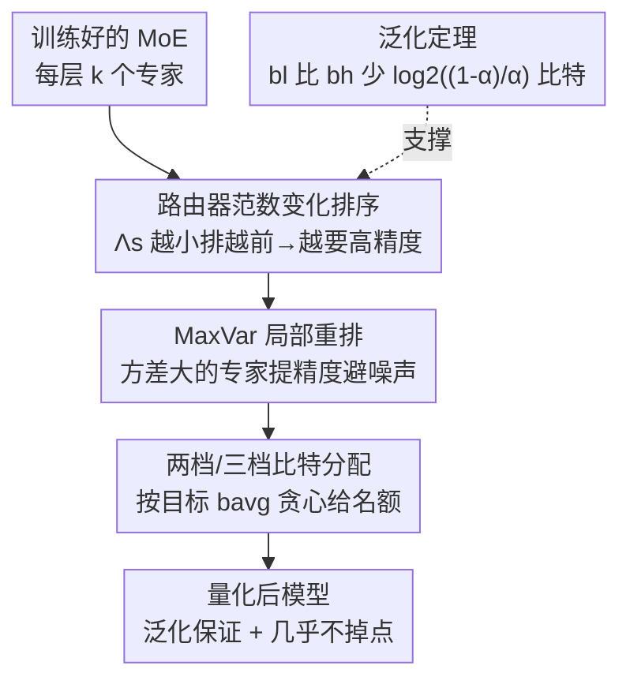

# Efficient Quantization of Mixture-of-Experts with Theoretical Generalization Guarantees

**会议**: ICLR2026  
**OpenReview**: [https://openreview.net/forum?id=yiMlVBAoQi](https://openreview.net/forum?id=yiMlVBAoQi)  
**代码**: https://github.com/nowazrabbani/moe_quantization  
**领域**: 模型压缩 / MoE 量化  
**关键词**: Mixture-of-Experts、混合精度量化、路由器范数、泛化保证、训练后量化

## 一句话总结
本文提出一个**有理论保证的逐专家混合精度量化**方法：用「训练中路由器 $\ell_2$ 范数的变化量 $\Lambda_s$」给 MoE 的每个专家分配比特宽度——范数变化小的专家（学到低频但关键特征）给高精度、变化大的给低精度，再用「最大神经元内方差 MaxVar」做微调重排，使 Switch Transformer / Mixtral 能压到 2 比特出头仍几乎不掉点，且分配开销可忽略。

## 研究背景与动机
**领域现状**：稀疏 MoE 通过「每个 token 只激活少数专家」把模型做大而不增加推理 FLOPs，是当下扩展大模型的主流路线。但庞大的专家参数量在推理时仍带来巨大的显存开销，限制了部署。训练后权重量化（PTWQ，如 GPTQ、AWQ、HQQ）是缓解显存的主流手段之一。

**现有痛点**：把所有专家**统一量化**到同一个低比特，在极低比特（sub-3-bit）下会严重掉点，因为它忽略了不同专家对量化的敏感度差异。已有的混合精度方法要么是**跨模块/跨层**（MLP 块、注意力头之间变比特），没利用 MoE「专家相关性各不相同」这一结构；要么虽然做了**逐专家**混合精度，却依赖「专家激活频率 / 平均路由权重」这类**启发式指标**——既次优又缺乏理论依据。

**核心矛盾**：到底**哪个指标能可证明地**把专家分成「该给高精度」和「能给低精度」两类？已有指标（usage frequency、mean routing weight）只是经验直觉，没人证明它们和「量化后泛化损失」之间有因果联系。同时，现有 SOTA 方法（如 PMQ）为了估专家敏感度，需要在校准集上枚举所有专家×所有比特档位，对 Mixtral-8x22B 要 350 GB 显存、6000 秒，开销惊人。

**本文目标**：① 找一个有理论支撑、能区分专家重要性的排序指标；② 让指标的计算开销可忽略；③ 在真实大模型上把 MoE 压到 2 比特出头仍保精度。

**切入角度**：作者从 MoE 的训练动力学入手——在一个可分析的两层 MoE 模型上，研究专家在微调中如何特化。关键观察是：**专家学的特征"罕见程度"会反映在它路由器范数的变化量上**，而这个量恰好和「量化敏感度」挂钩。

**核心 idea**：用「训练中路由器 $\ell_2$ 范数变化 $\Lambda_s$」作为逐专家比特分配的主指标（变化越小越要高精度），辅以「最大神经元内方差」修正量化噪声，得到一个**几乎零开销 + 有泛化保证**的混合精度策略。

## 方法详解

### 整体框架
方法把「给 MoE 每个专家分配比特」拆成两步：**Step 1 给专家排序**（先按路由器范数变化 $\Lambda_s$ 排，再按最大神经元内方差 MaxVar 做局部重排），**Step 2 按排序结果分配比特**（两档或三档量化，让平均比特达到目标 $b_{avg}$ 的同时尽量把高精度名额给到排在前面的专家）。整条流程不需要在校准集上跑前向、不需要 GPU，只是对每层 $k$ 个专家算两个标量并排序，因此分配开销可忽略。排序背后的「为什么是这个顺序」由第 4 节的泛化定理撑住。

### 关键设计

**1. 路由器范数变化 $\Lambda_s$：用训练动力学指认"该给高精度"的专家**

这是全文的核心指标，针对「现有启发式不知道哪些专家敏感」这个痛点。对专家 $s$，记它训练前后的路由器向量为 $w_s^{(0)}$ 和 $w_s^{(T)}$，定义

$$\Lambda_s^{(T)} := \|w_s^{(T)}\| - \|w_s^{(0)}\|.$$

排序规则是：$\Lambda_s$ **越小的专家排越靠前**，对应越高的比特精度。直觉是——$\Lambda_s$ 小的专家学的是「不那么频繁出现但很关键」的特征，这类专家激活更弱，模型泛化对它们的量化更敏感，所以必须保高精度；而 $\Lambda_s$ 大的专家学的是高频特征、激活强，对量化更鲁棒，可以激进地压到低比特。

注意它和已有工作（Chowdhury et al. 2024 用路由器 $\ell_2$ 范数做剪枝、只区分「相关 vs 无关」专家）的区别：本文用的是**范数的变化量**而非范数本身，给出的是「重要性的连续分级」，因而能服务于**多档比特分配**而不只是二分。对于拿不到初始路由器 $w_s^{(0)}$ 的纯预训练模型，作者直接用路由器范数本身当 $\Lambda_s$ 的代理（因为初始权重通常是小方差随机初始化，范数近似为 0），无需任何微调。

**2. 最大神经元内方差 MaxVar：修正量化噪声带来的排序偏差**

只看 $\Lambda_s$ 还不够：有些专家本身权重分布很"宽"或很"偏"，在同样比特下会注入更大的量化噪声。为此定义专家 $s$ 第一层权重 $W_1^{(s,T)}$ 的最大神经元内方差

$$\mathrm{MaxVar}_s^{(T)} := \max_{r\in[m]} \frac{1}{d}\sum_{i=1}^{d}\Big(W_1^{(s,T)}[r,i] - \frac{1}{d}\sum_{i=1}^d W_1^{(s,T)}[r,i]\Big)^2.$$

重排规则是：若一个排名靠后的专家 $s$ 的 MaxVar 至少是排名靠前专家 $s'$ 的 $\zeta$ 倍（$\zeta>1$），就把 $s$ 提到 $s'$ 之上，反复直到稳定。作者取 $\zeta=3$，理由是任何有界分布的方差至多是同区间均匀分布方差的 3 倍。这个修正在实验里**只影响 4–5% 的专家**，却能把可压缩的平均比特进一步往下推（如 Switch Transformer 上从 2.5 推到 2.125 比特）。它解决的是「方差大的专家一旦被压到低比特，量化噪声会拖垮整体」的隐患。

**3. 两档 / 三档比特分配：在固定平均比特下贪心放高精度名额**

有了排序后，要在「平均比特 = $b_{avg}$」的约束下决定每个专家具体几比特。**两档**很简单：给定 $b_h>b_l$，把排序最靠前的 $\kappa = \frac{b_{avg}-b_l}{b_h-b_l}$ 比例的专家设为 $b_h$，其余设为 $b_l$。**三档**（$b_h>b_m>b_l$）则按 $b_{avg}$ 相对三档的位置分情形贪心：

- $b_{avg}\in(b_h-\tfrac{b_h-b_l}{3},\,b_h)$（接近 $b_h$）：最大化进 $b_h$ 的专家数；
- $b_{avg}\in[b_h-\tfrac{2(b_h-b_l)}{3},\,b_h-\tfrac{b_h-b_l}{3}]$：仍尽量多进 $b_h$，但约束「进 $b_l$ 的数量不超过进 $b_m$ 的」；
- $b_{avg}\in(b_l,\,b_h-\tfrac{2(b_h-b_l)}{3})$：最小化进 $b_l$ 的专家数。

核心思路是「尽量多给排前面的专家最高精度、尽量少把专家丢到最低精度」，因为掉点风险集中在最低档。

**4. 泛化保证：证明这样分配能保住全精度模型的泛化**

这是本文区别于所有启发式方法的关键——它给出了**为什么这个排序+分配安全**的定理（详见下节理论）。简言之，作者证明：把「路由器范数变化小」的专家保到 $b_h$、其余压到 $b_l$ 后，只要 $b_h,b_l$ 满足一组显式下界，量化模型就能以高概率达到和全精度模型相同的泛化（零分类错误）；并且低精度专家每个可以比高精度专家**少用 $\log_2\!\frac{1-\alpha}{\alpha}$ 比特**而不伤泛化（$\alpha$ 是低频特征出现的比例，$\alpha<1/4$）。

### 损失函数 / 训练策略
本方法是**训练后量化**，不引入额外训练损失。实操上：Switch Transformer 在 CNN/DailyMail 摘要任务上微调后用 HQQ 量化；Mixtral 直接用预训练权重 + GPTQ 量化；所有非 MoE 权重统一量化（Switch 用 8 比特、Mixtral 用 3 比特）。专家比特只由上面两个标量指标排序决定。

## 实验关键数据

### 主实验
在 Mixtral-8x7B（46.7B）上对 8 个零样本 LLM 任务测平均准确率，与 SOTA 逐专家方法 PMQ 及非逐专家方法对比（节选）：

| 方法 | 平均比特/专家 | 显存(GB) | 8 任务平均准确率 |
|--------|------|------|----------|
| 全精度 (FP16) | 16 | 96.8 | 72.72 |
| 统一量化 | 3 | 19.3 | 70.85 |
| 统一量化 | 2 | 13.1 | 58.73（崩） |
| **本文 (Router norm + MaxVar)** | 2.75 | 17.7 | **70.01** |
| **本文** | 2.5 | 16.1 | **68.38** |
| **本文** | 2.125 | 13.8 | **64.26** |

统一 2 比特直接崩到 58.73，而本文在 2.125 比特（显存 13.8 GB）仍保 64.26，相近显存下远胜统一量化；在 2.0 比特以上准确率全面超过 PMQ，并在更大的 Mixtral-8x22B（140.6B）上同样优于 PMQ 及 Hessian（层级）、BSP（层级）、Slim-LLM（组级）等非逐专家方法。

### 消融实验

| 配置 | 关键现象 | 说明 |
|------|---------|------|
| 仅 Router-norm-change 排序 | 可保泛化到 2.5 平均比特 | 主指标已超过激活频率/激活权重两种 baseline |
| + MaxVar 重排 | 进一步保到 2.125 比特 | 仅重排 3.7% 的专家就把可压比特再往下推 |
| 激活频率 baseline | 更早掉点 | 高频专家给高精度，方向与本文相反 |
| 激活权重 baseline | 更早掉点 | 同样次优 |

### 关键发现
- **主指标本身就够强**：仅靠路由器范数变化排序，Switch Transformer 在 CNNDM 上可保泛化到 2.5 平均比特，已胜过激活频率/激活权重两种启发式。
- **MaxVar 是低成本增益**：只动 3.7%（Switch）/ 4–5%（整体）的专家，却把可压缩比特从 2.5 推到 2.125。
- **推理更快**：同样平均比特下本文比 PMQ 快——因为本文把高精度给**低频**专家，而 PMQ 把高精度给**高频**专家，后者在推理时被频繁激活、算得更多。
- **分配开销可忽略**：PMQ 给 Mixtral-8x7B 分配比特要 110 GB 显存 / 2227s、8x22B 要 350 GB / 6000s；本文只排序两个标量，零 GPU。

## 亮点与洞察
- **把"量化敏感度"接到训练动力学上**：用路由器范数的*变化量*而非范数本身，区分出「低频但关键」的专家，这是一个有理论根的敏感度代理，比 usage frequency 这类纯经验指标扎实得多。
- **反直觉的精度分配**：通常会觉得"高频专家更重要该保精度"，本文证明恰恰相反——低频专家激活弱、对量化噪声更脆弱，反而要高精度；这一反转同时带来了**推理加速**的副产物。
- **可证明的比特节省量**：$\log_2\frac{1-\alpha}{\alpha}$ 这个显式表达把"能省几比特"和"特征频率失衡度 $\alpha$"直接挂钩，给混合精度提供了量化的理论标尺。
- **可迁移思路**：「用训练中某个轻量统计量（这里是路由器范数变化）来预判模块对压缩的敏感度」这个范式，可迁移到剪枝、LoRA 秩分配、KV cache 压缩等其他「逐组件分配预算」的场景。

## 局限与展望
- **理论模型高度简化**：泛化保证建立在两层 MoE、二分类、专家-选择路由、固定输出层、单个任务相关 token 的合成数据模型上；虽然作者在真实模型上做了经验验证，但定理本身与 Mixtral 这类大模型之间仍有较大 gap（⚠️ 定理条件如 $d=\Omega(L^8)$、$\mathrm{MaxVar}_s=\Theta(1)$ 在实际模型未必成立）。
- **预训练模型用代理指标**：拿不到 $w_s^{(0)}$ 时用路由器范数本身代替 $\Lambda_s$，依赖「初始权重小方差」假设，对非标准初始化或经过多阶段训练的模型可能偏差。
- **压不到 2.0 比特以下**：作者自己指出 Mixtral-8x7B 压到 2.0 比特以下（≤13.1 GB）已低于同规模 dense 模型（13.6 GB），不再划算——本方法的甜点区在 2.0–3.0 平均比特。
- **改进方向**：把理论从二分类/两层推广到多分类与更深 MoE；探索 $\zeta$ 和三档边界的自适应选择；与激活量化（本文只量化权重）联合。

## 相关工作与启发
- **vs 统一量化（Kim et al. / Frantar & Alistarh）**：他们对所有专家统一比特，忽略专家重要性差异，在 sub-3-bit 下严重掉点；本文逐专家分配，相近比特下大幅保精度。
- **vs PMQ（Huang et al. 2025a，SOTA 逐专家）**：PMQ 在校准集上枚举每专家每比特的 Frobenius 输出误差、按激活频率/门控加权，开销极大（百 GB 显存、数千秒）且把高精度给高频专家；本文只排两个标量、零 GPU，2.0 比特以上准确率更高、推理更快。
- **vs 激活频率 / 激活权重启发式（Li et al. 2024）**：这些是经验指标、缺理论依据且次优；本文给出可证明的路由器范数变化指标并在实验中胜出。
- **vs 专家剪枝（Chowdhury et al. 2024 等）**：剪枝在复杂任务上失效（需要保留更多专家），且只能二分相关/无关；本文做的是更细粒度的混合精度量化，保留全部专家。

## 评分
- 新颖性: ⭐⭐⭐⭐⭐ 首个为 MoE 逐专家混合精度量化给出泛化保证、并把指标接到训练动力学的工作
- 实验充分度: ⭐⭐⭐⭐ Switch Transformer + Mixtral 8x7B/8x22B + 8 任务 + 多 baseline，但理论验证主要靠合成数据
- 写作质量: ⭐⭐⭐⭐ 理论与实验衔接清晰，定理条件较重需细读附录
- 价值: ⭐⭐⭐⭐⭐ 几乎零开销 + 有保证地把大 MoE 压到 2 比特出头，部署价值高

<!-- RELATED:START -->

## 相关论文

- [\[ICLR 2026\] Coupling Experts and Routers in Mixture-of-Experts via an Auxiliary Loss](coupling_experts_and_routers_in_mixture-of-experts_via_an_auxiliary_loss.md)
- [\[ICLR 2026\] Unveiling Super Experts in Mixture-of-Experts Large Language Models](unveiling_super_experts_in_mixture-of-experts_large_language_models.md)
- [\[ICLR 2026\] CodeQuant: Unified Clustering and Quantization for Enhanced Outlier Smoothing in Low-Precision Mixture-of-Experts](codequant_unified_clustering_and_quantization_for_enhanced_outlier_smoothing_in_.md)
- [\[ICLR 2026\] MoBE: Mixture-of-Basis-Experts for Compressing MoE-based LLMs](mobe_mixture-of-basis-experts_for_compressing_moe-based_llms.md)
- [\[ICML 2026\] DAG-MoE: From Simple Mixture to Structural Aggregation in Mixture-of-Experts](../../ICML2026/model_compression/dag-moe_from_simple_mixture_to_structural_aggregation_in_mixture-of-experts.md)

<!-- RELATED:END -->
