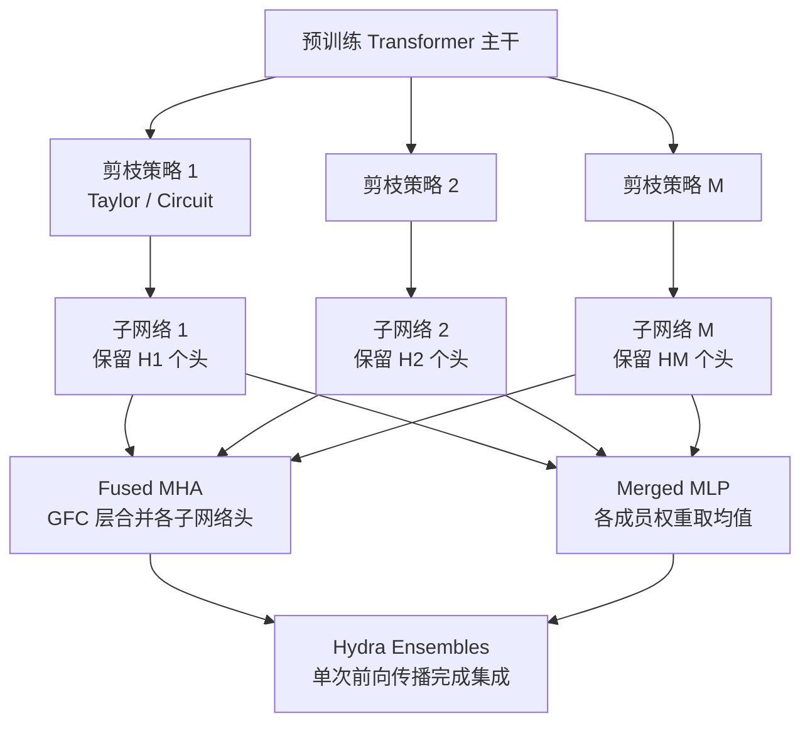

# Ensembling Pruned Attention Heads for Uncertainty-Aware Efficient Transformers

**会议**: ICLR 2026  
**代码**: 待发布（论文承诺发布）  
**领域**: 模型压缩  
**关键词**: 注意力头剪枝、不确定性量化、高效集成学习、Transformer、校准

## 一句话总结

Hydra Ensembles 通过对同一预训练 Transformer 进行差异化注意力头剪枝，再将多个剪枝子网络融合为单一前向传播的集成模型，在接近单模型推理开销（仅 1.07×）的条件下实现与 Deep Ensembles 相当甚至更优的不确定性量化性能。

## 研究背景与动机

**领域现状**：深度神经网络在视觉、语言、多模态任务上表现突出，但在安全关键场景（医疗、自动驾驶）中必须提供可靠的不确定性估计（UQ）。Deep Ensembles 是目前 UQ 的金标准，通过多组独立训练的模型聚合预测，在准确率和校准方面均表现最优。

**现有痛点**：Deep Ensembles 代价极高——需要多次独立预训练和微调、存储多份权重、推理时逐模型顺序前向传播，对大规模基础模型（CLIP、BERT）几乎不可行。现有轻量集成方案（MC Dropout、BatchEnsemble、Packed Ensembles、LoRA Ensemble）要么仍需完整预训练，要么因参数共享而限制成员多样性。

**核心矛盾**：直接用剪枝压缩 Deep Ensembles 的各成员是自然的想法，但论文首先证明了常规剪枝会在噪声/OOD 数据上显著损害校准性——剪枝后模型在分布外的损失增幅大于干净数据，使其不适用于 UQ。

**本文目标**：在无需从头重训的前提下，以接近单模型的推理成本构建多样性强、校准性好的 Transformer 集成模型。

**核心 idea**：对同一预训练主干进行多套差异化注意力头剪枝生成 M 个子网络，再通过 Grouped Fully-Connected（GFC）层将其融合为单一模型（Fused MHA + Merged MLP），单次前向传播即完成集成推断。

## 方法详解

### 整体框架

从单个预训练 Transformer 出发，利用差异化注意力头剪枝策略生成 M 个多样子网络，随后将这些子网络的 MHA 权重通过 GFC 层融合成 Fused MHA、MLP 权重取均值得到 Merged MLP，构成 Hydra Ensembles——一个能在单次前向传播中完成集成推断的紧凑模型。

### 关键设计

**1. 剪枝伤害 UQ 的理论证明（Proposition 1）**

论文首先建立了剪枝对噪声数据影响的理论基础。设 $\tilde{\theta}$ 是经过剪枝扰动 $\delta\theta$ 后的参数，定义干净测试集与噪声测试集之间的损失差距：

$$\Delta L(\theta) := L_{D_n}(\theta) - L_{D_t}(\theta)$$

在训练集梯度为零（$\nabla L_D(\theta)=0$）且剪枝扰动方向与噪声梯度非负相关（$\nabla L_{D_n}(\theta)^\top \delta\theta \ge 0$）的条件下，若 $H_n - H_t \succ 0$（噪声数据 Hessian 更大），则 $\Delta L(\theta) \le \Delta L(\theta + \delta\theta)$。这意味着剪枝在噪声/OOD 数据上的损失增幅更大，直接伤害不确定性校准。这一结论促使作者转向基于电路（circuit）的头选择策略，而非盲目剪枝最不重要的权重。

**2. Fused MHA：用 GFC 层单次前向完成集成**

核心工程创新在于将 M 个剪枝子网络的注意力头"并排打包"到同一个多头注意力层中。对于第 $\ell$ 层，M 个模型的输入沿 batch 维拼接：$X_{i,\ell} \in \mathbb{R}^{MT \times d}$，然后 reshape 为 $\tilde{X}_{i,\ell} \in \mathbb{R}^{T \times Md}$。利用 Grouped Fully-Connected 层，各模型的 Q/K/V 投影矩阵 $W_\ell^{Q(m)}, W_\ell^{K(m)}, W_\ell^{V(m)}$ 组成分组线性变换，一次计算得到所有成员的注意力输出：

$$Q_\ell = \mathrm{GFC}(\tilde{X}_\ell;\ W_\ell^{Q(1)}, \ldots, W_\ell^{Q(M)}) \in \mathbb{R}^{T \times Md_\ell}$$

由于不同成员的头是相互独立计算的（不跨成员做 attention），这种 reshape + GFC 的设计在数学上等价于 M 个子网络的并行前向传播，但实际上只需一次矩阵运算，大幅提升 GPU 利用率。

**3. Merged MLP：权重平均消除冗余存储**

与 MHA 的结构融合不同，MLP 部分采用更简单的权重平均策略：

$$W_\ell^{(j)} = \frac{1}{M} \sum_m W_\ell^{(j)(m)}, \quad b_\ell^{(j)} = \frac{1}{M} \sum_m b_\ell^{(j)(m)}$$

这一合并不会引入额外参数，也不会牺牲成员多样性——因为 MHA 中已由差异化剪枝头保证了多样性，MLP 合并仅压缩了冗余存储。论文在消融实验（Appendix B.7）中验证了 MLP 合并不降低 ID/OOD 指标。

**4. 两种成员生成策略：Taylor vs. Circuit**

如何生成 M 个"不同但互补"的子网络是关键。论文提出两套策略：

- **Hydra Ensembles (Taylor)**：无需验证集，用 Taylor 一阶重要性分数（对损失的梯度加权）剪掉每个 MHA 块中最不重要的头。不同随机种子或不同剪枝比例可生成多样成员。实现简单，适合无 OOD 验证数据的场景，但因 Proposition 1 的限制在 zero-shot 下需谨慎。
- **Hydra Ensembles (Circ)**：当存在不确定性验证集时，使用 Headmap 算法（Wang et al., 2025）提取对 UQ 最关键的注意力头电路，保留这些头并剪除其余。电路提取比盲目 Taylor 剪枝更有针对性，在 OOD 检测上表现更优，且支持完全 zero-shot（无需微调）的 CLIP 场景。

## 实验关键数据

### 主实验

| 数据集 | 指标 | Hydra (Circ) | Deep Ensembles | Δ |
|--------|------|-------------|----------------|---|
| ImageNet-1K | Acc ↑ | 80.88% | 82.19% | −1.31% |
| ImageNet-1K | AUROC ↑ | 86.29% | 85.48% | **+0.81%** |
| ImageNet-1K | FPR95 ↓ | 47.62% | 46.93% | −0.69% |
| CIFAR-100 | AUROC ↑ | 89.43% | 86.08% | **+3.35%** |
| CIFAR-100 | FPR95 ↓ | 36.44% | 38.67% | **−2.23%** |
| SST-2 (BERT) | AUROC ↑ | 77.60% | 74.81% | **+2.79%** |
| SST-2 (BERT) | FPR95 ↓ | 55.06% | 62.69% | **−7.63%** |
| ImageNet ZS (CLIP) | AUROC ↑ | 76.82% | — | vs ViLU 75.38%: **+1.44%** |
| ImageNet ZS (CLIP) | FPR95 ↓ | 68.05% | — | vs ViLU 71.59%: **−3.54%** |
| ImageNet ZS (CLIP) | AUPR ↑ | 47.85% | — | vs ViLU 43.81%: **+4.04%** |

**推理开销（ImageNet-1K, BF16）**：Hydra Ensembles / Single = **1.07×**；Deep Ensembles / Single ≈ **3×**；参数量 Hydra ≈ Single < 1/2 Deep Ensembles。

### 消融实验

| 配置 | OOD AUROC (ImageNet) | 说明 |
|------|----------------------|------|
| Taylor (单模型剪枝) | 84.38% | 基准：无集成 |
| CircAvg (单电路) | 85.71% | 电路提取但无集成 |
| Hydra (Taylor) | 85.36% | Taylor 剪枝 + 集成融合 |
| Hydra (Circ) | **86.29%** | 电路剪枝 + 集成融合，最优 |
| Deep Ensembles | 85.48% | 3× 开销的 gold standard |

### 关键发现

- 单纯 Taylor 剪枝虽能保持 Top-1 准确率，但在 OOD 和噪声数据上校准显著下降，印证了 Proposition 1。
- 电路（Circuit）策略比 Taylor 策略在 UQ 指标上稳定领先，尤其在 zero-shot CLIP 场景差距最大。
- MLP 权重平均融合不损害多样性，因为成员间的差异已由差异化注意力头充分编码。
- 集成规模 M=3 是成本/收益的拐点，更多成员收益递减（Appendix B.6）。

## 亮点与洞察

- **理论先行**：先用 Proposition 1 证明"朴素剪枝伤害 UQ"，再设计规避方案，论证链条完整，不只是工程 trick。
- **zero-shot 可用**：在 CLIP 场景下无需任何额外训练即超越需要训练的 ViLU，对大规模基础模型尤为实用。
- **机制可解释**：借助电路/Headmap 分析，揭示了哪些注意力头专门负责不确定性表征，剪掉这些头会特别有害——这本身就是对 Transformer 内部机制的新发现（Appendix B.2）。
- **GFC 融合技巧可迁移**：Fused MHA 的 reshape + GFC 思路与 Packed Ensembles 同源，但这里用于结构剪枝场景，可推广至其他需要多子网络并行的场景。

## 局限与展望

- 电路（Circuit）策略需要一个不确定性验证集（含 OOD 样本），在实际部署中并非总能获取。
- 成员数 M=3 时 MLP 平均已能工作，但更大 M 的 MLP 多样性损失值得进一步研究。
- 实验主要覆盖分类任务（ViT、BERT、CLIP），在生成任务（语言模型、扩散模型）上的 UQ 效果尚未验证。
- 剪枝比例（每层保留头数）的自动搜索目前仍是手动设定，引入结构化 NAS 可进一步减少调参成本。

## 相关工作与启发

- **vs Deep Ensembles**：本文是 Deep Ensembles 的高效替代，在 OOD 检测上甚至优于后者，代价仅为 1.07× 单模型开销。
- **vs Packed Ensembles**：Packed Ensembles 同样用 GFC，但针对 MLP 分组且需从头训练；Hydra Ensembles 专注注意力头、无需重训，是其在预训练大模型上的自然延伸。
- **vs MC Dropout / LoRA Ensemble**：参数高度共享导致成员多样性不足，OOD 检测弱于 Hydra；Hydra 的头级差异化是多样性的更好来源。
- **vs ViLU（CLIP UQ）**：ViLU 需要额外训练一个误差预测头；Hydra (Circ) 完全 zero-shot 且在所有 OOD 指标上全面超越，说明结构化子网络多样性比后处理预测头更本质。
- **启发**：电路与 UQ 的联系（Appendix B.2）提示可将机制可解释性工具（如激活修补、attention knockout）直接用于提升模型可靠性，而非仅用于分析。

## 评分

- 新颖性: ⭐⭐⭐⭐ 将剪枝、集成与电路可解释性三条线首次统一，Proposition 1 的理论贡献有独特价值；GFC 融合思路来自前人，核心创新是"差异化头剪枝 + 合并"的组合。
- 实验充分度: ⭐⭐⭐⭐ 覆盖图像分类（ViT）、文本分类（BERT）、零样本分类（CLIP），多数据集多指标，消融完整；略缺生成任务验证。
- 写作质量: ⭐⭐⭐⭐ 结构清晰，理论—方法—实验链条完整，Appendix 充实（电路分析、多样性分析、效率分析等均有专节）。
- 价值: ⭐⭐⭐⭐ 对需要在大规模基础模型上部署 UQ 的实践者极具价值，zero-shot CLIP 结果尤为突出；轻量开销使其在资源受限场景中首选。

<!-- RELATED:START -->

## 相关论文

- [\[CVPR 2026\] Trainable Log-linear Sparse Attention for Efficient Diffusion Transformers](../../CVPR2026/model_compression/trainable_log-linear_sparse_attention_for_efficient_diffusion_transformers.md)
- [\[ICLR 2026\] FASA: Frequency-Aware Sparse Attention](fasa_frequency-aware_sparse_attention.md)
- [\[ICLR 2026\] TP-Spikformer: Token Pruned Spiking Transformer](tp-spikformer_token_pruned_spiking_transformer.md)
- [\[ICLR 2026\] TurboBoA: Faster and Exact Attention-aware Quantization without Backpropagation](turboboa_faster_and_exact_attention-aware_quantization_without_backpropagation.md)
- [\[CVPR 2026\] BinaryAttention: One-Bit QK-Attention for Vision and Diffusion Transformers](../../CVPR2026/model_compression/binaryattention_one-bit_qk-attention_for_vision_and_diffusion_transformers.md)

<!-- RELATED:END -->
