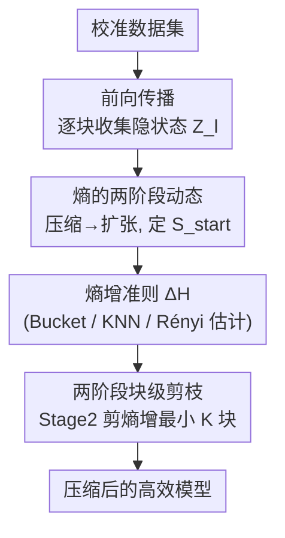

# Entropy-Based Block Pruning for Efficient Large Language Models

**会议**: ICLR 2026  
**OpenReview**: [https://openreview.net/forum?id=bzQvL797PS](https://openreview.net/forum?id=bzQvL797PS)  
**代码**: https://github.com/SalesforceAIResearch/EntroDrop  
**领域**: 模型压缩  
**关键词**: 块级剪枝、熵增准则、LLM 高效推理、冗余分析、校准数据集

## 一句话总结
本文提出 EntroDrop，用隐状态的"熵增"代替传统的余弦相似度来衡量 Transformer 计算块的冗余度，发现 LLM 隐状态熵呈"先压缩后扩张"的两阶段规律，于是只在扩张阶段剪掉熵增最小的若干块，在 Llama3.1-8B 上剪掉 37.5% 注意力层仍保留 95%+ 性能，且全面优于余弦相似度类剪枝方法。

## 研究背景与动机
**领域现状**：随着 LLM 参数从百万级膨胀到十亿级，部署的算力与存储压力越来越大，结构化剪枝成了主流提效手段。近期研究发现预训练 LLM 在层级（layer）上存在大量冗余——删掉相当一部分层模型性能几乎不掉，说明各层贡献并不均等；LLMDrop 进一步指出注意力块比 MLP 块更冗余，把剪枝粒度从"整层"细化到"块内组件"。

**现有痛点**：无论是层剪枝（LaCo、ShortGPT）还是注意力剪枝（LLMDrop），现有方法判断一个计算块是否冗余时，几乎都用**余弦相似度**——即比较块的输入 $X$ 和输出 $Y$，若 $\cos(X,Y)$ 很高（输出和输入几乎一样）就认为这个块没干什么活、可以剪。

**核心矛盾**：余弦相似度本质上只刻画了两个向量的**几何对齐程度**，并不等于这个块实际贡献了多少**信息**。一个块可能在几何方向上几乎没改变隐状态（余弦相似度高），却在信息分布上做了重要的重组；反过来也可能方向变化大但信息量没增加。因此仅凭余弦相似度做剪枝决策，容易误剪真正有用的块、保留实际冗余的块，导致次优结果。

**本文目标**：找到一个能直接量化"块输出信息量"的剪枝准则，并据此设计一套既适用于整层剪枝、又适用于注意力块剪枝的统一策略。

**切入角度**：作者把视线从"几何"转向"信息论"——对隐状态离散化后逐块计算香农熵，观察熵随网络深度如何演化。一个关键的实证发现支撑了整个方法：熵在早期几层先下降、之后大部分层持续上升，呈现稳定的两阶段模式。

**核心 idea**：用"熵增"$\Delta H = H(Z_l) - H(Z_{l-1})$ 代替余弦相似度来衡量块的重要性——熵增小的块说明它对信息扩张贡献最少，最该被剪。

## 方法详解

### 整体框架
EntroDrop 是一个**无需重训、仅靠少量校准数据**的块级剪枝流程。给定一个预训练 Transformer（共 $L$ 个计算块，块可以是整个 Transformer Block，也可以单指 Attention Block），它的目标是排出一个剪枝顺序，让你按需求剪掉 $K$ 个最冗余的块。整条流水线分四步走：把校准样本喂进模型、逐块收集隐状态；对每块的隐状态估计香农熵；根据熵曲线识别"压缩阶段(Stage 1)"和"扩张阶段(Stage 2)"并定出分界点 $S_{start}$；在 Stage 2 内计算每块的熵增并升序排名，剪掉熵增最小的 $K$ 块。整个判定只看前向传播的统计量，不更新任何权重。

### 关键设计

**1. 熵的两阶段动态：从"压缩"到"扩张"的信息流规律**

这是整篇论文的实证地基，针对的是"余弦相似度看不出信息贡献"这个痛点——作者改用熵直接量化每块输出的信息量。具体做法是把隐状态激活值离散化后，逐块计算香农熵 $H(Z) = -\sum_z p(z)\log p(z)$（熵越高代表激活分布越均匀、信息越丰富，越低代表表示越集中）。在 Llama3.1-8B、Mistral-7B-v0.3 等模型、跨 C4 / Law / Medicine / Wikitext2 四个数据集上，作者观察到一致的两阶段行为：**Stage 1（约第 1–3 层）熵下降**，对应早期层在做强信息压缩、噪声过滤、形成紧凑表示；**Stage 2（第 3 层到末层）熵逐渐上升**，对应后续层在做上下文扩展和特征丰富。这个规律的意义在于：早期层各司其职、不可替代；而后期层"做的事情很相似"（都在均匀地往上堆信息），因此后期层里熵增最小的那些就是天然的剪枝候选。这一发现也与前人"早期层对信息保留更关键"的结论相互印证。

**2. 熵增准则 ΔH：用信息量取代几何相似度**

针对余弦相似度"只看方向不看信息"的根本缺陷，本文把重要性准则从 $g(X,Y)=1-\frac{X\cdot Y}{|X||Y|}$ 换成**熵增**：

$$\Delta H_l = H(Z_l) - H(Z_{l-1})$$

其中 $Z_l = f_l(Z_{l-1})$ 是第 $l$ 块的输出隐状态。$\Delta H_l$ 直接衡量"经过这个块之后，信息量净增加了多少"——增加得越少，说明这个块对信息流的贡献越边缘，越该剪。为了实际算出 $H(\cdot)$，作者探索了三种熵估计器：**Bucket-based**（把激活值分桶按频率分布估计）、**KNN**（用 K 近邻局部密度估计）、**Rényi 熵**（香农熵的可调推广，靠参数控制对分布变化的敏感度）。三者计算开销都很低，实验表明 Bucket 和 KNN 估计最有效。相比余弦相似度，熵增能更可靠地反映块的真实信息贡献，从而做出更优的剪枝决策。

**3. 两阶段块级剪枝：冻结压缩区、只在扩张区按熵增剪 K 块**

有了熵增准则，剪谁、剪多少就有了算法。作者把"两阶段动态"直接落进剪枝策略：**Stage 1 整段冻结**，一个块都不剪——因为这些早期层在做不可替代的信息压缩，删掉会严重伤害模型；**Stage 2 才是剪枝战场**。两阶段的分界点 $S_{start}$ 由校准数据集自动定出。在 Stage 2 区间 $S_{start} \le l \le L$ 内，把所有块按熵增**升序排名** $\text{Rank}(\Delta H_l) = \text{argsort}(\Delta H_l)$，然后取排名最靠前（熵增最小）的 $K$ 个块构成剪枝集合：

$$S_{prune} = \{ f_i \mid f_i \in \text{Rank}(\Delta H_l)_{S_{start}:L}[:K] \}$$

这个设计的巧妙在于**统一了粒度**：当 $f_l$ 指整个 Transformer Block 时就是层剪枝，指 Attention Block 时就是注意力剪枝，同一套熵增准则两边都能用。$K$ 作为唯一的预算旋钮，让用户按部署需求在压缩率和性能间自由权衡。

### 损失函数 / 训练策略
EntroDrop 是**训练无关（training-free）的剪枝方法**，不涉及任何损失函数或微调；只需一遍前向传播在校准集上收集隐状态、估计熵、排序剪枝即可，全部实验在单张 40G A100 上完成。

## 实验关键数据

### 主实验
在 Llama3.1-8B 上，剪掉不同数量块 $L$ 后在 13 个基准上的平均准确率（$L=0$ 为未剪原模型 0.5872）。Ours(Layer) 对比层剪枝基线，Ours(Attn) 对比注意力剪枝基线：

| 剪枝块数 $L$ | ShortGPT(层) | Ours(Layer) | LLMDrop(注意力) | Ours(Attn) |
|--------|------|------|------|------|
| 4 | 0.5054 | **0.5170** | 0.5955 | 0.5949 |
| 8 | 0.3015 | **0.4583** | 0.5932 | 0.5909 |
| 12 | 0.3346 | 0.3346 | 0.5467 | 0.5467 |
| 16 | 0.2956 | 0.2980 | 0.4207 | **0.4603** |

层剪枝场景下优势最明显：$L=8$ 时 Ours(Layer) 0.4583 比 ShortGPT 0.3015 高出约 15.7 个百分点；注意力剪枝在重度压缩（$L=16$）时 Ours(Attn) 0.4603 也明显超过 LLMDrop 0.4207。Mistral-7B-v0.3 上结论一致（如 $L=12$ 注意力剪枝 0.5255 vs LLMDrop 0.5071）。剪掉 12 层注意力（占总注意力层 37.5%）仍保留原模型 95%+ 性能。

### 消融与分析实验

| 分析维度 | 对比项 | 关键发现 |
|------|---------|------|
| 重要性准则 | 熵增 vs 余弦相似度 | 各基准上熵增曲线（Bucket/KNN/Rényi）随剪枝量下降更平缓，全面优于 Cosine |
| 熵估计方法 | Bucket / KNN / Rényi | Bucket 与 KNN 最有效，Rényi 略逊 |
| 校准数据集 | C4 / Wikitext / Law / Medicine | 不同校准集得到的熵增热力图与剪枝后性能差异极小，方法对校准集鲁棒 |

### 关键发现
- **熵增准则是性能来源**：把准则从余弦换成熵增后，相同压缩率下掉点显著更少，验证了"几何相似 ≠ 信息冗余"的核心假设。
- **后期层冗余、深层尤甚**：熵增热力图显示越深的层熵增越小、贡献越少，是天然剪枝候选，印证两阶段观察。
- **对校准集鲁棒**：即便用医学、法律这类领域特定校准集，剪枝后平均准确率依旧稳定，说明熵估计能跨域泛化，部署时不必精心挑选校准数据。
- **注意力块比整层更可剪**：注意力剪枝（Ours(Attn)）在各压缩率下都比层剪枝保留更多性能，与"注意力块更冗余"的前人结论一致。

## 亮点与洞察
- **换一个度量视角就能撬动整个方法**：从"几何相似度"切到"信息熵"，本质是把剪枝判据从"块改变了多少方向"换成"块贡献了多少信息"，这个视角迁移简单却有效，可复用到任何需要衡量模块冗余的结构化剪枝场景。
- **两阶段动态把"剪哪里"也一并解决了**："先压缩后扩张"不仅给出了重要性度量，还直接圈定了剪枝区域（冻结 Stage 1），避免了误剪关键早期层这一常见陷阱。
- **统一粒度、零训练、单旋钮**：同一套熵增准则同时覆盖层剪枝和注意力剪枝，无需微调，只用 $K$ 一个超参控制压缩率，工程落地友好。

## 局限与展望
- 两阶段熵动态虽在多个主流 decoder-only 模型上复现，但作者也承认**并非所有架构都普适**，对未观察到该模式的模型方法可能失效。
- 实验主要在 7B–8B 规模、两个模型族上验证，**更大规模（数百亿/MoE）模型上是否仍成立尚未充分检验**。
- 熵增是**逐块贪心**地排序剪枝，未考虑被剪块之间的相互作用与级联误差累积，重度剪枝（$L=16$）时绝对性能仍明显下降。
- 改进方向：结合熵增与轻量微调/知识蒸馏进一步恢复性能；探索熵增的全局组合优化而非逐块贪心；把分界点 $S_{start}$ 的确定做得更自适应。

## 相关工作与启发
- **vs ShortGPT / LaCo（层剪枝）**：它们用余弦相似度判断整层冗余；本文用熵增，相同剪枝量下性能保留显著更好（$L=8$ 高出约 15 个百分点），且把粒度自然扩展到注意力块。
- **vs LLMDrop（注意力剪枝）**：LLMDrop 同样靠余弦相似度但已意识到注意力块更冗余；本文沿用其细粒度思路，但把准则换成熵增，在重度压缩区间优势更明显。
- **vs Entropy-lens**：Entropy-lens 研究的是从隐状态导出的**预测 logits** 的熵动态（输出层视角）；本文直接分析**原始隐表示**的熵（模型内部视角），粒度更细，也因此能用于逐块剪枝决策。

## 评分
- 新颖性: ⭐⭐⭐⭐ 用熵增替代余弦相似度的视角切换简洁有力，两阶段动态观察提供了新洞见。
- 实验充分度: ⭐⭐⭐⭐ 两模型族、13 基准、多压缩率、校准集与估计器消融齐全；但规模偏中等、缺更大模型验证。
- 写作质量: ⭐⭐⭐⭐ 动机—观察—方法逻辑清晰，公式与图示到位。
- 价值: ⭐⭐⭐⭐ 训练无关、单旋钮、统一粒度，对 LLM 高效部署有直接实用价值。

<!-- RELATED:START -->

## 相关论文

- [\[ICLR 2026\] RCPU: Rotation-Constrained Error Compensation for Structured Pruning of Large Language Models](rcpu_rotation-constrained_error_compensation_for_structured_pruning_of_large_lan.md)
- [\[ICLR 2026\] MicroMix: Efficient Mixed-Precision Quantization with Microscaling Formats for Large Language Models](micromix_efficient_mixed-precision_quantization_with_microscaling_formats_for_la.md)
- [\[ICLR 2026\] GPTailor: Large Language Model Pruning Through Layer Cutting and Stitching](gptailor_large_language_model_pruning_through_layer_cutting_and_stitching.md)
- [\[ICLR 2026\] Knowledge Fusion of Large Language Models Via Modular Skillpacks](knowledge_fusion_of_large_language_models_via_modular_skillpacks.md)
- [\[ICLR 2026\] Distillation of Large Language Models via Concrete Score Matching](distillation_of_large_language_models_via_concrete_score_matching.md)

<!-- RELATED:END -->
