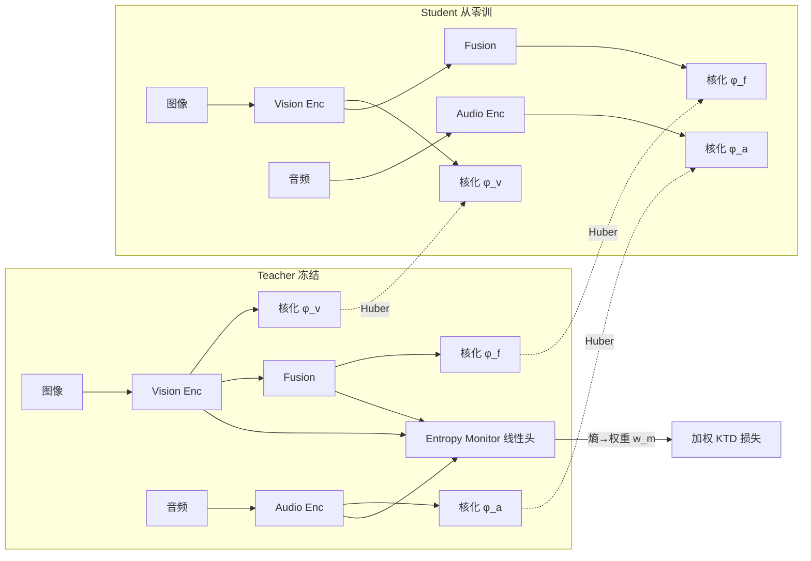

# Entropy-Monitored Kernelized Token Distillation for Audio-Visual Compression

**会议**: ICLR 2026  
**OpenReview**: [https://openreview.net/forum?id=nspzrcvzcB](https://openreview.net/forum?id=nspzrcvzcB)  
**代码**: 待确认  
**领域**: 模型压缩 / 知识蒸馏  
**关键词**: 知识蒸馏, 核方法, 音视频, Token 蒸馏, 熵自适应  

## 一句话总结
不直接蒸馏 teacher 的隐空间特征或输出，而是用核函数（Gram 矩阵）蒸馏 token 之间的两两相似关系，并用每个模态的预测熵自适应地调节蒸馏权重，从而做到架构无关、压缩 94% 参数还能保住 ~97% 性能的音视频模型压缩。

## 研究背景与动机
**领域现状**：音频（mel 谱）和视觉（RGB）通常各用一个独立的大编码器，性能随参数量增长，但边缘设备算力受限，需要把大 teacher 蒸馏成小 student。知识蒸馏要么在**隐空间**做（更强但要求 teacher/student 维度甚至架构匹配），要么在**输出空间**做（架构无关但性能弱）。

**现有痛点**：(1) 隐空间蒸馏靠 projection module 把维度对齐，会引入额外参数、还可能学出过度表达的投影函数直接把 student 特征映射成 teacher 特征、绕过真正的蒸馏；(2) 最接近的工作 MTST 只能处理音频，且对 masked token 的相似度做 softmax 归一化——masking 丢信息、softmax 抹掉相似度的线性偏移、同一样本的 token 关系会随被 mask 的 token 而改变；(3) 传统蒸馏对所有模态**均匀**蒸馏，但当某个模态对当前任务不 informative（如物体被遮挡时视觉无效）时，强行蒸馏反而会污染监督信号。

**核心矛盾**：既要架构无关（输出空间的优点），又要保留隐空间的表达力（隐空间的优点），还要避免对无信息模态的盲目蒸馏。

**本文目标**：一个架构无关、但比输出空间更有表达力、且能按模态信息量选择性蒸馏的音视频蒸馏框架。

**核心 idea**：蒸馏的不是隐向量本身，而是 token 之间的**两两关系**——用核函数算 Gram 矩阵；再用每个模态的预测熵当作不确定性代理，自适应地给各模态的蒸馏损失加权。

## 方法详解

### 整体框架
Teacher（冻结）和 student 都接收 RGB 图像 + 音频 mel 谱，各自有 vision / audio / fusion 三个分支。对每个分支、每个 instance，把最后一个 transformer block 输出的 token 向量做 kernelization（算 Gram 矩阵），用 Huber loss 让 student 的 Gram 矩阵逼近 teacher 的；同时给每个模态接一个线性 task head 算预测熵，熵越低（越确定/越 informative）蒸馏权重越大。

### 关键设计
**1. Kernelized Token Distillation (KTD)：蒸馏关系而非特征**
不复制 teacher 的隐向量，而是复制其隐空间的**几何结构**（判别力来自点之间的可分性）。对模态 $m$ 的 token 矩阵 $z_m \in \mathbb{R}^{N_m \times C}$，用线性核算 instance 内的 Gram 矩阵 $\varphi_m[i,j] = z_m^{i\top} z_m^j$（token 先归一化为单位向量），teacher 和 student 各算一份，用 Huber（smooth-L1）损失对齐：

$$L_{KTD} = \sum_{m \in \{a,v,f\}} \frac{1}{N^2}\sum_{i}\sum_{j} L_{Huber}(\varphi_m^T[i,j], \varphi_m^S[i,j]).$$

对角元（自相似）自然抵消，监督来自 off-diagonal。这彻底摆脱了维度/架构匹配的要求，且**不做 masking、不做 softmax**，完整保留 teacher 的原始相似度——这正是相对 MTST 的核心改进。核是 instance-wise 计算（而非整个 batch 跨样本），以避免二次复杂度爆炸。

**2. 灵活的核函数：不升维而增表达力**
KTD 的核可以替换以提升表达力，而无需真的把数据投到高维空间（核技巧）。线性核作为概念验证，再扩展到多项式核 $\varphi_m[i,j] = (z_m^{i\top}z_m^j + c)^d$（$d$ 次展开，复杂度 $O(C^d)$）和 RBF 核 $\varphi_m[i,j] = \exp(-\gamma\|z_m^i - z_m^j\|^2)$（映射到无穷维空间，可展开为三个内积）。$\gamma$ 控制峰的陡峭程度，实验中 RBF（$\gamma=0.5$）最佳。

**3. Entropy-Monitored Distillation：按信息量选择性蒸馏**
不是所有模态对当前任务都 informative。给冻结 teacher 的每个模态分支接一个线性 task head $g_m(\cdot)$（分类用线性探针、分割用逐像素线性探针），算其预测分布的熵作为不确定性代理：

$$H_m(z_m^T) = -\sum_{c=1}^{C} \sigma(g_m(z_m^T))[c] \log \sigma(g_m(z_m^T))[c].$$

熵越高代表越不确定/越无信息，用负指数把熵转成权重 $w_m = e^{-\lambda H_m(z_m^T)}$ 去自适应地压低高不确定模态的影响。最终 EM-KTD 损失为：

$$L = \sum_{m \in \{a,v,f\}} \frac{w_m}{N^2}\sum_{i}\sum_{j} L_{Huber}(\varphi_m^T[i,j], \varphi_m^S[i,j]).$$

作者把 Entropy Monitor 比作"督学"——监督 teacher-student 蒸馏的质量。Monitor 在蒸馏前先单独训练（teacher 冻结，cosine annealing 调度）。

## 实验关键数据

### 主实验

| 数据集 | 任务/指标 | 本文 (EM-KTD) | 最强基线 (MTST) | Teacher |
|--------|------|------|------|---|
| VGGSound | Acc | 62.0 | 57.6 | 63.9 |
| VGGSound | mAP | 63.4 | 58.5 | 65.0 |
| VGGSound | mAUC | 97.9 | 97.0 | 97.9 |
| AVS-S4 | mIoU (MJ) | 79.81 | 77.19 | 83.15 |
| AVS-S4 | F-score (MF) | 87.86 | 86.03 | 90.4 |
| AVS-MS3 | mIoU (MJ) | 64.43 | 59.60 | 61.95 |
| AVS-MS3 | F-score (MF) | 74.73 | 69.89 | 70.9 |

Student 仅用 teacher **6%** 参数（ViT-Tiny 10M vs ViT-Base 164M），保住 96.9%/97.0% 性能；AVS 视觉端 student PVTv2-b0 仅 3.4M（teacher 81.4M，约 4.5%）。

### 消融实验

| 配置 | 指标 (VGGSound Acc) | 说明 |
|------|------|------|
| MTST+KD (Linear) | 57.6 | 同为线性核但做 softmax+mask |
| KTD (Linear) | 60.2 | 仅换成保留原始相似度 → +2.6 |
| KTD (Polynomial-2) | 60.5 | 复杂度 2× 矩阵乘 |
| KTD (RBF γ=2) | 60.9 | — |
| KTD (RBF γ=0.5) | 61.4 | 3× 乘法，最佳核 |
| 输入降至 112×112 EM-KTD | 60.0 | token 数减 1/4 仍强于所有基线 |

### 关键发现
- 仅 KTD（不加熵）就比四个基线全面领先：Acc +6.61%、mAP +3.86%、mAUC +0.85%；加 KD 后协同进一步提升。
- 同为线性核，KTD 比 MTST 高 6.25% Acc——验证**保留原始相似度（不 softmax/不 mask）**才是关键。
- 加 Entropy Monitor 后在 KTD 基础上再涨（62.0 vs 61.4），尤其在 MS3 多声源场景增益明显。
- KTD 对输入分辨率不敏感：把 student 视觉 token 降采样到 1/4 仍优于全部基线，适配 teacher/student 传感器分辨率不一致的现实场景。

## 亮点与洞察
- 把经典核方法（Gram 矩阵 + 核技巧）嫁接到 token 蒸馏，优雅地同时解决"架构无关"和"隐空间表达力"两个看似矛盾的目标。
- 指出 MTST 的 softmax 会丢掉相似度的线性偏移、masking 会让同一样本的 token 关系随机变化——这个对前作的诊断很到位，且用"换回原始相似度"一招验证。
- 用预测熵当蒸馏权重，把"哪个模态此刻可信"显式建模进蒸馏，比固定权重或只蒸 fusion 更细粒度。

## 局限与展望
- 核是 instance-wise 计算以避开二次复杂度，但单 instance 内 token 数大时 Gram 矩阵仍是 $O(N^2)$，更高分辨率/更长序列的扩展性未充分讨论。
- 更复杂的核（多项式/RBF）带来 2-3× 计算开销，增益与开销的权衡需按场景取舍。
- 验证集中在音视频分类与分割两类任务、CAVMAE/UFE-AVS 两套 backbone，跨更多模态（如文本）或更异构架构对的泛化仍待验证。
- Entropy Monitor 需在蒸馏前额外训练线性探针，多了一步训练流程。

## 相关工作与启发
- **vs MTST (Choi et al. 2023)**：最接近的前作，但仅限音频、对 masked token 做 softmax 归一化；本文保留完整原始相似度、扩展到多模态，同核函数下高 6%。
- **vs SPKD (Tung & Mori 2019)**：SPKD 蒸馏的是样本间相似度；本文蒸馏 instance 内 token 间相似度，且可换任意核 + 熵加权。
- **vs 投影模块类蒸馏 (Kim 2018, Liu 2022b)**：靠 projection 对齐维度会引额外参数和过度表达风险；KTD 用 Gram 矩阵天然架构无关，无需投影。
- **vs Monitored Distillation (Liu 2022a)**：前者在输出空间做深度补全的 monitored 蒸馏；本文把"monitor"思想搬到 token 层的隐空间，用熵当督学信号。

## 评分
- 新颖性: ⭐⭐⭐⭐ 核化 token 关系 + 熵自适应两个点结合得自洽，对前作 MTST 的诊断和改进清晰
- 实验充分度: ⭐⭐⭐⭐ 三任务两数据集、核函数/token 数/Entropy Monitor 多组消融，对照基线齐全
- 写作质量: ⭐⭐⭐⭐ 动机—方法—消融链条顺，公式和图都到位；个别表述（UM-KTD/σ 与 γ 混用）略有笔误
- 价值: ⭐⭐⭐⭐ 边缘端音视频压缩刚需，94% 参数压缩保 97% 性能、架构无关，实用性强

<!-- RELATED:START -->

## 相关论文

- [\[ICLR 2026\] Rejuvenating Cross-Entropy Loss in Knowledge Distillation for Recommender Systems](rejuvenating_cross-entropy_loss_in_knowledge_distillation_for_recommender_system.md)
- [\[ICLR 2026\] AgilePruner: An Empirical Study of Attention and Diversity for Adaptive Visual Token Pruning in LVLMs](agilepruner_an_empirical_study_of_attention_and_diversity_for_adaptive_visual_to.md)
- [\[ICLR 2026\] Token Distillation: Attention-Aware Input Embeddings for New Tokens](token_distillation_attention-aware_input_embeddings_for_new_tokens.md)
- [\[ICML 2026\] Entropy-Aware On-Policy Distillation of Language Models](../../ICML2026/model_compression/entropy-aware_on-policy_distillation_of_language_models.md)
- [\[ICLR 2026\] Boosting Entropy with Bell Box Quantization](boosting_entropy_with_bell_box_quantization.md)

<!-- RELATED:END -->
