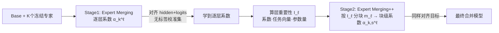

# Expert Merging: Model Merging with Unsupervised Expert Alignment and Importance-Guided Layer Chunking

**会议**: ICLR 2026  
**OpenReview**: [https://openreview.net/forum?id=Awf3ebMpKw](https://openreview.net/forum?id=Awf3ebMpKw)  
**代码**: [github.com/Littleor/ExpertMerging](https://github.com/Littleor/ExpertMerging)  
**领域**: 模型合并 / 模型压缩  
**关键词**: Model Merging, Task Arithmetic, 表示对齐, Logit 蒸馏, 层重要性, MLLM  

## 一句话总结
用 5–10 条**无标签**校准样本，学一组**逐层系数**把合并模型的隐藏状态与 logits 对齐到各领域专家，再按层重要性做**分块加权**（Expert Merging++），在 LLM/MLLM 上超越免训练与训练型合并基线，甚至胜过有监督混合训练。

## 研究背景与动机
- **领域现状**：把多个领域专家（SFT 后的 code/math/VQA 等模型）合并成一个全能模型，是免去联合训练、避免多模型部署开销的实用路线。主流做法分两类——免训练法（Task Arithmetic、TIES、DARE）用预设系数做任务向量加权，训练型法（WUDI、AdaMerging）用梯度学系数。
- **现有痛点**：免训练法靠人工调系数 / 网格搜索，且只在**参数空间**做对齐；训练型法里 WUDI 只在选定线性层最小化干扰 $J_{k,\ell}=\mathbb{E}\|\theta^\ell_{\text{merged}}x-\theta^\ell_k x\|_2^2$，并不直接匹配完整隐藏轨迹和预测分布；AdaMerging 靠最小化熵 $\sum_k\sum_x H(p(y|x))$，只逼模型"自信"却没有"该对谁自信"的信号——分布偏移下会自信地答错。
- **核心矛盾**：要的是**下游任务行为对齐**，现有目标却停留在参数对齐或隐式分布匹配；同时它们普遍**按层均匀对待**，忽略了注意力/MLP 参数量差异、深层影响更大、任务对各层影响不均等**层间异质性**。
- **本文目标**：在不依赖标签的前提下，既显式对齐每个专家的下游行为，又把可学容量按层重要性分配。
- **核心 idea**：**(1) 表示+预测双层对齐**——用无标签数据让合并模型的隐藏态和 logits 同时贴合对应专家；**(2) 重要性引导分块**——从学到的系数反推层重要性，给重要层切更多块、分配更多系数，轻量层保持极简。

## 方法详解

### 整体框架
冻结 base 与各专家模型，**唯一可训练参数是合并系数**。先跑 **Expert Merging**：每层一个系数 $\alpha^\ell_k$，在各专家领域的无标签输入上对齐隐藏态与 logits；再跑 **Expert Merging++**：用第一阶段学到的系数算层重要性 $I_\ell$，据此给每层分配块数 $m_\ell$，把高重要层的参数张量切成多块、每块一个独立系数，重新优化同样的对齐目标。

### 关键设计
**1. 双层对齐：把"参数贴近"换成"行为贴近"。** 这是全文立论的支点。对任务 $k$ 的无标签输入 $x\in D_k$，同时压两个损失：隐藏态用 L2 匹配每个 Transformer 层输出 $L^{(k)}_{\text{hid}}=\sum_{\ell\in S}\mathbb{E}\|h_\ell(x;\theta_{\text{merged}})-h^{(k)}_\ell(x)\|_2^2$，logits 用带温度的 KL 蒸馏专家分布 $L^{(k)}_{\text{logit}}=T^2\,\mathbb{E}\,\text{KL}(\text{softmax}(z^{(k)}/T)\,\|\,\text{softmax}(z/T))$。关键在于：当专家本身准确时，KL 项等价于无标签地逼近有监督损失，比熵最小化多了"该对谁自信"的方向；而隐藏态匹配又把 WUDI 只覆盖线性层的干扰约束扩展到了完整轨迹和非线性层，两者互补。

**2. 可控权衡 + 系数正则：让小样本优化稳得住。** 不同于以往隐式平衡任务，这里给每个专家配非负权重 $\beta_k$，总对齐损失 $L_{\text{align}}=\sum_k\beta_k(L^{(k)}_{\text{hid}}+L^{(k)}_{\text{logit}})$，调 $\beta_k$ 就能透明地控制保留哪个领域更多。同时因为只有 5–10 个校准样本极易过拟合，加了围绕初值 $\bar\alpha_k$ 的正则 $R(\alpha)=\frac{1}{KL}\sum_{k,\ell}|\alpha^\ell_k-\bar\alpha_k|$，总目标 $\min L_{\text{align}}+\gamma R(\alpha)$；初值直接取 Task Arithmetic 验证过的系数，相当于把解锚在免训练点上，只在对齐损失给出一致证据时才允许偏移，避免退化解。

**3. 层重要性度量：数据驱动地决定"钱该花哪层"。** Expert Merging 训完后，用三个因子合成每层重要性：学到的系数幅度、任务向量权重 $s^\ell_k=\text{mean}(|\tau^\ell_k|)$、参数量 $n_\ell$，即 $I_\ell=\text{Norm}(\sum_k|\alpha^\ell_k|\,s^\ell_k\,n_\ell)$（跨层 $\ell_1$ 归一到 $[0,1]$）。它是"专家和系数有多依赖这一层"的代理信号，回答了为什么有些层值得加更多容量。

**4. 重要性引导分块：在几乎不增加参数下提升表达力。** 给定每任务总系数预算 $B$，按 $m_\ell=\lfloor B\,I^\kappa_\ell/\sum_j I^\kappa_j\rfloor$ 给层 $\ell$ 分配块数（$\kappa$ 控制陡峭度：$\kappa{=}0$ 近均匀、$\kappa{>}1$ 向高重要层集中），把该层张量展平切成 $m_\ell$ 个连续块，每块一个独立系数 $\alpha^\ell_{k,s}$，合并写成 $\theta^\ell_{\text{merged}}=\theta^\ell_{\text{base}}+\sum_k\sum_{s=1}^{m_\ell}\alpha^\ell_{k,s}\tau^\ell_{k,s}$；低重要层设 $m_\ell{=}0$ 用固定标量。因为 $B$ 实践中只取 0.9–1.2，块级系数总量与逐层几乎相同——保持稀疏性的同时榨出额外性能。

## 实验关键数据
设置：LLM 用 Mistral-7B（Chat/Math/Code 三专家），MLLM 用 InternVL2.5-1B 与 Qwen2-VL-7B（VQA/Geometry/Chart/OCR/Grounding 五专家）；每任务仅采 5–10 条无标签样本，重复 5 次取平均，8×32G GPU。

### 主实验表格（InternVL2.5，10 任务平均）

| 方法 | 类型 | Avg. |
|---|---|---|
| Task Arithmetic | 免训练 | 56.17 |
| TIES w/ DARE | 免训练 | 56.76 |
| WUDI Merging | 训练型 | 56.86 |
| WUDI v2 | 训练型 | 56.96 |
| AdaMerging | 训练型 | 56.85 |
| Mixture Training | 有监督 | 57.66 |
| **Expert Merging** | 本文 | **58.11** |
| **Expert Merging++** | 本文 | **58.45** |

Grounding 提升最显著：Expert Merging/++ 在 RefCOCO 80.05/80.53、RefCOCO+ 73.85/74.37、RefCOCOg 79.04/79.31，大幅超越所有基线。

### Qwen2-VL（10 任务平均）

| 方法 | Avg. |
|---|---|
| WUDI v2（最强基线） | 62.63 |
| Mixture Training | 62.23 |
| **Expert Merging++** | **63.63**（+1.00 / +1.40）|

MATH-Vision 44.74、TextVQA 81.65、RefCOCOg ~79.00 均达到或接近最优。

### 关键发现
- 仅用 5–10 条无标签样本，**就超过了用全量标签的有监督 Mixture Training**（InternVL +0.79、Qwen2-VL +1.40）。
- Expert Merging++ 相对 Expert Merging 持续再涨（如 InternVL 58.11→58.45），验证按层分配容量有效。
- 单任务峰值有时被某些基线占据（如 TA+DARE 在 ChartQA），但都以牺牲其他领域为代价；本文在各领域保持均衡，赢在整体权衡。

## 亮点与洞察
- **目标层级的换位**：把合并从"参数空间对齐"抬到"隐藏态+预测分布对齐"，一句"该对谁自信而非只是自信"精准戳中了熵最小化的软肋。
- **无标签 KL 蒸馏的妙用**：专家准确时，KL 项无标签地逼近有监督损失，这是它能超过 Mixture Training 的根因。
- **重要性度量自洽**：度量直接复用第一阶段学到的系数，让"先粗对齐→再按需精化"形成闭环，几乎零额外参数。

## 局限与展望
- 度量与分块依赖第一阶段的系数质量，两阶段流程比单阶段方法更繁琐。
- 校准样本极少（5–10），论文虽用正则缓解，但对样本选择/分布代表性的敏感性未充分剖析。
- OCR 类指标（如 OCRVQA）仍被 Mixture Training 占优，说明强领域专家的细粒度知识保留仍有空间。
- 仅验证到 7B 规模与已对齐的专家，更大模型、异构架构专家的可扩展性待验。

## 相关工作与启发
- **免训练合并**：Task Arithmetic / TIES / DARE / TSV / Iso-C——本文把它们的系数作初值与正则锚点，做到"站在免训练肩膀上微调"。
- **训练型合并**：WUDI / WUDI v2（最小化层间干扰）、AdaMerging（熵最小化）——本文逐条指出其只对齐参数或只逼自信的缺陷，并用双层对齐统一替代。
- **启发**：知识蒸馏式的 logit/hidden 对齐 + 重要性驱动的容量分配，是一条"用极少无标签数据做模型融合"的通用范式，可迁移到 LoRA 合并、跨模态专家融合等场景。

## 评分
- **新颖性**: ⭐⭐⭐⭐ 把合并目标从参数对齐升级为行为对齐 + 层重要性引导分块，组合清晰且切中现有方法痛点。
- **实验充分度**: ⭐⭐⭐⭐ 覆盖 LLM/MLLM 三个 backbone、10 任务、近 10 个强基线，并对比有监督上界。
- **写作质量**: ⭐⭐⭐⭐ 动机推导严谨，对 AdaMerging/WUDI 的失效分析很有说服力。
- **价值**: ⭐⭐⭐⭐ 仅需 5–10 无标签样本即超有监督，部署友好、可控权衡，落地价值高。

<!-- RELATED:START -->

## 相关论文

- [\[ICLR 2026\] DisTaC: Conditioning Task Vectors via Distillation for Robust Model Merging](distac_conditioning_task_vectors_via_distillation_for_robust_model_merging.md)
- [\[ICML 2026\] Saliency-Aware Model Merging](../../ICML2026/model_compression/saliency-aware_model_merging.md)
- [\[ICLR 2026\] Steering MoE LLMs via Expert (De)Activation](steering_moe_llms_via_expert_deactivation.md)
- [\[ICLR 2026\] MergOPT: A Merge-Aware Optimizer for Robust Model Merging](mergopt_a_merge-aware_optimizer_for_robust_model_merging.md)
- [\[ICLR 2026\] AdaRank: Adaptive Rank Pruning for Enhanced Model Merging](adarank_adaptive_rank_pruning_for_enhanced_model_merging.md)

<!-- RELATED:END -->
