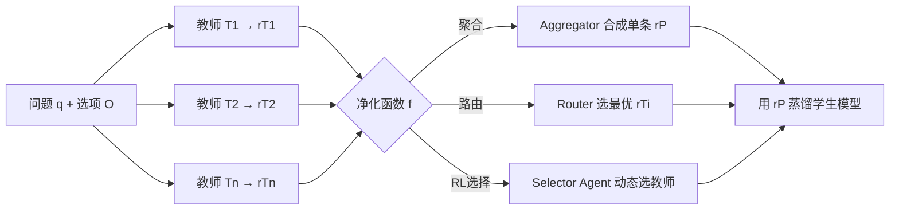

# Exploring Knowledge Purification in Multi-Teacher Knowledge Distillation for LLMs

**会议**: ICLR 2026  
**OpenReview**: [https://openreview.net/forum?id=7pvJoB4aKO](https://openreview.net/forum?id=7pvJoB4aKO)  
**代码**: 待确认  
**领域**: 模型压缩 / 知识蒸馏  
**关键词**: 多教师知识蒸馏, 知识净化, LLM 路由, 强化学习教师选择, 知识冲突  

## 一句话总结
针对多教师蒸馏中"教师越多反而越差"的知识冲突问题，本文提出"知识净化"概念——把多个教师 LLM 的 rationale 合并成单条统一 rationale 再蒸馏，并系统比较了聚合、路由、RL 选择三类共五种净化方法，发现路由类方法在域内域外都最稳。

## 研究背景与动机
**领域现状**：知识蒸馏是把强 LLM 能力迁到小模型的主流手段，而多教师蒸馏（如 TinyLLM、TwT）通过聚合多个教师的 rationale 来扩大知识多样性，被普遍认为能进一步增强学生模型的泛化与专业能力。

**现有痛点**：作者用 TinyLLM 做了一个反直觉实验——逐步把教师从 1 个增加到 4 个（FLAN-T5 xlarge → +Llama 2-chat → +BioMistral-7B → +Llama-3.1-8B-Instruct），结果学生准确率不升反降。这暴露出两个核心缺陷：**(1) 知识冲突**——教师因幻觉、推理路径不一致、专长领域不同而给出互相矛盾的 rationale，且教师越多冲突越严重；**(2) 高资源开销**——融合多教师需要复杂采样和繁琐训练流程，教师数量增加进一步推高算力和调参成本。

**核心矛盾**：多教师本应"博采众长"，但直接把所有 rationale 一股脑塞给学生反而引入噪声与矛盾，知识多样性的收益被冲突的代价抵消。

**本文目标**：设计一种新框架，在保留多教师知识广度的同时消解冲突、降低开销。

**核心 idea**：**知识净化（Knowledge Purification）**——不再让学生同时学 $n$ 条 rationale，而是先把 $R=\{r_{T_1},\dots,r_{T_n}\}$ 净化成单条统一 rationale $r_P=f(R)$，再用 $r_P$ 做蒸馏。这样既消解了教师间矛盾，又把多条蒸馏损失压缩成一条，显著提效。

## 方法详解

### 整体框架
知识净化把多教师蒸馏的训练目标从"对每个教师 rationale 各算一条蒸馏损失再加权求和"（$L_{\text{MTKD}}=L_{PR}+\sum_j \lambda_j L_{DL_j}$）改写为"只对一条净化后的 rationale 算蒸馏损失"：$L_{\text{MTKD-KP}}=L_{PR}+\lambda L_{DL\text{-}KP}$，其中 $L_{DL\text{-}KP}=-\frac{1}{|D|}\sum \sum_i \log p(r_{P_i}\mid r_{<i},q,O,p_r)$。问题的关键就落在净化函数 $f(\cdot)$ 怎么实现上，作者从聚合、路由、RL 选择三个视角提出五种方法。

### 关键设计
**1. 知识聚合（Knowledge Aggregation）：用强 LLM 当"裁判"合成统一 rationale**。最直接的思路是请一个全局强模型（实现里用 GPT-4）把所有教师的 rationale 当输入，按 instruction-tuning 范式配上含 in-context 示例的指令 prompt，以生成方式产出一条融合后的 $r_P$。它的优点是不需要额外训练、可直接迁到新数据集；但代价是参数量 >10B、依赖外部强模型，且实验显示其合成 rationale 对蒸馏的增益并不稳定——尽管聚合器很强，融合后的单条 rationale 是否真能帮到学生仍不确定。

**2. LLM 路由（LLM Routing）：不合成而是"选"，把净化退化为路由问题**。与聚合"造一条新的"不同，路由的思路是从 $n$ 条原始 rationale 里直接挑出最合适的那条：$r_P=\arg\max_{r_{T_i}} P_\theta(r_{T_i}\mid q)$。关键好处是路由器只需要问题 $q$ 作为输入、无需预先采样所有教师的 rationale，因此训练好的路由器可以反过来去指导采样（这正是后面域外蒸馏能省采样开销的基础）。作者给出三种打分实现：**(a) Plackett-Luce 排序**——用 PL 模型以 softmax 形式 $P_\theta(r_{T_i}\mid q)=\frac{e^{\xi_i}}{\sum_j e^{\xi_j}}$ 对教师排名，并借鉴 RouterLLM 用问题相似度 $\omega'=\gamma^{1+\frac{\epsilon\cdot\epsilon'}{\|\epsilon\|\|\epsilon'\|}}$ 加权学习系数 $\xi$，但它不依赖问题语义编码，表达力相对弱；**(b) PLM 分类器**——用预训练语言模型（mDeBERTaV3-base）把问题编码成 CLS 语义向量 $h_{CLS}$，再过两层 MLP 直接预测路由到各 rationale 的概率，把净化当成标准文本分类；**(c) 相似度路由器**——follow RouterDC，为每个教师学一个可训练 embedding $k_i$，用问题编码与 $k_i$ 的余弦相似度 $P_\theta(r_{T_i}\mid q)=\frac{e^{\text{sim}\langle E(q),k_i\rangle}}{\sum_j e^{\text{sim}\langle E(q),k_j\rangle}}$ 做软路由，并以双对比损失训练，是三者里综合最强的。

**3. RL 教师选择（RL-based Teacher Selection）：把"选教师"建成策略学习，用蒸馏反馈当奖励**。前两类要么造新 rationale、要么靠静态打分选 rationale，本设计则把选择过程交给一个强化学习智能体动态决策。状态 $s_i=[E(q),\,E(r_{T_i})\cdot\mathbb{I}(T_i(q,O,p_o)=o^*)]$ 同时编码问题语义和"该教师是否答对"这一信号；策略 $\pi_\theta(s_i,a_i)=a_i\sigma(W_is_i+b_i)+(1-a_i)(1-\sigma(W_is_i+b_i))$ 用 sigmoid 打分决定是否选教师 $T_i$，最终采用得分最高的教师 rationale 来蒸馏。参数 $\theta$ 用策略梯度优化，奖励直接取学生表现 $r=-L_{PR}-L_{DL}$，训练时让知识蒸馏与 RL 训练交替进行。它的优势是选择信号与蒸馏目标紧密耦合、域内表现最好；但代价是奖励来自蒸馏过程导致换数据集需重训、可迁移性差、单实例延迟达分钟级。

## 实验关键数据
设置：4 个教师（FLAN-T5 xlarge 2.85B、Llama 2-chat 7B、BioMistral-7B、Llama-3.1-8B-Instruct），学生为 FLAN-T5 small/base/large（77M/248M/783M）；数据集为常识推理 OBQA、ARC、Riddle 和生物医学 PQA。

### 主实验表格（平均准确率 Average，%）

| Method | 77M | 248M | 783M |
|---|---|---|---|
| Fine-tuning | 43.52 | 53.12 | 63.18 |
| Distilling-Step-by-Step | 41.47 | 54.23 | 62.76 |
| TinyLLM | 42.38 | 52.76 | 62.53 |
| Knowledge Aggregation | 42.01 | 53.42 | 63.32 |
| Plackett-Luce Ranking | 42.49 | 55.51 | 64.50 |
| PLM Classifier | 44.45 | 56.04 | 66.40 |
| Similarity-based Router | **45.66** | 56.56 | 67.20 |
| Teacher Selection | 44.63 | **56.68** | **67.55** |

相似度路由器在 77M 上最优（超最佳基线 ≥4.9%）；RL 教师选择在 248M/783M 上最优（分别超最佳基线 4.5%、6.9%）。783M 学生平均准确率已超过 3 个教师，仅次于 Llama-3.1-8B-Instruct。

### 消融/分析表格（冲突缓解值 CMV，越大越好）

| Method | CMV 77M | CMV 248M | CMV 783M |
|---|---|---|---|
| Knowledge Aggregation | −0.003 | −0.007 | −0.004 |
| Plackett-Luce Ranking | +0.001 | +0.012 | +0.010 |
| PLM Classifier | +0.018 | +0.014 | +0.021 |
| Similarity-based Router | **+0.025** | **+0.020** | **+0.032** |
| Teacher Selection | +0.020 | +0.019 | +0.029 |

CMV 衡量随教师数增加相对 TinyLLM 的平均提升。聚合方法在三个学生上全为负，说明它无法缓解冲突；所有路由方法和 RL 选择均为正，相似度路由器最高。

### 关键发现
- **聚合不灵、选择/路由灵**：即便用 GPT-4 当聚合器，合成 rationale 对蒸馏几乎无增益且 CMV 为负；"从已有 rationale 里选"比"造一条新的"更可靠。
- **大学生收益更大**：净化在 783M 上提升远大于 77M，因为大模型有更强能力从 rationale 学习，小模型更倾向只拟合最终选项。
- **路由器域外泛化强**：在域外 PIQA、BioASQ 上（表 4），路由方法仍稳定超 TinyLLM——例如相似度路由器在 783M 上 PIQA 69.53、BioASQ 91.87，因路由只需问题输入、可直接指导域外采样；RL 选择因可迁移性差被排除在域外实验外。
- **实用性权衡（表 2）**：PLM 分类器与相似度路由器仅 ~278M 额外参数、毫秒级延迟、可迁移；聚合需 >10B 参数；RL 选择延迟分钟级且不可迁移。

## 亮点与洞察
- 用一个干净的反直觉实验（图 1：教师越多越差）把"知识冲突"这个隐性问题摆到台面，动机扎实。
- "知识净化"是一个简洁且可推广的抽象：把多条蒸馏损失压成一条，同时统一了聚合/路由/RL 三类看似不同的方法到同一个 $f(R)$ 框架下。
- 不止比性能，还从 Prior/参数量/是否需训练/可迁移性/延迟五个实用维度系统对比，并提出 CMV 专门量化"缓解冲突"的能力，评估视角全面。
- 结论实用：路由器只需问题即可工作，能反向指导采样、省掉多教师全量采样开销，且域外泛化最好。

## 局限与展望
- 任务局限在多选问答（MCQA），rationale 净化对开放式生成、长链推理是否成立未验证。
- 学生与教师都偏小（学生≤783M、教师≤8B），未验证在更大学生模型或更强教师上的可扩展性。
- "净化"目前是经验性比较五种方法，缺乏对"为什么选择优于聚合"的理论刻画。
- RL 教师选择需逐数据集重训、延迟分钟级，落地成本高；聚合依赖 GPT-4 外部 API。
- 净化为单条 rationale 可能丢失教师间真正互补的多样性信息，何时该"选"何时该"融"仍开放。

## 相关工作与启发
- **多教师蒸馏**：TinyLLM、TwT（Xu et al. 2025，用拒绝采样平衡成本与性能）是直接对标的前作，本文指出它们受教师间冲突制约。
- **LLM 路由**：与 MoE 一脉相承，HybridLLM、RouterLLM（强弱模型动态路由）、RouterDC（双对比学习，本文相似度路由器的基础）、结构化路由及 RL 路由都是本文路由方法的来源。
- **rationale 蒸馏**：Distilling-Step-by-Step（Hsieh et al. 2023）把教师 rationale 当额外监督，是单条 rationale 蒸馏的基础。
- **启发**：把"多源知识融合"重构为"路由选择"而非"强行聚合"，对 RAG 多文档、多智能体辩论、集成学习等存在源间冲突的场景都有借鉴意义——选一个干净的源往往比融合一堆带噪源更稳。

## 评分
- 新颖性: ⭐⭐⭐⭐ —— "知识净化"概念清晰且把三类方法统一到同一框架，虽各子方法多借鉴已有路由器，但问题定义与抽象有新意。
- 实验充分度: ⭐⭐⭐⭐ —— 三种学生 × 四数据集 + 域外 + CMV + 五维实用性分析，相当扎实；不足是模型规模偏小、仅限 MCQA。
- 写作质量: ⭐⭐⭐⭐ —— 动机实验有说服力，公式与表格清晰，方法分类有条理。
- 价值: ⭐⭐⭐⭐ —— 揭示多教师蒸馏的冲突陷阱并给出低成本可迁移的路由解，对实际部署轻量模型有直接指导意义。

<!-- RELATED:START -->

## 相关论文

- [\[ICLR 2026\] In Good GRACES: Principled Teacher Selection for Knowledge Distillation](in_good_graces_principled_teacher_selection_for_knowledge_distillation.md)
- [\[CVPR 2026\] Distilling Balanced Knowledge from a Biased Teacher](../../CVPR2026/model_compression/distilling_balanced_knowledge_from_a_biased_teacher.md)
- [\[ICLR 2026\] SGD-Based Knowledge Distillation with Bayesian Teachers: Theory and Guidelines](sgd-based_knowledge_distillation_with_bayesian_teachers_theory_and_guidelines.md)
- [\[ICCV 2025\] A Good Teacher Adapts Their Knowledge for Distillation](../../ICCV2025/model_compression/a_good_teacher_adapts_their_knowledge_for_distillation.md)
- [\[ICLR 2026\] Pedagogically-Inspired Data Synthesis for Language Model Knowledge Distillation](pedagogically-inspired_data_synthesis_for_language_model_knowledge_distillation.md)

<!-- RELATED:END -->
