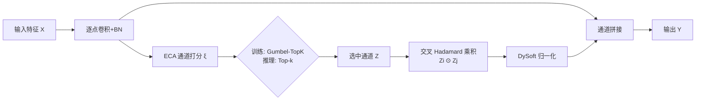

# Expressive yet Efficient Feature Expansion with Adaptive Cross-Hadamard Products

**会议**: ICLR 2026  
**OpenReview**: [https://openreview.net/forum?id=eQmoST3UMN](https://openreview.net/forum?id=eQmoST3UMN)  
**代码**: [https://github.com/acelych/hadaptivenet](https://github.com/acelych/hadaptivenet)  
**领域**: 高效模型设计 / 轻量化视觉网络  
**关键词**: Hadamard 乘积, 特征复用, 可微分离散采样, 通道扩展, 神经架构搜索, 轻量化网络  

## 一句话总结
本文把"逐元素相乘（Hadamard product）"打造成一个可学习的高效特征扩展算子 ACH，通过可微分离散采样自动挑选参与交叉相乘的通道、用动态 softsign 归一化稳住梯度，从而几乎零卷积参数地把通道维度扩张开，并经 NAS 集成进 Hadaptive-Net，在 ImageNet/CIFAR-100 上取得更优的精度/速度折中。

## 研究背景与动机
**领域现状**：轻量化网络普遍采用 inverted bottleneck（倒残差）结构——先在 block 内把通道扩张到高维做非线性变换，再压回低维做残差。MobileNet 系列、ConvNext 都靠这个范式在移动端取得了不错的精度/算力平衡。

**现有痛点**：倒残差的"通道扩张"阶段需要大量逐点卷积把特征投影到高维空间，而 GhostNet 早已揭示，扩张出来的高维通道之间存在大量线性相关——也就是说，相当一部分新通道其实是冗余的，花在它们上面的卷积是浪费。GhostNet 用廉价线性变换合成冗余通道、FasterNet 用部分卷积只算相邻特征，都是在"少算一点扩张卷积"上做文章。

**核心矛盾**：现有特征复用方法要么"生成"要么"过滤"特征，但**通道组合规则是固定的（要么跨通道、要么通道内）、操作是预定义的**，既限制了优化灵活性，也缺乏可解释性。与此同时，理论上已经证明级联的 Hadamard 乘积能诱导非线性表示和隐式高维映射（Ma et al. 2024），但这套理论在资源受限的视觉模型里几乎没被真正用起来。

**本文目标**：把 Hadamard 乘积从一个被动的"固定算子"升级成**可学习的、专用的深度学习算子**，让它在几乎不增加卷积参数的前提下完成通道扩张，并保证训练时梯度稳定。

**核心 idea**：**用通道两两交叉相乘代替昂贵的扩张卷积**——保留原始特征，再拼上"选中的若干通道两两 Hadamard 相乘"得到的新特征。每张 Hadamard 派生特征图只需 $f^2$ FLOPs，扩张几乎免费；难点在于"选哪些通道"这件离散的事如何端到端可学，以及动态生成的特征分布如何稳住——本文分别用 **Gumbel-TopK 可微采样** 和 **DySoft 动态归一化** 解决。

## 方法详解

### 整体框架
ACH 模块的数据流是：输入特征 $X$ 先经逐点卷积 + BatchNorm 做基础通道信息交换，再由一个 ECA 模块给每个通道打分；训练时用 Gumbel-TopK 从打分中可微地采样出 $C_{(s)}$ 个活跃通道，推理时直接取分数 top-k；被选中的通道 $Z$ 两两做交叉 Hadamard 乘积，经 DySoft 动态 softsign 归一化后，与原始特征拼接输出。整个模块再通过梯度型 NAS 被择优插进 Hadaptive-Net 的高维后段层。

### 关键设计

**1. Hadamard 通道扩展：把"扩张卷积"换成"两两相乘"，点破了高维特征的冗余本质。** 作者观察到 Hadamard 乘积天然契合"通道升维、空间降维"的网络演化趋势，于是对输入通道做两两组合相乘并保留原图：$Y = X \oplus \{X_i \odot X_j \mid (i,j)\in\{1,\dots,C\}, i\neq j\}$，输出维度从 $C$ 涨到 $\frac{C(C+1)}{2}$。这里有个漂亮的可解释性视角——拼接后的特征向量可看作一个高维向量，而原始特征空间是它的一组基，复合特征因此携带了隐式高维信息。相比扩张卷积 $O(mn\cdot f^2)$，ACH 把逐点卷积压在低维 $O(m^2\cdot f^2)$、扩张部分交给 Hadamard $O((n-m)\cdot f^2)$，复杂度约为倒残差卷积的 $\frac{1}{m}$，每张派生特征图只要 $f^2$ FLOPs。

**2. 可微分离散采样：用 Gumbel-TopK + STE 让"挑哪些通道"这件离散事变得可训练。** 通道两两组合随通道数二次爆炸，必须只选一个子集 $C_{(s)}$ 参与相乘，但"选/不选"本质离散、挡住了梯度。作者先用 ECA 给通道打分 $\xi = \text{ECA}(X)$，再注入 Gumbel 噪声做带温度的 softmax 得到概率分布 $M_c = \frac{\exp((\xi_c+o_c)/\tau)}{\sum_{c'}\exp((\xi_{c'}+o_{c'})/\tau)}$，其中 $o_i = -\log(-\log(u)),\, u\sim \text{Unif}[0,1]$。前向用直通估计器（STE）取 top-k 的离散 one-hot $M^H$ 走数据流，反向让梯度绕过离散 $M^H$ 流回连续的 $\text{softmax}(\xi/\tau)$。Gumbel 扰动的作用是让暂时没被选中的通道也能临时收到梯度反馈，避免过早锁死在初始选择上。更巧的是温度 $\tau$ **不靠全局调度器、而是按历史梯度范数自适应**：$\tau \leftarrow \text{CLAMP}(\tau\cdot(1+\alpha\cdot\text{sign}(\|grad\|_2 - \tau_{hist})), 0.01, 4.0)$——梯度变大时升温（鼓励探索多样特征），梯度变小时降温（加速收敛），从而适配不同层的异质性。

**3. DySoft 动态归一化：用有界 softsign 取代统计归一化，专治交叉相乘的梯度爆炸。** 交叉 Hadamard 产生的是输入自适应的通道组合，分布极不稳定，BatchNorm 这类依赖统计量的归一化在这里失效、还有梯度爆炸风险。受 Transformer 中激活式归一化启发，作者提出 $y = \frac{\alpha x}{1+|\alpha x|}\cdot w + b$，其中 $\alpha, w, b$ 是可学习仿射因子。softsign 自带有界性，能内在地把输出夹住、同时硬件友好。对比实验显示 softsign（73.57%）优于 sigmoid（73.14%）和代数 sigmoid（72.80%），稳定性与计算效率兼得。

**4. Hadaptive-Net + NAS：用可微架构搜索决定"ACH 该插在哪几层"，而非手工拍脑袋。** 预备分析发现 ACH **依赖深度、在后段高维层表现最好**（MobileNetV3-S 上替换 IB9,10 把精度从 70.01 提到 71.58）。于是作者构建一个 ACH 与 GhostNet 风格模块共存的搜索空间，让梯度型 NAS 逐层择优。搜索的置信度分布（表 3）证实了假设：在高维通道（128 维等后段层）ACH 的选择置信度大幅超过 Ghost，而低维前段层仍偏好 Ghost——NAS 把工程经验"客观化"成了可复现的设计原则。此外为让该算子真正跑得快，作者还设计了 Direct-Indexing 和 Parity-Balanced 两种 CUDA 调度策略处理三角组合 $C_n^2$ 的不规则计算，把 Hadaptive-Net-L 延迟从 12.40ms 降到 7.13ms。

## 实验关键数据

### 主实验表格（高效模型对比，CIFAR-100 / ImageNet-1k）

| 模型 | Params(M) | FLOPs(M) | GPU延迟(ms) | CIFAR-100(%) | ImageNet-1k(%) |
|------|-----------|----------|-------------|--------------|----------------|
| MobileNetV3-S | 1.62 | 56 | 4.98 | 70.01 | 67.42 |
| **Hadaptive-Net-S** | 2.10 | 131 | 3.41 | **73.57** | **73.96** |
| MobileNetV4-S | 2.62 | 185 | 4.46 | 73.15 | 73.80 |
| StarNet-S1 | 2.68 | 422 | 6.00 | 71.84 | 73.50 |
| **Hadaptive-Net-M** | 3.09 | 339 | 5.26 | **74.10** | **78.07** |
| GhostNetV3-1.0 | 8.13 | 404 | 13.91 | 73.20 | 73.92 |
| **Hadaptive-Net-L** | 6.11 | 669 | 7.13 | **74.73** | **80.79** |

Hadaptive-Net 在中小参数量组同时拿下更高精度与更低算力/延迟；只有最大参数组的 MobileNetV4-L（31.44M）精度更高，但算力开销显著更大。

### 消融实验表格（ACH 组件级消融）

| P.W.Conv | ECA | Learnable | DySoft | Top-1(%) |
|:---:|:---:|:---:|:---:|:---:|
| ✗ | ✓ | ✓ | ✓ | 69.27 |
| ✓ | ✗ | ✓ | ✓ | 69.12 |
| ✓ | ✓ | ✗（固定组合） | ✓ | 71.96 |
| ✓ | ✓ | ✓ | ✗（换BN） | 64.39 |
| ✓ | ✓ | ✓ | ✓ | **73.57** |

去掉可学习选择掉到 71.96，把 DySoft 换成 BatchNorm 暴跌到 64.39——印证了可微采样与动态归一化是模块能跑起来的两根支柱。

### 关键发现
- **即插即用**：把四个 SOTA 网络的最后两层替换为 ACH，MobileNetV3-S（70.01→71.58）、ShuffleNetV2（65.89→71.68）、StarNet-S1（71.84→72.07）均涨点且降算力，仅 MobileNetV4-S 略降；说明 ACH 作为性能增强器有泛化性。
- **目标检测可迁移**：作为 SSD 主干，Hadaptive-Net-L 在 COCO 上达到 mAP@0.5:0.95 23.2 / mIOU 73.4，优于 MobileNetV3-S、MobileNetV2、GhostNetV3-1.0。
- **算子优化必要**：Native CUDA 实现 12.40ms，Direct-Indexing 7.21ms，Parity-Balanced 7.13ms——低 FLOPs 不等于低延迟，三角组合需专门调度才能兑现理论效率。

## 亮点与洞察
- **把"逐元素相乘"提升为一等公民算子**：以往 Hadamard 多用于门控、双线性池化等被动场景，本文赋予它"可学习的通道选择 + 稳定归一化"，让它成为能独立承担特征扩展的主算子，思路新颖且可解释（高维向量 + 基的视角）。
- **离散选择的端到端化处理得当**：Gumbel-TopK + STE + 按梯度范数自适应温度，把"选通道"从超参/启发式变成训练的一部分，且自适应温度的设计避免了全局调度器对层间异质性的忽视。
- **理论效率落到硬件实处**：作者没有止步于 FLOPs，而是直面 GPU 上三角组合的调度难题，自研两套 CUDA 策略把延迟近乎砍半，体现了"算子要真能用"的工程自觉。
- **NAS 作为方法论而非结果**：用 NAS 客观验证"ACH 适合高维后段层"的假设，把设计经验沉淀为可复现原则，规避了手工设计的偏见。

## 局限与展望
- **MobileNetV4 上失效**：即插即用替换在 MobileNetV4-S 上反而掉点（73.15→72.19）且参数升高，说明 ACH 与某些已高度优化的 inverted bottleneck（如 universal IB）不完全兼容，适用边界尚需厘清。
- **任务范围有限**：实验集中在图像分类，目标检测只给了 SSD 一种检测器、规模也偏小；在分割、密集预测、大分辨率输入下的表现未充分验证。
- **硬件依赖性强**：理论低 FLOPs 必须配自研 CUDA 算子才能兑现速度，移动端/NPU 等其他硬件后端的优化与可移植性仍是开放问题；论文也明确声明速度结果不应被当作与基线的严格头对头比较。
- **可解释性仍偏定性**：把复合特征解释为"高维向量在原始基上的展开"很优雅，但缺乏对"哪些通道组合学到了什么语义"的定量分析。

## 相关工作与启发
- **Hadamard 在深度学习中的分类**（Chrysos et al. 2025）把其用途分为高阶交互、多模态融合、自适应调制、高效算子四类；本文属第四类但首次为其加上"可学习通道扩展"。理论侧 Ma et al. 2024、Chen et al. 2022a 证明级联 Hadamard 能隐式诱导高阶非线性映射，是本文的理论起点。
- **特征复用谱系**：GhostNet 用线性变换合成冗余通道、FasterNet 用部分卷积约束计算范围、GhostNetV3/MobileOne 用重参数化合并分支——ACH 提供了"从相乘而非生成/过滤角度做复用"的正交思路。
- **可微采样**：Gumbel-Softmax/STE 是从离散决策到可微训练的经典桥梁，本文把它从"选类别"迁移到"选通道对"，并加上梯度自适应温度，对需要端到端学习离散结构（如稀疏激活、路由、剪枝）的工作有借鉴价值。
- **启发**：对追求极致效率的视觉/边缘模型，"用廉价非线性算子（如逐元素相乘）替代昂贵卷积 + 让其组合规则可学 + 配套稳定归一化与硬件级算子"是一条值得复用的设计模式。

## 评分
- **新颖性**: ⭐⭐⭐⭐ 把 Hadamard 乘积升级为可学习的专用扩展算子，配合可微通道采样与梯度自适应温度，思路新颖且有理论支撑，不是简单的模块拼接。
- **实验充分度**: ⭐⭐⭐ 分类/检测、消融、即插即用、CUDA 加速都覆盖到了，但任务面偏窄（以分类为主）、检测仅 SSD，且对 MobileNetV4 失效缺乏深入剖析。
- **写作质量**: ⭐⭐⭐⭐ 从数学基础到架构部署层层递进，公式、图示、复杂度分析清晰，可解释性视角讲得漂亮。
- **价值**: ⭐⭐⭐⭐ 给轻量化网络提供了一条"近零参数扩张通道"的实用新路径，即插即用且代码开源，对边缘部署有现实意义。

<!-- RELATED:START -->

## 相关论文

- [\[ICLR 2026\] ABBA-Adapters: Efficient and Expressive Fine-Tuning of Foundation Models](abba-adapters_efficient_and_expressive_fine-tuning_of_foundation_models.md)
- [\[AAAI 2026\] Distilling Cross-Modal Knowledge via Feature Disentanglement](../../AAAI2026/model_compression/distilling_cross-modal_knowledge_via_feature_disentanglement.md)
- [\[ICLR 2026\] QWHA: Quantization-Aware Walsh-Hadamard Adaptation for Parameter-Efficient Fine-Tuning on Large Language Models](qwha_quantization-aware_walsh-hadamard_adaptation_for_parameter-efficient_fine-t.md)
- [\[ICLR 2026\] InfoScan: Information-Efficient Visual Scanning via Resource-Adaptive Walks](infoscan_information-efficient_visual_scanning_via_resource-adaptive_walks.md)
- [\[ICLR 2026\] Stable-LoRA: Stabilizing Feature Learning of Low-Rank Adaptation](stable-lora_stabilizing_feature_learning_of_low-rank_adaptation.md)

<!-- RELATED:END -->
