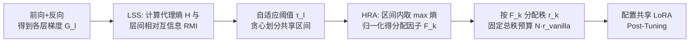

# E²LoRA: Efficient and Effective Low-Rank Adaptation with Entropy-Guided Adaptive Sharing

**会议**: ICLR 2026  
**OpenReview**: [https://openreview.net/forum?id=IQttyo0460](https://openreview.net/forum?id=IQttyo0460)  
**代码**: 待确认  
**领域**: 参数高效微调 / LoRA 参数共享  
**关键词**: LoRA, PEFT, 参数共享, 秩分配, 代理熵, 互信息  

## 一句话总结
用基于梯度的"代理熵"探测预训练模型的层间相似性与逐层信息异质性，据此**自适应地把相邻相似层划进同一个共享区间、并按信息量给每个区间分配 LoRA 秩**，在可训练参数减半的同时持平甚至超过 LoRA / ShareLoRA。

## 研究背景与动机
- **领域现状**：LoRA 已成为 PEFT 的基石，后续变体分两类——一类追求效果（AdaLoRA 动态调秩、DoRA 分解重构、LoRA+ 非对称学习率），但不省参数；一类追求效率（LoRA-FA 冻结 A、VeRA 共享冻结矩阵只学向量、ShareLoRA 跨层共享 A），靠冻结/共享压参数。
- **现有痛点**：现有共享方法大多是"一刀切"——把同一份 LoRA 参数无差别地共享到所有层，或按固定块共享。这会牺牲表示多样性、削弱特征判别力，往往带来明显的性能下降。
- **核心矛盾**：**既想大幅提升 LoRA 的参数效率，又要维持甚至超越原始效果**——而启发式的共享范围（全层共享、固定块）和均匀的秩分配恰恰忽视了模型内部的结构异质性。
- **本文目标**：找到"该和谁共享、共享区间内该分多少容量"的原则化答案，让共享既省参数又不掉点。
- **核心 idea（双自适应共享）**：作者用基于梯度的代理熵分析预训练模型，揭示两条被忽视的性质——**Local Similarity**（相邻层的梯度信息相似度高，且高相似块的大小/位置随模型与任务变化）和 **Layer-wise Information Heterogeneity**（各层绝对信息量差异显著）。据此提出 **E²LoRA**：用层间相似度自适应划分共享区间（应对前者），用逐层绝对代理熵自适应分配秩（应对后者）。

## 方法详解

### 整体框架
E²LoRA 是一个即插即用的"双自适应"框架，先做一次前向+反向拿到各层梯度，再分两步配置 LoRA：**(1) Local Similarity-based Sharing (LSS)** 用梯度互信息把相邻相似层划成不重叠的共享区间，每个区间共用一套 LoRA；**(2) Heterogeneity-based Rank Allocation (HRA)** 用各层代理熵衡量信息量，给信息更丰富的区间分更高的秩；最后用这套自适应配置的 LoRA 做 post-tuning。整套配置在训练前一次性算好，不引入训练中动态变形。

### 关键设计

**1. 代理熵：用梯度标准差当层信息量的廉价度量。** 方法的地基是一个"信息量"标量。对某层 $l$ 在一小批训练数据上得到的梯度张量 $G_l$，作者把它展平后用其元素标准差 $\sigma_{G_l}$ 定义代理熵 $H(G_l)=\log(\sigma_{G_l})+\frac{1}{2}\log(2\pi)+\frac{1}{2}$（高斯熵的近似形式）。直觉是梯度的离散程度反映了该层在下游任务上承载/更新的信息多寡，文中在附录把它与 Frobenius 范数、Fisher 信息联系起来给出理论依据。这个度量只需一次反传即可算出，几乎零额外开销，是后面"分组"和"分秩"两件事共用的原料。

**2. LSS——用相对互信息把相邻相似层并成共享区间。** 要决定"谁和谁共享"，需要一个层间相似度。作者先用代理熵定义两层梯度的互信息 $I(G_i;G_j)=H(G_i)+H(G_j)-H(G_i,G_j)$（联合熵把两层梯度拼接后同样用上式近似），再除以较小熵归一化成 **相对互信息** $\mathrm{RMI}(G_i;G_j)=\frac{I(G_i;G_j)}{\min(H(G_i),H(G_j))}\in[0,1]$，从而能跨层对比相似度。划分采用**贪心顺序**策略并配自适应阈值：每层 $m$ 的阈值取它与其余所有层 RMI 的均值 $\tau_m=\frac{1}{N-1}\sum_{k\neq m}\mathrm{RMI}(G_m,G_k)$；从当前层开新区间，只要后续层与区间起始层的 RMI 仍满足阈值就并入，一旦不满足就封闭区间另起一个，直到所有层被划进不重叠的连续区间。这样既尊重"局部相似"又让区间长度随模型/任务自适应，附录还验证它逼近动态规划的全局最优解但更快、无需调超参。

**3. HRA——按区间信息量分配有限的秩预算。** 区间分好后，要决定"每个共享区间给多少表达能力（秩）"。为避免高信息层被同区间的低信息层拖累，区间 $k$ 的代表熵取**区间内最大**代理熵 $H_{\text{interval}_k}=\max_{l\in[s_k,e_k]}H(G_l)$；归一化得到分配因子 $F_k=\frac{H_{\text{interval}_k}}{\sum_i H_{\text{interval}_i}}$。为公平对比，作者固定全模型总秩预算为 $N\times r_{\text{vanilla}}$（vanilla LoRA 给 $N$ 层每层 $r_{\text{vanilla}}$），按因子把它重分配：$r_k=\mathrm{round}(F_k\times(N\times r_{\text{vanilla}}))$。于是信息丰富的区间拿更高秩保表达力，次要区间用低秩省参数——LSS 负责"省"，HRA 负责"不掉点"。

**4. 正交集成到已有 LoRA 变体。** E²LoRA 是配置层而非新结构，因此能套到非共享与共享两类方法上：非共享设定（如 vanilla LoRA）把逐层适配器换成区间级共享适配器并按熵分秩；共享设定（如 ShareLoRA 全局共享 A）把全局共享分量初始化到最大秩，计算时按各层动态秩做**维度切片**，从而保留全局共享的效率又能享受熵引导的秩分配。文中以 E²X 形式验证了对 DoRA / VeRA / LoRI 的即插即用增益。

## 实验关键数据

### 主实验表格

RoBERTa-Base / GLUE（5 子任务平均）：

| 方法 | #Params | Average |
|------|---------|---------|
| FFT | 125.00M | 86.14 |
| LoRA | 0.30M | 85.87 |
| **E²LoRA** | 0.16M | 85.57 |
| ShareLoRA | 0.16M | 84.99 |
| **E²ShareLoRA** | **0.08M** | **85.40** |

Llama-3.1-8B-Base / NLG：

| 方法 | GSM8K #Params | Acc | HumanEval #Params | Pass@1 |
|------|---------------|-----|-------------------|--------|
| LoRA | 6.82M | 70.21 | 6.82M | 42.68 |
| **E²LoRA** | 3.61M | 70.51 | 3.66M | 44.31 |
| ShareLoRA | 2.75M | 70.51 | 2.75M | 43.69 |
| **E²ShareLoRA** | **1.59M** | 70.26 | **1.59M** | **44.71** |

CLIP-ViT-B/16 / 7 个图像分类数据集（平均）：

| 方法 | #Params | Average |
|------|---------|---------|
| LoRA | 1.31M | 89.08 |
| **E²LoRA** | 0.66M | **89.81** |
| ShareLoRA | 0.72M | 88.75 |
| **E²ShareLoRA** | **0.39M** | 89.73 |

### 消融实验表格

组件消融（Llama3.1-8B / GSM8K）：

| LSS | HRA | #Params | Acc |
|-----|-----|---------|-----|
| ✓ | × | 3.51M | 69.45 |
| × | ✓ | 6.82M | 71.19 |
| cosine 相似度 | ✓ | 3.75M | 66.67 |
| KL | ✓ | 3.43M | 67.57 |
| **✓（RMI）** | **✓** | 3.61M | **70.51** |

同参数量下与 LoRA 对比（Llama3.1-8B / GSM8K）：

| 方法 | Rank | #Params | Acc |
|------|------|---------|-----|
| LoRA | 4 | 3.41M | 67.58 |
| **E²LoRA** | 8 | 3.61M | **70.51** |
| LoRA | 8 | 6.82M | 70.21 |
| **E²LoRA** | 16 | 7.22M | **71.19** |

### 关键发现
- **参数减半仍持平/超越**：跨 NLU、NLG、CV 三类任务，E²LoRA 用约一半可训练参数匹配或超过 LoRA；E²ShareLoRA 把 ShareLoRA 参数进一步压到约 60% 甚至一半，反而涨点（HumanEval 43.69→44.71）。
- **LSS 主省参、HRA 主提效**：单 LSS 把参数从 6.82M 降到 3.51M 而 Acc 仅 69.45；单 HRA 把 Acc 拉到 71.19；二者合用在 3.61M 参数下达 70.51，体现互补。
- **RMI 优于其他相似度**：换成 cosine / L1 / L2 / KL 作相似度都明显掉点，验证代理熵互信息这一度量更契合"该不该共享"的判断。
- **同参数预算下更强**：固定参数量，E²LoRA-rank8 胜 LoRA-rank4（+0.3），E²LoRA-rank16 胜 LoRA-rank8（+0.98），说明增益来自更合理的容量分配而非单纯堆参数。

## 亮点与洞察
- **把"信息论度量"接进 LoRA 共享是新角度**：以往共享靠人工指定拓扑（全层/固定块/层级结构），本文第一次用下游任务梯度的代理熵+相似度统计直接导出共享区间，省去启发式与调参。
- **一个度量解决两件事**：同一个代理熵既支撑"分组"（经 RMI）又支撑"分秩"（经 max+归一化），方法非常省心且自洽。
- **训练前一次性配置、对分布式友好**：区间与秩在训练前定好，避免训练中动态改形状，利于 ZeRO 等分布式策略（区别于 AdaLoRA 这类训练中剪枝）。
- **正交可叠加**：作为配置层能套到 LoRA/ShareLoRA/DoRA/VeRA/LoRI 上，迁移成本低、复用价值高。

## 局限与展望
- **需要一次反向传播取梯度**：代理熵依赖在小批数据上的梯度，虽开销小但仍引入一次预计算步骤，且对所取小批的代表性可能有一定敏感性（文中未深究批样本选择的影响）。
- **贪心划分的次优性**：区间划分是贪心+均值阈值，虽对标 DP 接近最优，但在层间相似结构复杂时是否仍稳健、阈值取均值是否最优仍可探讨。
- **高斯近似的适用边界**：代理熵把梯度近似为高斯并只用标准差，对重尾或结构化梯度分布的刻画可能不够精细。
- **任务/规模外推**：实验集中在 8B 量级与中等规模任务，更大模型、多任务/持续学习下的共享区间稳定性值得进一步验证。

## 相关工作与启发
- **共享类 LoRA**：ShareLoRA、VeRA、Rasa、RandLoRA、HydraLoRA、BSLoRA 都用人工指定的共享拓扑；本文用梯度熵统计自动导出共享结构，是对这一路线的"去启发式"。
- **秩分配类 LoRA**：AdaLoRA（过参数后剪枝）、IncreLoRA（从 rank-1 增长）、GoRA / LoRA-GA / RaLoRA（用梯度信息指定秩）都在层内调秩；E²LoRA 的差异是把"跨层共享"与"熵引导分秩"联合起来。
- **熵用于深度学习**：前人用层间熵指导剪枝、用熵相似度做蒸馏/模型比较/注意力优化；本文把这套熵度量首次引入 LoRA 的共享与秩分配，是跨领域迁移的范例。
- **启发**：当需要在"共享省参"和"保表达力"之间取舍时，与其人工设计拓扑，不如让模型自身的（梯度）信息统计来回答"和谁共享、分多少容量"——这一思路可推广到 prompt/adapter 等其他 PEFT 模块的容量分配。

## 评分
- **新颖性**: ⭐⭐⭐⭐ 首次用基于梯度的代理熵+相对互信息同时驱动 LoRA 的共享区间划分与秩分配，揭示局部相似与逐层异质两条性质，角度新且自洽。
- **实验充分度**: ⭐⭐⭐⭐ 覆盖 NLU/NLG/CV 三模态、多模型，含组件消融、相似度度量消融、同参数对比与对多种 LoRA 变体的正交性验证，较完整；但模型规模上限与多任务场景仍有空间。
- **写作质量**: ⭐⭐⭐⭐ 动机—洞察—方法逻辑清晰，图 1/图 2 直观，公式与算法表述规范。
- **价值**: ⭐⭐⭐⭐ 即插即用、参数减半不掉点、对分布式友好，对 PEFT 落地有实用意义。

<!-- RELATED:START -->

## 相关论文

- [\[ICLR 2026\] FlexLoRA: Entropy-Guided Flexible Low-Rank Adaptation](flexlora_entropy-guided_flexible_low-rank_adaptation.md)
- [\[ICLR 2026\] Stable-LoRA: Stabilizing Feature Learning of Low-Rank Adaptation](stable-lora_stabilizing_feature_learning_of_low-rank_adaptation.md)
- [\[ICLR 2026\] LoFT: Low-Rank Adaptation That Behaves Like Full Fine-Tuning](loft_low-rank_adaptation_that_behaves_like_full_fine-tuning.md)
- [\[ICCV 2025\] Beyond Low-Rank Tuning: Model Prior-Guided Rank Allocation for Effective Transfer in Low-Data and Large-Gap Regimes](../../ICCV2025/model_compression/beyond_low-rank_tuning_model_prior-guided_rank_allocation_for_effective_transfer.md)
- [\[ACL 2026\] TLoRA: Task-aware Low Rank Adaptation of Large Language Models](../../ACL2026/model_compression/tlora_task-aware_low_rank_adaptation_of_large_language_models.md)

<!-- RELATED:END -->
