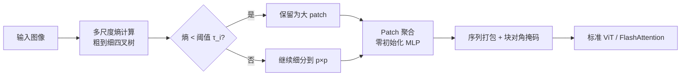

# Faster Vision Transformers with Adaptive Patches

**会议**: ICLR 2026  
**OpenReview**: [https://openreview.net/forum?id=SzoowJtd14](https://openreview.net/forum?id=SzoowJtd14)  
**代码**: 有项目主页（论文 abstract 注明 project page，未给具体仓库）  
**领域**: 模型压缩 / ViT 加速 / Token 缩减  
**关键词**: Vision Transformer, 自适应 Patch, 熵, Token 缩减, 序列打包, 零初始化 MLP  

## 一句话总结
APT（Adaptive Patch Transformer）让一张图里用多种 patch 尺寸——平坦区域用大 patch、复杂区域用小 patch，从源头减少 token 数量，给任意预训练 ViT 带来 30~50% 加速且几乎不掉点，微调 1 个 epoch 即可收敛。

## 研究背景与动机
- **领域现状**：ViT 把图像切成等大 patch，序列长度随分辨率平方增长，自注意力又是序列长度的二次复杂度，高分辨率图像因此异常昂贵——尽管高分辨率图里冗余其实更多。
- **现有痛点**：主流 token 缩减方法有两类硬伤。① Token 合并（ToMe 等）对每张图固定削减一个比例：在纯白图上只合一半远不够，在繁忙街景上合一半又会伤性能；② Token 剪枝（DynamicViT 等）要训练一个打分网络判断哪些 token 没用，前向过程中产生 padding 和不规则形状，实际反而抵消加速，还无法做 batch>1 推理，且训练本身不加速。
- **核心矛盾**：固定削减比例**与图像内容复杂度不匹配**；而内容自适应的剪枝又**破坏规则张量形状、与高效注意力内核不兼容**——既要内容感知，又要工程上真加速，二者难兼得。
- **本文目标**：在训练和推理都拿到真实墙钟（wall-clock）加速，同时保持下游性能，并且能直接套在已有预训练 ViT 上、极快收敛。
- **核心 idea**：**【借鉴语言模型的自适应分词】** NLP 用 BPE/SentencePiece 按子词频率分配变长 token，既缩短序列又提性能。APT 把这个思路搬到视觉——**用熵在多尺度上度量 patch 的可压缩性，低熵（冗余）区域分配大 patch，高熵（细节）区域分配小 patch**，在进入网络**之前**就把 token 数减下来，从而绕开剪枝那套"前向中削减"的工程坑。

## 方法详解

### 整体框架
APT 分三步：先用多尺度熵决定每个区域用多大 patch（四叉树结构）；再把不同尺寸的 patch 统一投影到同一 token 嵌入空间（核心是一个零初始化 MLP，保证开箱不掉点）；最后用序列打包（sequence packing）+ 块对角注意力掩码处理变长序列，让加速真正落到 FlashAttention 这类内核上。整套流程不改 transformer 主体，可直接挂到任意预训练 ViT 后微调。

### 关键设计

**1. 多尺度熵驱动的四叉树 patch 分配：用可压缩性决定粒度。** 定义 $S$ 个 patch 尺度，第 $i$ 级 patch 大小为 $2^i p \times 2^i p$（如 $S=3, p=16$ 时有 $16/32/64$ 三档），并约束所有 patch 沿规则网格构成四叉树。每个 patch 的信息量用熵 $H(P)=-\sum_{i=0}^{L-1} p_i \log_2 p_i$ 度量（$p_i$ 是像素强度直方图的概率），熵越低代表越冗余、越该用大 patch。分配自粗到细进行：先在最粗尺度 $2^S p$ 上算熵，保留所有熵低于阈值 $\tau_i$ 的块为该级大 patch，剩下的递归细分，直到最细的 $p\times p$。这样**削减比例随图像复杂度自适应**——简单卡通图 token 很少，繁忙街景 token 很多，从根本上解决了固定比例的错配。熵计算放在 CPU dataloader 上多核并行、与 GPU 计算重叠，几乎零额外开销。

**2. 零初始化 MLP 的 patch 聚合：开箱不掉点、一个 epoch 收敛。** 不同尺寸 patch 要落到同一 $d_{embed}$ 嵌入空间。单纯把大 patch resize 到 $p\times p$ 再用原嵌入层 $E$ 能免训练但丢信息；为每个尺寸训独立嵌入层又有开销。APT 把两者结合：对一个大 patch $P_i$，既 resize 后过 $E$，又把它拆成若干 $p\times p$ 子 patch $\{P_j\}$ 分别嵌入再用卷积逐级下采样聚合，二者用一个**零初始化的 MLP** 相加：
$$E(P_i)=\text{ZeroMLP}\big(\text{Conv2d}^{(i)}(\{E(P_j)\mid P_j\subset P_i\})\big)+E(\text{Resize}_p(P_i))$$
ZeroMLP 借鉴 ControlNet 的零初始化思想：初始时高分辨率细节那一支输出为 0，模型行为等同于纯 resize（开箱即用、几乎不掉点），训练中再**逐渐**把细节信息融进来。正因如此，APT 套到已微调 ImageNet 模型上**仅需 1 个 epoch** 就能"愈合"换 patch 方案带来的退化，而 DynamicViT/MS-ViT 这类要学打分网络的方法动辄要 50+ epoch。

**3. 序列打包 + 位置编码插值：让变长输入真正吃到内核加速。** 内容自适应导致每张图 token 数差异巨大，APT 不在层间削减，而是在跑模型**前**就定好序列长度（更像语言模型）。一个 batch 的图像 token 拼成一条长序列 $\sum_i N_i$，配一个**块对角掩码**保证每张图只注意自己的 token——这在 FlashAttention/xFormers 里原生支持，掩码不变所以零额外开销。位置编码沿用 NaViT 的插值：大 patch（尺寸 $sp$）从基础 $\frac{H}{p}\times\frac{W}{p}$ 编码图采样到 $\frac{H}{sp}\times\frac{W}{sp}$ 网格，跨尺度保持空间一致。

**4. 适配稠密预测与窗口注意力：把加速带出分类。** 检测/分割需要规则特征图，但 APT 输出 token 数可变。解法是假设大 patch 编码更简单的特征，将其**重复 $2^{2i}$ 次**还原成可被转置卷积上采样的可微特征图。对依赖窗口注意力的高分辨率任务（如 EVA-02 检测），把图划成"最大 patch 尺寸整数倍"的窗口，每个窗口内做自适应 patch 分配与局部注意力，同样靠序列打包实现，开销轻微——这让 APT 在 1536×1536 检测、ADE20K 分割上仍能削掉 30% token。

## 实验关键数据

### 主实验表格

ImageNet 微调（MAE 配方），分辨率越高、模型越大，加速越猛，精度几乎无损：

| 模型 | 分辨率/Patch | Acc | 墙钟时间 | 加速 |
|---|---|---|---|---|
| ViT-L (MAE) | 336/14 | 86.1 | 15.9h | - |
| APT-L | 336/14 | 86.1 | 9.9h | **+61%** |
| ViT-L (MAE) | 448/14 | 86.4 | 31.4h | - |
| APT-L | 448/14 | 86.3 | 16.9h | **+86%** |

1-epoch 微调（从已微调 checkpoint 起，对比仅随机/仅 resize）：

| 模型 | 分辨率 | Acc | 吞吐加速 |
|---|---|---|---|
| ViT-H | 336/14 | 88.5 | - |
| Random | 336/14 | 87.0 | +55% |
| Resizing | 336/14 | 88.0 | +50% |
| **APT-H** | 336/14 | **88.4** | **+50%** |

下游任务（仅微调 5% 迭代）几乎全面持平甚至略超 baseline：

| 任务 | Backbone | 加速 | 关键指标 |
|---|---|---|---|
| VQA | LLaVA-1.5-13B | +23% | VQAv2 79.4 vs 80.0；POPE/MMBench 多项**超过**基线 |
| 目标检测 (COCO@1536) | EVA-02-L | +30% | mAP 62.07 vs 62.28 |
| 语义分割 (ADE20K@640) | EVA-02-L | +11% | mIoU 60.01 vs 60.05 |

### 消融实验表格

| 消融 | 设置 | 结论 |
|---|---|---|
| 零初始化连接 | Residual / NonZero / **Zero** | Zero 在免训练（87.98）和训练后（88.13）都最优，最接近基线 88.15 |
| APT 开销（无削减时） | $\tau=-1$ | 约慢 10%（重排+掩码），但实际削减 token 带来 20%+ 加速，净赚 |
| 熵阈值 $\tau$ | $\tau_{32}=5.75,\tau_{64}=4.0$ 通用；检测用 2 | 阈值越高越快但精度先缓降后骤降；检测因需精确边缘要低阈值 |

### 关键发现
- **输入级削减 > 层级合并**：在 ViT-L/H 的精度-吞吐权衡曲线上，APT 全面超过 ToMe/EViT/PPT/DTEM 等层级合并方法（含为它们补上 FlashAttention 的"Advanced"版）。层级合并方法大多与 FlashAttention 不兼容，反而比带 FlashAttention 的原版 ViT 还慢。
- **加速随分辨率/模型规模放大**：注意力在大模型/高分辨率下占训练时间主导，token 削减收益因此被放大（ViT-L 在 448 分辨率加速翻倍到 86%）。
- **序列长度分布**：实际序列长度集中在最大值附近并缓慢拖尾，最低可到最大值的约 30%。

## 亮点与洞察
- **把"自适应分词"从 NLP 干净地搬到视觉**：用熵这个无需学习的廉价信号决定 patch 粒度，绕开了"训练打分网络"这条又贵又不加速的老路。
- **真·墙钟加速而非纸面 FLOPs**：通过"模型前削减 + 序列打包 + 块对角掩码"主动拥抱 FlashAttention，避免了剪枝方法 padding/不规则形状抵消加速的通病，还支持 batch>1。
- **零初始化是点睛之笔**：让方法可挂任意预训练 ViT、1 epoch 收敛，把"换 patch 方案"的代价压到几乎为零，工程落地友好。
- **通用性强**：分类、VQA、检测、分割、窗口注意力全覆盖，且在 VQA/部分基准上甚至略超原模型——说明削掉的多是冗余而非信息。

## 局限与展望
- **依赖手工启发式**：patch 尺寸由熵+阈值决定，是人工设计的启发式，未必对齐下游用户真正关心的区域（如问"背景什么颜色"，APT 仍会把背景粗粒化）。
- **阈值需经验调参**：$\tau$ 是任务相关超参（检测要调到 2），给下游采用增加摩擦，可考虑自动/可学习的阈值。
- **暂不支持图像生成**：生成任务分辨率极高、模型极大，本是理想应用场景，但 APT 目前未覆盖，是明确的未来方向。

## 相关工作与启发
- **vs Token 合并（ToMe）**：合并对每张图削减固定数量 token，内容错配；APT 自适应且在输入级削减。
- **vs Token 剪枝（DynamicViT）**：剪枝要学打分网络、不加速训练、不支持 batch 推理；APT 用免学习的熵、训练即加速。
- **vs 同尺度自适应 patch（CF-ViT/Quadformer/MG-ViT/MS-ViT）**：Quadformer 用固定 patch 数；MG-ViT 靠注意力分数决定尺寸而无法用高效内核且需从头训；MS-ViT 要大量微调且不加速训练。APT 用零初始化解决收敛、靠序列打包解决内核兼容，在高分辨率/大模型上加速更猛。
- **启发**：当输入存在天然的内容不均匀冗余时，"在进入主干前按内容自适应地变长 tokenize" 可能比"层内动态剪枝"工程上更划算——把削减做在内核能吃的地方，比削减得更激进更重要。

## 评分
- 新颖性: ⭐⭐⭐⭐ 把 NLP 自适应分词思想以熵+四叉树+零初始化干净落地到 ViT，输入级自适应 patch 的组合是清晰的增量创新。
- 实验充分度: ⭐⭐⭐⭐⭐ 覆盖分类/VQA/检测/分割、多模型规模与分辨率，输入级与层级 baseline 都补了 FlashAttention 公平复现，消融到位。
- 写作质量: ⭐⭐⭐⭐ 动机-方法-实验逻辑顺畅，图示（patch 嵌入、序列长度分布、运行时拆解）清楚。
- 价值: ⭐⭐⭐⭐⭐ 即插即用、1 epoch 收敛、真实墙钟加速 30~86% 且几乎不掉点，对降低 ViT 训练/推理成本有很高实用价值。

<!-- RELATED:START -->

## 相关论文

- [\[ICLR 2026\] Thicker and Quicker: A Jumbo Token for Fast Plain Vision Transformers](thicker_and_quicker_the_jumbo_token_for_fast_plain_vision_transformers.md)
- [\[NeurIPS 2025\] REOrdering Patches Improves Vision Models](../../NeurIPS2025/model_compression/reordering_patches_improves_vision_models.md)
- [\[CVPR 2026\] BinaryAttention: One-Bit QK-Attention for Vision and Diffusion Transformers](../../CVPR2026/model_compression/binaryattention_one-bit_qk-attention_for_vision_and_diffusion_transformers.md)
- [\[AAAI 2026\] Distillation Dynamics: Towards Understanding Feature-Based Distillation in Vision Transformers](../../AAAI2026/model_compression/distillation_dynamics_towards_understanding_feature-based_di.md)
- [\[ICLR 2026\] TurboBoA: Faster and Exact Attention-aware Quantization without Backpropagation](turboboa_faster_and_exact_attention-aware_quantization_without_backpropagation.md)

<!-- RELATED:END -->
