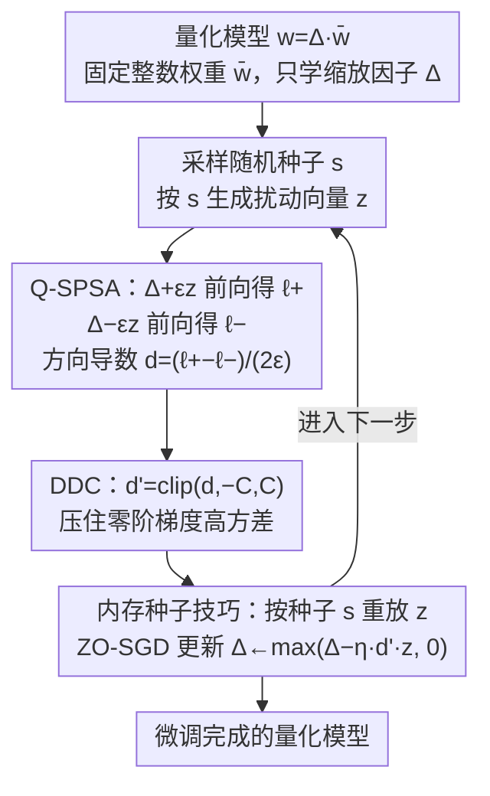

# Fine-tuning Quantized Neural Networks with Zeroth-order Optimization

**会议**: ICLR 2026  
**arXiv**: [2505.13430](https://arxiv.org/abs/2505.13430)  
**代码**: [GitHub](https://github.com/maifoundations/QZO)  
**领域**: 模型压缩/高效微调  
**关键词**: 零阶优化, 量化模型微调, 内存高效训练, 量化缩放因子, 梯度方差

## 一句话总结
提出QZO方法，通过对量化缩放因子（而非离散权重）做零阶扰动来估计梯度，配合方向导数裁剪稳定训练，实现4-bit/2-bit LLM的极致内存高效微调，总内存降低18倍以上。

## 研究背景与动机

**领域现状**：LLM微调需要存储权重、梯度、优化器状态和激活值，典型7B模型需56GB。现有方法分别压缩不同组件：LoRA减参数、GaLore压缩优化器状态、MeZO用零阶优化消除梯度存储。

**现有痛点**：这些方法只解决了部分内存问题。权重本身仍占大量内存（7B模型bfloat16需14GB），即使用MeZO消除梯度也仍需14GB存权重。最直接的解决方案是量化权重（如int4只需3.5GB），但量化后权重是离散的，无法直接做零阶扰动。

**核心矛盾**：零阶优化需要在连续空间扰动权重→量化权重是离散的；估计的梯度是连续的→无法更新离散权重（需要反量化-再量化循环）。

**本文目标**：如何在量化模型上应用零阶优化，同时最大化内存压缩（权重+梯度+优化器状态全压缩）？

**切入角度**：观察到量化的本质是 $w = \Delta \cdot \bar{w}$，其中 $\Delta$ 是连续的缩放因子，$\bar{w}$ 是离散整数。可以扰动连续的 $\Delta$ 而保持 $\bar{w}$ 不变。

**核心 idea**：扰动连续的量化缩放因子做零阶梯度估计，用方向导数裁剪控制梯度方差。

## 方法详解

### 整体框架
QZO 要在量化好的 LLM 上做微调，却又不想付出梯度和优化器状态的内存代价。难点在于量化把权重写成 $w = \Delta \cdot \bar{w}$，其中 $\bar{w}$ 是离散整数、$\Delta$ 是连续的缩放因子——零阶优化需要在连续空间里扰动参数，离散的 $\bar{w}$ 没法直接扰动。QZO 的破题点就是只动连续的那一半：整个训练过程中固定量化整数权重 $\bar{\theta}$，只把缩放因子 $\Delta$ 当作可学习参数。

训练是一个不需要反向传播的逐步循环。每一步：先按一个随机种子生成扰动向量 $z$，把缩放因子分别加、减 $\epsilon z$ 各做一次前向，用两次损失之差估出沿 $z$ 方向的导数（这就是 Q-SPSA）；再把这个标量裁剪一下压住方差（DDC）；最后按同一种子重放出 $z$、沿该方向更新 $\Delta$（内存种子技巧让 $z$ 不必存下来）。三个组件分别负责估梯度、稳训练、省存储，合起来做到梯度、优化器状态、权重三项内存全压。

### 关键设计

**1. Q-SPSA：把零阶扰动从离散权重挪到连续缩放因子上**

零阶优化原本卡在「权重是离散的、没法扰动」这个矛盾上。Q-SPSA 的做法是把扰动只施加在连续的缩放因子 $\Delta$ 上，用两次前向的损失差来估计梯度：

$$\hat{\nabla}_{\Delta}\mathcal{L} = \frac{\mathcal{L}((\Delta+\epsilon z)\odot\bar{\theta}) - \mathcal{L}((\Delta-\epsilon z)\odot\bar{\theta})}{2\epsilon}z, \quad z \sim \mathcal{N}(0, I_d)$$

这里只有 $\Delta$ 被加减扰动 $\epsilon z$，整数权重 $\bar{\theta}$ 始终不变。因为反量化 $w = \Delta \cdot \bar{w}$ 本就是量化模型正常前向的一部分，扰动后的前向和平时推理完全一致，不用改任何推理代码。这个分解还让方法天然适配两类主流量化：scalar-based（如 GPTQ）和 codebook-based（如 AQLM），它们都有连续的缩放/码本因子可供扰动。

**2. DDC（方向导数裁剪）：压住零阶梯度的高方差**

零阶估计有个老毛病——方差大（MeZO 也有），表现为训练时 loss 经常异常跳跃。DDC 直接对方向导数标量 $d$（即上式中那个损失差比值）做裁剪：

$$d' = \text{clip}(d, -C, C), \quad \hat{\nabla} = d' \cdot z$$

关键在于裁剪没有破坏估计的正确性：论文 Theorem 1 证明裁剪后的梯度仍是无偏估计，且方差不增——因为 $d'^2 \leq d^2$，所以 $\text{Var}[\hat{\nabla}'] \leq \text{Var}[\hat{\nabla}]$。于是 DDC 用一个极简的操作就换来了更稳的训练曲线，而不付出偏差代价。

**3. 内存种子技巧：用随机种子重放扰动向量，不存 $z$**

扰动向量 $z$ 和模型同维度，若把它存下来，省掉的梯度内存又被吃回去了。QZO 沿用 MeZO 的做法：不存 $z$，只记下生成它的随机种子编号，需要时按同一种子重新采样即可复现完全相同的 $z$。这样前向加扰、计算更新所需的 $z$ 都能即用即生成，内存开销可以忽略不计。

### 损失函数 / 训练策略
更新用 ZO-SGD：$\Delta_{t+1} = \max(\Delta_t - \eta \cdot d' \cdot z, 0)$，其中 $\max(\cdot, 0)$ 保证缩放因子始终非负。默认超参为学习率 $\eta = 10^{-7}$、扰动尺度 $\epsilon = 10^{-3}$、裁剪阈值 $C = 100$。若模型中还有未量化的部分，可在 Q-SPSA 更新 $\Delta$ 的同时用标准 SPSA 联合更新这部分参数。

## 实验关键数据

### 主实验
4-bit GPTQ量化模型（SST-2/RTE/CB/BoolQ/SQuAD）：

| 方法 | 精度 | 内存 | SST-2 | RTE | SQuAD |
|------|------|------|-------|-----|-------|
| Zero-Shot | 16bit | 14GB | 基线 | 基线 | 基线 |
| Fine-tuning+AdamW | 16bit | 56GB | 上界 | 上界 | 上界 |
| MeZO | 16bit | 14GB | 好 | 好 | 好 |
| QZO (4bit) | 4bit | **<3GB** | 接近MeZO | 接近MeZO | 接近MeZO |

### 极致量化实验 (2-bit AQLM, Llama-2-13B)

| 配置 | 内存 | 性能 | 说明 |
|------|------|------|------|
| Zero-Shot-Q(2bit) | ~5GB | 基线 | 量化后零样本 |
| QZO(2bit) | ~5GB | **显著超越Zero-Shot** | 极致量化仍有效 |
| MeZO(16bit) | 26GB | 对比参考 | 需5倍内存 |

### 关键发现
- QZO以<3GB内存实现了接近MeZO(14GB)的微调效果，18倍内存压缩
- 在2-bit极致量化下仍显著超越零样本基线，证明QZO在极端压缩下仍有效
- DDC裁剪对稳定训练至关重要——无DDC时loss经常出现异常跳跃
- 裁剪阈值C在较宽范围内(50-200)效果稳定

## 亮点与洞察
- **统一框架极致压缩**：同时消除梯度、优化器状态、并压缩权重，实现了三个维度的"极致"内存节省。18倍压缩使得24GB GPU可微调13B模型。
- **扰动缩放因子而非权重**：避免了反量化→扰动→再量化的复杂流程，既优雅又实用。关键insight是把量化分解写成 $w = \Delta \cdot \bar{w}$，只扰动连续部分。
- **DDC的理论保证**：证明裁剪后仍无偏且方差更小，是一个clean的理论结果。

## 局限与展望
- 零阶优化收敛慢，需要更多优化步数（20k步 vs 几百步的一阶方法）
- 仅在NLU任务上验证（分类+QA），生成任务（如指令跟随）上效果未知
- 只能微调缩放因子（粒度有限），不能像LoRA那样学习新的低秩参数
- 与LoRA+量化（如QLoRA）的对比缺失

## 相关工作与启发
- **vs MeZO**: MeZO在未量化模型上做ZO，QZO在量化模型上做ZO。QZO以1/5内存达到接近效果。
- **vs QLoRA**: QLoRA用量化+LoRA微调，仍需梯度存储。QZO完全消除梯度存储，内存更低但可能效果略差。
- **vs ZO-signSGD**: 之前量化ZO工作需要量化扰动噪声+在离散权重上用sign SGD，QZO更高效灵活。

## 评分
- 新颖性: ⭐⭐⭐⭐ 扰动量化缩放因子的想法直观且有效
- 实验充分度: ⭐⭐⭐ 数据集种类偏少，缺少与QLoRA对比
- 写作质量: ⭐⭐⭐⭐ 方法描述清晰，理论证明完整
- 价值: ⭐⭐⭐⭐ 对极端资源受限场景有直接价值

<!-- RELATED:START -->

## 相关论文

- [\[CVPR 2026\] FOZO: Forward-Only Zeroth-Order Prompt Optimization for Test-Time Adaptation](../../CVPR2026/model_compression/fozo_forward-only_zeroth-order_prompt_optimization_for_test-time_adaptation.md)
- [\[ICLR 2026\] Adaptive Width Neural Networks](adaptive_width_neural_networks.md)
- [\[ICML 2026\] Turning Stale Gradients into Stable Gradients: Coherent Coordinate Descent with Implicit Landscape Smoothing for Lightweight Zeroth-Order Optimization](../../ICML2026/model_compression/turning_stale_gradients_into_stable_gradients_coherent_coordinate_descent_with_i.md)
- [\[ICLR 2026\] A Recovery Guarantee for Sparse Neural Networks](a_recovery_guarantee_for_sparse_neural_networks.md)
- [\[ICLR 2026\] BEP: A Binary Error Propagation Algorithm for Binary Neural Networks Training](bep_a_binary_error_propagation_algorithm_for_binary_neural_networks_training.md)

<!-- RELATED:END -->
