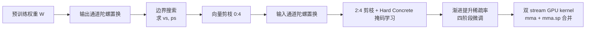

# FlexHiNM-GP: Flexible Hierarchical Pruning via Region Allocation and Channel Permutation

**会议**: ICLR 2026  
**OpenReview**: [https://openreview.net/forum?id=YaZraqRsbB](https://openreview.net/forum?id=YaZraqRsbB)  
**代码**: 待确认  
**领域**: 模型压缩 / 结构化剪枝  
**关键词**: N:M 稀疏, 层级稀疏, 通道置换, Sparse Tensor Core, Hard Concrete, 渐进剪枝  

## 一句话总结
把每层权重自适应切成「稠密(4:4)/N:M(2:4)/全剪(0:4)」三块区域，再配上一种感知 HiNM 结构的陀螺式通道置换 (Gyro-Permutation) 和可微 2:4 掩码学习，让结构化剪枝在保持 GPU Sparse Tensor Core 硬件兼容的前提下逼近非结构化剪枝的精度。

## 研究背景与动机
- **领域现状**：N:M 稀疏（每 M 个元素保留 N 个，典型 2:4）被 NVIDIA Ampere 的 Sparse Tensor Core (STC) 原生支持，靠 `mma.sp` 指令免去软件索引开销，是当前最硬件友好的剪枝范式。
- **现有痛点**：硬件只支持固定 N:M 模式（2:4 即固定 50% 稀疏），无法按层、按权重重要度灵活调节剪枝粒度。Venom 提出的层级 N:M (HiNM) 先按列向量重要度整列剪掉一部分（0:4），剩下的统一做 2:4，从而把整体稀疏率推到 50% 以上——但「剩余向量统一 2:4」这一步过于粗暴。
- **核心矛盾**：保留向量之间的重要度分布方差很大。即便某向量四个元素全是重要的，2:4 约束也强制剪掉两个，白白丢信息；而方差大也让 2:4 模式与权重分布不匹配，精度损失放大。
- **本文目标**：在不牺牲 STC 硬件兼容性的前提下，给 HiNM 加上「更细的区域控制」和「让显著权重对齐稀疏模式」两种能力，把结构化剪枝的精度顶到接近非结构化剪枝。
- **核心 idea**：**三级区域分配** + **结构感知通道置换** + **可微掩码**三件套。用一个闭式公式把目标稀疏率拆成稠密/2:4/全剪三块的边界，用陀螺置换把重要元素重排到对的位置，再用 Hard Concrete 让 2:4 掩码在渐进剪枝中可学习。

## 方法详解

### 整体框架
FlexHiNM-GP 把权重矩阵按输出通道切成若干 tile，每个 tile 内做三件事：先用**边界搜索**确定稠密/2:4/全剪三个区域的比例，再用**陀螺置换**重排输入/输出通道让显著权重对齐结构，最后在**渐进剪枝**中用 Hard Concrete 可微掩码联合优化权重与 2:4 mask。推理时自定义 GPU kernel 把稠密 tile 和稀疏 tile 分到两条 CUDA stream 上分别用 `mma` 和 `mma.sp` 算，最后 `atomicAdd` 合并。

### 关键设计

**1. 三级区域的边界搜索：用闭式约束把一维稀疏率搜索变简单。** 给定目标稀疏率 $t_s$，方法引入两个边界参数——向量稀疏边界 $v_s$（被整列剪掉的向量占比）和部分稀疏边界 $p_s$（剩余向量中被分到 2:4 区的占比）。由于 2:4 区贡献的稀疏来自 $(1-v_s)\,p_s\times 0.5$，与整列剪枝叠加得 $t_s = v_s + (1-v_s)\,p_s\times 0.5$，反解出 $p_s = \frac{2(t_s - v_s)}{1 - v_s}$。这条约束把二维搜索收缩到一条曲线上，于是只需沿 $v_s$ 单参数扫描。搜索目标是最大化保留权重的二阶重要度之和 $R_{total}=R_{dense}+R_{24}$，并利用目标函数的凹性（附录证明）从 $v_s=t_s$ 开始按步长 $\alpha$ 递减、一旦目标下降就停。步长还带自适应项 $\alpha = \alpha - \beta v_s - \gamma\,\text{RMSProp}(v_s,p_s)$，$\beta$ 惩罚过大的 $v_s$、$\gamma$ 用 RMSProp 软约束，避免一刀切剪太狠。

**2. 陀螺置换 (Gyro-Permutation)：把显著权重旋转到对的行列上。** 通道置换的本质是在不改变计算结果的前提下重排输入/输出通道，让重要权重落进会被保留的位置。形式化成 $\arg\max_{\Lambda_O,\Lambda_I}\|M\odot D[\Lambda_O;\Lambda_I]\|$（$D$ 是重要度矩阵，$M$ 满足列向量约束 $C_v$、2:4 约束 $C_{2:4}$、全局稀疏约束 $C_s$）。直接联合优化输入输出排列是组合爆炸，于是拆成「输出通道置换 → 列向量剪枝 → tile 内输入通道置换」的流水线，每轮三步迭代：从各 tile **采样** M 个向量、用平衡 K-means **聚类**成 N 个簇、再以匈牙利算法按剪枝代价矩阵做最优**指派**（cost 越小越好）。这套流程可反复迭代逐步精修，捕捉输入输出结构之间的耦合，且把跨层的索引翻译融进 HiNM 原生索引、在显存搬运时顺带完成，避免了 Tetris 那种额外运行时开销。

**3. Hard Concrete 可微 2:4 掩码：让 mask 在渐进剪枝中跟着权重一起进化。** 渐进剪枝每阶段稀疏率从 a% 提到 b%，边界随之更新——部分 2:4 区向量会被整列剪掉，部分稠密区向量会新转入 2:4 区，对这些新进入的向量需要重新分配 mask。静态贪心选择在微调后会变次优，于是用 Hard Concrete 分布把每个 4 元素组里的二值 mask 参数化为可学习 logit $\alpha_i$：先采样噪声 $\epsilon_i\sim U(0,1)$，算软掩码 $s_i = \sigma\!\big(\frac{1}{\tau}(\log\epsilon_i - \log(1-\epsilon_i) + \log\alpha_i)\big)$，再拉伸到 $(-0.1,1.1)$ 后裁剪到 $[0,1]$ 得最终软 mask $z_i$。损失 $L = L_{task} + \lambda_s\,\text{mean}(z_i) + \lambda_c\,\text{mean}(|\sum_{i=1}^4 z_i - 2|)$，其中 $L_{sparse}$ 推动整体稀疏、$L_{hard}$ 强制每组恰好保留 2 个、避免非法 2:4 模式。温度 $\tau$ 每 5 epoch 退火、每 20 epoch 以 0.5 阈值硬化为二值 mask。通过只对新引入的权重更新 mask，保证了剪枝单调不可逆（附录证明）。

**4. 双 stream 自定义 GPU kernel：稠密和稀疏并行算再合并。** 权重 tile 被分成稀疏与稠密两类，分别丢给 Stream0 和 Stream1。Stream0 只把 2:4 剪枝后的权重和对应的输入向量（按预计算 N:M 索引）搬进 shared memory，用 STC 的 `mma.sp` 算，最小化访存；Stream1 加载完整稠密 tile 用标准 `mma` 算 GEMM。两条 stream 的部分结果直接 `atomicAdd` 累加进全局输出，无需 stream 间同步。kernel 还在运行时动态重排输入通道保证跨层一致，省掉了静态离线置换。

## 实验关键数据

### 主实验表格（LLaMA2-7B 六个下游任务，均为准确率/%）

| 方法 | 75% OBQA | 75% ARC-E | 75% PIQA | 75% HellaS | 87.5% PIQA | 87.5% HellaS |
|------|------|------|------|------|------|------|
| Dense | 32.07 | 76.39 | 79.62 | 57.03 | 79.62 | 57.03 |
| Unstructured | 23.87 | 62.04 | 71.75 | 45.07 | 67.84 | 40.96 |
| OVW | 19.67 | 53.77 | 65.13 | 39.86 | 61.32 | 34.28 |
| HiNM-V (≈Venom) | 20.33 | 54.96 | 66.16 | 40.63 | 62.45 | 35.17 |
| HiNM-GP | 22.07 | 57.84 | 68.87 | 42.72 | 64.18 | 36.82 |
| **FlexHiNM-GP** | **23.13** | **59.22** | **70.14** | **44.58** | **65.72** | **38.11** |

FlexHiNM-GP 在 75% 稀疏率下平均比 HiNM-GP 高 +1.39%，且在所有结构化方法里最逼近非结构化基线。在 Deit-Base 上 75%/80% 稀疏率达 81.13%/79.46% top-1；Bert-Base 75% 稀疏在 SQuAD 上 88.55 F1、SST-2 上 91.65%，几乎追平非结构化基线（89.04 / 91.86%）。

### 消融实验表格（Deit-Base，按掩码学习变体，准确率/%）

| 变体 | Flexible | Hard Concrete | Gumbel | 75% | 87.5% | 95% |
|------|------|------|------|------|------|------|
| ① FlexHiNM-GP | ✓ | ✓ | – | **81.13** | **75.23** | **61.43** |
| ② | ✓ | – | ✓ | 81.10 | 75.55 | 59.77 |
| ③ | ✓ | – | – | 81.08 | 75.34 | 59.64 |
| ⑥ HiNM-GP | – | – | – | 81.04 | 74.35 | 58.94 |

加上 Flexible 区域分配（③ vs ⑥）和 Hard Concrete（① vs ②③）都有正贡献，尤其在高稀疏率（95%）下 Hard Concrete 相比 Gumbel-Softmax 优势明显（61.43 vs 59.77），因为 Gumbel 只能从每组 6 种固定模式里选、搜索空间受限，而 Hard Concrete 对每个元素独立生成近二值掩码、更灵活且梯度流更稳。

### 关键发现
- **推理加速介于 OVW 和 HiNM-GP 之间**：FlexHiNM-GP 同时算稠密和 2:4 向量，延迟自然落在两者间。Deit-Base 在 75%/87.5%/90% 稀疏率下加速 1.96×/2.22×/2.65×，Bert-Base 达 2.09×/2.46×/3.05×。保留稠密区带来的小延迟开销换来了明显更高的精度，权衡划算。
- **通道置换是关键**：对比 HiNM-V（无置换，≈Venom）和 HiNM-GP，去掉陀螺置换后显著权重与保留 tile 错位，随稀疏率升高退化加剧。

## 亮点与洞察
- **闭式边界约束把搜索降维**：$p_s = \frac{2(t_s - v_s)}{1-v_s}$ 这条简单公式 + 目标凹性，让原本二维的区域分配变成单参数扫描，工程上极易落地。
- **三级区域的物理直觉清晰**：高重要度向量整块留稠密（不被 2:4 误伤）、中等的走 2:4、低的整列剪，把「2:4 强制丢一半」的副作用限制在真正不重要的向量上。
- **置换 + 索引翻译零运行时开销**：把跨层索引翻译融进 HiNM 原生索引和显存搬运，避开了 Tetris 的高 GPU 开销，是落到 STC 硬件上的关键工程取舍。

## 局限与展望
- **仍只针对 2:4**：方法围绕 STC 支持的 2:4 展开，对未来支持其他 N:M 模式的硬件需要重新推导边界约束。
- **训练成本不低**：渐进剪枝四阶段、每阶段 20 epoch 联合优化权重与 Hard Concrete 掩码，加上迭代式陀螺置换，整体训练开销比一次性剪枝大。
- **超参敏感性**：步长自适应项的 $\beta,\gamma$、损失中的 $\lambda_s,\lambda_c$ 以及退火 schedule 都需要调，跨架构泛化性有待更大规模验证（论文也批评 S2HPruner 类方法的同类问题）。
- **延迟仍高于 OVW**：保留稠密区是精度与速度的权衡，对极致追求吞吐的场景未必最优。

## 相关工作与启发
- **Venom (HiNM)**：本文的直接前身，首次把向量级稀疏 + N:M 组合成层级稀疏；本文指出其「剩余统一 2:4」太粗并加以细化。
- **Pool & Yu 通道置换 / Tetris**：通道置换让显著权重对齐 N:M 的思想来源，陀螺置换在其上做了 HiNM 感知和零开销索引翻译。
- **MaskLLM (Gumbel-Softmax) / S2HPruner**：可学习半结构化稀疏的代表，本文用 Hard Concrete 替代 Gumbel，论证了更大的搜索空间和更稳的梯度流。
- **启发**：当硬件只给固定模式时，"软件侧多级区域 + 置换对齐 + 可微掩码"是把结构化剪枝精度推向非结构化的一条通用范式，可迁移到其它有固定稀疏指令的加速器。

## 评分
- **新颖性**: ⭐⭐⭐⭐ — 三级区域闭式边界 + 陀螺置换 + Hard Concrete 的组合在 HiNM 框架下是有机创新，虽各组件都有前作但整合与硬件落地扎实。
- **实验充分度**: ⭐⭐⭐⭐ — 覆盖 Deit/Bert/LLaMA2 三类模型、75%–95% 多稀疏率、精度+延迟+消融齐全，但缺与更多最新 learnable 稀疏方法的端到端对比。
- **写作质量**: ⭐⭐⭐⭐ — 图 1 的 HiNM 变体演进、算法伪代码和边界推导讲得清楚，少数符号和图引用略繁。
- **价值**: ⭐⭐⭐⭐ — 直接面向 STC 硬件、保持兼容性又逼近非结构化精度，对实际部署大模型压缩有较强落地价值。

<!-- RELATED:START -->

## 相关论文

- [\[NeurIPS 2025\] PermLLM: Learnable Channel Permutation for N:M Sparse Large Language Models](../../NeurIPS2025/model_compression/permllm_learnable_channel_permutation_for_nm_sparse_large_language_models.md)
- [\[ICLR 2026\] LSA: Layer-wise Sparsity Allocation for Large Language Model Pruning Based on Minimal Linear Reconstruction Error](lsa_layer-wise_sparsity_allocation_for_large_language_model_pruning_based_on_min.md)
- [\[ICLR 2026\] FlexLoRA: Entropy-Guided Flexible Low-Rank Adaptation](flexlora_entropy-guided_flexible_low-rank_adaptation.md)
- [\[ICLR 2026\] Navigating the Accuracy-Size Trade-Off with Flexible Model Merging](navigating_the_accuracy-size_trade-off_with_flexible_model_merging.md)
- [\[ICML 2026\] ToaSt: Token Channel Selection and Structured Pruning for Efficient ViT](../../ICML2026/model_compression/toast_token_channel_selection_and_structured_pruning_for_efficient_vit.md)

<!-- RELATED:END -->
