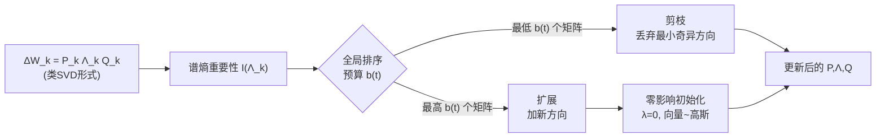

# FlexLoRA: Entropy-Guided Flexible Low-Rank Adaptation

**会议**: ICLR 2026  
**OpenReview**: [https://openreview.net/forum?id=tqnkbdYWWm](https://openreview.net/forum?id=tqnkbdYWWm)  
**代码**: 待确认  
**领域**: 参数高效微调 / 模型压缩  
**关键词**: LoRA, 动态秩分配, 谱熵, 参数高效微调, 秩剪枝与扩展  

## 一句话总结
FlexLoRA 用「谱能量熵」在**矩阵级别**度量每个 LoRA 低秩更新的重要性，在全局秩预算下既能**剪掉冗余秩**又能给关键层**扩展新秩**，并用「零影响初始化」保证扩容时训练稳定，从而比固定秩 LoRA 和单向剪枝的 AdaLoRA 更充分地利用参数预算。

## 研究背景与动机
**领域现状**：LoRA 用两个可训练低秩矩阵 $\Delta W = BA$ 近似下游任务的权重更新，已成为参数高效微调（PEFT）的主流。但它给所有层分配**同一个固定秩 $r$**，无法按层的实际需求灵活配置容量。为此 AdaLoRA、SaLoRA、AutoLoRA 等一系列动态秩分配方法应运而生，通过给每个秩方向打重要性分、全局排序后剪掉最不重要的方向来缓解这一问题。

**现有痛点**：作者指出这些方法存在三个结构性缺陷。其一，重要性度量多为**启发式**——依赖梯度×权重的参数敏感度近似，而非有原则的准则，且对梯度噪声敏感、跨迭代不稳定。其二，所有矩阵的秩方向被**全局混在一起排序剪枝**，忽略了矩阵层级的差异，可能误删某个矩阵里结构上很重要的方向。其三，分配是**单向**的——只会剪枝去冗余，没有任何机制给真正需要更多表达力的层**补充**秩。

**核心矛盾**：粒度（参数级 vs 矩阵级）、灵活性（只减 vs 可增可减）、稳定性（扩容时如何不破坏已有输出）三者无法同时满足，使现有方法难以真正"有原则地、自适应地"分配模型容量。

**本文目标**：提出一个在全局预算下既能剪也能扩、且重要性度量有信息论依据、扩容时还稳定的统一框架。

**核心 idea**：**用谱熵在矩阵级别衡量重要性，把秩分配做成"剪枝+扩展"的双向操作，并用零影响初始化让新秩无痛接入**。

## 方法详解

### 整体框架
FlexLoRA 把每个权重更新写成类 SVD 形式 $\Delta W = P\Lambda Q$（$\Lambda$ 为奇异值对角阵），并加正交正则维持 SVD 性质。训练中周期性地：①给每个 $\Delta W$ 算一个谱熵重要性分；②在全局秩预算 $b(t)$ 下，把分数最低的若干矩阵各剪掉一个最小奇异方向、给分数最高的若干矩阵各加一个新方向；③新方向用零影响初始化注入。三个组件（矩阵级熵度量、双向秩调整、零影响初始化）分别对应粒度、灵活性、稳定性三个痛点。

### 关键设计

**1. 矩阵级谱熵重要性度量：用奇异值能量分布判断该层"满不满"。** 现有方法在单个参数或单个奇异方向上算敏感度，看不到整个矩阵的结构。FlexLoRA 改为对每个矩阵的奇异值谱算一个熵：先把奇异值平方归一化成能量分布 $s_i = \lambda_i^2 / \sum_j \lambda_j^2$，再算归一化谱熵 $I(\Lambda) = -\frac{1}{\log r}\sum_{i=1}^{r} s_i \log(s_i+\epsilon)$，其中除以 $\log r$ 把熵限制在 $[0,1]$ 使不同秩的矩阵可比。直觉上，**熵低**说明能量集中在少数奇异值上、存在冗余、适合剪枝；**熵高**说明能量分布均匀、结构信息丰富、值得扩容。相比梯度敏感度，熵刻画的是矩阵在整个训练过程中的内在几何，不受梯度噪声困扰。

**2. 全局预算下的双向秩剪枝与扩展：能减也能加。** 不同于只做减法的前作，FlexLoRA 在每步定义一个秩预算 $b(t)$，限制本步最多增删多少个奇异方向。剪枝时，先按重要性排序、选出最不重要且秩大于 1 的 $b(t)$ 个矩阵，各自丢弃最小奇异值对应的方向——因为 SVD 中最小奇异值的方向对表达力贡献最小，且作者证明其熵贡献 $I(\lambda_{\min})$ 也最小（附录 C 给了单调性证明）。扩展时，选出最重要的 $b(t)$ 个矩阵，各加一个新奇异方向。预算本身由三次方衰减调度 $b(t)=\mathrm{round}\big(b_0\cdot(1-\frac{t-t_{warmup}}{T-t_{final}})^3\big)$ 控制，前期激进探索容量、后期逐步冻结稳定收敛。

**3. 零影响初始化：扩容当下不扰动输出，之后还能学。** 新增方向若随便初始化会立刻改变前向输出、破坏训练稳定。FlexLoRA 把新方向的**奇异值初始化为 0**、对应的**奇异向量从高斯分布采样**。奇异值为零意味着 $\Delta W$ 在注入瞬间完全不变，保证当前输出不被扰动；而向量非零且可训练，使梯度能逐步把这个方向"激活"。消融显示，相比把值和向量都置零（直接冻死直到梯度累积）或用 Gram–Schmidt 正交初始化，零影响初始化在稳定性与可学习性之间取得最佳平衡。

## 实验关键数据

### 主实验
在 GLUE（DeBERTaV3-base）、常识推理（LLaMA3-8B）、视觉 VTAB（ViT-B/16）三类任务上，与同参数预算的 LoRA、AdaLoRA 等对比。

| 任务 | 方法 | 参数量 | 平均分 |
|------|------|--------|--------|
| GLUE | LoRA (r=8) | 1.3M | 81.7 |
| GLUE | AdaLoRA | 1.9M | 88.1 |
| GLUE | **FlexLoRA** | 1.9M | **89.1** |
| 常识推理(LLaMA3) | LoRA (r=32) | 56.6M | 85.4 |
| 常识推理(LLaMA3) | AdaLoRA (r=32) | 56.6M | 84.5 |
| 常识推理(LLaMA3) | **FlexLoRA (r=32)** | 56.6M | **85.5** |
| VTAB | LoRA (r=14) | 1.29M | 66.7 |
| VTAB | AdaLoRA | 1.26M | 64.7 |
| VTAB | **FlexLoRA** | 1.18M | **67.8** |

GLUE 上在 CoLA（71.8 vs AdaLoRA 70.0）和 RTE（88.8 vs 88.1）等语言学难度高的任务上提升最明显；VTAB 上 CIFAR100 比 LoRA 高出 +8.9。

### 消融实验
均在 GLUE（DeBERTaV3-base）上进行。

| 消融维度 | 变体 | 平均分 |
|----------|------|--------|
| 重要性度量 | Nuclear 核范数 | 87.7 |
| 重要性度量 | Frobenius 范数 | 87.1 |
| 重要性度量 | AdaLoRA 敏感度 | 88.1 |
| 重要性度量 | **谱熵(本文)** | **89.1** |
| 秩调整方向 | Prune-only 仅剪枝 | 87.5 |
| 秩调整方向 | Expand-only 仅扩展 | 87.6 |
| 秩调整方向 | **剪枝+扩展(本文)** | **89.1** |
| 新方向初始化 | 其他三种策略 | < 85.8 |
| 新方向初始化 | **零影响初始化(本文)** | **85.8(最高)** |

### 关键发现
- 谱熵作为重要性准则，区分度和鲁棒性优于范数类和敏感度类度量；
- 双向调整不可或缺——仅剪枝会过度剪枝丢容量、仅扩展会留冗余浪费参数；
- 零影响初始化在四个 GLUE 子任务上均优于小值初始化、全零初始化和正交初始化。

## 亮点与洞察
- **把"重要性"从参数级提到矩阵级**：用谱熵看整个奇异值分布而非单个方向的梯度，避开了梯度噪声，给"该剪还是该扩"提供了信息论意义上的判据。
- **双向分配补齐了动态 LoRA 的最后一块拼图**：以往方法只会减不会加，FlexLoRA 在同一全局预算下把容量从"没那么需要的层"搬到"真正需要的层"，是一种资源再分配而非单纯压缩。
- **零影响初始化是个干净的小技巧**：奇异值置零保证注入瞬间输出不变，向量随机保证后续可学，理论上无扰动、实践上最稳。

## 局限与展望
- 主要对比集中在 LoRA 和 AdaLoRA，与 SoRA、DyLoRA、DoRA 等更多动态秩方法的全面横评略显单薄（部分仅在个别表出现）。
- 预算调度 $b(t)$、调整周期 $T$ 等超参由三次方衰减人工设定，作者自己也指出"自适应调度策略"值得进一步探索。
- 谱熵需要维持类 SVD 结构并加正交正则，相比原始 LoRA 引入了额外的分解与正则开销，论文未细致量化训练时间代价。
- 扩容/剪枝带来的秩动态变化对显存峰值和工程实现的影响讨论不足。

## 相关工作与启发
- **LoRA / AdaLoRA / SaLoRA / AutoLoRA**：固定秩 vs 动态秩分配的演进主线，FlexLoRA 在"可增可减 + 矩阵级度量"上做了推进。
- **SoRA / DoRA / DyLoRA / MLAE**：从奇异分量拆分合并、随机变秩、rank-1 专家掩码等不同角度调节有效容量，与本文谱熵视角互补。
- **熵引导的剪枝与压缩**：把信息熵从"统计不确定性"用作"表示丰富度"的判据，本文延续这一思路并落到秩分配上，启发是——很多"该保留多少容量"的问题，或许都能用谱分布的熵来统一刻画。

## 评分
- **新颖性**: ⭐⭐⭐⭐ 谱熵做矩阵级重要性 + 双向秩分配 + 零影响初始化的组合较新颖，把动态 LoRA 从"只会剪"推到"可增可减"。
- **实验充分度**: ⭐⭐⭐⭐ 覆盖 NLU/常识推理/视觉三类任务，三组消融分别验证三个核心组件，较扎实；但与更多动态秩基线的横评和效率开销分析偏弱。
- **写作质量**: ⭐⭐⭐⭐ 三个痛点→三个组件的对应清晰，公式与算法流程完整。
- **价值**: ⭐⭐⭐⭐ 在同参数预算下稳定优于 LoRA/AdaLoRA，且方法即插即用，对 PEFT 实践有直接参考意义。

<!-- RELATED:START -->

## 相关论文

- [\[ICLR 2026\] E²LoRA: Efficient and Effective Low-Rank Adaptation with Entropy-Guided Adaptive Sharing](e²lora_efficient_and_effective_low-rank_adaptation_with_entropy-guided_adaptive_.md)
- [\[ICLR 2026\] Stable-LoRA: Stabilizing Feature Learning of Low-Rank Adaptation](stable-lora_stabilizing_feature_learning_of_low-rank_adaptation.md)
- [\[ICLR 2026\] LoFT: Low-Rank Adaptation That Behaves Like Full Fine-Tuning](loft_low-rank_adaptation_that_behaves_like_full_fine-tuning.md)
- [\[ICML 2026\] Energy-Structured Low-Rank Adaptation for Continual Learning](../../ICML2026/model_compression/energy-structured_low-rank_adaptation_for_continual_learning.md)
- [\[AAAI 2026\] Group Orthogonal Low-Rank Adaptation for RGB-T Tracking](../../AAAI2026/model_compression/group_orthogonal_low-rank_adaptation_for_rgb-t_tracking.md)

<!-- RELATED:END -->
