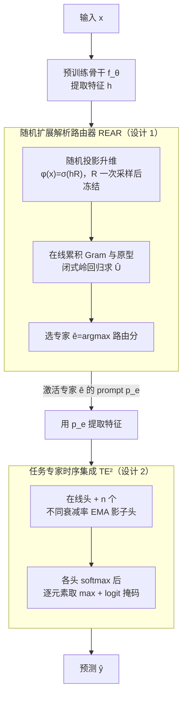

# FlyPrompt: Brain-Inspired Random-Expanded Routing with Temporal-Ensemble Experts for General Continual Learning

**会议**: ICLR 2026  
**arXiv**: [2602.01976](https://arxiv.org/abs/2602.01976)  
**代码**: 无  
**领域**: 模型压缩  
**关键词**: continual learning, prompt tuning, brain-inspired, expert routing, temporal ensemble  

## 一句话总结

受果蝇蘑菇体稀疏扩展和模块化集成的神经生物学启发，提出 FlyPrompt 框架用于通用持续学习（GCL），通过随机扩展解析路由器（REAR）实现非迭代的专家选择，结合多时间尺度 EMA 输出头的时序集成（TE²）提升专家能力，在 CIFAR-100/ImageNet-R/CUB-200 上分别取得最高 11.23%/12.43%/7.62% 的增益。

## 背景与动机

1. **通用持续学习（GCL）比传统 CL 困难得多**：GCL 要求在单次遍历、无明确任务边界、标签空间可重叠的非平稳数据流上学习，传统 CL 假设的清晰任务划分和多轮训练不再成立。
2. **现有 PET 方法路由器训练不稳定**：L2P、DualPrompt、MVP、MISA 等方法同步训练路由器和专家，在 GCL 的模糊边界和单次遍历下路由器容易过拟合早期数据或受分布漂移影响，实证显示路由准确率远不理想。
3. **专家能力在单次遍历下退化**：即使给予完美路由（oracle），现有方法的最终准确率仍然不高（Fig. 2c），说明专家表示质量和输出头的决策边界在非平稳流中逐渐失配，是独立于路由之外的第二个瓶颈。
4. **类别不平衡加剧干扰**：GCL 数据流中类别分布长尾且跨任务重叠，单个共享输出头不断被后续任务覆盖导致早期专家的决策边界偏移。
5. **果蝇蘑菇体提供生物范式**：果蝇仅不到 10 万神经元却具有鲁棒的终生学习能力，投射神经元到 Kenyon 细胞的 40 倍稀疏随机扩展实现高效模式分离，γ/α'β'/αβ 亚区的多时间尺度可塑性支持短/中/长期记忆并行巩固。
6. **CL 领域缺乏专门针对路由和专家能力的联合设计**：现有工作要么只关注防遗忘（正则化/回放），要么只关注路由（prompt 选择），没有将 GCL 显式分解为"专家路由 + 专家能力提升"两个子问题并联合求解。

## 方法详解

### 整体框架

FlyPrompt 把 GCL 拆成两个相互独立的瓶颈来攻：一是**专家路由**——给每个输入挑对负责它的 prompt 专家；二是**专家能力**——让被选中的专家在单遍、有限监督下仍能学出鲁棒的表示和稳定的决策边界。作者的经验分析（Fig. 2b-c）证实这两者各自封顶：路由不准会拖低上限，专家不强会拉低下限，所以必须分别下药。对应地，REAR（随机扩展解析路由器）负责前者，用前向一遍即可完成的无梯度闭式路由；TE²（任务专家时序集成）负责后者，用多个衰减率的 EMA 输出头在不同时间窗口上并行巩固知识。整条 pipeline 是：输入先过预训练骨干拿到特征，REAR 据此选出负责的专家，再用该专家的 prompt 提取特征，最后由 TE² 集成多个时间尺度的输出头给出预测。

### 关键设计

**1. 随机扩展解析路由器（REAR）：用固定随机投影 + 闭式解避开路由器自身的遗忘**

现有 PET 方法把路由器和专家一起用梯度训练，在 GCL 的模糊任务边界和单次遍历下，路由器极易过拟合早期数据或被分布漂移带偏。REAR 索性让路由器完全不参与反向传播。它模仿果蝇投射神经元到 Kenyon 细胞约 40 倍的稀疏随机扩展：先对输入 $\mathbf{x}$ 取预训练特征 $\mathbf{h} = f_\theta(\mathbf{x}) \in \mathbb{R}^d$，再用一个一次采样后就冻结的随机矩阵 $\mathbf{R} \sim \mathcal{N}(0,1)^{d \times M}$ 把它升到高维稀疏空间 $\varphi(\mathbf{x}) = \sigma(\mathbf{h}\mathbf{R}) \in \mathbb{R}^M$，默认 $M=10^4 \gg d$。高维稀疏表示天然更线性可分，而 $\mathbf{R}$ 固定不变意味着路由特征不会随数据漂移而变化。在扩展空间上，路由器退化成一个岭回归：在线累积 Gram 矩阵 $\mathbf{G} \leftarrow \mathbf{G} + \Phi_i^\top\Phi_i$ 与原型矩阵 $\mathbf{Q} \leftarrow \mathbf{Q} + \Phi_i^\top\mathbf{C}_t$，需要决策时直接闭式求解 $\hat{\mathbf{U}}^\top = (\mathbf{G} + \lambda\mathbf{I})^{-1}\mathbf{Q}$，再取 $\hat{E}(\mathbf{x}) = \arg\max_t [\varphi(\mathbf{x})\hat{\mathbf{U}}^\top]_t$ 作为被选专家。这套设计没有任何需要训练的路由参数，自然也就没有路由器遗忘的问题；Theorem 1 进一步给出人口超额风险 $\lesssim \sqrt{\log N/M} + (N\lambda)^{-1/2} + \lambda$，说明只要把扩展维度 $M$ 和已见样本数 $N$ 调大，路由误差就能被任意压低。

**2. 任务专家时序集成（TE²）：用多时间尺度 EMA 头补偿单遍训练下的专家退化**

即使给完美路由，单遍流上的专家输出头也会因为类别长尾、跨任务重叠而决策边界漂移（Fig. 2c）。TE² 借鉴果蝇蘑菇体 γ/α'β'/αβ 三个亚区的多时间尺度记忆巩固：为每个专家 $E_t$ 维护一个在线头和 $n$ 个不同衰减率的 EMA 影子头，短窗口（$\alpha=0.9$，等效 $L\approx 10$）追踪近期的模式变化，长窗口（$\alpha=0.99$，$L\approx 100$）守住长期稳定的知识。训练时只更新在线头 $\psi$ 和当前 prompt $\mathbf{p}_t$，并用 logit 掩码的交叉熵——只开放当前批次出现的类别，避免后续任务覆盖早期专家的决策边界；新任务的 prompt 用所有已有 prompt 的均值暖启动。每步梯度更新后，各影子头按 $\mathbf{W}_t^{(j)} \leftarrow \alpha_j \mathbf{W}_t^{(j)} + (1-\alpha_j)\mathbf{W}$ 滑动跟随。推理时把在线头和所有 EMA 头各自做 softmax，再逐元素取最大值集成。之所以要一整库不同衰减率的头而非单一 EMA，是因为 Theorem 2 把 EMA 参数误差拆成方差项 $\mathcal{O}(\zeta^2/L)$ 和漂移偏差项 $\mathcal{O}((LP_t)^2)$：窗口越长方差越小但越跟不上漂移，二者最优权衡随漂移速度变化，而几何间隔布点的 EMA 库保证任何时刻都有一个头落在接近最优的偏差-方差权衡上。

## 实验结果

### 实验 1：GCL 总体性能（Table 1，Sup-21K 骨干）

| 方法 | CIFAR-100 $A_{\text{auc}}$ | CIFAR-100 $A_{\text{last}}$ | ImageNet-R $A_{\text{auc}}$ | ImageNet-R $A_{\text{last}}$ | CUB-200 $A_{\text{auc}}$ | CUB-200 $A_{\text{last}}$ |
|------|:-:|:-:|:-:|:-:|:-:|:-:|
| L2P | 76.23 | 79.11 | 44.40 | 42.03 | 64.30 | 61.42 |
| DualPrompt | 76.04 | 76.62 | 46.13 | 40.80 | 65.03 | 62.43 |
| CODA-P | 79.13 | 80.91 | 51.87 | 48.09 | 66.01 | 62.90 |
| MISA | 80.35 | 80.75 | 51.52 | 45.08 | 65.40 | 60.20 |
| **FlyPrompt** | **83.24** | **86.76** | **56.58** | **55.27** | **70.64** | **73.40** |

**发现**：FlyPrompt 在所有三个数据集上均大幅领先，$A_{\text{auc}}$ 增益 +2.89/+4.71/+4.63，$A_{\text{last}}$ 增益更为显著（+5.85/+7.18/+10.50），说明方法尤其在后期抗遗忘方面优势突出。在 6 种不同预训练骨干（含监督/自监督）上均保持一致的优势。

### 实验 2：与离线 CL 方法对比（Table 2，Sup-21K）

| 方法 | CIFAR-100 $A_{\text{auc}}$/$A_{\text{last}}$ | ImageNet-R $A_{\text{auc}}$/$A_{\text{last}}$ | CUB-200 $A_{\text{auc}}$/$A_{\text{last}}$ |
|------|:-:|:-:|:-:|
| S-Prompt++ | 80.21/83.48 | 52.14/49.13 | 66.61/64.73 |
| HiDe-LoRA | 80.07/82.00 | 55.09/51.29 | 67.26/67.28 |
| SD-LoRA | 79.26/78.91 | 55.51/51.97 | 64.12/60.57 |
| **FlyPrompt** | **83.24/86.76** | **56.58/55.27** | **70.64/73.40** |

**发现**：FlyPrompt 作为在线单遍方法，甚至超过了使用多轮训练的离线方法（S-Prompt++、HiDe 系列），证明生物启发设计在效率-性能权衡上的优越性。

### 实验 3：消融实验（Table 3）

| 组件配置 | CIFAR-100 $A_{\text{auc}}$ | $A_{\text{last}}$ | ImageNet-R $A_{\text{auc}}$ | $A_{\text{last}}$ |
|----------|:-:|:-:|:-:|:-:|
| 无 REAR 无 EMA | 71.33 | 73.22 | 41.73 | 37.33 |
| +Prompt Expert | 80.75 | 83.65 | 54.91 | 52.58 |
| +REAR | 81.90 | 84.23 | 55.76 | 52.76 |
| +EMA | 82.17 | 83.75 | 55.90 | 53.65 |
| **REAR+Expert+EMA** | **83.24** | **86.76** | **56.58** | **55.27** |

**发现**：Prompt Expert 是最大贡献者（+9.42 $A_{\text{auc}}$），REAR 和 TE² 各贡献约 1-2%，三者组合有协同效应（完整版 > 任意两者之和），证明路由和能力提升是互补的两个维度。

## 亮点

- **跨学科创新**：将果蝇蘑菇体的稀疏扩展和多时间尺度记忆巩固原理转化为可实现的算法组件，NeuroAI 与 CL 交叉的典范
- **前向传播路由**：REAR 完全无需反向传播，闭式解且有理论误差界，特别适合在线和边端部署
- **即插即用设计**：REAR 和 TE² 可独立集成到已有方法（DualPrompt、MISA 等）并稳定提升性能（Table 4）
- **极低开销**：仅增加 0.83% 参数（87.08M vs 86.37M MISA），训练时间增量微乎其微

## 局限性

- 时序集成的 EMA 衰减率（$\{0.9, 0.99\}$）是手动设定的固定值，无法自适应当前数据漂移速度，极端漂移场景可能需要动态调整
- REAR 的随机投影维度 $M = 10^4$ 带来 $\mathbb{R}^{d \times M}$ 矩阵的存储开销（约 30MB），在超长任务序列下 Gram 矩阵求逆也可能成为瓶颈
- 实验主要在 Si-Blurry 设定下进行，该设定虽然灵活但仍是人工构造的受控场景，真实世界的数据流可能更加不规则
- 未在大规模数据集（如完整 ImageNet-1K 的 1000 类 GCL）或多模态持续学习场景中验证

## 相关工作对比

| 维度 | FlyPrompt（本文） | MISA (ICLR 2025) | CODA-P (CVPR 2023) |
|------|------------------|-------------------|---------------------|
| 路由机制 | 随机扩展+闭式求解（无梯度） | 对比学习+互信息（需梯度） | 注意力加权 prompt 组合 |
| 专家能力 | 多时间尺度 EMA 头 | prompt 初始化+自适应 | 单头+组合 prompt |
| GCL 支持 | 原生设计，单遍在线 | 原生设计，单遍在线 | 需多轮，GCL 下退化 |
| CIFAR-100 $A_{\text{auc}}$ | **83.24%** | 80.35% | 79.13% |
| 理论保证 | 路由误差界+EMA 误差分解 | 无 | 无 |

## 评分

- ⭐⭐⭐⭐ 创新性：生物原理到算法的映射自然且有效，REAR 闭式路由器和多时间尺度 EMA 均为新颖设计
- ⭐⭐⭐⭐⭐ 实验充分度：6 种骨干 × 3 数据集 × 8+ 基线，消融/即插即用/超参敏感性/计算成本分析非常全面
- ⭐⭐⭐⭐ 清晰度：生物学类比形象，双子问题分解逻辑清晰，理论和实验互为呼应
- ⭐⭐⭐⭐ 实用价值：即插即用组件+极低开销+无需反向传播路由，在边缘部署和在线学习中有实际应用前景

<!-- RELATED:START -->

## 相关论文

- [\[ICLR 2026\] LD-MoLE: Learnable Dynamic Routing for Mixture of LoRA Experts](ld-mole_learnable_dynamic_routing_for_mixture_of_lora_experts.md)
- [\[ICML 2026\] Continual Model Routing in Evolving Model Hubs](../../ICML2026/model_compression/continual_model_routing_in_evolving_model_hubs.md)
- [\[ICLR 2026\] LoRA-Mixer: Coordinate Modular LoRA Experts Through Serial Attention Routing](lora-mixer_coordinate_modular_lora_experts_through_serial_attention_routing.md)
- [\[ICLR 2026\] Rethinking Continual Learning with Progressive Neural Collapse](rethinking_continual_learning_with_progressive_neural_collapse.md)
- [\[ICLR 2026\] Quantized Gradient Projection for Memory-Efficient Continual Learning](quantized_gradient_projection_for_memory-efficient_continual_learning.md)

<!-- RELATED:END -->
