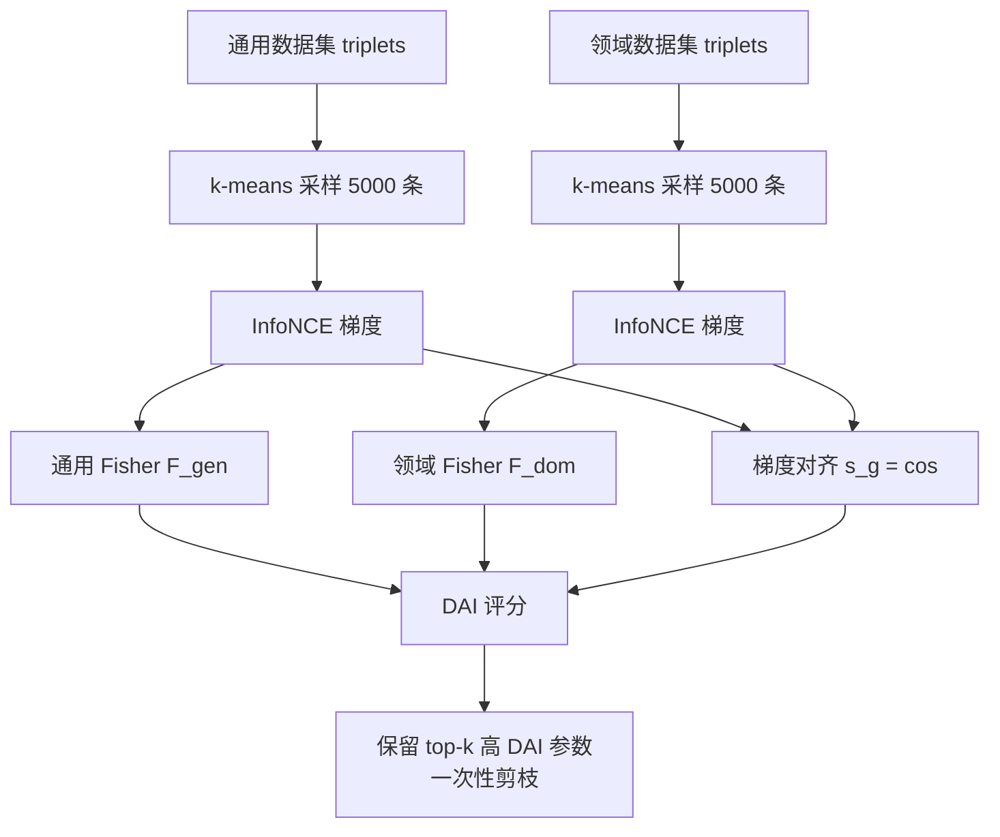

# GAPrune: Gradient-Alignment Pruning for Domain-Aware Embeddings

**会议**: ICLR 2026  
**OpenReview**: [https://openreview.net/forum?id=GLELajHnCo](https://openreview.net/forum?id=GLELajHnCo)  
**代码**: [https://github.com/yixuantt/GAPrune](https://github.com/yixuantt/GAPrune)  
**领域**: 模型压缩 / 领域自适应嵌入模型剪枝  
**关键词**: 模型剪枝, 嵌入模型, 领域自适应, Fisher 信息, 梯度对齐, Information Bottleneck  

## 一句话总结
GAPrune 用 Fisher 信息衡量参数的领域重要性、用通用-领域梯度的余弦相似度衡量参数的跨域对齐性，把两者融进一个 Domain-Alignment Importance (DAI) 评分里做一次性剪枝，使压缩后的嵌入模型在金融/化学领域基准上既保住通用语言能力又强化领域专长。

## 研究背景与动机
**领域现状**：领域专用嵌入模型（金融检索、代码 agent、生物医药）在专业语义任务上明显优于通用模型，但 SOTA 嵌入模型大多基于数十亿参数的 LLM，部署成本高。作者用一个很说明问题的现象点题：Qwen3-Embedding 的 0.6B 版本下载量是更强的 8B 版本的近 9 倍——**真实世界里效率经常压倒性能驱动选型**。

**现有痛点**：剪枝是天然的压缩手段，但现有方法（magnitude pruning、SparseGPT、Wanda 等）都用"统一视角"评估参数重要性，把所有参数一视同仁，无法区分"承载通用语义"和"承载领域知识"的参数。

**核心矛盾**：这导致两类失败模式互相对立——(1) 只看通用视角，编码关键领域知识的参数会因为"通用上不重要"被误删；(2) 只看领域样本，又会丢掉通用语言能力，整体性能下滑。剪出来的模型不是丢专业性就是丢基础能力。

**本文目标**：在压缩嵌入模型的同时，**同时**保住领域专长与通用语言基础，给出能直接部署的高效领域模型。

**核心 idea**：**[双维度刻画参数]** 不再用单一标准，而是把每个参数沿两个维度刻画——领域重要性（Fisher 信息）+ 通用/领域目标的对齐度（梯度余弦相似度），再用 DAI 评分统一两个信号，剪掉那些"对领域不重要"或"在通用与领域目标间制造冲突"的参数。

## 方法详解

### 整体框架
GAPrune 把领域剪枝形式化为约束优化：在稀疏度约束 $\|m\|_0 \le k$ 下最小化领域损失退化 $\mathcal{L}_{dom}(\theta\odot m)-\mathcal{L}_{dom}(\theta)$。整个流程三段串行：先从通用和领域数据集各采样 5000 条代表性对比三元组用于高效梯度计算，再对每个参数分别算 Fisher 信息（重要性）和跨域梯度余弦相似度（对齐性），最后在 Information Bottleneck 原理指导下把两类信号融成 DAI 评分，保留 DAI 最高的 top-k 参数完成一次性剪枝。

### 关键设计

**1. 代表性数据采样：用聚类把梯度计算成本压到可控。** 由于 Fisher 信息和梯度都需要在全量数据上反传，作者用 Qwen3-Embedding-0.6B 给每个三元组的 query $q$ 生成嵌入，在嵌入空间跑 $k=5000$、20 次迭代的 k-means，对每个聚类中心取最近的真实样本，从而保证 5000 条校准样本均匀铺满语义空间。所有数据统一为对比三元组 $(q,p,n)$ 格式，配合 InfoNCE 损失算梯度；附录验证即使样本更少 GAPrune 仍稳健。

**2. Fisher 信息估计参数重要性，且通用/领域分开算。** Fisher 信息度量损失曲面在某参数处的曲率，即"扰动该参数会让模型输出变多大"——值越高越关键。对参数 $\theta_j$ 用对角 Fisher 近似 $\hat F_{jj}=\frac{1}{N}\sum_{i=1}^{N}\left(\frac{\partial L_i}{\partial \theta_j}\right)^2$，其中 $L_i$ 是第 $i$ 个三元组的 InfoNCE 损失。关键是这一项在通用数据和领域数据上**分别**计算得到 $F^{gen}_{jj}$ 和 $F^{dom}_{jj}$，为后续"领域净价值"的相减打基础。

**3. 跨域梯度对齐：余弦相似度揭示参数到底是共享、专用还是冲突。** Fisher 只说"重不重要"却不说"参数在两个领域间如何互动"。作者对每个参数把多个 batch 的通用梯度 $g^{gen}_j$ 和领域梯度 $g^{dom}_j$ 各自平均（平均是为了压噪声、拿到稳健方向），再算余弦相似度 $s^j_g=\frac{\langle g^{gen}_j, g^{dom}_j\rangle}{\|g^{gen}_j\|\|g^{dom}_j\|+\varepsilon}$。这个 $s^j_g\in[-1,1]$ 直接对应三类参数：$s^j_g>0$ 是跨域一致、编码共享语义基础的核心参数（应保留）；$s^j_g\approx 0$ 是在不同语境扮演不同角色的专用参数（需谨慎评估）；$s^j_g<0$ 则是对通用和领域目标贡献相互冲突的参数（优先剪掉以化解优化冲突）。

**4. DAI 评分：把 IB 权衡落成一个可计算的公式。** 在 Information Bottleneck 视角下，最优子网络应最大化对领域任务的保真度、同时丢弃制造通用-领域冲突的信息。作者把它落成 Domain-Alignment Importance 评分：
$$\text{DAI}_j=\Big[(F^{dom}_{jj}-\beta\cdot F^{gen}_{jj})\cdot|\theta_j|+\gamma\cdot\sqrt{|\theta_j|}\Big]\cdot(1+\alpha\cdot s^j_g)$$
第一项 $(F^{dom}_{jj}-\beta F^{gen}_{jj})\cdot|\theta_j|$ 是核心——奖励领域 Fisher 高、惩罚仅在通用上重要的参数，再用幅值 $|\theta_j|$ 加权，量化参数对目标领域的"净价值"，$\beta$ 控制通用能力保留的强度；第二项 $\gamma\sqrt{|\theta_j|}$ 是幅值正则，即便 Fisher 中等也鼓励保留有表达容量的大权重以维持模型表达力；第三项 $(1+\alpha s^j_g)$ 是对齐调制器，跨域一致的参数($s^j_g>0$)被加分、冲突的($s^j_g<0$)被减分。实验取 $\beta=1.0,\ \alpha=0.2,\ \gamma=0.5$，最后保留 DAI 最高的 top-k 参数做一次性剪枝。

## 实验关键数据

### 主实验表格（One-shot 剪枝，Qwen3-Embedding-4B，∆% 相对 dense）

| 方法 | 稀疏度 | FinMTEB Avg / ∆% | ChemTEB Avg / ∆% |
|------|--------|------------------|------------------|
| Dense | – | 0.5353 / – | 0.7639 / – |
| Random | 50% | 0.2165 / **-59.55%** | 0.2445 / -68.00% |
| Magnitude | 50% | 0.5171 / -3.40% | 0.7299 / -4.44% |
| General Fisher | 50% | 0.3623 / -32.32% | 0.6461 / -15.42% |
| Domain Fisher | 50% | 0.4887 / -8.70% | 0.7060 / -7.57% |
| **GAPrune** | 50% | **0.5224 / -2.41%** | **0.7462 / -2.31%** |

30% 稀疏度下 GAPrune 在两个基准都超过所有 baseline（FinMTEB +1.35%、ChemTEB +0.04%），E5-mistral-7B 上同样领先。

### 消融实验表格（Prune-and-Retrain，50% 稀疏度，仅 100 步重训）

| 模型 | 重训后变化 |
|------|-----------|
| Qwen3-Embedding-4B（FinMTEB） | **+4.51%** |
| Qwen3-Embedding-4B（ChemTEB） | **+1.73%** |

重训后 GAPrune 不仅恢复且**超过** dense 模型，并在所有指标上稳定优于按层剪枝的 L3 Prune。

### 关键发现
- 在 50% 稀疏度下 General Fisher 在 FinMTEB 上崩了 30% 以上，而 GAPrune 仅 -2.41%——说明**梯度对齐提供了 Fisher 信息本身捕捉不到的关键信号**。
- Random 剪枝普遍掉 40–60%，凸显领域剪枝中"剪谁"远比"剪多少"重要。
- 附录显示 GAPrune 在 60%、65% 极端稀疏度下仍稳健，而 baseline 此时灾难性崩溃。

## 亮点与洞察
- **把"参数到底归谁"显式拆成两维**：领域重要性 × 跨域对齐，这比所有把参数一视同仁的剪枝方法更贴合领域自适应的本质。
- **梯度余弦相似度的语义解读很优雅**：正/零/负三态分别对应共享、专用、冲突参数，给"该剪谁"提供了可解释依据。
- **剪枝即增强**：重训后反而超过 dense，说明剪掉冲突参数等于化解了通用-领域间的优化干扰，剪枝起到了类似去噪/正则的作用。

## 局限与展望
- 只在 MLP 层做非结构化剪枝，未触及注意力头，且非结构化稀疏在通用硬件上的实际加速有限。
- 只验证了金融、化学两个领域和两个模型，跨更多领域/架构的普适性待验证。
- DAI 三项各有超参 $\alpha,\beta,\gamma$，虽给了敏感性分析，但换领域是否需重调仍是部署摩擦。
- 需要构造领域对比三元组并跑 GPT-4o-mini 生成 query，对没有现成领域数据的场景有一定门槛。

## 相关工作与启发
- **LLM 剪枝**：SparseGPT（Hessian 一次性剪枝）、Wanda（权重×激活）面向生成式 LLM，按 perplexity 评估；GAPrune 指出嵌入模型按 nDCG@10/准确率评估，对注意力头删除更敏感，需专门方法。
- **领域感知剪枝**：Zhang et al. (2024)、Williams et al. (2025) 已证明领域感知剪枝能更好保留领域知识，但面向 LLM 嵌入模型的方案仍是空白，本文填补该缺口。
- **启发**：把"参数重要性是任务相关的"这一假设显式化，并用梯度对齐量化跨任务冲突，这套思路可迁移到多任务/持续学习的参数分配与遗忘缓解。

## 评分
- **新颖性**: ⭐⭐⭐⭐ 把 Fisher 重要性与跨域梯度对齐融进单一 DAI 评分、专攻 LLM 嵌入模型的领域剪枝，切入点清晰且有 IB 理论支撑。
- **实验充分度**: ⭐⭐⭐⭐ 两模型×两领域×两稀疏度、一次性与重训两种协议、对 5 类 baseline 完整对比，附录还有极端稀疏与超参敏感性，较扎实；领域覆盖面可再扩。
- **写作质量**: ⭐⭐⭐⭐ 动机用下载量数据点题、三态梯度对齐解读直观、DAI 各项逐一拆解，可读性高。
- **价值**: ⭐⭐⭐⭐ 直击"领域嵌入模型既要小又要专"的真实部署痛点，剪枝即增强的发现有实际意义，代码开源。

<!-- RELATED:START -->

## 相关论文

- [\[ICLR 2026\] Token Distillation: Attention-Aware Input Embeddings for New Tokens](token_distillation_attention-aware_input_embeddings_for_new_tokens.md)
- [\[ICLR 2026\] Constraint-guided Hardware-aware NAS through Gradient Modification](constraint-guided_hardware-aware_nas_through_gradient_modification.md)
- [\[AAAI 2026\] Prototype-Based Semantic Consistency Alignment for Domain Adaptive Retrieval](../../AAAI2026/model_compression/prototype-based_semantic_consistency_alignment_for_domain_adaptive_retrieval.md)
- [\[ICLR 2026\] GradPruner: Gradient-guided Layer Pruning Enabling Efficient Fine-Tuning and Inference for LLMs](gradpruner_gradient-guided_layer_pruning_enabling_efficient_fine-tuning_and_infe.md)
- [\[ICLR 2026\] Modality-free Graph In-context Alignment](modality-free_graph_in-context_alignment.md)

<!-- RELATED:END -->
