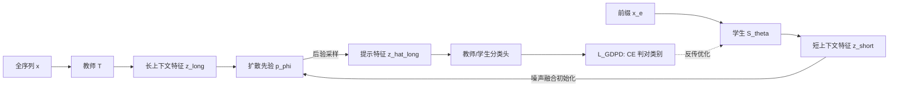

# Generative Diffusion Prior Distillation for Long-Context Knowledge Transfer

**会议**: ICLR 2026  
**OpenReview**: [https://openreview.net/forum?id=e5tepxQfE1](https://openreview.net/forum?id=e5tepxQfE1)  
**代码**: 待确认  
**领域**: 知识蒸馏 / 模型压缩 / 时间序列分类  
**关键词**: 知识蒸馏, 扩散先验, 后验采样, 早期时间序列分类, full-to-partial 蒸馏  

## 一句话总结
把"全序列教师 → 部分序列学生"的蒸馏重新建模成一个**逆问题**：学生的短上下文特征被视为目标长上下文特征的"退化观测"，用扩散模型作为教师特征的生成先验做后验采样，给每个学生特征供给一组"动态、多样、可聚合"的教师信号，从而让只能看到序列前缀的分类器获得近似全序列模型的泛化能力。

## 研究背景与动机
- **领域现状**：很多时序分类（ECG 心律失常检测、工业监测）在部署时受延迟/成本/传感器掉线限制，推理时只能拿到序列的**前缀（partial prefix）**，而不是训练时假设的完整序列。知识蒸馏（KD）是把全序列教师的泛化能力迁移给部分序列学生的自然手段。
- **现有痛点**：经典 KD（logit 匹配 Hinton、feature 匹配 FitNets/RKD/Attention）都是为**参数容量差**设计的——教师学生看的是同一份数据。本文场景是**输入空间不同**（全序列 vs 前缀），即使容量相同也存在天然的表示鸿沟。
- **核心矛盾**：教师的全上下文特征对只编码了部分上下文的学生而言是个"压倒性"的硬目标。论文归纳出三个被 full-to-partial 放大的 KD 顽疾——(1) 直接对齐全上下文特征会**淹没**学生，知识传不进去；(2) 单一教师视角**不够多样**，学生容易过拟合到对缺失信息的某一种解读；(3) 训练数据失配导致学生很难**忠实复现**教师的预测分布（fidelity 低）。
- **本文目标**：在前缀输入上训练/部署的学生，能获得全序列模型的泛化与忠实度，且只用单个教师、不需重训多个教师。
- **核心 idea**（**知识即分布**）：不再把教师信号当作单点目标 $k^\star=z_t$，而是把"知识"建模成一个以学生当前状态为条件的**分布** $k\sim p(K\mid Z_s=z_s)$，用扩散先验在教师特征流形上后验采样得到这些信号。

## 方法详解

### 整体框架
GDPD 把学生特征 $z_{\text{short}}=S^{\text{feat}}_\theta(x_e)$ 看作理想全上下文特征 $z^*_{\text{long-ideal}}$ 的退化测量，先在教师特征 $z_{\text{long}}$ 上训练一个扩散模型作为生成先验 $p_\phi(z_{\text{long}})$，再以 $z_{\text{short}}$ 为条件做后验采样得到"提示特征" $\hat z_{\text{long}}$，并约束学生：只要它的后验重建能被教师分类头判对类别，学生特征就被推向 $z^*_{\text{long-ideal}}$。训练分两阶段，warm-up 前只训扩散先验，之后用先验引导学生抽取长上下文知识。

### 关键设计

**1. 把蒸馏写成逆扩散问题：学生特征是教师特征的"退化观测"**。论文借用 inverse diffusion 的视角——给定退化测量 $y=D(z_0)$ 要从后验 $p(z_0\mid y)\propto p(y\mid z_0)\,p_\phi(z_0)$ 恢复 $z_0$。这里 $z_{\text{short}}$ 扮演退化测量，$z^*_{\text{long-ideal}}$ 是待恢复的清晰信号，扩散模型提供学到的先验 $p_\phi(z_{\text{long}})$。这一步是整篇的根基：它把"特征对齐"从死板的 $\ell_2$ 距离改成"在教师流形上找最能解释当前学生特征的完整版本"，自然回避了直接对齐导致的淹没问题。

**2. 用无条件先验做条件后验采样——噪声融合初始化**。难点是扩散先验是在教师特征上**无条件**训的，怎么以 $z_{\text{short}}$ 为条件采样？常规 guided sampling（DPS 那套）在每步反向用似然梯度修正 score，但那要求退化测量是固定的；而 GDPD 的条件信号 $z_{\text{short}}$ 本身还在被优化。作者于是改用一种直接的初始化式引导：把学生特征与高斯噪声按权重融合，作为反向过程的起点
$$z_{\text{long},T}=\alpha\, z_{\text{short}}+(1-\alpha)\,\epsilon,\quad \epsilon\sim\mathcal N(0,I)$$
其中 $\alpha$ 在蒸馏中**逐特征学习**，让不同特征按各自合适的噪声水平进入起始步。从这个起点跑反向过程，采样既被 $z_{\text{short}}$ 牵引（停在它附近），又能在教师流形上探索，收敛到与初始化一致的可信清晰特征 $\hat z_{\text{long}}$。

**3. 用"重建能否判对类别"定义提示特征，而非直接对齐**。提示特征 $z_{\text{long-hint}}$ 是被**功能性**定义的——它是含有正确分类所需长程信息的教师特征。于是监督不是让 $\hat z_{\text{long}}$ 逼近某个固定 $z_t$，而是约束其后验重建经过教师/学生分类头后输出正确标签：
$$\mathcal L_{\text{GDPD}}(\theta)=\mathbb E_{(x,y)}\Big[\ell_{\text{CE}}\big(S^{\text{head}}_\theta(\hat z_{\text{long}}),\,y\big)\Big],\quad \hat z_{\text{long}}\sim\tilde p_{\text{diff}}\big(z_{\text{long}}\mid z_{\text{short}}=S^{\text{feat}}_\theta(x_e)\big)$$
含义是：如果学生特征保留了足够的长上下文信息（相对提示特征"最小退化"），那它就应该能把一个合法的 $z_{\text{long-hint}}$ 作为可信完成恢复出来。

**4. 知识即分布——随机轨迹天然实现"多样 + 渐进 + 可聚合"**。传统 KD 取单点 $k^\star=z_t$（等价于 $P_{K\mid Z_s}=\delta_{k^\star}$）；GDPD 取期望损失
$$\mathbb E_{k\sim p(\cdot\mid z_s)}[\ell(z_s;\theta,k)]\approx\frac1J\sum_{j=1}^J \ell\big(z_s;\theta,k^{(j)}\big)$$
由于每次前向都走不同的噪声轨迹，随着训练自然覆盖多个样本，实践中 $J=1$ 就够。这三个性质正好对症三大顽疾：教师信号随学生当前能力 $z_s;\theta_t$ **动态/渐进**地从流形上取（不淹没）；扩散采样保证多样性被**约束**在教师流形的邻域（不是手工乱加噪的离群信号）；多条轨迹的信号**集体聚合**出更完整的长程知识（提升 fidelity）。

## 实验关键数据

数据集：UCR 单变量、UEA 多变量、PhysioNet 死亡率真实数据。Net1→Net2 表示教师→学生蒸馏，结果对 5 次运行取平均。

### 主实验（不同 earliness 下 12 个 UCR 数据集，LSTM3-100→LSTM3-100）

| Earliness | 指标 | Base | Base-KD | Fits | **GDPD** |
|---|---|---|---|---|---|
| 0.2L | Avg.AUC-PRC | 63.64 | 69.23 | 67.47 | **73.83** |
| 0.2L | Avg.Rank↓ / Top-1 数 | 3.50 / 0 | 2.42 / 2 | 2.92 / 0 | **1.17 / 10** |
| 0.4L | Avg.AUC-PRC | 70.44 | 78.03 | 75.36 | **81.70** |
| 0.6L | Avg.AUC-PRC | 76.79 | 83.70 | 81.15 | **86.00** |
| 0.8L | Avg.AUC-PRC | 77.79 | 84.78 | 82.74 | **89.02** |
| 0.8L | Avg.Rank↓ / Top-1 数 | 3.67 / 0 | 2.42 / 0 | 2.83 / 1 | **1.08 / 11** |

各 earliness 下 GDPD 都拿到最佳 AUC-PRC 和最低平均 rank，赢在 80% 以上的数据集。

### 与多种 KD 变体对比（e=0.5L, 12 UCR）
对手含 RKD、Attention、DKD、DT2W、VID、PKT、TeKAP、TTM、Base-KD、Fits、Base。GDPD 在 80% 数据集进 top-3，平均 rank 2.25，其余方法没有任何一个接近 4。

### 关键发现
- **泛化**：所有蒸馏学生都比无蒸馏 Base 强，证明全上下文教师知识确实有助于部分分类；GDPD 增益最大。
- **fidelity**：以教师-学生 top-1 一致率衡量，GDPD 在各 earliness 下都高于 Base-KD / Fits（Fig.2），说明"集体信号"比单点信号更能复刻教师的预测结构（类可分性、特征几何关系）。
- **J 的消融**：每次前向走不同噪声轨迹，时间维度上已覆盖多样性，$J=1$ 足够。

## 亮点与洞察
- **范式转换**：第一次把教师知识建模成"生成式分布"而非单点目标，并把师生特征关系形式化为**不适定逆问题**——这是个干净且可迁移的视角，不止时序，凡是"教师学生看不同输入空间"的蒸馏都可借鉴。
- **巧解条件采样**：用可学习的噪声融合权重 $\alpha$ 做初始化式条件引导，绕开了"条件信号本身在被优化、无法用固定似然梯度"的难点，工程上简单。
- **功能性定义提示特征**：不要求重建逼近某个具体教师特征，只要求重建被判对类别，避免了死板的特征对齐，这正是对"全上下文特征会淹没学生"的直接回应。
- 三大 KD 顽疾（有效性/多样性/忠实度）被同一机制（分布化信号）一并解决，论证闭环。

## 局限与展望
- 评测以 UCR/UEA + PhysioNet 时序、LSTM 等中小模型为主，**多为同构师生**（LSTM3-100→LSTM3-100），跨架构、大模型上的可扩展性待验证。
- 引入扩散先验 + 后验采样 + 两阶段训练，**训练成本与超参（warm-up、$\alpha$、$\lambda$）**比直接 feature KD 高；推理虽只用学生不增成本，但训练管线更重。
- 方法专为"前缀/部分观测"设计，是否能推广到一般的输入分布失配（域偏移、缺失模态）尚是开放问题。
- $J=1$ 够用的结论依赖"训练步天然覆盖多样性"，在训练步数很少或 batch 很小时是否成立值得探究。

## 相关工作与启发
- **经典 KD**：logit 匹配（Hinton 2015）、中间特征匹配（FitNets、Attention、RKD），以及针对容量差的 teacher-assistant（Mirzadeh 2020）、student-friendly teacher。GDPD 指出这些都假设师生同输入空间，不适配 full-to-partial。
- **多样化教师**：teacher ensemble、互学习（DML）、单模型扰动生成多视角（TeKAP, Hossain 2025）。GDPD 用扩散采样把"多样性"约束在教师流形内，避免手工扰动产生离群信号。
- **蒸馏 fidelity**：Stanton 2021 指出蒸馏集与教师训练集失配会降低 fidelity，正对应本文 full-to-partial 场景。
- **逆扩散/扩散先验**：DDRM（Kawar 2022）、DPS（Chung 2023）的逆问题求解思路被搬到"特征空间蒸馏"，是本文方法论的直接来源。
- **启发**：凡是"目标信号本身模糊/多解"的监督场景（弱标注、缺失观测、早期决策），把监督从单点目标改成生成式分布 + 后验采样，可能是个通用的稳健化范式。

## 评分
- **新颖性**: ⭐⭐⭐⭐⭐ 首次把教师知识建模为生成分布、把师生特征关系写成逆扩散问题，视角新且自洽，开辟了 full-to-partial 蒸馏方向。
- **实验充分度**: ⭐⭐⭐⭐ 覆盖多 earliness、多数据集（UCR/UEA/PhysioNet）、与 10+ KD 变体对比、fidelity 与 J 的消融齐全；但师生多同构、缺大模型/跨架构验证。
- **写作质量**: ⭐⭐⭐⭐ 三大顽疾 → 机制 → 验证的论证闭环清晰，公式与图（Fig.1 框架对比）到位；符号略多需细读。
- **价值**: ⭐⭐⭐⭐ 解决早期/部分观测时序分类这一有真实部署需求的问题，方法范式可迁移到更广的输入失配蒸馏场景。

<!-- RELATED:START -->

## 相关论文

- [\[ICLR 2026\] TiTok: Transfer Token-level Knowledge via Contrastive Excess to Transplant LoRA](titok_transfer_token-level_knowledge_via_contrastive_excess_to_transplant_lora.md)
- [\[ICLR 2026\] In Good GRACES: Principled Teacher Selection for Knowledge Distillation](in_good_graces_principled_teacher_selection_for_knowledge_distillation.md)
- [\[ICLR 2026\] SGD-Based Knowledge Distillation with Bayesian Teachers: Theory and Guidelines](sgd-based_knowledge_distillation_with_bayesian_teachers_theory_and_guidelines.md)
- [\[ICLR 2026\] Pedagogically-Inspired Data Synthesis for Language Model Knowledge Distillation](pedagogically-inspired_data_synthesis_for_language_model_knowledge_distillation.md)
- [\[ICLR 2026\] Channel-Aware Mixed-Precision Quantization for Efficient Long-Context Inference](channel-aware_mixed-precision_quantization_for_efficient_long-context_inference.md)

<!-- RELATED:END -->
