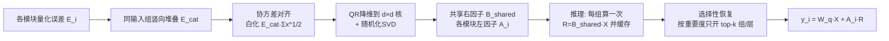

# GlowQ: Group-Shared Low-Rank Approximation for Quantized LLMs

**会议**: ICLR 2026  
**OpenReview**: [https://openreview.net/forum?id=kVojSLUcvS](https://openreview.net/forum?id=kVojSLUcvS)  
**代码**: [https://github.com/ahnselim/GlowQ](https://github.com/ahnselim/GlowQ)  
**领域**: 模型压缩 / 量化误差补偿  
**关键词**: 低秩补偿, 后训练量化, 共享右因子, 协方差对齐, 选择性恢复  

## 一句话总结
GlowQ 把"给每一层都挂独立低秩误差校正模块"改成"同输入分组共享一个右因子 B、只缓存一次投影 BX 再各模块复用"，并按收益挑选性恢复部分组/层，从而在几乎不掉精度的前提下把量化 LLM 的首字延迟降一截、吞吐拉一截。

## 研究背景与动机
**领域现状**：4-bit 后训练量化（GPTQ/AWQ/BitsAndBytes）是部署 LLM 的标配，但低比特会掉精度，于是出现了一类"低秩误差补偿"方法（LQER、QERA、ASER 等）：把量化误差 $W-W_q\approx AB$ 用一个高精度低秩项补回来，推理时输出加上 $A(BX)$ 即可恢复质量。

**现有痛点**：这些方法几乎都给**每一层、每个投影**挂一个独立的 $(A_\ell,B_\ell)$ 模块，并在网络里**反复计算高精度投影 $B_\ell X$**。后果是三重浪费：(i) 共享同一输入张量（如 Q/K/V 都吃 attention 输入）的模块重复做同样的昂贵投影；(ii) 物化多份 $BX$ 抬高显存流量；(iii) 子空间选择目标常忽略真实激活的强各向异性，把有限的秩分配给几乎用不到的方向。结果是在严格延迟预算下精度-效率折中比理论上能达到的更差。

**核心矛盾**：低秩补偿确实能补精度，但"逐层独立 + 逐层重算"的部署方式让它在延迟和显存上付出了不必要的代价——补偿模块的算法收益被工程开销吃掉了。

**本文目标**：保留逐层校正的表达力，同时砍掉冗余计算与显存占用，让低秩补偿在真实部署预算下真正划算。

**核心 idea**：**[分组共享 + 一次投影缓存]** 把"吃同一个输入"的模块视作一个组，整组只学一个共享右因子 $B_{shared}$、各模块保留各自的左因子 $A_i$；推理时整组只算一次 $R=B_{shared}X$ 并缓存，每个模块只做轻量的 $A_i R$。再叠加 **[协方差对齐]** 让有限的秩对齐数据真正常走的方向，以及 **[选择性恢复]** 只在收益最大的组/层上开启校正。

## 方法详解

### 整体框架
GlowQ 分三块：先把同输入模块的误差矩阵竖向堆叠、用一个共享右因子做联合低秩拟合（理论上等价于堆叠矩阵的截断 SVD）；再用协方差对齐目标把右子空间引向数据高频方向，并用 QR-降维 + 随机化 SVD 在不物化高瘦矩阵的前提下高效求解；最后在推理期把 $R=B_{shared}X$ 每组只算一次缓存复用，并按重要度分数选择性地只恢复 top-k 个单元。

### 关键设计

**1. 分组共享右因子：一份 B 服务整组，且证明最优**　对吃同一输入维度 $d$ 的 $m$ 个模块，把它们的误差矩阵竖向拼成 $E_{cat}=[E_1^T\cdots E_m^T]^T$，求解 $\min_{A,B}\|E_{cat}-AB\|_F^2$。论文给出 Proposition 1：联合拟合单一右因子 $B$ 等价于对堆叠矩阵 $E_{cat}$ 做一次低秩拟合，由 Eckart-Young-Mirsky 定理，最优 $B$ 张成 $E_{cat}$ 的前 $r$ 个右奇异子空间；允许每模块各用 $B_i$ 并不增加表达力（差异都能吸收进 $A_i$ 的可逆重参数化）。这就把"逐层独立 $B_\ell$"在数学上证明为冗余——一个共享 $B$ 既够用又最优，从而合法地把多次大矩阵 $BX$ 折叠成一次投影加几次廉价的 $A_iR$。

**2. 协方差对齐：让有限的秩对齐数据真正走的方向**　纯堆叠 SVD 只看误差矩阵的几何，而真实激活强各向异性——论文实测输入协方差谱呈幂律重尾衰减 $\lambda_r\propto r^{-\alpha}$（MLP $\alpha\approx0.77$、QKV $\alpha\approx1.19$），意味着表示空间的使用高度集中在少数轴上。若不加权，选出的子空间会和数据偏好方向错位、白白浪费秩。于是改用"使用度加权"目标：期望损失 $\mathbb{E}\|Mx\|_2^2=\|M\Sigma_x^{1/2}\|_F^2$，等价于对误差右乘白化矩阵后再做低秩拟合 $\min_{A,B}\|(E_{cat}-AB)\Sigma_x^{1/2}\|_F^2$。Proposition 2/3 证明"最小化使用度加权风险"恰好等于"最小化右加权重构误差"，其全局最优由白化误差 $\tilde E=E_{cat}\Sigma_x^{1/2}$ 的秩-$r$ SVD 给出；各向同性时退化为普通堆叠 SVD。实测在同样的秩下白化版本的累积能量捕获显著更快。

**3. QR-降维随机化 SVD：不物化高瘦矩阵的可扩展求解**　直接对白化后的高瘦矩阵做 SVD 代价大、还数值不稳。论文走三步：先对 $E_{cat}$ 做 thin QR，把"高 $m$"问题无损压成一个 $d\times d$ 的核 $M=R_e\Sigma_x^{1/2}$（依赖 Frobenius 范数的左正交不变性）；再在核上做随机化 SVD（带 $p$ 个过采样列与 $q$ 次幂迭代）抽取主导右子空间，复杂度从 full SVD 的 $O(d^3)$ 降到 $O(d^2(r+p)+qd^2(r+p))$；最后做平衡恢复 $\hat A^\star=U_r\Sigma_r^{1/2}$、$\hat B^\star=\Sigma_r^{1/2}V_r^T$ 提升数值稳定性，并把因子提升回原变量（$\Sigma_x$ 奇异时用伪逆）。整个求解只需离线一次，直接对接后面的缓存与选择性恢复运行时，不改动任何模型结构。

**4. 缓存 + 选择性恢复：把算法节省变成真实的延迟/吞吐收益**　共享结构意味着同组模块都依赖同一右投影。GlowQ 对每个组只物化一次 $R_\ell=XB_{\ell,shared}^T$ 并复用，模块 $i$ 只做小校正 $y_i=W_i^{(q)}X+A_{\ell,i}R_\ell$；用 anchor 策略让 $R_\ell$ 恰好算一次再被固定次数消费（attention 里 Q 是 anchor、K/V 是 consumer；MLP 里 gate 是 anchor、up 是 consumer），不共享输入的 solo 模块（o_proj、down_proj）则即时计算不缓存。在给定延迟/显存预算下，再按重要度分数排序、只激活 top-k：分数用两个指标——协方差对齐后的 GSVD 能量捕获分数 $g_{ec}(u)=\sum_{j=1}^r\sigma_j(M_u)^2/\|M_u\|_F^2$ 和归一化误差比 $g_{ner}(u)=\|E_u\|_F^2/\|W_u\|_F^2$，信号弱时退回按层序。这就得到全功率版 GlowQ 与轻量版 GlowQ-S 两档。

## 实验关键数据
评测覆盖 LLaMA 2/3、Qwen 2.5/3、OPT、Mistral、Qwen1.5-MoE 等 11+ 变体，统一 W4A16（int4 权重 g128、fp16 激活）、秩固定 64、64 条长 2048 校准序列、不微调；协方差/SVD 在 A100 上算、推理在 RTX 4090 上跑。基线含 PTQ（BnB/AWQ/GPTQ）与误差校正法（L2QER/ZeroQuant-V2/QERA）。

### 主实验表格（WikiText-2 PPL，越低越好，节选）

| Method | LLaMA3.2-3B | LLaMA3.1-8B | Qwen2.5-7B | Qwen3-8B | Mistral-7B |
|---|---|---|---|---|---|
| FP16 | 7.81 | 6.24 | 6.86 | 9.73 | 5.32 |
| AWQ | 8.24 | 6.64 | 7.11 | 10.19 | 5.51 |
| QERA | 8.22 | 6.64 | 8.09 | 10.07 | 5.48 |
| L2QER | 8.30 | 6.75 | 8.14 | 10.07 | 5.46 |
| **GlowQ** | **8.16** | **6.59** | **7.07** | **9.90** | **5.42** |
| GlowQ-S | 8.22 | 6.62 | 7.09 | 9.97 | 5.45 |

GlowQ 在 11 个变体中 9 个取得最优或并列最优；仅 LLaMA2-13B（L2QER 略胜）、OPT-1.3B（QERA 领先）、OPT-6.7B（纯 PTQ 更好）例外。

### 下游精度 + C4（Table 2，节选）

| Method | LLaMA3.2-3B Acc↑ | LLaMA3.1-8B Acc↑ | Qwen3-8B Acc↑ | Qwen3-14B Acc↑ |
|---|---|---|---|---|
| FP16 | 67.14 | 73.29 | 71.48 | 74.10 |
| QERA | 65.48 | 72.86 | 69.86 | 73.14 |
| L2QER | 66.19 | 72.43 | 69.52 | 73.24 |
| **GlowQ** | **66.90** | **73.33** | **70.71** | **73.84** |

### 效率与选择性恢复
- 相比强基线，GlowQ 平均把 **TTFB 降 5.6%、吞吐升 9.6%**，同时 WikiText-2 PPL 降 0.17%、下游精度升 0.42 个百分点。
- 选择性版 **GlowQ-S 把 TTFB 降 23.4%、吞吐升 37.4%**，平均精度仅损失 0.2 个百分点以内（典型只恢复约 50% 的组/层）。
- W4A8 几乎追平 W4A16 精度；W4A4 下各方法都掉，但 GlowQ/GlowQ-S 仍与 L2QER 竞争或更优。

### 关键发现
- **逐层独立 B 是冗余的**：共享右因子既不掉表达力又省下大量重复投影与补偿参数。
- **协方差对齐显著提速能量捕获**：在重尾各向异性激活下，白化让同秩下恢复更多误差能量。
- **选择性恢复甜点在半数左右**：恢复约 50% 的组就能拿到大部分精度，同时换来最大的延迟/吞吐收益。

## 亮点与洞察
- 把"低秩补偿为什么慢"归因到**输入共享导致的重复投影**这个工程视角，再用一条干净的代数命题（共享 B 最优）把它消除，理论与系统收益对得很齐。
- 协方差对齐不是拍脑袋加权，而是从"使用度加权风险 = 右加权重构误差"的等价性推出来，并用实测幂律谱佐证动机，论证链条完整。
- anchor/consumer 的缓存调度把"一次投影复用"落到 attention/MLP 的具体结构上，工程可直接复现。

## 局限与展望
- 主要面向 **W4A16 权重量化误差补偿**，W4A4 下增益收窄，激活量化是更难啃的部分。
- GlowQ-S 的重要度打分规则**因模型族而异**（需按家族选 GSVD/NER/层序），缺乏跨族统一的自适应策略。
- 平均增益（PPL 降 0.17%、精度升 0.42pt）偏小，价值更多体现在**等精度下的延迟/吞吐**而非精度本身；少数模型（OPT 系）上反被纯 PTQ 或单一基线超过。
- 协方差/SVD 步骤需在 A100 上离线完成，对算力受限场景的端到端成本未充分讨论。

## 相关工作与启发
- **低秩误差补偿**：LQER/ZeroQuant-V2(LoRC)/QERA/ASER 奠定了 $W\approx W_q+AB$ 的补偿范式，GlowQ 在其上解决"逐层独立 + 逐层重算"的部署低效。
- **联合/集体矩阵分解**：共享右子空间的思想源自 collective matrix factorization（Singh & Gordon 2008）与共享奇异子空间恢复（Ma & Ma 2024），本文首次系统迁移到 LLM 的输入共享模块。
- **剪枝式显著性选择**：选择性恢复借鉴了剪枝里的 saliency/重要度评分（Molchanov、Nagel、Banner 等），把"该不该补这一层"变成预算约束下的 top-k 选择。
- **启发**：当一类增强模块"挂满每一层"时，先问"它们的输入是否共享、计算是否可折叠"，往往能在不改精度的前提下把开销摊薄——这套"分组共享 + 一次计算缓存 + 选择性激活"的思路可推广到 LoRA、adapter、KV 缓存校正等场景。

## 评分
- 新颖性: ⭐⭐⭐⭐ — 把低秩补偿从"逐层独立"重构为"分组共享右因子 + 一次投影缓存"，并用代数命题证明其最优，视角清晰、迁移得当。
- 实验充分度: ⭐⭐⭐⭐ — 覆盖 11+ 模型变体、多基线、PPL/下游精度/延迟/吞吐多维度，含选择性恢复曲线与混合精度消融，较全面。
- 写作质量: ⭐⭐⭐⭐ — 动机—理论—实现—部署链条连贯，命题与图表配合到位；个别符号偏密。
- 价值: ⭐⭐⭐⭐ — 在等精度下实打实降延迟/升吞吐（GlowQ-S 尤甚），对量化 LLM 部署有直接工程意义；精度净增偏小限制了上限。

<!-- RELATED:START -->

## 相关论文

- [\[ICLR 2026\] UniQL: Unified Quantization and Low-Rank Compression for Adaptive Edge LLMs](uniql_unified_quantization_and_low-rank_compression_for_adaptive_edge_llms.md)
- [\[ICLR 2026\] WSVD: Weighted Low-Rank Approximation for Fast and Efficient Execution of Low-Precision Vision-Language Models](wsvd_weighted_low-rank_approximation_for_fast_and_efficient_execution_of_low-pre.md)
- [\[ICLR 2026\] Taming Momentum: Rethinking Optimizer States Through Low-Rank Approximation](taming_momentum_rethinking_optimizer_states_through_low-rank_approximation.md)
- [\[ACL 2025\] GSQ-Tuning: Group-Shared Exponents Integer in Fully Quantized Training for LLMs On-Device Fine-tuning](../../ACL2025/model_compression/gsq-tuning_group-shared_exponents_integer_in_fully_quantized_training_for_llms_o.md)
- [\[ICLR 2026\] SERQ: Saliency-Aware Low-Rank Error Reconstruction for LLM Quantization](serq_saliency-aware_low-rank_error_reconstruction_for_llm_quantization.md)

<!-- RELATED:END -->
