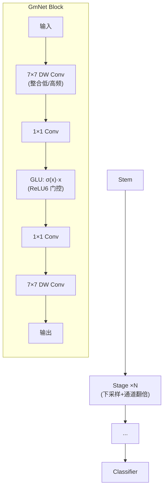

# GmNet: Revisiting Gating Mechanisms From A Frequency View

**会议**: ICLR 2026  
**OpenReview**: [https://openreview.net/forum?id=dkfEwHobXq](https://openreview.net/forum?id=dkfEwHobXq)  
**代码**: [https://github.com/YFWang1999/GmNet](https://github.com/YFWang1999/GmNet)  
**领域**: 轻量化网络 / 高效模型设计  
**关键词**: 门控线性单元(GLU)、频率分析、低频偏置、轻量化网络、卷积定理  

## 一句话总结
从频域视角首次系统解释门控线性单元(GLU)为何有效——逐元素乘对应频域卷积可拓宽频谱、非光滑激活保留高频能量——据此设计出极简的 GmNet，用最简单的 $\sigma(x)\cdot x$ 门控修正轻量模型的低频偏置，在 ImageNet 上刷新高效模型 SOTA。

## 研究背景与动机
**领域现状**：轻量化网络是端侧部署的刚需，主流设计走两条路线——纯卷积(MobileOne、RepViT)和卷积+注意力混合(EfficientFormerV2)。这些工作一路把参数量和 FLOPs 压低，但优化目标几乎都集中在"算得快"这件事上。

**现有痛点**：神经网络存在被广泛验证的**频谱偏置(spectral bias)**——网络天然偏爱先学简单的低频全局模式，而对纹理、边缘这类高频细节学得又慢又差。轻量模型因为容量和深度都被砍掉，这种低频偏置被进一步放大，恰恰丢掉了复杂识别任务最需要的细粒度信息。

**核心矛盾**：GLU 这类门控机制已经在 Mamba、Llama3、gMLP 里被反复证明有效，但学界对它的理解停留在"自适应信息门控"这种功能性描述上。**没有人从频率视角解释过 GLU 到底改变了网络的什么——它和低频偏置这个老问题之间的联系完全是空白。**

**本文目标**：系统分析 GLU 的频域行为，把它的核心操作和频谱调制能力建立明确联系，并据此设计一个能主动对抗低频偏置的轻量架构。

**核心 idea**：**逐元素乘 = 频域卷积(卷积定理) + 非光滑激活保留高频** 这两个性质叠加，让 GLU 天然具备"选择性放大高频"的能力；只要把这个原理嵌进标准轻量骨干，无需任何复杂训练技巧就能拿到 SOTA。

## 方法详解

### 整体框架
论文分两步走：先从频域理论 + 受控实验拆解 GLU 为什么能改善高频学习（逐元素乘、激活函数两个角度），再把结论落地为 GmNet——一个用最简 GLU $\sigma(x)\cdot x$ 武装标准轻量骨干的网络。GmNet 沿用经典混合架构：每个 stage 用卷积下采样并把通道数翻倍，block 内部首尾各放一个 $7\times7$ 深度卷积负责融合低/高频信息，中间夹两个 $1\times1$ 卷积和一个极简门控单元，激活统一用 ReLU6。

### 关键设计

**1. 逐元素乘拓宽频谱：用卷积定理解释 GLU 的高频能力** 论文从频域第一性原理切入，指出 GLU 核心的逐元素乘并非简单的信息缩放。卷积定理告诉我们空间域的逐元素乘等价于频域的卷积：$(u\cdot v)(x)=\mathcal{F}^{-1}(U*V)$，其中 $\cdot$ 是逐元素乘、$*$ 是卷积。最直观的情形是自卷积——若 $F(\omega)$ 的支撑集是 $[-\Omega,\Omega]$，那么 $F*F(\omega)$ 的支撑集会扩张到 $[-2\Omega,2\Omega]$。也就是说，逐元素乘会**主动拓宽特征的频谱范围**，给网络创造更多机会去捕捉并学习高低频成分，这正是 GLU 能修正低频偏置的频域根源。

**2. 非光滑激活保留高频：把激活平滑度和频谱衰减率挂钩** 既然门控里还有激活函数，论文进一步分析激活的平滑度如何影响频率特性。傅里叶分析中有个经典结论：函数越光滑(可导阶数越高)，其傅里叶变换幅值衰减越快——由微分性质 $\mathcal{F}[f^{(n)}(t)]=(j\omega)^n F(\omega)$，光滑函数的高频成分以 $1/|\omega|^n$ 快速衰减。反过来，像 ReLU 这种带"尖角"、导数不连续的非光滑激活，频谱只以 $1/|\omega|$ 缓慢衰减，**天然蕴含丰富的高频能量**。在 ResNet18 上的对照实验印证了这点：非光滑的 ReLU6 在各个高频阈值下学高频成分都稳定胜过光滑的 GELU，而 GELU 在低频上相对更强。这解释了 GmNet 为何选 ReLU6——它既能强化高频，又比纯 ReLU 更能抑制对高频的过拟合(在低频上表现更好)。

**3. 极简 $\sigma(x)\cdot x$ 门控：自增强对齐胜过独立投影** GmNet 的 GLU 采用最简形式 $\sigma(x)\cdot x$——门控信号和被调制信号来自同一个表示，形成"自增强(self-reinforcing)"对齐。这与 StarNet、EfficientMod 等用独立投影(dual-channel FC、DW、LN、Pool)生成门控的做法形成对比：独立投影本质上像一个通用滤波器，对分类关键的细微高频变化敏感度反而更弱；而共享表示能保证显著变化(尤其高频成分)被一致强化而非被抑制。这个设计同时满足两个目标——把模型做到极致轻量(GLU 内不加任何额外卷积/全连接)，并让门控行为与频域分析完全自洽、更可解释。消融显示 $\sigma(x)\cdot x$ 在高频分类上明显领先各种"加料"变体，验证了"最简即最优"。

## 实验关键数据

### 主实验：ImageNet-1K 分类
300 epoch 从随机初始化训练，AdamW，无重参数化/蒸馏/架构搜索。延迟在 A100 GPU 和 iPhone 14(CoreML)上实测。

| Model | Top-1 (%) | Params (M) | FLOPs (G) | GPU (ms) | Mobile (ms) |
|---|---|---|---|---|---|
| MobileV2-1.0 | 72.0 | 3.4 | 0.3 | 1.7 | 0.9 |
| **GmNet-S1** | **75.5** | 3.7 | 0.6 | 1.6 | 1.0 |
| EfficientFormerV2-S1 | 77.9 | 4.5 | 0.7 | 3.4 | 1.1 |
| **GmNet-S2** | **78.3** | 6.2 | 0.9 | 1.9 | 1.1 |
| RepViT-M1.0 / StarNet-S4 | 78.6 / 78.4 | 6.8 / 7.5 | 1.2 / 1.1 | 3.6 / 3.3 | 1.1 |
| **GmNet-S3** | **79.3** | 7.8 | 1.2 | 2.1 | 1.3 |
| RepViT-M1.5 | 81.2 | 14.0 | 2.3 | 6.4 | 1.7 |
| LeViT-256 | 81.5 | 18.9 | 1.1 | 6.7 | 31.4 |
| **GmNet-S4** | **81.5** | 17.0 | 2.7 | 2.9 | 1.9 |

GmNet-S3 比 RepViT-M1.0/StarNet-S4 高 1.9%/0.9% 且 GPU 上快 30%+；GmNet-S4 与 LeViT-256 精度持平但 GPU 快 2×、iPhone 上快 16×。

### 消融实验

**激活函数频域行为(GmNet-S3，分频段精度)**：

| Activation | Raw | r=12 High | r=24 High | r=36 High |
|---|---|---|---|---|
| Identity | 70.5 | 12.6 | 1.7 | 0.7 |
| ReLU | 78.3 | 45.9 | 13.5 | 4.9 |
| GELU | 78.4 | 41.5 | 9.4 | 3.9 |
| **ReLU6** | **79.3** | **51.7** | 12.1 | 4.7 |

Identity→ReLU 在 raw 上涨 11%，但高频上平均涨幅超 3 倍；ReLU6 在小半径高频处明显胜 GELU，同时低频好于 ReLU(更抗高频过拟合)。

**GLU 设计对比(GmNet-S3)**：

| GLU 设计 | Top-1 (%) | Params (M) | GPU (ms) | r=12 High |
|---|---|---|---|---|
| σ(x)·LN(x) | 78.9 | 7.8 | 2.9 | 47.6 |
| σ(x)·DW(x) | 79.0 | 8.0 | 2.4 | 49.0 |
| σ(x)·FC(x) | 79.2 | 20.2 | 3.6 | 51.4 |
| **σ(x)·x** | **79.3** | **7.8** | **2.1** | **51.7** |

最简 $\sigma(x)\cdot x$ 在精度、参数、延迟、高频分类四项上同时最优；FC 设计虽高频接近但参数暴涨到 20.2M、延迟最高。

### 关键发现
- **同延迟跨方法对比高频**：r=12 时 GmNet-S3 高频精度 51.7%，比 EfficientMod-xs(45.4)、StarNet-S4(43.3)、MobileOne-S2(35.0)显著领先，而各方法低频精度接近——证明 GmNet 的增益主要来自高频。
- 用 GLU 替换 MobileNetV2 MLP 块的激活，高频分类提升直接带动整体精度上涨，验证"高频建模对轻量模型更关键"。
- 不存在"牺牲低频换高频就一定整体更好"——要拿到 raw 最优精度，必须让模型对各频段都有均衡学习能力。

## 亮点与洞察
- **理论解释干净有力**：用卷积定理(逐元素乘→频谱拓宽)+ 微分性质(激活平滑度→高频衰减率)两条经典傅里叶结论，把 GLU 这个"黑箱信息门"讲成了可解释的频谱调制器，是首个从频率视角系统分析 GLU 的工作。
- **"最简即最优"反直觉但自洽**：$\sigma(x)\cdot x$ 不加任何投影/归一化，反而在效果和效率上全面胜出，因为门控与被调制信号共享表示形成自增强对齐——理论分析和架构设计完全闭环。
- **工程价值实在**：无需重参数化/蒸馏/NAS，标准端到端训练就拿 SOTA，GPU 延迟优势尤其突出(S4 比同精度 LeViT-256 快 2-16×)。

## 局限与展望
- 分析主要围绕图像分类，GLU 的频域优势在检测、分割等密集预测任务上是否同样成立尚未验证。
- 频域解释建立在自卷积、单一激活等简化情形上，深层堆叠后频谱如何级联演化缺乏定量刻画。
- 截断半径 $r$、ReLU6 的截断上界等关键超参对频谱行为的影响只给了经验性结论，缺乏自适应选择机制。
- 与重参数化、蒸馏等正交技巧叠加能否进一步提升，论文未做探索。

## 相关工作与启发
- **GLU 谱系**：从 GLU(Dauphin 2017)、SwiGLU(Shazeer 2020)到 Mamba、gMLP，门控一直被当作"自适应信息控制"；本文补上了缺失的频率视角解释。
- **频谱偏置**：Rahaman 2019、Tancik 2020、Yin 2019 等揭示了网络先学低频的现象，但多停留在分析诊断；本文是少见地提出"用高效架构机制主动对抗低频偏置"的工作。
- **轻量网络**：MobileOne、RepViT、EfficientFormerV2 等优化了算力指标却忽视了表示的频谱保真度；GmNet 指出这是高效设计的盲点，给出"从频域纠偏"的新设计原则。
- **启发**：把激活函数的"平滑度"当作可调的频谱旋钮，以及"门控信号与被调制信号是否共享表示"这一视角，可迁移到 token mixer、注意力门控等更多模块的设计中。

## 评分
- **新颖性**: ⭐⭐⭐⭐⭐ 首个从频率视角系统解释 GLU，把卷积定理与低频偏置这两个看似无关的主题打通，视角新且解释自洽。
- **实验充分度**: ⭐⭐⭐⭐ ImageNet 主实验覆盖 4 个尺度 + 多平台延迟，激活/GLU 设计/跨方法分频段消融做得细致；但仅限分类任务，缺下游验证。
- **写作质量**: ⭐⭐⭐⭐ 理论铺陈清晰，从直觉图示到公式推导再到架构落地层层递进，叙事完整。
- **价值**: ⭐⭐⭐⭐ 给出可解释、无花哨技巧的高效模型 SOTA，频域设计原则对轻量网络社区有切实启发。

<!-- RELATED:START -->

## 相关论文

- [\[ICLR 2026\] FASA: Frequency-Aware Sparse Attention](fasa_frequency-aware_sparse_attention.md)
- [\[ICLR 2026\] Revisiting Weight Regularization for Low-Rank Continual Learning](revisiting_weight_regularization_for_low-rank_continual_learning.md)
- [\[ICLR 2026\] Multi-View Encoders for Performance Prediction in LLM-Based Agentic Workflows](multi-view_encoders_for_performance_prediction_in_llm-based_agentic_workflows.md)
- [\[CVPR 2026\] Cross-View Distillation and Adaptive Masking for Incomplete Multi-View Multi-Label Classification](../../CVPR2026/model_compression/cross-view_distillation_and_adaptive_masking_for_incomplete_multi-view_multi-lab.md)
- [\[ICLR 2026\] FreqKV: Key-Value Compression in Frequency Domain for Context Window Extension](freqkv_key-value_compression_in_frequency_domain_for_context_window_extension.md)

<!-- RELATED:END -->
