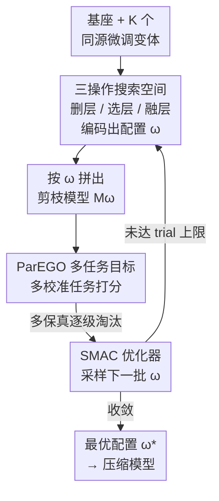

# GPTailor: Large Language Model Pruning Through Layer Cutting and Stitching

**会议**: ICLR 2026  
**OpenReview**: [https://openreview.net/forum?id=yCTpYe3UOL](https://openreview.net/forum?id=yCTpYe3UOL)  
**代码**: https://github.com/Guinan-Su/auto-merge-llm (有)  
**领域**: 模型压缩  
**关键词**: 结构化剪枝, 层裁剪, 模型融合, 零阶优化, 多保真搜索

## 一句话总结
GPTailor 把 LLM 结构化剪枝重新定义为「在同一基座的一族微调变体上做层级裁剪与缝合」的零阶优化问题——支持删层、跨模型选层、层融合三种操作，用 ParEGO 多任务目标 + SMAC 多保真搜索自动找配置，在不做任何后训练修复的前提下，让 Llama2-13B 删掉约 25% 的层后仍保留 97.3% 的原始性能，显著超过此前 SOTA。

## 研究背景与动机

**领域现状**：把大模型压小、降部署成本的主流路线有量化、知识蒸馏、结构化剪枝三条。量化要专门硬件支持、蒸馏要付出昂贵的小模型重训练，相比之下结构化剪枝直接砍掉冗余结构（如整层），硬件无关、最灵活，因此被广泛研究。

**现有痛点**：现有结构化剪枝（LLMPruner、SliceGPT、LaCo、ShortGPT 等）几乎都在「单个模型」上手工设计重要性度量——比如用梯度信息、用隐状态变化导出的 Block Influence 来判断哪层该删。这类方法有两个硬伤：一是删完几乎必然掉点，二是为了把性能补回来往往还得做一轮全参数后训练，代价高。

**核心矛盾**：单模型剪枝的信息是「一次性」的——删掉的那层里承载的能力就永久丢了，只能靠后训练去重新长出来。问题根源在于**只盯着一个模型看，没有别的地方可以把丢掉的能力补回来**。

**切入角度**：作者观察到，同一个基座（如 Llama2-13B）会衍生出一堆任务专精的微调变体——擅长代码的、擅长数学的、擅长语言理解的。这些变体彼此「足够接近」（同源微调，权重差异小），既可以互相替换某一层，必要时还能用模型融合把多个变体的同位层缝合到一起。于是丢层造成的能力损失，可以从「别的变体的对应层」里补回来。

**本文目标**：不再剪一个孤立的模型，而是把剪枝对象换成「一族微调变体」，在它们之间挑选、删除、融合层，拼出一个更小但能力齐全的模型。

**核心 idea**：把剪枝重构成一个零阶优化问题——在候选模型族上搜索「每层保留/删除、从哪个变体取、要不要融合及怎么融合」的配置，用数据驱动的多保真搜索代替专家手工度量，从而无需后训练就得到高质量压缩模型。

## 方法详解

### 整体框架

GPTailor 的输入是一个基座模型 $M_{base}$ 和 $K$ 个同源微调变体 $\mathcal{M}=\{M_1,\dots,M_K\}$，输出是一个满足目标稀疏率 $s$（删掉的层占比）的剪枝模型。整条管线不像传统压缩那样「算度量→删层→后训练」，而是把剪枝整体表述为一个带约束的优化问题：

$$\omega^* = \arg\min_{\omega\in\Omega} f(M_\omega) \quad \text{s.t.} \quad S(M_\omega)\le s$$

其中每个配置 $\omega$ 规定了如何从候选模型里取层、删层、融层来拼出剪枝模型 $M_\omega$，$f(\cdot)$ 衡量它在校准数据上的表现，$S(\cdot)$ 计算被删参数占比。整个流程就是在巨大的配置空间 $\Omega$ 里搜一个最优 $\omega^*$。

具体分四步：先把剪枝**重构成候选模型族上的零阶优化**（确定优化对象与约束）；再设计支持「删层 / 跨模型选层 / 层融合」三种操作的**搜索空间**（用一组二值向量+融合超参编码每个配置）；然后用 **ParEGO 多任务目标函数**在多个校准任务上评估每个配置，输出一条 Pareto 前沿；最后用 **SMAC 多保真优化器**在配置空间里高效采样、用越来越多的校准样本逐级淘汰，找到最终配置。

### 关键设计

**1. 把剪枝重构成候选模型族上的零阶优化：换掉「剪一个模型」的范式**

这是全文的根，针对的是「单模型剪枝丢了层就补不回来、还得后训练」的痛点。作者不再把剪枝看成「在一个 $M_{base}$ 上删结构」，而是看成「在 $M_{base}$ 及其 $K$ 个任务专精微调变体上做层级重组」。形式化为 $\omega^*=\arg\min_{\omega\in\Omega} f(M_\omega)$ s.t. $S(M_\omega)\le s$。关键在于：因为这些变体同源、彼此接近，删掉某层造成的能力空缺可以用别的变体的对应层（或多个变体融合后的层）顶上——丢的代码能力从 Code 变体取，丢的数学能力从 Math 变体取。$f$ 是一个**对 $\omega$ 不可导、只能黑箱评估**的函数（改一个层配置就得重新前向跑一遍 benchmark），所以这天然是个零阶（无梯度）优化问题，也正因如此可以完全数据驱动、不靠任何手工重要性度量。这套重构让「剪枝」和「融合」第一次被统一进同一个搜索目标里。

**2. 三操作搜索空间：用二值向量+融合超参编码每一种裁剪缝合方式**

光有「在模型族上优化」的想法还不够，得让搜索器能枚举出所有可能的裁剪缝合方案，这就是搜索空间设计要解决的。给定 $l$ 层的基座和 $K$ 个变体，作者用三层编码刻画一个配置：① 删层用二值向量 $r=[r_1,\dots,r_l]$，$r_i=1$ 表示删第 $i$ 层，且 $\sum_i r_i=\lceil l\cdot s\rceil$ 强制满足目标稀疏率；② 对每个保留的层位 $i$，用选择向量 $c_i=[c_{i,1},\dots,c_{i,K}]$ 指定从哪些变体取该层，若 $\sum_j c_{i,j}=0$ 就用基座的层；③ 当某层位有多个变体贡献（$\sum_j c_{i,j}>1$）时，再指定一个融合方法 $m_i$ 及其超参 $h_i$（如 task-arithmetic 的融合系数）。于是完整配置写成 $\omega=\{r,\{c_i\},\{m_i\},\{h_i\}\}$，搜索空间基数

$$|\Omega| = \binom{l}{\lceil l\cdot s\rceil}\times\prod_{i:r_i=0}2^K\times\prod 1Z\times\prod 1|h_i|$$

这套编码的精髓是把「删 / 选 / 融」三件事**正交地**塞进一个统一表示——删层负责降稀疏率，选层负责跨模型取最优能力，融层负责在一层里缝合多个变体；后面消融会证明三者缺一不可。

**3. ParEGO 多任务目标函数：用标量化把多能力评估拧成可搜索的单目标**

剪枝模型不能只在一个任务上好，得同时保住推理、语言、知识、理解等多方面能力，所以目标函数必须是多任务的——但多目标没法直接喂给搜索器排序。作者用 Pareto Efficient Global Optimization（ParEGO）把多目标标量化：对 $m$ 个任务 $\{T_1,\dots,T_m\}$，

$$f_{multi}(M_\omega,\lambda)=\max_{i=1,\dots,m}\{\lambda_i\cdot f_i(M_\omega)\}+\alpha\sum_{i=1}^m \lambda_i\cdot f_i(M_\omega)$$

其中 $f_i$ 是第 $i$ 个任务的目标，权重 $\lambda_i\ge 0$ 且 $\sum_i\lambda_i=1$，$\alpha$ 是小常数（典型取 0.05）。前一项是 Chebyshev 范数，保证**非凸 Pareto 前沿上的非支配解都能被识别**（普通加权和会漏掉凹陷处的解）；后一项加权和则提升数值稳定性。每轮随机采一组 $\lambda$ 就对应前沿上的一个 trade-off，最终优化器吐出一整条 Pareto 前沿，作者从表现最好的前沿里挑配置上报。这一步把「同时保多种能力」这个本质多目标的问题，变成搜索器可以逐个比较的单目标评分。

**4. SMAC 多保真优化器：用越删越多的校准样本逐级淘汰差配置**

搜索空间巨大、每评估一个配置都要跑一遍 benchmark，全量评估每个候选成本不可承受，这正是优化器要解决的效率问题。作者用 SMAC，把**校准数据量当作保真度（fidelity）**：预算 $b$ 从 $b_{min}$ 到 $b_{max}$，小预算（低保真）只用少量样本快速粗评，大预算（高保真）用更多样本慢但准。流程（Algorithm 1）类似 Hyperband 的逐次减半：每一档先用低预算 $r$ 评估 $n$ 个配置，按表现排序只留前 $\lfloor n_i/\eta\rfloor$ 个进入更高预算继续评，逐层淘汰，最后在最高预算上选表现最好的 $\omega^*$。采样新配置用随机森林作代理模型。实现里 $b_{min}=100$、$b_{max}=1000$、缩减因子 $\eta=3$，于是 PIQA/CSQA/MMLU 的预算梯度是 $\{100,300,1000\}$，总共 500 次 trial。另一个加速 trick 是**用随机删掉中间层的模型作搜索起点**——因为中间层冗余度高、对扰动鲁棒，从这里出发能更快收敛。这套多保真策略让搜索成本相比穷举大幅下降。

## 实验关键数据

### 主实验

在 OpenCompass 框架下，跨推理/语言/知识/理解 14 个 benchmark 评估，与四个 SOTA 结构化剪枝方法（LLM-Pruner、SliceGPT、LaCo、ShortGPT）对比。基线给了三种公平场景：分别剪每个候选取最强、先剪后融、先融后剪。GPTailor **全程不做后训练修复**。

| 模型 | 方法 | 删层比例 | 平均分 | 保留率 |
|------|------|---------|--------|--------|
| Llama2-7B | Dense (基座) | 0% | 52.63 | 100% |
| Llama2-7B | ShortGPT (最优基线) | 27.1% | 42.24 | 80.3% |
| Llama2-7B | **Ours** | 27.1% | **48.55** | **92.2%** |
| Llama2-13B | Dense (Code 变体) | 0% | 55.86 | 100% |
| Llama2-13B | ShortGPT (最优基线) | 24.6% | 50.49 | 90.4% |
| Llama2-13B | **Ours** | 24.6% | **54.33** | **97.3%** |

13B 上删掉约 25% 的层（10/40）仍保留 97.3% 性能，在多数单项任务上甚至追平或超过稠密模型。作者归因于两点：剪枝可能缓解了「过度思考」效应（CNLI、WSC 等任务上其他剪枝方法也涨点），以及融合策略补偿了剪枝带来的信息损失。结构分析发现两个剪枝模型都倾向删**中后段层**（13B 从第 25 层、7B 从第 19 层开始删），印证了后段层高冗余的已有发现。

### 消融实验

在 7B 上拆解搜索空间三操作的贡献（平均分）：

| 配置 | 平均分 | 说明 |
|------|--------|------|
| Ours（删+选+融全开） | 48.55 | 完整方法 |
| LR-only（仅删层，单模型） | 44.83 | 退化成传统单模型剪枝 |
| LS+LR（选层+删层，关融合） | 43.20 | 跨模型取层但不融合 |
| FL-merge（Folding Layers 融合） | 46.26 | 换一种融合实现 |

### 关键发现
- **融合是关键、但选层必须配融合**：仅删层（LR-only 44.83）已经超过最强基线 ShortGPT（42.24），说明零阶搜索本身就强；但开启跨模型选层却关掉融合（LS+LR）反而掉到 43.20——比只删层还差，证明「从不同模型硬拼层而不做融合整合」是无效的，选层和融合必须绑在一起用。
- **候选池越大越好、且差模型不拖后腿**：候选池组成实验显示，含语言模型（LM）的组合一致带来明显增益（Math&LM&Code 48.55 vs 仅 Code 42.03）；加入较弱的模型不会损害整体（稳定性强）；扩大候选池总体持续涨分（可扩展性强）。
- **剪枝率有明显拐点**：各模型准确率随剪枝率单调下降，GPTailor 在所有剪枝率下都最优，尤其 0%–37.5% 区间；到 50% 时所有模型性能崩塌、差距缩小，说明超过这个肘点就必须靠后训练才能维持功能。
- **能泛化到新一代模型**：在 Llama-3 8B 上删 9 层后保留 84.55%（53.17/63.61），远超 ShortGPT 的 62.79%（39.94/63.61）；但两者都低于 Llama-2 7B 的 92.2% 保留率，说明 Llama-3 语义更密、更难压缩。

## 亮点与洞察
- **「剪枝 = 在模型族上重组」是个范式转换**：把别的微调变体当成「能力零件库」，丢掉的层从库里补回来，绕开了单模型剪枝必须后训练修复的死结——这是最让人「啊哈」的地方。
- **无后训练却能逼近甚至超过稠密模型**：97.3% 保留率且零修复成本，意味着压缩阶段本身就是「成本可控、即插即用」的，这对部署侧极有价值。
- **多保真搜索把零阶优化的成本压下来了**：用校准数据量当 fidelity 逐级淘汰 + 随机删中间层作热启动，是把「每次评估都很贵」的黑箱优化做得可行的工程关键，这套思路可迁移到任何「评估昂贵、配置空间大」的模型搜索任务（如架构搜索、量化配置搜索）。
- **正交三操作的搜索空间编码**很干净：删/选/融用二值向量+融合超参分层表示，既保证稀疏率约束又覆盖广，是可复用的设计模板。

## 局限与展望
- **依赖现成的同源微调变体**：方法的前提是有一族任务专精的微调模型可用；若某基座没有这样的变体生态，就得自己先微调，成本会回来。
- **剪枝率天花板**：实验显示超过约 50% 的层就性能崩塌，且 Llama-3 这类更稠密的新模型保留率明显下降（84.55%），说明方法对「高冗余、可替换层多」的模型最有效，对语义密集的模型增益递减。
- **粒度停留在「层」级**：搜索空间是整层删/选/融，没有更细的子模块（注意力头、FFN 通道）粒度；更细粒度可能在高剪枝率下保住更多能力，但会让搜索空间爆炸，是个待解的 trade-off。
- **目标受校准数据影响**：虽然作者用 avg*（剔除校准来源任务）验证了泛化，但 ParEGO 的任务权重 $\lambda$ 怎么采、对哪些能力更敏感，仍有调参空间。

## 相关工作与启发
- **vs ShortGPT / LaCo（度量驱动的单模型剪枝）**: 它们靠手工度量（Block Influence、激活相似度）在单个模型上删/合层；GPTailor 改用数据驱动的零阶搜索，且跨多个变体取层融层。LaCo 也做层融合，但只在单模型内融相似层；本文强调**跨不同模型**的层融合，实验证明明显优于模型内融合。
- **vs SliceGPT / LLM-Pruner**: 它们分别用降维替换权重矩阵、用梯度删非关键结构，仍是单模型视角且常需后训练；GPTailor 无需后训练即超过它们。
- **vs NAS 式权重共享剪枝（Klein et al.）**: 那类方法在单模型内做需要昂贵训练的架构搜索；本文直接在已微调好的模型族上搜，省掉训练。
- **vs 模型融合（Task Arithmetic / TIES / DARE / Evolutionary Merging）**: 本文借用了融合技术（task-arithmetic）和多保真优化框架（Su & Geiping），但把融合从「不改模型大小的能力增强」推进到「服务于剪枝压缩」——融合在这里是补偿删层损失的手段，而非目的。

## 评分
- 新颖性: ⭐⭐⭐⭐⭐ 把结构化剪枝重构成「候选模型族上的零阶优化」，统一了剪枝与融合，是真正的范式转换。
- 实验充分度: ⭐⭐⭐⭐⭐ 14 benchmark、三公平场景、搜索空间消融、候选池/剪枝率/跨代模型泛化分析齐全。
- 写作质量: ⭐⭐⭐⭐ 问题表述清晰、动机自洽，搜索空间公式略密但可读。
- 价值: ⭐⭐⭐⭐⭐ 无后训练即保留 97.3% 性能，部署侧即插即用，思路可迁移到广义昂贵模型搜索。

<!-- RELATED:START -->

## 相关论文

- [\[ICLR 2026\] LSA: Layer-wise Sparsity Allocation for Large Language Model Pruning Based on Minimal Linear Reconstruction Error](lsa_layer-wise_sparsity_allocation_for_large_language_model_pruning_based_on_min.md)
- [\[ICLR 2026\] RCPU: Rotation-Constrained Error Compensation for Structured Pruning of Large Language Models](rcpu_rotation-constrained_error_compensation_for_structured_pruning_of_large_lan.md)
- [\[ICLR 2026\] Knowledge Distillation for Large Language Models through Residual Learning](knowledge_distillation_for_large_language_models_through_residual_learning.md)
- [\[ICLR 2026\] Entropy-Based Block Pruning for Efficient Large Language Models](entropy-based_block_pruning_for_efficient_large_language_models.md)
- [\[ICLR 2026\] GradPruner: Gradient-guided Layer Pruning Enabling Efficient Fine-Tuning and Inference for LLMs](gradpruner_gradient-guided_layer_pruning_enabling_efficient_fine-tuning_and_infe.md)

<!-- RELATED:END -->
