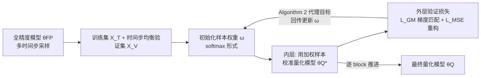

# Gradient-Aligned Calibration for Post-Training Quantization of Diffusion Models

**会议**: ICLR 2026  
**OpenReview**: [https://openreview.net/forum?id=CtFSOlrjth](https://openreview.net/forum?id=CtFSOlrjth)  
**代码**: 待确认  
**领域**: 模型压缩 / 扩散模型量化  
**关键词**: Post-Training Quantization, Diffusion Models, Gradient Conflict, Sample Reweighting, Meta-Learning, Bi-level Optimization  

## 一句话总结
通过元学习给不同时间步的校准样本学习一组重要性权重，使量化模型在各时间步上的梯度方向对齐、缓解梯度冲突，从而把扩散模型的训练后量化（PTQ）做得更好。

## 研究背景与动机
- **领域现状**：扩散模型生成质量惊艳，但采样要走几百步去噪、噪声估计网络又大又重，部署成本高。PTQ（训练后量化）因为不需要重训、不依赖原始数据集，成了压缩扩散模型的主流方案。校准数据（calibration data）在 PTQ 里至关重要，通常从去噪轨迹的不同阶段采集——Q-Diffusion 按固定间隔采、PTQ4DM 从高斯分布采时间步。
- **现有痛点**：几乎所有现有方法（Q-Diffusion、PTQ4DM、TFMQ-DM）都**默认所有校准样本同等重要**，给每个样本赋统一权重。但近期研究表明，不同时间步的样本对生成过程贡献差异巨大：晚期时间步刻画高层语义结构，早期时间步专注去除低层噪声细节，一刀切会稀释关键样本的影响。
- **核心矛盾**：不同时间步的激活分布和梯度方向差异显著，可以看作**带有冲突梯度的不同子任务**。本文的关键观察（Figure 1a）是——把量化损失的梯度按时间步两两算余弦距离，发现**早期时间步梯度一致、晚期时间步梯度严重发散**。而量化模型受限于离散参数空间（参数只能取 0/1 这类离散值），无法像全精度模型那样靠微调来化解冲突梯度，于是一个时间步上变好往往以另一个时间步变差为代价，整体性能在各时间步间剧烈波动。
- **本文目标**：在不增加推理开销的前提下，找到一组校准样本的加权方式，让量化模型既在验证集上表现好，又能让跨时间步的梯度方向保持一致。
- **核心 idea**：**[梯度对齐的样本重加权]** 首次指出 PTQ 中的"梯度冲突"问题，并用元学习把它建模成**双层优化**——内层用加权样本校准量化模型，外层学习样本权重，使得校准后的模型在各时间步验证集上的梯度互相对齐。

## 方法详解

### 整体框架
方法把"学样本权重"和"用加权样本校准量化模型"组织成一个双层优化：外层（meta）学习每个校准样本的权重 $\omega_i$，内层用这些权重做一步带权的量化校准得到 $\theta_Q^*(\omega)$，再用一个包含"梯度匹配损失 + 重构损失"的验证目标来评估并回传更新 $\omega$。整个校准在 noise-estimation 网络上**逐 block（逐层）**进行，每进入新 block 就刷新一次样本权重。

### 关键设计

**1. 双层优化目标：用加权样本校准、用验证性能选权重。** 方法把样本权重 $\omega$ 的求解写成一个嵌套问题：内层是一步带权的量化更新，外层在验证集上挑出能让模型表现最好的那组权重。形式上 $\omega = \arg\min_\omega \mathcal{L}_{VAL}(\theta_Q^*(\omega), \theta_{FP}, X^{(V)})$，约束为 $\theta_Q^*(\omega) = \theta_Q - \eta \sum_i \omega_i \frac{\partial \mathcal{L}_{MSE}(\theta_Q,\theta_{FP},x_i^{(T)})}{\partial \theta_Q}$。这里 $\mathcal{L}_{MSE}$ 是常规的量化重构损失，匹配全精度模型 $f(\theta_{FP},x_i)$ 与量化模型 $f(\theta_Q,x_i)$ 的输出 $\|f(\theta_{FP},x_i)-f(\theta_Q,x_i)\|^2$。直观上，权重大的样本对量化更新的贡献更大，所以"学权重"等价于"挑出对最终量化质量最有利的校准样本组合"。

**2. 梯度匹配损失：显式拉齐各时间步的优化方向。** 既然所有时间步共享同一份量化权重 $\theta_Q$，本文在验证损失里加了一项跨时间步的梯度对齐项。验证损失定义为 $\mathcal{L}_{VAL} = \mathcal{L}_{GM} + \mathcal{L}_{MSE}$，其中梯度匹配项 $\mathcal{L}_{GM}(\theta_Q^*, X^{(V)}) = -\frac{2}{T(T-1)} \sum_{t \neq k} G_{\theta_Q^*,t} \cdot G_{\theta_Q^*,k}$，$G_{\theta_Q^*,t} = \frac{\partial \mathcal{L}_{MSE}(\theta_Q^*,\theta_{FP},X_t^{(V)})}{\partial \theta_Q^*}$ 是第 $t$ 个时间步验证子集对模型权重的梯度。这项取所有时间步两两梯度内积的负均值——内积越大说明方向越一致，损失越小。因为相邻时间步梯度行为相似，实践中把时间步分成若干组（每组当作一个任务），而非逐个时间步处理。

**3. 三阶项的代理优化：把不可直接算的目标换成可行算法。** 直接优化目标（1）会涉及 $\mathcal{L}_{GM}$ 对样本权重 $\omega$ 的**三阶导**，难以计算。本文转而优化一个对权重梯度的代理梯度匹配损失 $\mathcal{L}_{GM}^{(2)}(\theta_Q^*, X^{(V)}) = -\frac{2}{T(T-1)} \sum_{t \neq k} G_{\omega,t} \cdot G_{\omega,k}$，其中 $G_{\omega,t} = \frac{\partial \mathcal{L}_{MSE}(\theta_Q^*,\theta_{FP},X_t^{(V)})}{\partial \omega}$ 是损失对权重而非对模型参数的梯度。Theorem 4.1（配两条引理）证明：最小化这个代理验证损失 $\mathcal{L}_{VAL}^{(2)} = \mathcal{L}_{GM}^{(2)} + \mathcal{L}_{MSE}$ 隐式地等价于最小化原始目标，于是用 Algorithm 2 这种基于梯度的元优化（借助 `higher` 库）就能高效求解 $\omega$，绕开了三阶导的计算难题。

**4. softmax 权重初始化与逐 block 校准流程。** 样本权重用 softmax 形式参数化 $\omega_i = \frac{\exp(s_i/\tau)}{\sum_j \exp(s_j/\tau)}$，初始 $s_i = \frac{1}{32}$，$\tau$ 为温度超参，保证初始时权重均匀。整体流程（Algorithm 1）按 noise-estimation 网络的层逐一推进：对每一层，先用 Algorithm 2 更新一次 $\omega$，再用更新后的加权训练集校准这一层的量化参数，逐层走完得到最终量化模型。权重量化用 AdaRound + block-wise reconstruction，激活量化沿用 TFMQ-DM 的 EMA 轻量方案，并整合其时序特征保持策略——这套配置保证了与现有 PTQ 方法的公平对比。

## 实验关键数据

### 主实验表格

CIFAR-10 32×32（DDIM，DDPM）：

| 方法 | W/A | FID↓ | W/A | FID↓ |
|------|-----|------|-----|------|
| PTQ4DM | 4/32 | 5.65 | 4/8 | 5.14 |
| Q-Diffusion | 4/32 | 5.08 | 4/8 | 4.98 |
| TFMQ-DM | 4/32 | 4.73 | 4/8 | 4.78 |
| **Ours** | 4/32 | **4.28** | 4/8 | **4.32** |

LSUN-Bedrooms & ImageNet 256×256（LDM-4）：

| 方法 | Bits(W/A) | LSUN FID↓ | LSUN sFID↓ | ImageNet FID↓ | ImageNet sFID↓ |
|------|-----------|-----------|------------|---------------|----------------|
| Full Prec. | 32/32 | 2.98 | 7.09 | 10.91 | 7.67 |
| TFMQ-DM | 4/32 | 3.60 | 7.61 | 10.50 | 7.98 |
| **Ours** | 4/32 | **3.14** | **7.22** | **10.17** | **7.40** |
| TFMQ-DM | 4/8 | 3.68 | 7.65 | 10.29 | 7.35 |
| **Ours** | 4/8 | **3.26** | **7.40** | **9.96** | 7.55 |

在所有量化配置下都取得 SOTA FID：CIFAR-10 上对 TFMQ-DM 改进 0.45（W4A32）/0.46（W4A8）；LSUN 改进 0.46/0.42；ImageNet W4A32 上 FID 降 0.33、sFID 降 0.58。

### 消融实验表格

CIFAR-10 W4A32 下的消融：

| 验证集大小 | 2% | 5% | 10% | 20% |
|-----------|-----|-----|-----|-----|
| FID↓ | 4.55 | **4.32** | 4.59 | 4.75 |
| sFID↓ | 4.71 | 4.61 | 4.38 | 4.51 |

| 温度 τ | 0.2 | 0.5 | 1 | 2 |
|--------|-----|-----|-----|-----|
| FID↓ | 4.85 | 4.55 | **4.28** | 4.32 |

极少时间步（ImageNet 4/32，DDIM）：

| 方法 | Timestep | FID↓ | sFID↓ |
|------|----------|------|-------|
| TFMQ-DM | 20 | 10.50 | 7.98 |
| **Ours** | 20 | **10.17** | **7.40** |
| TFMQ-DM | 10 | 9.01 | 12.75 |
| **Ours** | 10 | **8.73** | **11.26** |
| TFMQ-DM | 5 | 19.10 | 38.69 |
| **Ours** | 5 | **18.22** | **35.05** |

### 关键发现
- **5% 验证集即够**：只用 5% 训练数据当验证集就拿到最优 FID，使得总用图量与 baseline TFMQ-DM 持平；验证集再大反而因样本多样性升高、固定校准预算下更难优化重加权而不再提升。
- **样本权重与梯度对齐正相关**（Figure 2）：把样本按权重降序分成 50 组，平均权重与"该组样本梯度和验证集的平均对齐度"呈正相关——方法确实把高权重分给了梯度方向更一致的样本，印证了缓解梯度冲突的设计动机。
- **开销可控**：LSUN W4A8 下训练耗时约 3.5 GPU 小时，比 TFMQ-DM（2.32h）多约 1 小时，但仍优于 Q-Diffusion（5.29h）；且额外复杂度只在训练阶段，**推理时与 TFMQ-DM 模型结构、量化格式完全相同，延迟与硬件效率一致**。

## 亮点与洞察
- **把"训练阶段的梯度冲突"概念迁移到 PTQ**：以往多任务/梯度冲突的讨论集中在扩散模型训练，本文首次指出量化离散参数空间让梯度冲突更难化解，视角新颖且切中要害。
- **重加权而非重采样**：不改变校准样本总量、不动推理流程，只在训练时学一组权重，因此"零推理代价"——这对部署侧非常友好。
- **理论与工程兼顾**：用 Theorem 4.1 把含三阶导的难解目标转化为可用 `higher` 库高效求解的代理目标，避免了暴力计算高阶梯度。

## 局限与展望
- **改进幅度偏小**：FID 提升多在 0.3~0.5 区间，绝对收益有限，对极端低比特（如 W2/W3）或更激进激活量化是否仍有效未充分验证。
- **时间步分组较粗**：实践中把验证集分成 5 组当任务处理，分组数量和粒度对结果的影响仅做了有限消融，最优分组策略仍是开放问题。
- **训练开销随时间步/任务数增长**：双层优化与逐 block 重加权带来约 +1 GPU 小时的额外成本，时间步更多或更大模型上开销可能进一步放大。
- **依赖既有 PTQ 组件**：方法建立在 AdaRound、TFMQ-DM 时序特征保持等之上，本质是"更好的校准数据加权"，与新型量化算子的协同空间尚待探索。

## 相关工作与启发
- **扩散模型 PTQ**：Q-Diffusion（固定间隔采校准数据 + shortcut-aware 量化）、PTQ4DM（从去噪过程而非前向过程采样）、TFMQ-DM（时序特征一致性保持）、APQ-DM（结构风险最小化选时间步）、PTQD。本文是它们的"上游"——专攻校准数据该如何加权。
- **样本重要性差异**：Xie et al. 2024 指出样本梯度范数高度依赖时间步、带来影响力估计偏差；Wang et al. 2024b 把时间步分为加速/减速/收敛三阶段。
- **梯度冲突 / 负迁移**：Hang et al. 2023 把扩散训练看作多任务、指出某噪声级优化会损害其他级；Go et al. 2023 观察到跨时间步的负迁移。本文把这些 full-precision 训练的洞见接到量化场景。
- **启发**：双层优化 + 梯度对齐这套"学校准数据权重"的范式，原则上可推广到其他多任务/多条件的 PTQ 场景（如多分辨率、多 prompt 的生成模型量化）。

## 评分
- **新颖性**: ⭐⭐⭐⭐ 首次在扩散模型 PTQ 中识别并形式化"跨时间步梯度冲突"，用梯度对齐 + 元学习重加权求解，切入点清晰且有理论支撑。
- **实验充分度**: ⭐⭐⭐ 覆盖 CIFAR-10/LSUN/ImageNet 三数据集、多比特与极少时间步设置，消融完整；但 baseline 主要对标 TFMQ-DM、绝对提升幅度较小，更激进低比特未覆盖。
- **写作质量**: ⭐⭐⭐⭐ 动机叙述（Preliminary Analysis 用热图+逐时间步损失）有力，方法推导（双层优化→代理目标→定理）逻辑顺畅。
- **价值**: ⭐⭐⭐⭐ "零推理代价、即插即用"的校准数据加权对实际部署有吸引力，且为后续多任务 PTQ 提供了可复用的思路。

<!-- RELATED:START -->

## 相关论文

- [\[ICLR 2026\] Inlier-Centric Post-Training Quantization for Object Detection Models](inlier-centric_post-training_quantization_for_object_detection_models.md)
- [\[ICLR 2026\] Quant-dLLM: Post-Training Extreme Low-Bit Quantization for Diffusion Large Language Models](quant-dllm_post-training_extreme_low-bit_quantization_for_diffusion_large_langua.md)
- [\[ICLR 2026\] PTQ4ARVG: Post-Training Quantization for AutoRegressive Visual Generation Models](ptq4arvg_post-training_quantization_for_autoregressive_visual_generation_models.md)
- [\[ICML 2026\] FAIR-Calib: Frontier-Aware Instability-Reweighted Calibration for Post-Training Quantization of Diffusion Large Language Models](../../ICML2026/model_compression/fair-calib_frontier-aware_instability-reweighted_calibration_for_post-training_q.md)
- [\[ICLR 2026\] Post-Training Quantization for Video Matting](post-training_quantization_for_video_matting.md)

<!-- RELATED:END -->
