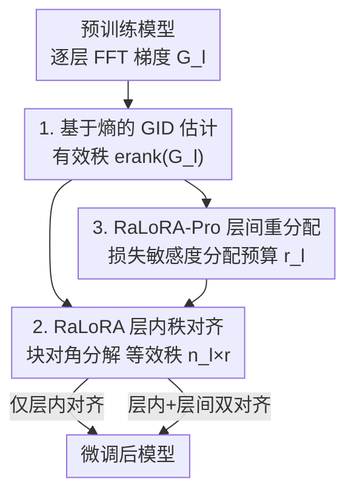

# Gradient Intrinsic Dimensionality Alignment: 弥合 LoRA 与全量微调之间的鸿沟

**会议**: ICLR 2026  
**OpenReview**: [https://openreview.net/forum?id=kObvnQ6pUx](https://openreview.net/forum?id=kObvnQ6pUx)  
**代码**: 无  
**领域**: 模型压缩 / 参数高效微调  
**关键词**: LoRA, PEFT, 梯度内在维度, 有效秩, 秩对齐

## 一句话总结
本文指出 LoRA 与全量微调（FFT）性能差距的根本原因是 LoRA 的低秩子空间维度远小于 FFT 梯度真正有效的更新方向数（梯度内在维度 GID，二者最多差 100 倍），并提出用基于熵的估计器度量逐层 GID，再用 RaLoRA / RaLoRA-Pro 在不增加参数量的前提下把 LoRA 的等效秩对齐到 GID，从而在 GLUE、GSM8K、HumanEval、MT-Bench 和图像分类上一致逼近甚至超过 FFT。

## 研究背景与动机
**领域现状**：在算力受限场景下微调大模型，参数高效微调（PEFT）已成为主流，其中 LoRA 凭借「只训练低秩矩阵 $A、B$、推理零延迟、实现简单」成为最常用的方法。它用 $\Delta W = \frac{\alpha}{r}BA$ 近似权重更新，其中 $A\in\mathbb{R}^{r\times d_{in}}$、$B\in\mathbb{R}^{d_{out}\times r}$，秩 $r\ll\min\{d_{in},d_{out}\}$。

**现有痛点**：在数学推理、代码生成这类复杂任务上，LoRA 始终明显落后于全量微调。围绕这个差距，社区提出了三类变体——秩增强（跨层重分配秩 / 堆叠多个 LoRA）、训练动态优化（稳定缩放因子、给 $A、B$ 分别设学习率、解耦方向与幅度）、改进初始化（主奇异分量、QR 正交初始化）。但这些方法都没碰到差距的根源。

**核心矛盾**：作者把 LoRA adapter 理解为一个「隐式梯度压缩器」——在第 $t$ 步它把完整梯度 $G_t$ 投影到一个低秩子空间：$\Delta(BA)\approx -\eta\,(B_tB_t^\top G_t + G_t A_t^\top A_t)$。于是 LoRA 的秩同时决定了它的梯度压缩率和表达力。而 FFT 梯度真正有效的更新方向（本文定义为**梯度内在维度 GID**）通常占据一个大得多的子空间（高达 300，甚至 30–1000），却被 LoRA 固定成 8 这样的小秩硬压下去，造成严重信息损失。这个「子空间维度错配」才是性能短板的本质，而它一直被忽视。

**本文目标**：拆成两个子问题——(1) 如何准确估计每一层的梯度内在维度（此前几乎无人研究）；(2) 如何在固定参数预算内设计「把 LoRA 秩对齐到 GID」的策略。

**切入角度**：借用信号处理中的「有效秩（effective rank）」概念——用奇异值分布的香农熵来连续、稳健地刻画矩阵的内在维度，而不依赖人为阈值。作者是第一个把有效秩引入「梯度矩阵内在维度估计」并服务于 LoRA 的工作。

**核心 idea**：先用基于熵的估计器量出逐层 GID，再让 LoRA 的等效秩自适应对齐到 GID（高维层多分块、低维层退化为普通 LoRA），并在参数总量不变的前提下，进一步按层重要性在层间重新分配预算。

## 方法详解

### 整体框架
方法围绕「估计 GID → 层内秩对齐 → 层间预算重分配」三步展开。给定一个待微调的预训练模型，首先用基于熵的估计器对每一层的 FFT 梯度算出梯度内在维度 GID；RaLoRA 据此把该层的 LoRA 通过块对角分解拆成若干 mini-block，使等效秩从 $r$ 放大到 $n_l\times r$，但参数量保持 $r(d_{in}+d_{out})$ 不变——这是**层内（intra-layer）对齐**。RaLoRA-Pro 在此之上加一层**层间（inter-layer）重分配**：用损失敏感度（重要性分数）把固定的总参数预算按比例分给各层，让重要的层拿到更高的秩，再在每层内部按 RaLoRA 做秩对齐，实现层内几何对齐 + 层间容量分配的「双重对齐」。

### 关键设计

**1. 基于熵的梯度内在维度（GID）估计器：把「该用多大秩」从拍脑袋变成可度量**

最朴素的内在维度估计是对梯度 $G$ 做 SVD、数有多少个奇异值超过阈值 $\varepsilon$（$\mathrm{rank}(G)=\max\{i\mid\sigma_i>\varepsilon\}$），但它对 $\varepsilon$ 极其敏感，跨层跨任务时不稳健。作者改用源自「有效秩」的熵度量：把奇异值归一化成分布 $p_i=\sigma_i/\sum_j\sigma_j$，再取分布熵的指数

$$\mathrm{erank}(G_l)=\exp\!\Big(-\sum_{i=1}^{n}p_i\log p_i\Big).$$

直觉上，当奇异值能量集中在少数方向时熵小、有效秩小；当能量铺散到很多方向时熵大、有效秩大——它连续地量出「梯度真正动用了多少个自由度」，且无需阈值、对超参不敏感。这个估计器是整套方法的地基：它第一次让人看到 FFT 梯度的内在维度跨 30–1000、且和任务复杂度正相关（WizardLM≈404 > Code-Feedback≈269 > MetaMathQA≈178），从而把「LoRA 秩该设多大」从经验值变成可由梯度结构推出的量。它还与大多数 LoRA 变体正交，可单独嫁接到别的 PEFT 框架。

**2. RaLoRA：用块对角分解把等效秩对齐到 GID，且不增参数**

痛点是固定秩 $r$ 远小于 GID 时表达力被卡死。RaLoRA 不直接调大 $r$（那会增参数），而是采用结构化并行分解，把 $A、B$ 切成 $n_l$ 个 mini-block，拼成块对角更新矩阵 $\mathrm{diag}(B_1A_1,\dots,B_{n_l}A_{n_l})$，其中 $A_i\in\mathbb{R}^{r\times(d_{in}/n_l)}$、$B_i\in\mathbb{R}^{(d_{out}/n_l)\times r}$。块数由该层 GID 决定：

$$e_l=\Big\lfloor\log_2\frac{\mathrm{erank}(G_l)}{r}\Big\rfloor,\qquad n_l=2^{e_l},\quad 1\le n_l\le n_{\max}.$$

取 2 的幂是为了整除输入/输出维度，$n_{\max}$ 作上界保稳定。关键在于：这样做把等效秩从 $r$ 扩到 $n_l\times r$，而参数量仍是 $r(d_{in}+d_{out})$ 不变——因为每个块的维度同步缩小了。它之所以有效，是因为「表达力不只取决于参数量，也取决于架构结构」：GID 低的层 $n_l$ 退化为 1（等价普通 LoRA、聚焦主方向），GID 高的层增大 $n_l$，用更细粒度换取跨多个梯度子空间的更广表达力。RaLoRA 因此是 LoRA 的一个自然推广。

**3. RaLoRA-Pro：用损失敏感度做层间预算重分配，实现层内+层间双对齐**

RaLoRA 只在层内对齐，但不同层的重要性差异很大，一刀切给每层同样的预算并不划算。RaLoRA-Pro 先按损失敏感度算每层的重要性分数 $I(W_l)=\mathrm{avg}(|W_l\odot G_l|)$（权重与梯度逐元素积的均值，刻画该层参数对损失的平均影响），归一化得 $\alpha_l=I_l/\sum_k I_k$。在保持可训练参数总量 $P_{total}=\sum_l(\sqrt{d_{in}^l+d_{out}^l})\,r_{ref}$ 不变（用维度平滑消除不同模块特征维带来的偏置）的约束下，把预算按 $\alpha_l$ 比例分回各层，得到层级秩

$$r_l=\Big\lfloor\frac{P_{total}\cdot\alpha_l}{\sqrt{d_{in}^l+d_{out}^l}}\Big\rfloor,\qquad r_{\min}\le r_l\le r_{\max}.$$

拿到 $r_l$ 后，再在每层内部按设计 2 做 GID 秩对齐。这样就同时做到了层间（按重要性分容量）和层内（按 GID 对齐几何）的双重对齐。与「只靠敏感度分配秩」的既有方法不同，RaLoRA-Pro 是第一个把「层间参数重分配」和「层内几何自适应」统一起来的框架，让分到的容量在结构上真正匹配 FFT 的有效更新方向。

### 损失函数 / 训练策略
方法不改训练损失，只改 LoRA 的结构与秩分配；GID 估计、块数 $n_l$ 与层级秩 $r_l$ 在初始化阶段算定后即固定训练。NLU 用 T5-Base 在 GLUE 上微调，NLG 用 LLaMA-3.1-8B-Base 在 math/code/chat 上微调，图像分类用 CLIP-ViT-B/16，所有实验跑 3 个随机种子，LoRA 秩与参考秩 $r_{ref}$ 默认设为 8，各方法可训练参数量保持可比。

## 实验关键数据

### 主实验
GLUE（T5-Base，五个子集平均）与 NLG（LLaMA-3.1-8B-Base）上，RaLoRA / RaLoRA-Pro 在可比参数量下全面领先各类 LoRA 变体，部分指标甚至超过 FFT。

| 任务 | 指标 | LoRA | 最强变体基线 | RaLoRA | RaLoRA-Pro | FFT |
|------|------|------|------|------|------|------|
| GLUE | 平均 | 82.08 | 86.35 (MoRA) | 87.24 | 87.23 | 87.91 |
| MT-Bench | 分数 | 6.15 | 6.38 (MoRA) | 6.38 | **6.72** | 5.88 |
| GSM8K | acc | 67.78 | 71.29 (LoRA+) | 72.25 | **73.01** | 73.69 |
| HumanEval | pass | 43.09 | 45.78 (RSLoRA) | **48.78** | 48.37 | 51.63 |
| 图像分类 | 7 项平均 | 89.08 | 90.13 (MoRA) | 90.53 | **90.66** | — |

- 相比普通 LoRA：GLUE +5%、MT-Bench +0.57、GSM8K +5.23、HumanEval +5.69、图像分类 +1.58。
- GSM8K 上 RaLoRA-Pro 把与 FFT 的差距收窄了 88.5%；HumanEval 上 RaLoRA 把差距收窄了 66.6%；MT-Bench 上 RaLoRA-Pro 反超 FFT +0.84。
- QNLI、MRPC 等任务上本文方法用远少的参数就超过了 FFT。

### 消融 / 分析：不同秩下隔离两类对齐的贡献
作者把「只做层间敏感度重分配的 LS-LoRA」单拎出来对照，在 rank 8/16/32/64 下隔离层内对齐与层间重分配的作用（LLaMA-3.1-8B-Base）。

| Rank | 方法 | GSM8K | HumanEval |
|------|------|------|------|
| 8 | LoRA | 67.78 | 43.09 |
| 8 | LS-LoRA（仅层间） | 70.15 | 39.83 |
| 8 | RaLoRA（仅层内） | 71.42 | 47.76 |
| 8 | RaLoRA-Pro（双对齐） | 72.23 | 46.95 |
| 64 | LoRA | 67.17 | 43.29 |
| 64 | RaLoRA | 74.55 | 51.22 |
| 64 | RaLoRA-Pro | **75.23** | **52.24** |

### 关键发现
- **层内 GID 对齐（RaLoRA）是主力**：在所有秩、所有任务上都稳超普通 LoRA，尤其 GSM8K 与 HumanEval 提升最大，证实「秩对齐到 GID」直接补回了表达力。
- **层间重分配（RaLoRA-Pro 相对 LS-LoRA）锦上添花**：双对齐在高秩时优势更明显；而单独的 LS-LoRA 在 HumanEval（rank 8）上甚至掉到 39.83，说明只按敏感度分秩、不做层内几何对齐反而可能有害，必须两者结合。
- **GID 与任务复杂度强相关且随训练演化**：估计的 GID 跨 30–1000，指令多样性高的 WizardLM(≈404) > Code-Feedback(≈269) > MetaMathQA(≈178)；训练中 GID 先快速上升后趋稳，且持续远超典型 LoRA 秩——这正解释了 LoRA 与 FFT 的差距来源。
- **逐层异质性显著**：GID 在不同层差异很大，验证了「逐层自适应分秩」比全局统一设秩更合理。

## 亮点与洞察
- **把 LoRA 看作「梯度压缩器」是全文的支点**：从这个视角自然推出「秩 = 压缩率 = 表达力上界」，再引出「压缩率该匹配梯度真实自由度（GID）」，逻辑非常顺，把一个被忽视的错配讲成了可度量、可对齐的问题。
- **熵/有效秩做内在维度估计，免阈值且稳健**：相比 SVD 数阈值，用奇异值分布熵的指数来量自由度，是个可复用的小工具，能直接嫁接到别的 PEFT 方法上去指导分秩。
- **「不增参数、只改结构」扩等效秩**：块对角分解让等效秩翻 $n_l$ 倍而参数量不变，这种「用结构换表达力」的思路对任何受参数预算约束的适配场景都有借鉴价值。
- **双对齐分层分配**：层间按重要性分预算、层内按 GID 对齐几何，两个维度正交又互补，给「固定预算下怎么把容量花在刀刃上」提供了一个干净的框架。

## 局限与展望
- GID 估计依赖逐层 FFT 梯度，需要先反传拿到完整梯度做 SVD，相比纯 LoRA 多了一笔估计开销，论文未充分讨论其在超大模型上的可扩展成本。
- 块数 $n_l=2^{e_l}$ 被限制为 2 的幂以整除维度，是一种离散近似，可能在某些层与真实 GID 不完全贴合；$n_{\max}$、$r_{\min}/r_{\max}$ 等上下界仍是需要设定的超参。
- 评测集中在 T5-Base / 8B 量级与标准 benchmark，对更大模型、更长训练下 GID 动态是否仍稳定、对齐收益是否持续，尚需进一步验证。
- 改进方向：把 GID 估计做成训练中在线自适应（而非初始化一次定死），或与训练动态优化类变体（DoRA、LoRA+）联合，看正交收益能否叠加。

## 相关工作与启发
- **vs 秩增强类（AdaLoRA / MELoRA / MoRA）**：它们靠重要性分数跨层重分配秩或堆叠多个 LoRA 提升等效秩，但分秩依据是「重要性」而非梯度真实自由度；本文先量出 GID 再对齐，且 RaLoRA-Pro 把层间重分配与层内几何对齐统一，目标更本质。
- **vs 训练动态类（DoRA / LoRA+ / RSLoRA）**：它们改的是学习率、缩放、方向/幅度解耦等优化层面，不触及子空间维度错配；本文与之正交，理论上可叠加。
- **vs 改进初始化类（PiSSA / OLoRA）**：它们用主奇异分量或 QR 正交基加速收敛，仍在固定秩内打转；本文直接放大等效秩去匹配 GID，解决的是表达力上界而非起点。
- **vs 有效秩既有应用**：有效秩此前用于信号处理降维、自监督评估（RankMe）、扩散模型嵌入质量等；本文首次把它用作「梯度矩阵内在维度」的估计器，开辟了 LoRA 分秩的新依据。

## 评分
- 新颖性: ⭐⭐⭐⭐⭐ 把 LoRA-FFT 差距归因到「梯度内在维度错配」并用有效秩量化、对齐，视角新且自洽。
- 实验充分度: ⭐⭐⭐⭐ 覆盖 NLU/NLG/视觉三类任务、多秩消融、GID 表征分析，但模型规模与训练时长有限。
- 写作质量: ⭐⭐⭐⭐⭐ 从「梯度压缩器」支点一路推导到双对齐，逻辑链清晰、图表到位。
- 价值: ⭐⭐⭐⭐⭐ 估计器与块对角对齐都可复用、与多数变体正交，对 PEFT 社区有较强实用价值。

<!-- RELATED:START -->

## 相关论文

- [\[ICLR 2026\] GAPrune: Gradient-Alignment Pruning for Domain-Aware Embeddings](gaprune_gradient-alignment_pruning_for_domain-aware_embeddings.md)
- [\[ICLR 2026\] IGU-LoRA: Adaptive Rank Allocation via Integrated Gradients and Uncertainty-Aware Scoring](igu-lora_adaptive_rank_allocation_via_integrated_gradients_and_uncertainty-aware.md)
- [\[ICML 2025\] Make LoRA Great Again: Boosting LoRA with Adaptive Singular Values and Mixture-of-Experts Optimization Alignment](../../ICML2025/model_compression/make_lora_great_again_boosting_lora_with_adaptive_singular_values_and_mixture-of.md)
- [\[ICLR 2026\] CAR-LoRA: Training Compression-Aware and Robust LoRA Adapters for Evolving LLMs](car-lora_training_compression-aware_and_robust_lora_adapters_for_evolving_llms.md)
- [\[ICLR 2026\] E²LoRA: Efficient and Effective Low-Rank Adaptation with Entropy-Guided Adaptive Sharing](e²lora_efficient_and_effective_low-rank_adaptation_with_entropy-guided_adaptive_.md)

<!-- RELATED:END -->
