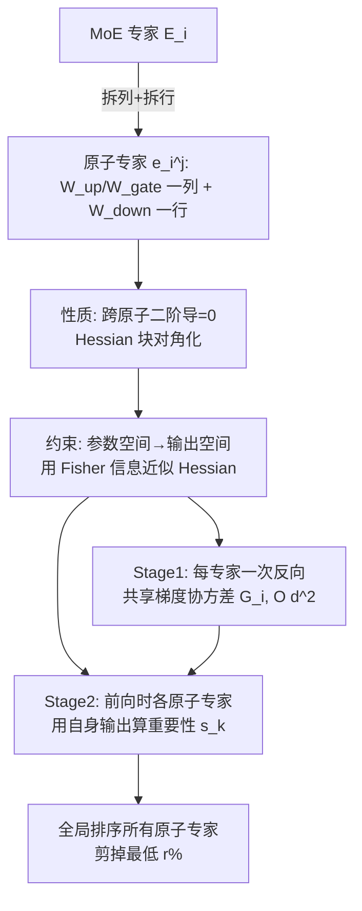

# HEAPr: Hessian-based Efficient Atomic Expert Pruning in Output Space

**会议**: ICLR 2026  
**OpenReview**: [https://openreview.net/forum?id=JAbMgS7gl6](https://openreview.net/forum?id=JAbMgS7gl6)  
**代码**: [https://github.com/LLIKKE/HEAPr](https://github.com/LLIKKE/HEAPr)  
**领域**: 模型压缩 / MoE 剪枝  
**关键词**: Mixture-of-Experts, 模型剪枝, Optimal Brain Surgeon, 二阶信息, 原子专家  

## 一句话总结
HEAPr 把 MoE 的每个专家拆成不可再分的"原子专家"（W_up/W_gate 的一列 + W_down 的一行），用 Optimal Brain Surgeon 的二阶信息衡量每个原子专家的重要性，并通过"参数空间→输出空间"的两步化简把 Hessian 存储复杂度从 $O(d^4)$ 降到 $O(d^2)$，只需两次前向 + 一次反向即可在小校准集上对全模型原子专家做全局排序剪枝，在 20%~25% 剪枝比下接近无损。

## 研究背景与动机
**领域现状**：MoE 用稀疏激活换来了"算得少"，但所有专家参数都得常驻显存——DeepSeek-V3 推理只激活 37B，却要存满 671B，MoE 层占了模型 97%+ 的参数，成了部署的存储瓶颈。因此压缩 MoE 层成为让大模型落地资源受限设备的关键。

**现有痛点**：剪枝长期卡在一个权衡上——细粒度剪枝（参数稀疏化）保精度但硬件加速有限，粗粒度剪枝直接加速却掉点明显。于是研究转向**专家级剪枝**，但它有两条路都不干净：(1) 专家丢弃（NAEE 等）直接删整个专家，容易丢掉互补的专长知识；(2) 专家合并（MC-SMoE / HC-MoE）想把功能相似的专家融合，但聚类相似度本身不稳定，平均/按频率加权又会引入破坏性的参数冲突；后来的分解式方法（D2-MoE / Sub-MoE）把专家拆成共享+特化分量来缓解冲突，却要昂贵的分解与合并，且仍有不可忽略的精度损失。

**核心矛盾**：专家级是当前最粗的剪枝单元，一删就是一整块，精度损失难以避免；而想用更细的单元又要面对 Hessian 二阶信息在专家级高达 $O((3d_{model}\cdot d_{inter})^2)$ 的天文存储开销。**剪枝粒度的灵活性**和**二阶信息的可计算性**互相打架。

**本文目标**：找到比"整个专家"更灵活的剪枝单元，同时让衡量其重要性的二阶信息在算力和存储上都可承受，做到无需重训练的高性能剪枝。

**核心 idea**：**【拆原子 + 换空间】**——把专家分解成"原子专家"这一不可再分的最小单元，利用原子专家之间二阶导数为零的解耦性质砍掉跨原子的 Hessian 项；再把剪枝约束从参数空间搬到输出空间，借助 Fisher 信息矩阵把每个原子专家的重要性化简为输出层面的二阶量，最终只用标准的前向/反向就能算出来。

## 方法详解

### 整体框架
HEAPr 先把 MoE 每个专家在数学上写成若干"原子专家"之和，证明不同原子专家的参数二阶解耦；然后把"删除某原子专家"的约束从"参数置零"重写为"输出置零"，从而用输出空间的 Fisher 信息（梯度协方差）来近似 OBS 的损失增量。实际计算分两阶段：每个专家做一次反向得到共享的输出梯度协方差矩阵 $\bar{G}_i$，再在前向时用各原子专家各自的输出算出重要性分数，最后跨所有 MoE 层做**全局排序**，剪掉分数最低的 $r\%$。

### 关键设计

**1. 原子专家分解：把专家写成可单独切除的最小单元。** 一个 gated FFN 专家 $E_i(x)=W^{down}_i[\text{SiLU}(W^{gate}_i x)\odot(W^{up}_i x)]$ 中，作者把 $W^{up}_i$、$W^{gate}_i$ 的第 $j$ 行和 $W^{down}_i$ 的第 $j$ 列绑成一个原子专家 $e_i^{(j)}(x)=w^{down}_{i,j}[\text{SiLU}(w^{gate}_{i,j}x)\cdot(w^{up}_{i,j}x)]$，于是整个专家就是这些原子专家的线性叠加 $E_i(x)=\sum_{j=1}^{d_{inter}} e_i^{(j)}(x)$。这一分解的价值在于：剪掉一个原子专家相当于去掉中间维度的一个 slice，对其余原子专家的结构毫无干扰，既比专家级灵活得多，又天然对硬件友好（直接缩小矩阵维度，能真加速、真省显存），不像参数稀疏化那样靠不规则稀疏吃不到硬件红利。

**2. 块对角化 Hessian：跨原子专家二阶导为零。** 直接在专家级套用 OBS，Hessian 空间复杂度高达 $O((3d_{model}\cdot d_{inter})^2)$，根本存不下。作者发现原子专家之间参数解耦：$\frac{\partial^2 E(x)}{\partial\Theta^{(i)}\partial\Theta^{(j)}}=0,\ \forall i\neq j$，也就是不同原子专家的交叉 Hessian 全为零。于是损失的二阶 Taylor 展开退化成各原子专家自身 Hessian 的求和 $\Delta\ell\approx\frac{1}{2}\sum_{i=1}^{d_{inter}}(\delta\Theta^{(i)})^TH^{(i)}\delta\Theta^{(i)}$，把求和后的复杂度从 $O((3d_{model}\cdot d_{inter})^2)$ 降到 $O((3d_{model})^2\cdot d_{inter})$——这是第一次量级削减，让问题从"完全不可算"变成"仍偏大但有结构可挖"。

**3. 输出空间重写：用 Fisher 信息把重要性变成可前向算的量。** 块对角化后存储仍嫌大，作者做第二步关键化简：OBS 原始约束（公式 2）要求被剪原子专家"对所有输入 $x$ 参数置零"，作者把它等价改写为"该原子专家的**输出**置零"。这一搬家让重要性分析落到输出空间，从而可以引入 Fisher 信息矩阵——它在理论上等价于期望 Hessian，但计算上高效得多——再配合对原子专家函数的 Taylor 展开估计其对最终损失的贡献，把每个专家的复杂度进一步压到 $O(d_{model}^2)$。这一步是 HEAPr 名字里 "in Output Space" 的由来，也是它区别于以往参数空间 OBS 方法的本质所在。

**4. 两阶段高效估计 + 全局排序。** 落地为算法时分两步：**Stage 1（梯度协方差）**——同一专家内所有原子专家共享对输出的梯度，因此只需一次反向得到 $g_{E_i}=\partial\ell/\partial E_i$，在路由到该专家的 token 子集 $T_i$ 上累积出共享协方差 $\bar{G}_i=\frac{1}{|T_i|}\sum_{x\in T_i}g_{E_i}(x)g_{E_i}(x)^\top$，存储仅 $O(d_{model}^2)$；**Stage 2（重要性计算）**——前向时虽然 $\bar{G}_i$ 共享，但各原子专家输出 $e_k(x)$ 不同，故 $\bar{s}_k=\frac{1}{|T_i|}\sum_{x\in T_i}\frac{1}{2}e_k(x)^\top\bar{G}_i e_k(x)$ 能区分各自贡献。由于该重要性度量直接对应"对整个模型损失的贡献"，可以跨层做**全局排序**，统一剪掉全模型最低 $r\%$ 的原子专家，而非按层各剪一刀。整套流程只需两次前向 + 一次反向、无需任何重训练。

## 实验关键数据

### 主实验（七项 zero-shot 任务平均准确率，越高越好；Wiki/PTB 困惑度越低越好）
覆盖 DeepSeekMoE-16B-Base、Qwen1.5-MoE-A2.7B-Chat、Qwen2-57B-A14B、Qwen3-30B-A3B：

| 模型 | 剪枝比 | 方法 | Wiki↓ | PTB↓ | Avg.↑ |
|------|--------|------|-------|------|-------|
| DeepSeekMoE-16B | 0% | Original | 6.38 | 9.47 | 0.56 |
| | 20% | NAEE | 9.44 | 15.02 | 0.53 |
| | 20% | D2-MoE | 6.84 | 11.10 | 0.54 |
| | 20% | **HEAPr** | **6.54** | **9.88** | **0.56** |
| | 40% | D2-MoE | 7.93 | 14.07 | 0.49 |
| | 40% | **HEAPr** | **6.80** | **10.86** | **0.53** |
| Qwen1.5-MoE | 0% | Original | 8.12 | 12.97 | 0.54 |
| | 25% | Sub-MoE | 9.48 | 14.84 | - |
| | 25% | **HEAPr** | **8.31** | 14.12 | **0.53** |

- DeepSeekMoE-16B 在 **20% 剪枝下平均精度 0.56，与原模型持平**（接近无损），且 Wiki 困惑度 6.54 vs 原始 6.38 几乎不变。
- 40% 高剪枝比下 HEAPr 仍达 0.53，明显领先 D2-MoE 的 0.49、NAEE 的 0.46。
- 最新 Qwen3-30B-A3B 在 25% 剪枝比下平均精度仅下降 **0.03**；整体在 20%~25% 接近无损，同时减少约 **20% FLOPs**。

### 消融实验
**全局 vs 层内排序**（DeepSeekMoE-16B-Base，七任务平均）：

| 剪枝比 | 方法 | Average |
|--------|------|---------|
| 20% | CAMERA-P（层内） | 59.52 |
| 20% | HEAPr-L（层内） | 60.03 |
| 20% | **HEAPr-G（全局）** | **60.68** |
| 40% | CAMERA-P（层内） | 56.87 |
| 40% | HEAPr-L（层内） | 56.99 |
| 40% | **HEAPr-G（全局）** | 更优 |

- 即便退化到层内排序，HEAPr-L 也已优于同为层内的 CAMERA-P，说明**原子专家 + 输出空间重要性度量**本身就更准。
- 全局排序（HEAPr-G）进一步把 20% 平均分从 60.03 提到 60.68，验证了"跨层统一比较、把剪枝预算花在全模型最不重要的原子专家上"的价值。

### 关键发现
- **粒度即收益**：从"整个专家"细化到"原子专家"，剪枝效应被隔离，不再误伤互补专长，是接近无损的根本原因。
- **输出空间是可计算性的关键**：两步化简把二阶信息从 $O(d^4)$ 压到 $O(d^2)$，让 OBS 思想第一次能在 16B~57B 级 MoE 上实用。
- 全程**免重训练**，仅需小校准集上两前向一反向，部署成本极低。

## 亮点与洞察
- **把"专家"再拆一层的视角很漂亮**：原子专家是 gated FFN 中间维度的自然切片，分解后专家恰为其线性和，使得"删一个原子专家=缩一维"既数学干净又硬件友好。
- **两次复杂度削减环环相扣**：先用块对角性质（跨原子二阶导为零）砍掉绝大多数 Hessian 项，再用输出空间 + Fisher 信息把单专家压到 $O(d^2)$，二阶剪枝理论与工程效率被同时照顾到。
- **共享梯度的工程巧思**：同一专家内所有原子专家共享对输出的梯度，所以一次反向算一个专家，避免了逐原子专家的冗余反向，是"两前向一反向"得以成立的关键。
- **全局排序优于层内**：把重要性度量锚定到"对整体损失的贡献"，让跨层比较有了统一标尺，比传统逐层等比例剪枝更合理。

## 局限与展望
- 评估集中在 zero-shot 语言理解与困惑度，对生成质量、长链推理、代码/数学等更难任务的退化未充分展开。
- 重要性基于小校准集估计，校准集分布与下游任务不匹配时可能影响剪枝选择的鲁棒性（论文未深入讨论校准集敏感性）。
- 方法面向 gated FFN 形态的 MoE，对共享专家、细粒度专家或其它路由结构（如带共享专家的 DeepSeek-V3 式架构）的适配仍需验证。
- 仅做剪枝、不含恢复式微调，更激进剪枝比（如 50%+）下的精度仍会明显下滑，与可选的轻量微调如何结合是自然的延伸方向。

## 相关工作与启发
- **OBS 谱系**：HEAPr 延续 Optimal Brain Surgeon / Optimal Brain Damage 用二阶 Taylor 展开衡量剪枝损失增量的思想，并接续 K-FAC、layer-wise Hessian（GPTQ/SparseGPT 系）、Fisher 信息近似（WoodFisher）等"让二阶可算"的路线，把它们首次系统地用到 MoE 原子粒度。
- **MoE 压缩对照**：相比专家丢弃（NAEE）、专家合并（MC-SMoE/HC-MoE/EEP）、分解式（D2-MoE/Sub-MoE/MoE-I²），HEAPr 不做聚类、不做权重合并、不需重训练，靠更细的剪枝单元 + 原理化的重要性度量取胜。
- **启发**：当某种结构（这里是原子专家）能让 Hessian 块对角化时，"换一个空间（参数→输出）重写约束 + 借 Fisher 信息近似"是把昂贵二阶方法工程化的通用配方，可迁移到 attention 头、低秩分量等其它结构化剪枝场景。

## 评分
- **新颖性**: ⭐⭐⭐⭐ — "原子专家"这一剪枝单元 + 参数空间到输出空间的二阶信息重写，把经典 OBS 在 MoE 上首次做到可用，视角清晰、推导自洽。
- **实验充分度**: ⭐⭐⭐⭐ — 覆盖 DeepSeek/Qwen 四个 16B~57B MoE、多剪枝比、七项任务，并有全局 vs 层内消融；但缺生成/推理类难任务与校准敏感性分析。
- **写作质量**: ⭐⭐⭐⭐ — 动机—矛盾—两步化简的逻辑链条流畅，复杂度推导和算法伪代码交代清楚。
- **价值**: ⭐⭐⭐⭐ — 免重训练、两前向一反向即可在 20%~25% 接近无损并省约 20% FLOPs，对 MoE 大模型落地部署有直接实用价值，且代码开源。

<!-- RELATED:START -->

## 相关论文

- [\[ICLR 2026\] Expert Merging: Model Merging with Unsupervised Expert Alignment and Importance-Guided Layer Chunking](expert_merging_model_merging_with_unsupervised_expert_alignment_and_importance-g.md)
- [\[ICLR 2026\] SERE: Similarity-based Expert Re-routing for Efficient Batch Decoding in MoE Models](sere_similarity-based_expert_re-routing_for_efficient_batch_decoding_in_moe_mode.md)
- [\[ICLR 2026\] PiCa: Parameter-Efficient Fine-Tuning with Column Space Projection](pica_parameter-efficient_fine-tuning_with_column_space_projection.md)
- [\[ICLR 2026\] SSDi8: Accurate and Efficient 8-bit Quantization for State Space Duality](ssdi8_accurate_and_efficient_8-bit_quantization_for_state_space_duality.md)
- [\[ICLR 2026\] Steering MoE LLMs via Expert (De)Activation](steering_moe_llms_via_expert_deactivation.md)

<!-- RELATED:END -->
