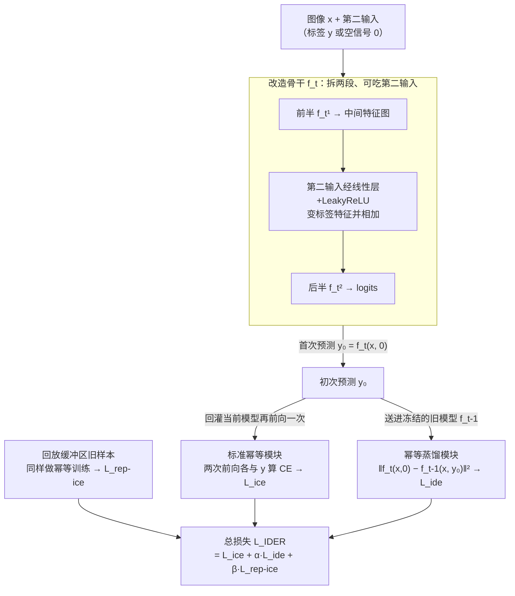

# IDER: IDempotent Experience Replay for Reliable Continual Learning

**会议**: ICLR 2026  
**arXiv**: [2603.00624](https://arxiv.org/abs/2603.00624)  
**代码**: [GitHub](https://github.com/YutingLi0606/Idempotent-Continual-Learning)  
**领域**: 模型压缩  
**关键词**: 持续学习, 幂等性, 经验回放, 校准误差, 灾难性遗忘

## 一句话总结
将幂等性（idempotence）引入持续学习，通过标准幂等模块和幂等蒸馏模块两个组件强制模型在学习新任务时保持输出自一致性，在提升预测可靠性（降低校准误差）的同时显著减少灾难性遗忘。

## 研究背景与动机
持续学习面临灾难性遗忘这一核心挑战——模型在学习新任务时迅速丢失旧任务知识。基于回放的方法（如ER、DER++）通过缓冲区存储旧样本来缓解，但这些方法通常过度自信且校准不良（ECE高），尤其对近期任务存在偏见。在医疗、交通等安全关键领域，模型不仅要准确还要"知道自己不知道什么"。

现有不确定性感知的CL方法（如NPCL）使用神经过程但存在：(1)参数增长不可忽视；(2)与基于logits的回放方法不兼容（Monte Carlo采样的随机性）。因此需要一种**轻量且兼容**的原则来构建可靠的CL系统。

核心idea：幂等性——一个函数反复应用产生相同结果（$f(f(x)) = f(x)$）。如果模型在旧数据上保持幂等，说明输出落在学习到的稳定流形上，即模型做出了自一致的可靠预测。

## 方法详解

### 整体框架
IDER 想解决的是：基于回放的持续学习模型在学新任务时既会灾难性遗忘旧知识、又往往过度自信（校准误差高）。它的做法是把代数里的幂等性（idempotence，$f(f(x))=f(x)$）当成"预测自一致性"的约束写进训练。整条 pipeline 是：先把分类骨干改造成能"吃下自己的预测"（拆成前后两段、腾出第二输入位）；图像走一遍得到初次预测 $y_0$，再把 $y_0$ 分别回灌——一路喂回当前模型构成**标准幂等模块**（两次前向都要对得上 ground truth），一路送进冻结的上一阶段 checkpoint 构成**幂等蒸馏模块**（让初次预测朝旧模型认可的方向收敛）；回放缓冲区里的旧样本同样跑这套幂等训练。整体只需两次前向传播、几乎不加参数，可即插即用挂到 ER、BFP、CLS-ER 上。

### 关键设计

**1. 改造网络让它能"吃下自己的预测"：为幂等循环铺路**

幂等性要求把模型的输出再喂回模型，可标准分类网络只接受图像一个输入，没法把预测回灌进去。IDER 先改造骨干结构：把 ResNet 从中间切成前半 $f_t^1$ 和后半 $f_t^2$ 两段，腾出一个注入第二输入的位置。第二输入既可以是 one-hot 的真实标签 $y$，也可以是一个均匀分布的"空"信号 $\mathbf{0}$（表示"我还不知道标签"）；它先过一层线性层加 LeakyReLU，变换成和 $f_t^1$ 输出同维度的特征，加到中间特征图上再送进 $f_t^2$。这样一来，模型 softmax 后的 logits 自己就能当作第二输入再喂一遍——推理时没有真实标签，就用 $\mathbf{0}$ 跑出一次预测，再把这次预测回灌验证它是否稳定，幂等约束就有了落脚点。

**2. 标准幂等模块：把"预测两次都对得上"写进训练目标**

有了能循环的结构，第一步是让当前模型在当前任务上真正幂等。它最小化的是两次前向传播各自与 ground truth 的交叉熵之和：

$$\mathcal{L}_{ice} = \sum_{(x,y)\in\mathcal{T}_t} [\mathcal{L}_{ce}(f_t(x,y^*),y) + \mathcal{L}_{ce}(f_t(x,f_t(x,y^*)),y)]$$

其中第二输入 $y^*$ 以概率 $1-P$ 取 ground truth 标签、以概率 $P$ 取空信号 $\mathbf{0}$，让模型既见过"带标签提示"的情况、也见过"从零猜"的情况。训练收敛后，$f_t(x,\mathbf{0}) \approx y$ 给出第一次预测，再回灌一次仍有 $f_t(x,f_t(x,\mathbf{0})) \approx y$——预测落在稳定流形上、反复应用不变，这正是幂等所要的自一致性，也是模型"知道自己的答案靠谱"的信号。

**3. 幂等蒸馏模块：借冻结的旧模型当裁判，避免把错误越练越深**

只在当前模型上做幂等有个陷阱：如果直接最小化 $\|f_t(x,\mathbf{0}) - f_t(x,f_t(x,\mathbf{0}))\|^2$，由于 $f_t$ 对当前任务数据本身就有偏，它会把一个错误预测"自圆其说"地强化，越练越确信错的答案。IDER 的做法是把第二次前向传播交给冻结的上一阶段 checkpoint $f_{t-1}$ 来算：

$$\mathcal{L}_{ide} = \sum_{(x,y)\in\mathcal{T}_t,M} \|f_t(x,\mathbf{0}) - f_{t-1}(x,f_t(x,\mathbf{0}))\|_2^2$$

$f_{t-1}$ 被冻住，保留着旧任务的知识和一个稳定的预测分布，相当于一个不会被新数据带偏的裁判；优化只更新 $f_t$，逼着它的初次预测 $y_0$ 朝裁判认可的方向收敛，而不是自我强化。这一项既起到约束当前模型不让预测分布漂移、缓解对近期任务过度自信的作用，又顺带把旧模型的知识蒸馏进来，对抗灾难性遗忘。

### 损失函数 / 训练策略
总损失为三项加权和：$\mathcal{L}_{IDER} = \mathcal{L}_{ice} + \alpha\mathcal{L}_{ide} + \beta\mathcal{L}_{rep\text{-}ice}$，其中回放损失 $\mathcal{L}_{rep\text{-}ice}$ 在缓冲区数据上同样采用幂等训练loss。IDER可即插即用地集成到ER、BFP、CLS-ER等方法。

## 实验关键数据

### 主实验（Final Average Accuracy）

| 方法 | CIFAR-10 Buf200 | CIFAR-10 Buf500 | CIFAR-100 Buf500 | CIFAR-100 Buf2000 |
|------|----------------|----------------|-----------------|------------------|
| ER | 44.46 | 58.84 | 23.41 | 40.47 |
| DER++ | 62.19 | 70.10 | 37.69 | 51.82 |
| XDER | 64.10 | 67.42 | 48.14 | 57.57 |
| BFP | 68.64 | 73.51 | 46.70 | 57.39 |
| **ER+ID (Ours)** | **71.02** | **74.74** | 44.82 | 56.59 |
| **BFP+ID (Ours)** | **71.99** | **76.65** | **48.53** | **57.74** |

### GCIL消融（GCIL-CIFAR-100 Uniform）

| 方法 | Buf200 | 提升 | Buf500 | 提升 |
|------|--------|------|--------|------|
| ER | 16.34 | — | 28.76 | — |
| ER+ID | 26.66 | +10.32 | 40.54 | +11.78 |
| CLS-ER | 22.37 | — | 36.80 | — |
| CLS-ER+ID | 31.17 | +8.80 | 37.57 | +0.77 |

### 关键发现
- ER+ID 在CIFAR-10 Buf200上提升高达26%（44.46→71.02），是所有方法中提升最大的
- 幂等蒸馏有效缓解近期任务偏见，使不同任务的预测概率更均匀
- ECE（校准误差）在所有基线上一致降低，说明模型预测更"诚实"
- 在GCIL更具挑战性的设置中，提升更加明显（如CLS-ER+ID在Longtail设置中提升8.4%）

## 亮点与洞察
- 将代数中的幂等性直接映射为CL中"预测自一致性"的约束，数学直觉清晰且优雅
- 方法极其轻量——仅需一个额外前向传播和旧checkpoint，参数几乎无增长
- 即插即用特性使其成为增强现有CL方法可靠性的通用工具

## 局限与展望
- 需要保存旧任务checkpoint $f_{t-1}$，虽存储开销不大但增加了系统复杂性
- 实验均在ResNet-18上进行，在Transformer骨干和更大模型上的效果未知
- 幂等性假设的理论基础可进一步加强——为何幂等性必然导致更好的泛化？

## 相关工作与启发
- **vs NPCL**: NPCL使用神经过程带来参数增长且与logits方法不兼容，IDER轻量且通用
- **vs DER++**: DER++ 简单存储并匹配logits，IDER通过幂等约束提供更强的正则化

## 评分
- 新颖性: ⭐⭐⭐⭐⭐ 幂等性在CL中的应用是全新的视角
- 实验充分度: ⭐⭐⭐⭐⭐ CIL+GCIL+ECE+即插即用验证，非常全面
- 写作质量: ⭐⭐⭐⭐ 逻辑清晰，动机到方法的推导自然
- 价值: ⭐⭐⭐⭐ 为CL领域提供了新的数学原则和实用工具

<!-- RELATED:START -->

## 相关论文

- [\[ICLR 2026\] Sculpting Subspaces: Constrained Full Fine-Tuning in LLMs for Continual Learning](sculpting_subspaces_constrained_full_fine-tuning_in_llms_for_continual_learning.md)
- [\[ICLR 2026\] Quantized Gradient Projection for Memory-Efficient Continual Learning](quantized_gradient_projection_for_memory-efficient_continual_learning.md)
- [\[ICLR 2026\] Rethinking Continual Learning with Progressive Neural Collapse](rethinking_continual_learning_with_progressive_neural_collapse.md)
- [\[ICLR 2026\] Revisiting Weight Regularization for Low-Rank Continual Learning](revisiting_weight_regularization_for_low-rank_continual_learning.md)
- [\[ICCV 2025\] PLAN: Proactive Low-Rank Allocation for Continual Learning](../../ICCV2025/model_compression/plan_proactive_low-rank_allocation_for_continual_learning.md)

<!-- RELATED:END -->
