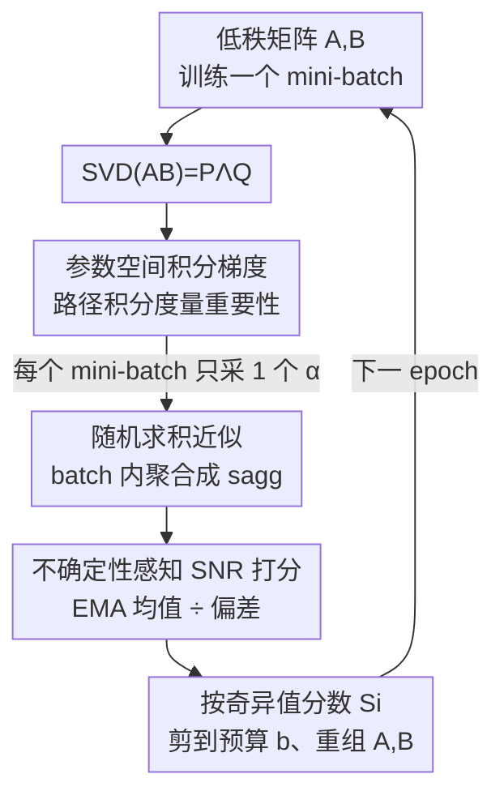

# IGU-LoRA: Adaptive Rank Allocation via Integrated Gradients and Uncertainty-Aware Scoring

**会议**: ICLR 2026  
**OpenReview**: [https://openreview.net/forum?id=MnToYQx9My](https://openreview.net/forum?id=MnToYQx9My)  
**代码**: https://github.com/withyou12/igulora.git  
**领域**: 模型压缩 / 参数高效微调  
**关键词**: LoRA, 自适应秩分配, 积分梯度, 不确定性感知, PEFT

## 一句话总结
针对 AdaLoRA 用瞬时梯度打分导致秩分配不稳的问题，IGU-LoRA 把"积分梯度（Integrated Gradients）"搬进参数空间来度量每个奇异值方向的重要性，再用 EMA 平滑 + 偏差跟踪算出一个信噪比式的不确定性感知分数来指导剪枝，在相同参数预算下稳定超过 LoRA / AdaLoRA / DoRA。

## 研究背景与动机
**领域现状**：大模型全参数微调成本太高，参数高效微调（PEFT）只更新一小撮任务相关参数、冻结底座，已成为主流。其中 LoRA 把权重更新 $\Delta W$ 写成两个低秩矩阵之积 $AB$，几乎不损性能又省参数，是被采用最广的方案。

**现有痛点**：原始 LoRA 给所有层用**统一的固定秩** $r$，但不同层、不同权重矩阵的"重要性"差异很大，一刀切既浪费预算又限制表达力。AdaLoRA 这类自适应秩方法对 $AB$ 做 SVD，按"重要性分数"动态裁掉冗余奇异值方向，但它的打分依赖**瞬时梯度敏感度** $|w_{ij}\nabla_{w_{ij}}\mathcal{L}|$。

**核心矛盾**：瞬时梯度只反映参数在当前点的**局部敏感性**，有三个硬伤——(1) 逐元素评估，忽略 LoRA 子空间内参数的结构化联合贡献；(2) 只看"此刻"对损失的影响，捕捉不到训练全程的累积贡献；(3) 在 ReLU 等激活的饱和区梯度直接消失，导致这些参数的重要性被误判为零。于是分数既不稳又有偏，秩分配自然次优。

**本文目标**：设计一种能捕捉**层内非局部、路径式累积贡献**的重要性度量，并抑制随机采样带来的打分方差，从而让秩分配更稳、更准。

**切入角度**：作者借鉴可解释性里的积分梯度（IG）——IG 沿"基线 → 真实输入"的路径对梯度积分，天然绕过饱和区、满足 completeness 公理。作者把这套思路**从输入空间迁移到参数空间**：沿"零权重 → 训练后权重"的路径对损失梯度积分，就得到一个累积式的参数重要性。

**核心 idea**：用"参数空间积分梯度"代替"瞬时梯度"来给奇异值方向打分，再叠一层不确定性感知的信噪比分数来校准剪枝。

## 方法详解

### 整体框架
IGU-LoRA 建在 AdaLoRA 的 SVD-剪枝骨架上：对每层的低秩积 $AB$ 做 SVD 得到 $W = W_0 + P\Lambda Q$，其中 $\Lambda=\mathrm{diag}\{\lambda_1,\dots,\lambda_r\}$。初始把秩 $r$ 设得偏大（过参数化上界），训练中按重要性分数 $S_i$ 逐步剪掉冗余的奇异值三元组 $(\lambda_i, P_{:,i}, Q_{i,:})$，最终保留预算 $b$ 个。整篇论文的创新全在"$S_i$ 怎么算"上：把 AdaLoRA 里基于瞬时梯度的敏感度，换成参数空间积分梯度 + 不确定性感知的信噪比分数。

完整流程是一个"训练 → SVD → 逐 mini-batch 估 IG → 整 epoch 聚合 → EMA 平滑+不确定性 → 算 SNR 分 → 按分剪秩"的回环，每个 epoch 重复：

### 关键设计

**1. 参数空间积分梯度：用路径积分代替瞬时梯度**

针对"瞬时梯度只看局部、还会在饱和区消失"的痛点，作者把 IG 从输入空间搬到参数空间。给定权重项 $w_{ij}$，以零权重 $\Delta W^{(0)}=0$ 为基线，沿 $\alpha\in[0,1]$ 从基线插值到真实权重 $\Delta W$，对损失梯度做积分：

$$s_e(w_{ij}) = w_{ij}\int_{0}^{1}\frac{\partial \mathcal{L}(\alpha\Delta W)}{\partial w_{ij}}\,d\alpha.$$

这相当于把"这个参数从无到有、对损失的累积影响"沿整条路径加起来，而不是只看终点那一瞬的斜率。因为是对整条路径积分，即使某一段落在梯度饱和区（瞬时梯度≈0），其它路径段仍有信号，分数不会被误判为零；同时它在 SVD 子空间上聚合 $P$ 的列与 $Q$ 的行（见下文 $S_i$），捕捉了参数的结构化联合贡献，而非逐元素孤立打分。这是全文最核心的替换：把 AdaLoRA 的 $|w_{ij}\nabla_{w_{ij}}\mathcal{L}|$ 换成上面的路径积分。

**2. 随机求积近似：把 $O(N)$ 次前反传压成 batch 线性开销**

上面的积分在大模型里没有闭式解，常规做法是把 $[0,1]$ 离散成 $N$ 段、用复合梯形公式近似，但这要在 $N{+}1$ 个 $\alpha$ 点各做一次前向反向，对每个权重都是 $O(N)$ 次前反传，大模型根本扛不住。作者的解法是**随机求积**：每个 mini-batch 只从 $\{1/N,\dots,(N{-}1)/N\}$ 里**均匀采一个** $\alpha_k$，于是第 $p$ 个 mini-batch 的估计是

$$\hat{s}_e^{p}(w_{ij}) \approx \frac{|w_{ij}|}{2N}\Big(\frac{\partial\mathcal{L}(0)}{\partial w_{ij}} + 2\frac{\partial\mathcal{L}(\alpha_k\Delta W)}{\partial w_{ij}} + \frac{\partial\mathcal{L}(\Delta W)}{\partial w_{ij}}\Big),$$

再在一个 epoch 的 $M$ 个 mini-batch 上平均得到 $s_{agg}(w_{ij})=\frac{1}{M}\sum_{p}\hat{s}_e^{p}(w_{ij})$。这样积分的额外开销只是随 batch 线性增长，而非随离散步数 $N$ 翻倍。作者还给出了 Theorem 1：在路径式 Hessian-Lipschitz 假设下，该估计与精确 IG 之间的误差被界在 $O(N^{-2})$（离散化）$+\,O(M^{-1/2})$（采样）量级，这条界也反过来指导了求积预算（实验取 $N=20$）。

**3. 不确定性感知 SNR 打分：用信噪比抑制噪声、校准剪枝**

随机采样 + 复杂训练动态会让 $s_{agg}$ 的方差很大，单看它来剪秩并不可靠。作者再叠两条 EMA：一条平滑敏感度 $\bar{s}_e^{(t)} = \beta_1\bar{s}_e^{(t-1)} + (1-\beta_1)s_{agg}^{(t)}$ 表示参数对损失的**持续影响**；一条跟踪偏差 $\bar{U}^{(t)} = \beta_2\bar{U}^{(t-1)} + (1-\beta_2)\,|s_{agg}^{(t)}-\bar{s}_e^{(t)}|$ 度量跨 mini-batch 的**认知不确定性**。最终分数取两者之比，形如信噪比：

$$s_{snr}^{(t)}(w_{ij}) = \mathrm{SNR}_t = \frac{\bar{s}_e^{(t)}(w_{ij})}{\bar{U}^{(t)}(w_{ij}) + \epsilon}.$$

直觉很直接：分子大说明这个参数一贯强影响损失，分母小说明它波动小、信号可信，两者之比高的方向才该保留。这与 AdaLoRA 把敏感度和不确定性**相乘**的策略不同——消融里把比值换成 AdaLoRA 的乘式（IGU-LoRA-4）会掉点。每个奇异值方向的最终分数沿用 AdaLoRA 的聚合式 $S_i = s_\lambda(\lambda_i) + \frac{1}{d_1}\sum_k s_{snr}(P_{ki}) + \frac{1}{d_2}\sum_k s_{snr}(Q_{ik})$，其中 $s_\lambda(\lambda_i)=|\lambda_i|$，按 $S_i$ 排序保留 top-$b$ 个方向、重组回 $A\leftarrow P_{:,\pi_{1:b}}\tilde\Lambda^{1/2}$、$B\leftarrow\tilde\Lambda^{1/2}Q_{\pi_{1:b},:}^\top$。

### 损失函数 / 训练策略
不改训练目标，只改剪枝调度。指令微调任务初始秩 $r^{(0)}=32$，剪到平均秩 $r^{(1)}=16$（约 50% 缩减）；GLUE 沿用 AdaLoRA 设置 $r^{(0)}=2\to r^{(1)}=1$。$\alpha$ 从 $(0,1)$ 内 $N=20$ 个均匀点采样。秩剪枝在第 2~5 个 epoch 间、每 1/5 epoch 执行一次；剪完用早停（patience=10 步）微调恢复性能；推理用 beam width=3 的束搜索。每个任务跑 5 个随机种子、报中位数。

## 实验关键数据

### 主实验
GLUE（RoBERTa-large，约 0.33M 可训练参数，median over 5 seeds）：

| 方法 | CoLA(mcc) | SST-2 | MRPC | QQP | STS-B | MNLI | QNLI | RTE | Avg. |
|------|-----------|-------|------|-----|-------|------|------|-----|------|
| Full FT (355M) | 69.19 | 95.63 | 89.46 | 91.10 | 91.60 | 90.01 | 94.03 | 86.94 | 88.50 |
| LoRA | 68.71 | 94.84 | 89.71 | 90.26 | 91.63 | 90.34 | 93.87 | 85.56 | 88.12 |
| AdaLoRA | 70.04 | 95.62 | 90.34 | 90.37 | 91.57 | 90.18 | 94.29 | 87.06 | 88.68 |
| DoRA | 70.26 | 95.80 | 90.12 | 90.16 | 91.68 | 90.43 | 94.17 | 87.38 | 88.75 |
| AutoLoRA | 70.47 | 95.53 | 90.26 | 90.31 | 91.52 | 90.26 | 94.08 | 87.64 | 88.76 |
| **IGU-LoRA** | **71.93** | **96.17** | **90.69** | **90.68** | **91.95** | **90.76** | **94.72** | **88.46** | **89.42** |

CoLA 上 MCC 71.93%，比最优 baseline 高约 1.5%；RTE 比次优 AutoLoRA 高约 0.8% acc；平均分 89.42 全表第一，且参数量仅 0.33M。

数学 / 常识推理（Qwen-2.5-0.5B，8.8M 参数）：

| 方法 | BoolQ | ARC-e | ARC-c | GSM8K | AQuA | Avg. |
|------|-------|-------|-------|-------|------|------|
| Full FT (494M) | 81.74 | 74.82 | 54.98 | 34.64 | 48.72 | 58.98 |
| LoRA | 78.94 | 72.78 | 54.38 | 31.42 | 45.33 | 56.57 |
| AdaLoRA | 80.32 | 73.90 | 54.23 | 33.27 | 46.58 | 57.67 |
| GoRA | 79.24 | 71.20 | 51.91 | 32.07 | 45.81 | 56.04 |
| **IGU-LoRA** | **82.45** | 74.62 | **55.67** | 34.16 | **48.93** | **59.17** |

BoolQ / ARC-c / AQuA 取得 SOTA，平均 59.17 甚至略超 494M 全参微调（58.98），而只用 8.8M 参数。ARC-e / GSM8K 未夺第一但与全参微调相当。

### 消融实验
Qwen-2.5-0.5B 上 BoolQ / GSM8K：

| 配置 | BoolQ | GSM8K | Avg. | 说明 |
|------|-------|-------|------|------|
| **IGU-LoRA（完整）** | **82.45** | **34.16** | **58.31** | $N=20$ + SNR 比值打分 |
| IGU-LoRA-1 (w/o $\alpha$) | 81.87 | 33.76 | 57.82 | 去掉积分梯度 $\alpha$ 系数 |
| IGU-LoRA-2 ($N=10$) | 82.14 | 33.95 | 58.05 | 降低 $\alpha$ 候选分辨率 |
| IGU-LoRA-3 ($N=4$) | 82.02 | 33.83 | 57.93 | $\alpha$ 候选进一步降到 4 |
| IGU-LoRA-4 ($s_e=\bar{s}_e\cdot\bar{U}$) | 82.28 | 33.69 | 57.99 | 换成 AdaLoRA 乘式打分 |

去掉积分梯度 $\alpha$（退回瞬时梯度风格）掉得最多（58.31→57.82），证明 IG 路径积分是主要增益来源；把比值打分换成 AdaLoRA 乘式（IGU-LoRA-4）也掉点，说明信噪比式的不确定性校准确有必要。

效率对比（BoolQ，Qwen-2.5-0.5B）：IGU-LoRA 训练 0.87h、显存 10.32GB、推理速度 5.23 it/s，与 AdaLoRA（0.73h / 10.60GB）同量级、明显快于 DoRA（0.95h），推理显存/延迟与各 baseline 持平——精度提升几乎不带额外推理成本。

### 关键发现
- **积分梯度是核心增益**：去掉 $\alpha$ 系数（IGU-LoRA-1）平均掉 0.49 点，是消融里最大跌幅，验证"路径积分 > 瞬时梯度"的主张。
- **超参鲁棒**：$M$、$N$、$\beta_1$、$\beta_2$ 在较宽范围内表现稳定，$M$、$N$ 越大略好（更细粒度的 $\alpha$ 采样），$\beta_1$、$\beta_2$ 中等取值最优。
- **秩分配呈结构偏好**：自注意力里 Query / Key 投影最常被优先分配高秩，FFN 里 Up / Down 投影拿到最高秩；不同任务（BoolQ vs GSM8K）的秩分布差异明显，印证了任务自适应的必要性。
- **跨预算 / 跨底座稳赢**：初始秩预算从 2 到 64，IGU-LoRA 在所有设置下都超 LoRA / AdaLoRA / DoRA；换 Llama-2-7B / Llama-3-8B / DeepSeek-R1-Distill-Qwen-2.5-7B 仍领先 baseline。

## 亮点与洞察
- **把可解释性工具反过来用于"参数剪枝打分"**：IG 本是输入归因方法，作者迁到参数空间度量"哪个奇异值方向值得保留"，视角新颖且天然回避梯度饱和这一老问题。
- **随机求积是落地关键**：每个 mini-batch 只采一个 $\alpha$ 点，把 IG 的 $O(N)$ 前反传压成 batch 线性开销，并配 Theorem 1 的 $O(N^{-2})+O(M^{-1/2})$ 误差界给出预算依据——理论与可行性兼顾。
- **信噪比式打分可迁移**：用"EMA 均值 ÷ 偏差"做不确定性感知的重要性分数，这个 trick 不限于 LoRA，凡是需要"稳定地排序参数/通道/方向"的剪枝、结构搜索场景都可借鉴。

## 局限与展望
- **额外训练开销**：相比 LoRA（0.42h），IGU-LoRA 训练时间翻倍（0.87h），两阶段剪枝 + 每 mini-batch 多算一次 IG 点带来成本；虽与 AdaLoRA 同量级，但对超大规模训练仍是负担。
- **理论假设较强**：误差界依赖路径式 Hessian-Lipschitz / $g_{ij}$ 二阶连续可导且有界等假设，真实大模型损失面是否满足存疑，界更多是"指导预算"的定性参考。⚠️ 具体常数与适用性以原文 Appendix A 为准。
- **增益幅度有限**：多数任务相对 AdaLoRA / DoRA 的提升在 0.2%~1.5% 区间，部分任务（ARC-e、GSM8K）并非最优；在更大底座上的优势幅度也未充分展开（Table 5 仅给出"同样领先"的结论）。
- **改进方向**：可探索自适应选择 $\alpha$ 采样点（而非均匀采样）、把 IG 重要性直接用于"层间预算再分配"而不仅是层内剪枝。

## 相关工作与启发
- **vs AdaLoRA**：两者都用 SVD + 重要性分数动态剪秩，骨架一致。区别在打分——AdaLoRA 用瞬时梯度敏感度 + 敏感度×不确定性的乘式；IGU-LoRA 换成参数空间积分梯度 + 敏感度÷不确定性的信噪比式。IGU-LoRA 优势是更稳、能绕饱和区，劣势是多一份 IG 计算开销。
- **vs DoRA**：DoRA 把权重分解为幅值向量 $m$ 和方向矩阵 $V$ 解耦优化，是固定秩下的表达力增强；IGU-LoRA 走的是动态秩分配路线，两者正交，且 IGU-LoRA 训练更快（0.87h vs 0.95h）。
- **vs GoRA / AutoLoRA / SalientLoRA**：都试图自动决定秩——GoRA 用梯度驱动、AutoLoRA 用元学习、SalientLoRA 按参数显著性。IGU-LoRA 的差异化在于用"路径积分式的累积贡献"取代"瞬时/显著性"信号，并显式建模打分的不确定性。

## 评分
- 新颖性: ⭐⭐⭐⭐ 把积分梯度迁到参数空间做秩分配 + 信噪比式不确定性打分，组合新颖，但本质仍是 AdaLoRA 打分模块的替换。
- 实验充分度: ⭐⭐⭐⭐ 覆盖 GLUE + 推理任务、5 个底座、跨预算/效率/秩可视化/超参敏感，消融到位；增益幅度偏小是减分项。
- 写作质量: ⭐⭐⭐⭐ 动机—方法—理论—实验链条清晰，公式与算法完整。
- 价值: ⭐⭐⭐⭐ 即插即用替换 AdaLoRA 打分、推理零额外成本，对 PEFT 落地有实用价值。

<!-- RELATED:START -->

## 相关论文

- [\[ICLR 2026\] E²LoRA: Efficient and Effective Low-Rank Adaptation with Entropy-Guided Adaptive Sharing](e²lora_efficient_and_effective_low-rank_adaptation_with_entropy-guided_adaptive_.md)
- [\[ICLR 2026\] CAR-LoRA: Training Compression-Aware and Robust LoRA Adapters for Evolving LLMs](car-lora_training_compression-aware_and_robust_lora_adapters_for_evolving_llms.md)
- [\[ICLR 2026\] Stable-LoRA: Stabilizing Feature Learning of Low-Rank Adaptation](stable-lora_stabilizing_feature_learning_of_low-rank_adaptation.md)
- [\[ICLR 2026\] Ensembling Pruned Attention Heads for Uncertainty-Aware Efficient Transformers](ensembling_pruned_attention_heads_for_uncertainty-aware_efficient_transformers.md)
- [\[ACL 2026\] TLoRA: Task-aware Low Rank Adaptation of Large Language Models](../../ACL2026/model_compression/tlora_task-aware_low_rank_adaptation_of_large_language_models.md)

<!-- RELATED:END -->
