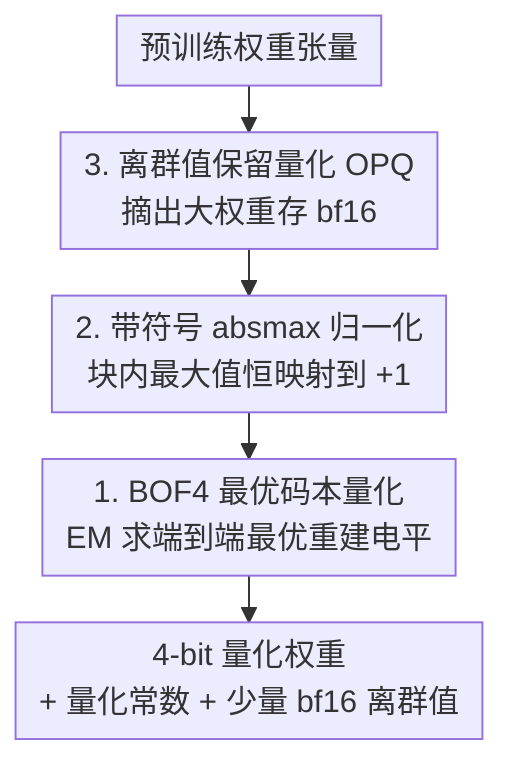

# Improving Block-Wise LLM Quantization by 4-bit Block-Wise Optimal Float (BOF4): Analysis and Variations

**会议**: ICLR 2026  
**OpenReview**: [https://openreview.net/forum?id=VpZ8YYdBmT](https://openreview.net/forum?id=VpZ8YYdBmT)  
**代码**: 无  
**领域**: 模型压缩  
**关键词**: 块级量化, 4-bit 量化, QLoRA, 最优码本, 离群值保留

## 一句话总结
本文重新审视 QLoRA 中常用的块级 absmax 量化（NF4 / AF4），用一个 Lloyd 式 EM 算法直接求解**端到端权重误差最优**的 4-bit 码本（BOF4），再配上「带符号归一化」（BOF4-S）和「离群值保留量化」（OPQ）两个简单改动，在三大 LLM 家族上把量化误差和困惑度都压到了 4-bit 块级量化方法里的最好水平。

## 研究背景与动机
**领域现状**：为了让 LLM 能在消费级 GPU 上做内存高效微调，QLoRA 把预训练权重压成 4-bit 再叠加 LoRA。其量化核心是**块级 absmax 量化**：把权重切成小块，每块用块内绝对值最大值 $w^{\max}_b$ 归一化到 $[-1,1]$，再用一个固定的 16 级标量码本（NF4 / AF4）去量化归一化后的权重。NF4 用假设的高斯分布分位数构造码本，AF4 则去直接最小化归一化权重的 MAE。

**现有痛点**：NF4 当年宣称码本"信息论最优"，理由是 16 个重建电平被等概率利用——但这个判据本身就站不住脚。等概率利用只对均匀分布输入才最优，对非均匀分布它根本不是率失真最优的。AF4 虽然纠正了一部分，但它优化的是**归一化权重** $x_{b,i}$ 的 MAE，而我们真正在意的是反量化回去之后**原始权重** $w_{b,i}$ 的误差——两者并不等价，块越大偏差越明显。

**核心矛盾**：优化目标（归一化空间的误差）和真正想最小化的量（原权重空间的端到端误差）之间存在错配；同时块内只有一个权重能落在 $\pm1$ 端点，却白白固定了 $-1$ 和 $+1$ 两个重建电平，浪费了一个宝贵的自由度。此外，块级 absmax 对**离群权重**极其敏感——一个超大权重会把整块的 $w^{\max}_b$ 拉大，导致块内其余权重被压到码本中央、分辨率骤降。

**本文目标**：(1) 给块级 absmax 量化一个严格的、面向端到端权重误差的最优码本；(2) 修掉端点自由度浪费；(3) 缓解离群值对块缩放的污染。

**核心 idea**：把"求最优码本"形式化成带权重的 Lloyd/EM 问题（权重为块最大值的平方），并用「带符号归一化」省下一个固定电平、用「离群值单独存 bf16」把离群权重从块统计里摘出去。

## 方法详解

### 整体框架
方法围绕块级 absmax 量化的三个薄弱环节各打一个补丁，但彼此正交、可叠加。输入是预训练权重张量，输出是 4-bit 量化权重 + 每块的量化常数（+ 可选的少量 bf16 离群值）。流程是：先对每个块做归一化（标准 absmax，或本文的**带符号 absmax**，后者让块内最大值恒映射到 $+1$）；归一化前可选地把**离群权重**摘出去单独存 bf16（OPQ），避免它们污染块缩放；归一化后用本文离线跑出来的 **BOF4 最优码本**做标量量化。关键在于：码本不是拍脑袋构造的，而是用一个 Lloyd 式 EM 算法、以**反量化后原权重的 MSE/MAE** 为目标离线求解一次得到，对每种权重分布只需算一次、推理/微调时零额外开销。

> 框架图自上而下是数据流向（先摘离群、再归一化、再查码本量化）；而下面的「关键设计」按本文的核心贡献分量排序（BOF4 码本最根本，故列第一），两者用同名节点对应、编号不必同序。

### 关键设计

**1. BOF4：用带权 Lloyd/EM 直接求端到端最优码本**

针对"NF4 等概率判据错误、AF4 只优化归一化空间误差"这个痛点，本文把码本设计回归到率失真最优的本源——Lloyd 算法。难点在于：码本作用在归一化权重 $x_{b,i}=w_{b,i}/w^{\max}_b$ 上，但目标却是最小化反量化后**原权重** $Q_b(w_{b,i})=w^{\max}_b\cdot\tilde Q(x_{b,i})$ 相对 $w_{b,i}$ 的误差。直接套 Lloyd 会用错分布。作者把块最大值 $M$ 也建模成随机变量，重新推导出每个 Voronoi 区间 $R_\ell$ 内的质心更新式。MSE 准则下，更新后的重建电平不是普通均值，而是**以块最大值平方 $m^2$ 为权重**的加权质心；其蒙特卡洛近似非常直观：

$$\hat x^{(\ell)} = \frac{\sum_{k\in K_\ell} w_k^2 \, x_k}{\sum_{k\in K_\ell} w_k^2}$$

其中 $w_k$ 是 $x_k$ 所在块的绝对块最大值。直觉上，落在大块（大 $w^{\max}$）里的归一化权重，反量化时误差会被放大 $w^{\max}$ 倍，所以它们在码本优化里就该占更大话语权——这正是 $m^2$ 权重的来历，也是 BOF4 区别于 AF4 的关键。MAE 准则下对应解则是**加权中位数**（公式 8）。要把某些电平钉死在 $-1,0,1$，只需初始化后在每轮迭代里跳过它们的重算即可。整个 EM 对固定分布只跑一次、离线完成，量化时零开销。

**2. BOF4-S：带符号 absmax 归一化，省下一个固定端点换自由度**

NF4/AF4 把 $\hat x^{(1)}=-1$ 和 $\hat x^{(16)}=1$ 都钉死，为的是让块内绝对值最大的权重无误差表示。但作者观察到：对一般位置的权重，每个块的归一化权重里**只会出现 $-1$ 或 $+1$ 中的一个端点**（取决于块内最大值是正是负），另一个端点纯属浪费。于是改用**带符号绝对块最大值**做归一化常数：

$$w^{\max}_b = w_{b,j^*}, \quad j^*=\arg\max_{i\in I}|w_{b,i}|$$

这样块内最大值**恒被映射到 $+1$**（而不是等概率落到 $\pm1$），于是只需固定 $\hat x^{(16)}=1$ 和零点两个电平，把原来固定的 $\hat x^{(1)}=-1$ 解放成一个**可优化的自由电平**。多出来的这个自由度让非均匀码本能更贴合分布，量化误差进一步下降。改动只发生在选取量化常数这一步，解码逻辑完全不变，推理/微调零额外开销。

**3. OPQ：离群值保留量化，把大权重摘出去再做块级量化**

块级 absmax 的软肋是离群权重会撑大整块的 $w^{\max}_b$，逼着实践中只能用小块来限制受害参数数量，而小块意味着要存更多量化常数、内存反而上去。OPQ 反其道而行：把离群权重单独用 bf16 存、再配一个 64-bit 整数记录它在该层展平权重张量里的位置。离群判据是按块自适应的——把块归一化到单位标准差后，绝对值超过其 $q$-分位数的权重才算离群：

$$|w_{b,i}| > \sigma_b \cdot F^{-1}_M(q)$$

$\sigma_b$ 是该块的修正样本标准差，$F^{-1}_M$ 是绝对块最大值的分位函数，$q$ 控制离群比例（实验取 $q=0.95$）。量化前先把离群权重置零、使其不参与（带符号）块最大值搜索，从而让块缩放回归正常分布。摘出离群值后，就能放心用**更大的块**来省下量化常数的存储，同时不再被极端值拖累——这是 OPQ 能同时降误差又降内存的关键。OPQ 可与 BOF4 或 BOF4-S 自由组合。

## 实验关键数据

### 主实验
在三个 LLM（Llama-3.1 8B / Qwen-2.5 7B / Mistral 7B）上对比量化误差（MAE/MSE）与 WikiText-2 困惑度（PPL），块大小 $I=64$：

| 量化方法 | Llama-3.1 8B MAE↓ | Llama MSE↓ | Llama PPL↓ | Qwen PPL↓ | Mistral PPL↓ |
|----------|------|------|------|------|------|
| NF4 | 0.977 | 1.637 | 8.53 | 9.89 | 8.90 |
| AF4 | 1.006 | 1.762 | 8.51 | 9.91 | 8.90 |
| BOF4 (MSE) | 0.994 | 1.566 | 8.51 | 9.94 | 8.89 |
| BOF4-S (MAE) | 0.936 | 1.508 | 8.49 | 9.87 | 8.90 |
| BOF4-S (MSE) | 0.954 | 1.441 | 8.46 | 9.88 | 8.88 |
| **BOF4-S (MSE) + OPQ** | **0.932** | **1.367** | **8.43** | **9.83** | **8.87** |

（MAE 单位 $1\text{e}{-3}$，MSE 单位 $1\text{e}{-6}$；最优加粗。）BOF4-S (MSE) + OPQ 在几乎所有列都拿到第一或第二，是综合最优方案。

### 消融实验
| 配置 | 关键观察 | 说明 |
|------|---------|------|
| NF4 / AF4 基线 | PPL 8.51–8.53 | 旧的固定码本 |
| BOF4（仅最优码本） | MSE 从 1.637→1.566 | 端到端最优码本即已优于基线 |
| + 带符号归一化 (BOF4-S) | MSE 进一步→1.441 | 省下端点、解放一个自由电平 |
| + OPQ | MSE→1.367，PPL→8.43 | 离群值单独存 bf16，再降一档 |
| MAE vs MSE 优化 | MSE 版 PPL 普遍更低 | 块越大优势越明显 |

### 关键发现
- **三个改动逐级叠加都涨点**：最优码本 → 带符号归一化 → OPQ，每加一层 MAE/MSE/PPL 都单调下降，说明三者解决的是不同维度的问题、互不冲突。
- **MSE 优化普遍优于 MAE 优化**：尽管误差准则不同，MSE 版在困惑度上几乎总是更好（仅 Qwen-2.5 7B 例外、MAE 版领先 0.01），且块越大差距越大，故后续实验都聚焦 MSE 版。
- **下游任务要谨慎解读**：在 MMLU/ARC/HellaSwag 等 6 个 benchmark 上，不同方法的排名因任务而异；作者专门引入"归一化平均准确率"(NAV ACC) 看整体趋势——Qwen-2.5 3B 上 BOF4-S+OPQ 的 NAV ACC 甚至略超 BF16 参考，但作者也坦承这更多反映准确率指标本身的方差，不宜过度解读。
- **高斯假设只是近似仍然有效**：码本是按高斯权重假设离线优化的，真实 LLM 权重只是近似高斯，但优势依然成立；作者指出换更贴合的分布重新优化码本有望进一步提升。

## 亮点与洞察
- **把"码本设计"重新拉回率失真最优**：戳破 NF4"等概率即最优"的误解，并指出 AF4 优化错了空间（归一化 vs 端到端）。$m^2$ 加权质心更新式既有理论推导又有简洁的蒙特卡洛形式，是可直接复用的核心 trick。
- **带符号归一化几乎零成本却实打实涨点**：仅仅把归一化常数从 $|w^{\max}|$ 换成带符号的 $w^{\max}$，就能从"两端点二选一固定"变成"只固定一端、放出一个自由电平"，解码完全不变、推理零开销——这种"洞察一个对称性浪费再回收自由度"的思路很有迁移价值。
- **OPQ 反直觉地用更大块换更小内存**：常规认知是离群值逼着用小块，OPQ 把离群值摘出去后反而能放大块、减少量化常数存储，是"对症下药"而非"全局加 bit"的精细化做法。

## 局限与展望
- **码本依赖分布假设**：BOF4 码本按高斯权重离线优化，真实权重只是近似高斯；作者承认换更贴合分布可进一步提升，但本文未系统探索。
- **OPQ 引入额外存储与少量开销**：每个离群值需额外存 bf16 值 + 64-bit 索引，并在推理时带来小幅运行时开销（附录 G.3），$q$ 也需调。
- **下游准确率收益不稳定**：在分类型 benchmark 上不同方法排名混乱，方法的主要、稳定收益体现在量化误差和困惑度上，准确率提升需谨慎看待。
- **聚焦 4-bit 标量块级量化**：未覆盖更低比特、向量量化或与激活量化的联合方案。

## 相关工作与启发
- **vs NF4**：NF4 用假设高斯分位数构造码本并宣称等概率利用即最优；本文证明该判据错误，改用面向端到端误差的 Lloyd/EM 求真正最优码本，并指出 NF4 浪费了一个端点自由度。
- **vs AF4**：AF4 直接最小化归一化权重的 MAE，忽略了反量化时 $w^{\max}$ 的放大效应；本文的 $m^2$ 加权质心正是补上这一项，且同时给出 MSE/MAE 两套准则。
- **vs 离群值处理类方法（如 LLM.int8/SmoothQuant 思路）**：那些主要面向激活离群值或混合精度推理；OPQ 专门针对**块级权重归一化**被离群值污染这一具体问题，用 bf16 单独存权重离群值来恢复块缩放。

## 评分
- 新颖性: ⭐⭐⭐⭐ 把块级量化码本设计严格化为端到端最优问题，并配两个简洁有效的正交改进。
- 实验充分度: ⭐⭐⭐⭐ 覆盖三大 LLM 家族、多块大小、误差/困惑度/下游准确率/微调多维评估，且诚实讨论指标方差。
- 写作质量: ⭐⭐⭐⭐ 推导严谨、动机清晰，对前人误解的剖析尤其到位。
- 价值: ⭐⭐⭐⭐ 直接可落地到 QLoRA 类内存高效微调，零推理开销且即插即用。

<!-- RELATED:START -->

## 相关论文

- [\[ICML 2025\] BlockDialect: Block-wise Fine-grained Mixed Format Quantization for Energy-Efficient LLM Inference](../../ICML2025/model_compression/blockdialect_block-wise_fine-grained_mixed_format_quantization_for_energy-effici.md)
- [\[ICLR 2026\] Entropy-Based Block Pruning for Efficient Large Language Models](entropy-based_block_pruning_for_efficient_large_language_models.md)
- [\[ACL 2026\] A Layer-wise Analysis of Supervised Fine-Tuning](../../ACL2026/model_compression/a_layer-wise_analysis_of_supervised_fine-tuning.md)
- [\[ICLR 2026\] Compute-Optimal Quantization-Aware Training](compute-optimal_quantization-aware_training.md)
- [\[ICML 2026\] ReSpinQuant: Efficient Layer-Wise LLM Quantization via Subspace Residual Rotation Approximation](../../ICML2026/model_compression/respinquant_efficient_layer-wise_llm_quantization_via_subspace_residual_rotation.md)

<!-- RELATED:END -->
